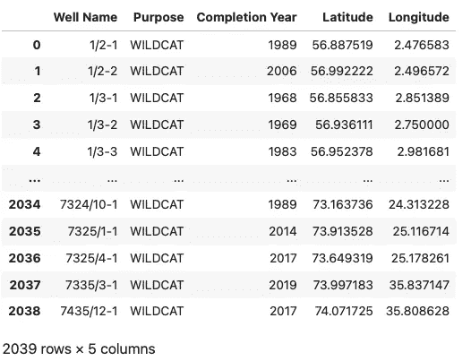
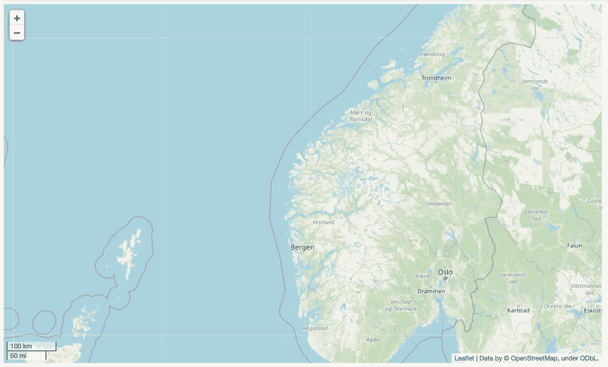
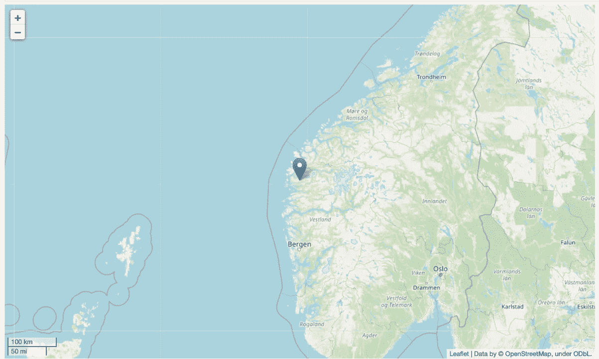
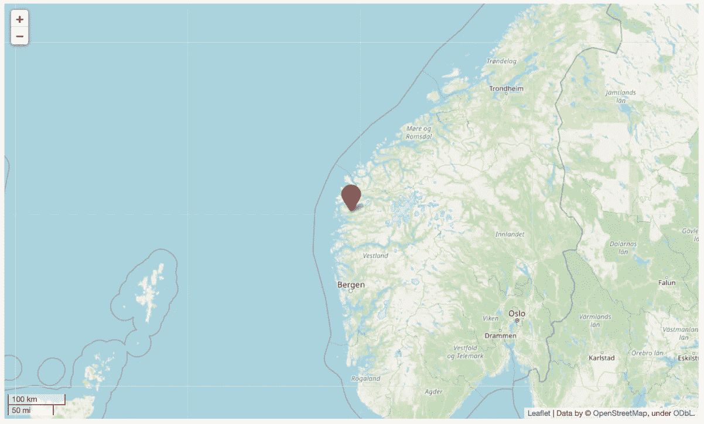
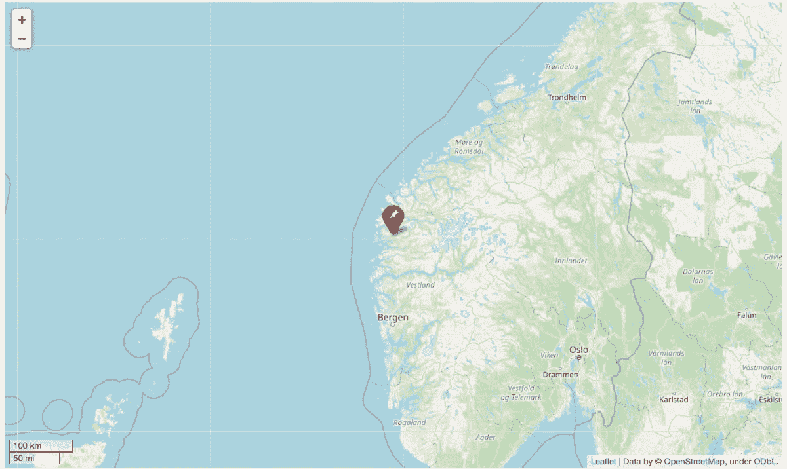
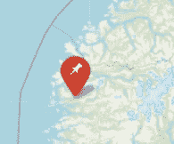
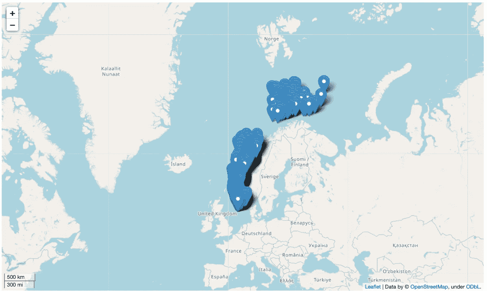
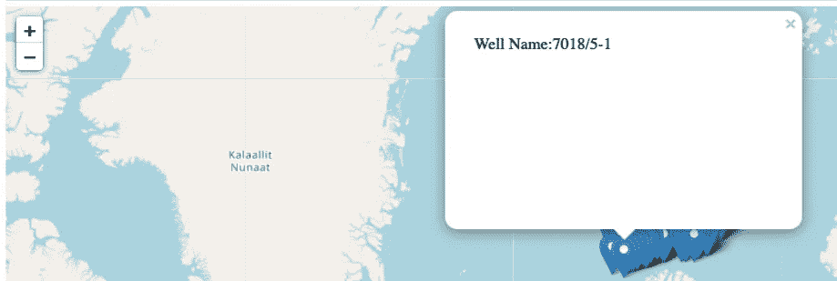
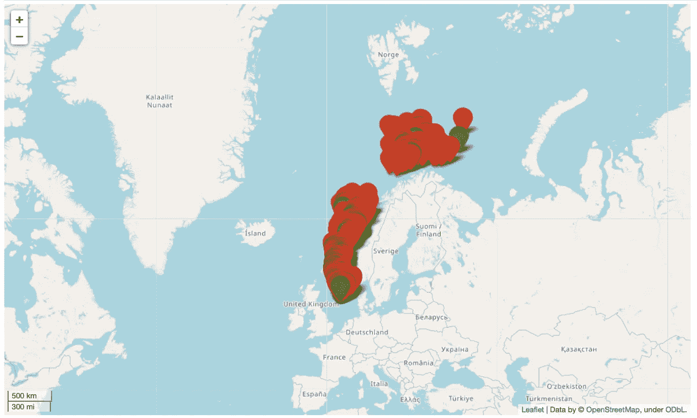
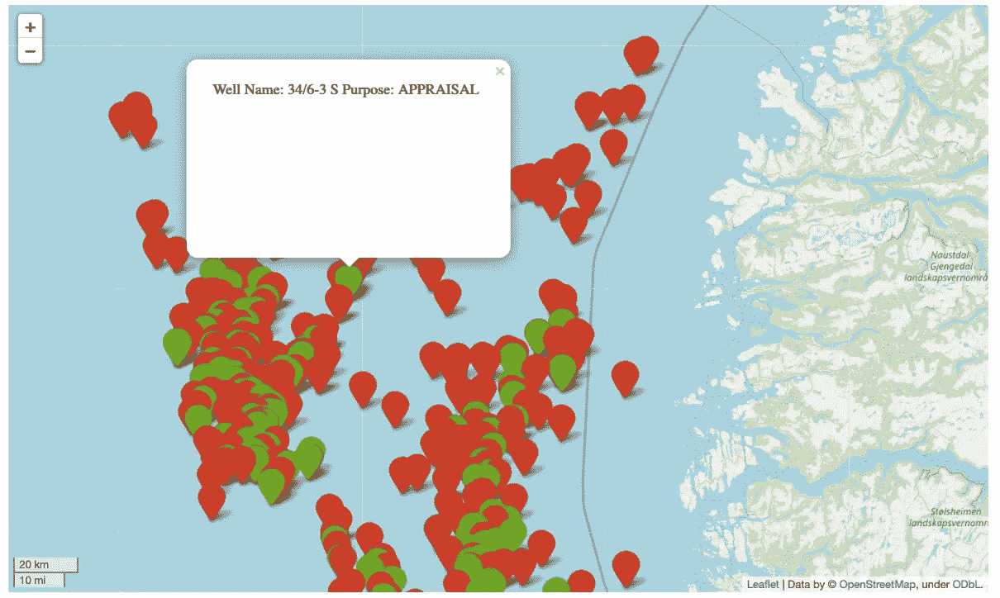

# 树叶映射:在地图上显示标记

> 原文：<https://towardsdatascience.com/folium-mapping-displaying-markers-on-a-map-6bd56f3e3420>

## Python 中向叶子地图添加标记的简短指南


照片由 [GeoJango 地图](https://unsplash.com/@geojango_maps?utm_source=medium&utm_medium=referral)在 [Unsplash](https://unsplash.com?utm_source=medium&utm_medium=referral) 上拍摄

是一个强大的 Python 库，可以很容易地可视化地理空间数据。它利用了 [**Leaflet.js**](https://leafletjs.com/) 的强大功能，这是一个流行且领先的 JavaScript 库，可用于创建可跨桌面和移动平台使用的交互式地图。

该库的设计使其易于使用，同时保持良好的性能。

有多种方法可以将数据显示在一张树叶地图上，包括:

*   标记(点和圆)
*   热图
*   簇
*   氯派思

在这个简短的教程中，我们将看到如何在一个叶子地图上显示单个和多个标记。

# 在 follow Python 教程中显示标记

## 安装叶片

如果您尚未安装 leav，您可以通过 pip 安装它:

```
pip install folium
```

或者蟒蛇:

```
conda install folium
```

## 进口叶子

第一步是导入我们将要使用的库。

在本教程中，我们将使用 pandas 加载 CSV 文件中的数据，并使用 follow 在地图上显示我们的数据。

## 从 CSV 加载井位数据

我们在这个例子中使用的数据来自挪威石油管理局的网站，包含了在挪威大陆架上已经钻探的所有油井的位置。

数据可在此下载:

[https://fact pages . NPD . no/en/井筒/表视图/勘探/全部](https://factpages.npd.no/en/wellbore/tableview/exploration/all)

这些数据得到了挪威政府的 NOLD 2.0 许可，详细信息可以在这里找到:[挪威开放政府数据许可(NLOD) 2.0](https://data.norge.no/nlod/en/2.0/) 。

下载完数据后，我们现在将使用 [pandas 函数](https://pandas.pydata.org/docs/reference/api/pandas.read_csv.html) `[read_csv()](https://pandas.pydata.org/docs/reference/api/pandas.read_csv.html)`加载数据。

当我们调用数据帧(`df`)时，我们看到以下内容:



我们可以看到有 5 列:

*   井名—井的名称
*   目的——钻井的目的是什么
*   完井年份——油井完井的年份
*   纬度—以十进制单位表示的井的纬度位置
*   经度-以十进制单位表示的井的经度位置

## 显示空白树叶地图

要用 leav 显示基本地图，我们需要调用`folium.map()`。在这个类方法中，我们可以传入许多参数。

*   `location` —地图将居中的位置
*   `zoom_start` —地图的初始缩放级别
*   `control_scale` —比例尺控件是否显示在地图上

我们还可以使用许多其他参数。如果您想了解更多信息，请查看关于[**leave . map**](https://python-visualization.github.io/folium/modules.html)类的帮助文档。

这将返回以下以上面指定的位置为中心的地图。



以挪威为中心的底图。图片由作者提供。

## 向树叶地图添加单个标记

在地图上显示数据的最简单方法是使用标记。

我们可以通过调用`folium.Marker`并传递该点的位置来给地图添加一个标记。在这个例子中，我们将显示数据的平均纬度和经度。

为了让它出现在地图上，我们需要应用`.add_to()`函数并传入我们的地图对象。

当我们调用`map`对象时，我们得到下面的地图，在所有数据点的平均位置(地图的中心)有一个标记。



显示我们所有油井平均位置的叶图。图片由作者提供。

## 更改树叶地图上标记的颜色

我们还可以通过调用 Marker 方法中的`[**icon**](https://python-visualization.github.io/folium/modules.html?highlight=icon#folium.map.Icon)`参数来改变标记的颜色，并将其设置为:

```
folium.Icon(color='red', icon='')
```

标记颜色可以是以下任何一种:

`*‘red’, ‘blue’, ‘green’, ‘purple’, ‘orange’, ‘darkred’, ’lightred’, ‘beige’, ‘darkblue’, ‘darkgreen’, ‘cadetblue’, ‘darkpurple’, ‘white’, ‘pink’, ‘lightblue’, ‘lightgreen’, ‘gray’, ‘black’, ‘lightgray’*`

要删除叶子标记中的任何符号，我们可以将`icon`设置为一个空字符串。

一旦我们选择了颜色，我们就需要使用`.add_to(map)`将它添加到我们的地图中。

完整的代码如下所示:

这将生成下面的地图，我们的标记颜色改为红色。



改变颜色和移除符号后的叶子标记。图片由作者提供。

## 更改树叶地图上标记上的图标

在上面的例子中，我们移除了图标，但是如果我们想要使用我们自己选择的图标，我们可以从下面的 Bootstrap 网站传入一个命名的符号。

https://getbootstrap.com/docs/3.3/components/

例如，我们可以将图标设置为图钉

然后，当我们运行代码并查看地图时，我们可以看到图标已经更新为图钉。



更改符号后的叶子标记。图片由作者提供。

当我们放大时，我们可以更清楚地看到图标的样子。



放大我们的标记和所选符号的视图。图片由作者提供。

## 向树叶地图添加多个标记

我们可以继续一个接一个地添加标记，这对于小数据集来说可能是好的。但是，当您有一个像这样的超过 2000 行的数据集时，我们需要考虑一种替代方法。

在下面的代码中:

*   我们调用我们的地图并将`zoom_start`改为 3，这将比之前的地图更大程度地缩小地图
*   然后我们迭代数据帧中的每一行
*   然后我们创建一个 iframe 对象，它允许我们对弹出窗口的外观和内容有更多的控制。在这种情况下，我们只显示井的名称
*   接下来，我们创建弹出窗口，并传递 iframe 对象和弹出窗口的尺寸
*   最后，我们获取每一行的纬度和经度，并将它们添加到地图中

当我们运行这个并调用我们的 map 对象时，我们得到了下面的地图，其中显示了挪威近海油井的所有位置。



添加多个标记后的叶子图。图片由作者提供。

我们可以单击任何一个孔来查看弹出窗口和孔的名称。



在包含井名的 iframe 中弹出。图片由作者提供。

## 按类别控制树叶标记颜色

我们可以根据数据中的属性来改变颜色，而不是用单一颜色来表示叶子标记。

在本例中，我们将根据井的用途更改标记的颜色。

为此，我们需要用目的和相关颜色建立一个字典。在这种情况下，我们有三个类别:野猫，评估和野猫-CCS，分别分配给红色，绿色和蓝色。

由于该列包含一些缺失值(nan ),我们需要在第 15 到 19 行设置一个简短的 try-except 块。

为了调用这些颜色，我们在对`folium.Icon()`的调用中改变颜色参数的参数。

当我们呼唤地图时，我们现在有了根据目的着色的标记。



带有按类别着色的标记的树叶地图。图片由作者提供。

我们可以放大并检查一个标记，看看弹出窗口显示什么。



带有按类别和自定义弹出窗口着色的标记的树叶地图。图片由作者提供。

# 摘要

Folium 为显示地理空间数据提供了一个很好的平台。一旦你理解了它的基本原理，使用起来就很简单了。如果你有时间，值得探索一下[叶库中可用的其他地图类型。](https://python-visualization.github.io/folium/index.html)

*感谢阅读。在你走之前，你一定要订阅我的内容，把我的文章放到你的收件箱里。* [***你可以在这里做！***](https://andymcdonaldgeo.medium.com/subscribe)**或者，您可以* [***注册我的简讯***](https://fabulous-founder-2965.ck.page/2ca286e572) *免费获取更多内容直接发送到您的收件箱。**

*其次，通过注册会员，你可以获得完整的媒介体验，并支持我和其他成千上万的作家。每月只需花费你 5 美元，你就可以接触到所有精彩的媒体文章，也有机会通过写作赚钱。如果你用 [***我的链接***](https://andymcdonaldgeo.medium.com/membership)**报名，你直接用你的一部分费用支持我，不会多花你多少钱。如果你这样做了，非常感谢你的支持！***