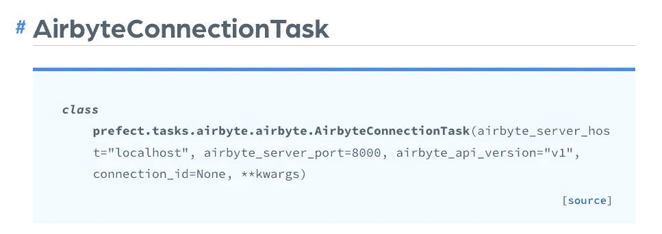

# 遵循以下高质量数据接收的最佳实践

> 原文：<https://towardsdatascience.com/follow-these-best-practices-for-high-quality-data-ingestion-deb9e2a7f6cb>

## 如何选择正确的工具并将其集成到您的数据管道中

乔恩·泰森在 [Unsplash](https://unsplash.com/s/photos/best?utm_source=unsplash&utm_medium=referral&utm_content=creditCopyText) 上的照片

数据摄取可能是 ETL/ELT 过程中最重要的一步。毕竟没有数据是做不了任何转化的！数据接收管道将您的工具和数据库连接到您的数据仓库，即整个数据堆栈的中枢。

您为将数据接收到仓库中而设置的流程为您的数据团队中的所有其他流程设定了标准。您随后的转换和分析取决于您接收的数据的质量。这就是为什么您必须从一开始就遵循最佳实践，并在整个过程中记录下来。

当您从一开始记录最佳实践时，您被迫遵循一个固定的结构。没有这种结构，事情就会变得一团糟。您创建了一个新的数据连接器，它没有遵循您想要的命名约定，但是您已经为要接收的数据付费了，现在要更改它已经太晚了。您与一家摄取公司签订了合同，该公司不提供对您的业务最重要的连接器集成。这些都是你应该避免的现代数据堆栈的噩梦。

那么，创建数据接收管道的最佳实践是什么呢？在本文中，我将分享我从零开始构建数据堆栈时学到的最佳实践。这些实践包括选择摄取工具、记录来源、编排、测试和监控。通过分享我过去所做的事情，你可以在开始自己的旅程之前，从我的成功和失败中学习。

# ‍Compare 数据接收工具

当我第一次着手决定我们的数据堆栈将使用的工具时，我当时的经理已经准备好了一些非常棒的系统。我是一名新的分析工程师，从未在初创公司做过全职工作。我只是在学习诀窍！幸运的是，他在决定合适的工具和组装框架方面有丰富的经验。如果不是他制作了一个精美的 Excel 电子表格来帮助[比较我们正在选择的数据摄取工具](https://airbyte.com/etl-tools-comparison)，谁知道我们今天的摄取会是什么样。

那么，这个决定摄取工具的框架到底是什么呢？它基本上是一个记分卡，上面有我在标题中提到的三个不同的类别——必须拥有的、最好拥有的和交易破坏者。然后，在每个类别下都有某些品质/特性，我们根据工具的功能给它们打了 1-3 分。

在设计数据接收管道时，有许多重要的事情需要考虑，下面是我们包括的几个:

*   可用的数据连接器(Shopify、Azure Blob、脸书、NetSuite 等。)
*   您团队的能力(建立时间、维护时间、技能组合等。)
*   预算(接收预期数据量的每月成本)
*   支持(松散的社区、专门的支持代理等。)

这些都是为您的团队决定合适的摄取工具的关键。你可能找不到能满足你所有需求的工具，但是你确实想找到最能满足你需求的工具。如果你在一个工具中找不到你想要的东西，那就策划一下如何使用几个不同的工具，并且仍然能获得相同的结果。例如，也许你有一个分析工程师，他可以用 [Airbyte](https://airbyte.com/connectors) 为你的大多数来源设置和维护连接器。然而，有一些没有集成，所以你需要让你的工程团队建立一些东西。

# 记录您的数据摄取管道来源

我怎么强调文档的重要性都不为过，尤其是当你在一个小型的数据团队中工作的时候。当出现问题，文档的所有者生病、休假或离开公司时，文档就是您的生命线。您的现代数据堆栈中的所有内容都应该记录在案，以便团队中的任何其他人都可以在需要时接管。数据摄取也是如此。

确保您保留了您正在使用的各种摄取工具以及您在该工具中设置的连接器的文档。如果不这样做，就很容易忘记原始数据的来源。此外，请注意为使该连接器工作，您必须做出的任何特殊要求或更改。例如，对于我们的一个连接器，我必须在数据库上启用变更数据捕获，以便正确地捕获数据。把这些事情写下来，这样对你的团队来说就不是猜谜游戏了。

# 随时在你的仓库里保存一份所有原始数据的副本

我在[雪花数据仓库架构:如何组织数据库、模式和表](https://airbyte.com/blog/snowflake-data-warehouse-architecture)中详细地描述了这一点，所以如果你还没有，一定要去看看。数据摄取的一个最基本的最佳实践是保护您的原始数据。原始数据应该始终保存在数据仓库中的一个单独的数据库中。任何转换工具或人员都不应该对此数据库拥有写访问权限。它应该是严格只读的。

这是一个从不同来源接收所有原始数据的数据库。这个数据库将作为您所有数据的“备份”，以防您的数据建模出现问题。假设您意外运行了一个数据模型，该模型删除了表中的随机行并混合了列值。你不能再相信那些数据了。你不想删除它，因为那样它就永远消失了，但是你不能用它。您可以删除数据模型中保存的所有数据，并通过引用原始数据源重新运行模型。

原始数据的救援！

# ‍Run 同步建模

根据您运行数据模型的频率，您的原始数据应该总是在您的模型运行之前同步到您的仓库。无论你是像我一样使用 [dbt](https://airbyte.com/blog/best-practices-dbt-style-guide) 进行转换，还是其他，一个转换应该紧接着另一个发生。这确保了相互依赖的 dbt 模型不会并行运行，从而在不同的分析中给出不准确的结果。通过同步运行 syncs 和 dbt 模型，您还可以对数据进行更准确的验证。

幸运的是，像 Airbyte 这样的数据摄取工具一直在与 Airflow、Prefect 和 Dagster 这样的强大部署工具合作。就我个人而言，我使用 Prefect 来部署我的数据模型。他们通过[提供](https://docs.prefect.io/api/latest/tasks/airbyte.html)“Airbyte 连接任务”使同步变得容易，这允许你直接在你的数据管道内同步你的数据连接器。通过在管道中直接同步数据，您可以在模型和这些同步之间创建下游依赖关系。这意味着您的数据模型中总是有最准确和最新的数据。

作者图片

您只需指定 Airbyte 服务器的托管位置、post、api 版本和连接 id。就这么简单！然后，在完美流中使用这些任务，并将它们设置为 dbt 模型运行的上游依赖项。您可以阅读本教程，用 Airbyte、Prefect 和 dbt 创建一个[数据接收和传输管道。](https://airbyte.com/tutorials/elt-pipeline-prefect-airbyte-dbt)

# 数据源上的‍Create 警报

您必须在源头创建数据警报和测试。许多人认为测试和警报应该在最终的数据模型上进行，但实际上恰恰相反。当你专注于下游而不是上游时，它就变成了一个你永远无法解决的一万块拼图。您必须做大量的挖掘工作，才能发现问题实际上从来都不是数据模型。

相信我，我知道因为我也经历过。当我们在数据可视化平台中编写所有的数据模型时，就不可能调试中间模型。我不得不花数周时间调查一个问题，结果发现是数据源本身造成的。您构建的第一个警报应该在数据源级别。如果您的数据源有问题，您需要在它影响任何下游数据模型之前立即知道。

更不用说，修复数据源的问题要比检查数据模型、测试每一行代码以查看其性能是否符合预期容易得多。数据源中的错误可以简单到修复电子表格中的人为错误、更新凭证或重新触发 cron 作业。与涉及大量代码的情况相比，它们要简单得多。

我最喜欢在源代码中设置测试和警报的方式是使用 [dbt tests](https://docs.getdbt.com/docs/building-a-dbt-project/tests) 和 re_data。使用 dbt 测试，您可以检查空值、主键和预期值。您可以使用这些简单的测试来确保您的数据符合预期。 [re_data](https://www.getre.io/) 是一个 dbt 包，允许您监控数据的新鲜度、行计数和描述性统计等指标。您甚至可以设置松弛警报，在指标超出其典型 z 值时提醒您。

松弛警报本身就很强大。我们每天都在 Slack 上跟公司和团队沟通。将数据提醒直接发送到 **#data-alerts** 频道，这样你就不需要每天早上解析电子邮件或手动访问仪表盘。如果有问题，你的工具会通过 Slack 告诉你。确保您总是设置它们！

# 结论

从数据堆栈的初始阶段开始遵循数据接收最佳实践，将为您的团队未来的成功做好准备。这些最佳实践的文档将从一开始就使需求变得清晰，几乎不给出错留下空间。当为拼图的一部分设定了高标准时，它必然会渗透到其他部分。

再次重申，在决定一个接收工具并创建一个数据接收管道到您的堆栈时，请记住以下几点:

1.  写下所有对你的业务最重要的连接器，你的团队必须提供的技能和时间，以及在决定合适的摄取工具时你的预算。
2.  记录所有数据源以及它们是如何被接收到数据仓库中的，包括任何特殊的设置。
3.  始终保持一个包含原始数据的数据库。
4.  同步运行数据同步和模型，以便数据中没有间隙。
5.  在数据源而不是下游数据模型上创建警报。

虽然这可能会增加您的工作量，但现在遵循这些最佳实践只会为您省去麻烦。您正在主动解决数据接收管道中的某些问题，在对业务产生负面影响之前找到解决方案。从一开始就考虑这些事情总是比对出错的事情做出反应要好。

订阅我的分析工程[简讯](https://madisonmae.substack.com/)以了解最佳实践、新工具和所有现代数据堆栈的最新信息。