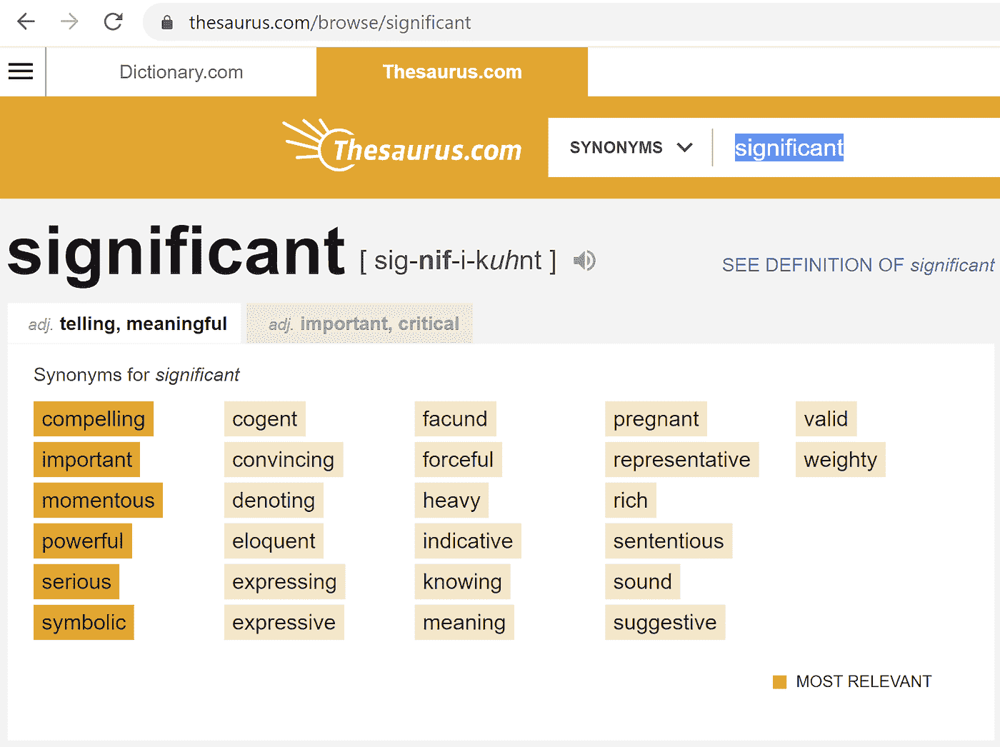

# 被统计意义所迷惑

> 原文：<https://towardsdatascience.com/fooled-by-statistical-significance-7fed1bc2caf9>

## 不要让诗人欺骗你

看看世界上最短的关于[#统计学](https://www.linkedin.com/feed/hashtag/?keywords=statistics&highlightedUpdateUrns=urn%3Ali%3Aactivity%3A6691746839667978240)的讲座，以及人们对待它的方式的所有错误:

> 42.

或者说: [p](http://bit.ly/quaesita_pesky) =0.042

来自 thesaurus.com 的截图。我的另一个词库很糟糕，很糟糕，也很糟糕。

# 统计上的不重要

与普遍的看法相反，术语“*”并不意味着某件*重要的*、*重大的*或*令人信服的*发生了。如果你认为我们在这里使用的单词 *significant* 会让你的词典感到自豪，那么你就成了一个狡猾花招的受害者。不要让诗人欺骗你。*

> *“你不应该让诗人骗你。”比约克*

*对于那些喜欢尽量少接触统计数据的人来说，以下是你需要知道的关于“统计显著性”这个术语的所有信息:*

*   *这并不意味着发生了什么重大的事情。*
*   *这并不意味着结果是“大的”或值得注意的。*
*   *这并不意味着你会对[数据](http://bit.ly/quaesita_hist)感兴趣。*
*   *意思是某人声称对某事感到惊讶。*
*   *如果你不太了解问题中的 ***某人*** 和 ***某事*** ，它不会告诉你任何有用的东西。*

*对于除了正在讨论的决策者之外的所有人来说，统计上有意义的结果很少是*重要*意义上的*重要*——它们偶尔[很适合提出有趣的问题](http://bit.ly/quaesita_inspired)，但通常它们是不相关的。*

**

*安德鲁·乔治在 [Unsplash](https://unsplash.com?utm_source=medium&utm_medium=referral) 上拍摄的照片*

*当非专家使用这个术语时，要格外警惕，尤其是当它伴随着令人窒息的旺盛时。有时，特别厚颜无耻的江湖骗子更进一步，去掉“统计”一词，挖掘诗歌的全部力量。*“嘿瞧”，*他们告诉你，*“我们所谈论的在宇宙的眼中是有意义的。”**

*不，不是的。*

*最糟糕的可能罪犯是那些把“统计显著性”发音为“*确定的*”或“*确定的*”或“*完美无瑕的知识*”的同义词的人——这里有一些讽刺被忽略了。该术语来自一个处理[不确定性](http://bit.ly/quaesita_uncertainty)的领域，因此(根据定义！)只属于我们的知识是 ***而不是*** 完美无瑕的设定。*

# *行话预警！*

*对于那些喜欢用行话来对付行话的人，我将在下一节中帮助自己使用更正式的语言。你可以不去想那一点，但是如果你同时对这里的*和*新事物感到好奇，那就走一条[小弯路](http://bit.ly/quaesita_statistics)在短短 8 分钟内浏览所有统计学中最重要的观点:*

* [## 为赶时间的人统计

### 曾经希望有人能告诉你统计学的意义是什么，术语用简单的英语表达是什么意思吗？让…

towardsdatascience.com](/statistics-for-people-in-a-hurry-a9613c0ed0b) 

我的文章中的大部分链接会将你带到博客文章，在那里我会给你重点主题的更深入的概述，所以你也可以将这篇文章作为选择你自己的冒险[关于](http://bit.ly/quaesita_sministats)[数据科学](http://bit.ly/quaesita_datascim)的迷你课程的发射台。

# 统计显著性

“统计显著性”仅仅意味着一个 [p 值](http://bit.ly/quaesita_puppies) *低到足以改变决策者的想法。换句话说，我们用这个术语来表示一个[无效假设](http://bit.ly/quaesita_damnedlies)被[拒绝](http://bit.ly/quaesita_fisher)。**什么是*无效假设呢？测试有多严格？\_(ツ)_/*

> *欢迎来到统计学，这里的答案是 [p](http://bit.ly/quaesita_puppies) = 0.042 但是你不知道问题是什么。*

*从技术上来说，设定假设检验条件的[决策者](http://bit.ly/quaesita_di)是 ***唯一的*** 人，对他来说，检验的结果可能具有统计学意义。*

# *统计是个人的*

*统计学为你提供了一套决策工具，但如何使用它们取决于你自己——它将像任何其他决策一样是个性化的。*

**

*照片由 [Towfiqu barbhuiya](https://unsplash.com/@towfiqu999999?utm_source=medium&utm_medium=referral) 在 [Unsplash](https://unsplash.com?utm_source=medium&utm_medium=referral) 上拍摄*

*这个过程包括非常仔细地措辞你的决策问题，挑选你愿意接受的[假设](http://bit.ly/quaesita_saddest)，对你的答案可能错误的不同方式做出一些风险权衡***(因为随机性是一个混蛋)，然后使用数学来获得你特定问题的风险可控的答案。*

> *作为一种修辞欺凌的支撑，它的流行有些反常和滑稽。*

*这就是为什么真正的专家永远不会用统计数据像锤子一样敲打敌人。两个决策者可以在相同的数据上使用相同的工具，然后[得出两个不同的——完全有效的——结论](http://bit.ly/quaesita_saddest)……这意味着它作为修辞欺凌的一个支柱，其受欢迎程度既反常又滑稽。*

> *统计意义是个人的。仅仅因为我对这些数据感到惊讶，足以改变我的想法，并不意味着你也应该如此。*

*当我理解了统计是如何工作的，我不禁惊叹于在不了解统计决策局限性的人面前宣布某件事具有统计学意义是多么的傲慢——几乎是粗鲁。这个术语听起来太普遍了，对任何人都没有好处；这就像是*“闭嘴，相信我，因为我的方法很奇特”*的修辞手法。我希望你能和我一起给这种修辞方式以它应得的“ *pffft* ”。*

# *借用别人的统计意义*

*等等，难道我们就不能从别人的统计结果中学到什么吗？*

*这就有点哲学了，所以我需要一篇单独的文章来阐述我对这个问题的看法:*

* [## 我们为什么信任科学家？

### 现在是时候重新思考我们对事实和虚构的假设了

kozyrkov.medium.com](https://kozyrkov.medium.com/why-do-we-trust-scientists-98c24e3b9f0e) 

简而言之，我的建议是，把你的一些决策权委托给其他人是没问题的，只要你相信他们是有能力的，并且把你的最大利益放在心上。当他们被说服时，你会借用他们的意见，这样你就不用自己重做他们所有的工作了。

> 通过使用别人的统计结论，你的决定不是基于数据，而是基于你对个人的信任。

请注意，使用别人的结果，你的决定不是基于数据，而是基于你对个人的信任。选择信任他人没有问题，所以你不需要从零开始凭经验建立你的整个世界观——知识共享是人类如此成功的一部分——但值得注意的是，你可能是你认为你正在收听的任何“知识”的几个回合的断电话下游。

如果你让某人站出来代表你做决定——这意味着消耗别人的 [p 值](http://bit.ly/quaesita_pesky)和决策结论——那么确保这个人是你认为足够胜任和值得信任的。

# 你不应该让诗人欺骗你

如果那个对你大放厥词的人是你*不信任的人怎么办？往山上跑！*

无论何时，只要有一丝关于统计意义的声明的说服力，就要格外小心[的发言人](http://bit.ly/quaesita_charlatan)兜售的任何商品。如果你信任和你谈话的人，你不需要他们的呼吁有统计学意义。你只需要知道他们相信。如果你不信任他们，你就不会信任他们的统计术语，就像你不会信任他们的爵士乐手一样。

> 如果你连问题是什么都不明白，那么回答有什么用呢？

如果有一件事我想让你从这篇博文中学到的话，那就是:如果你不太了解决策者，不太了解他们如何着手弄清楚他们是否应该[改变他们的想法](http://bit.ly/quaesita_statistics)(确切地说是关于什么)，那么他们关于统计显著性的主张 ***对你来说完全没有意义*** 。如果你连问题是什么都不明白，那么回答有什么用呢？

# 感谢阅读！人工智能课程怎么样？

如果你在这里玩得开心，并且你正在寻找一个为初学者和专家设计的有趣的应用人工智能课程，这里有一个我为你制作的娱乐课程:

在这里欣赏课程播放列表，它被分成 120 个单独的一口大小的课程视频:[bit.ly/machinefriend](http://bit.ly/machinefriend)

 [## 加入介质

### 阅读 Cassie Kozyrkov(以及媒体上成千上万的其他作家)的每一个故事。您的会员费直接支持…

kozyrkov.medium.com](https://kozyrkov.medium.com/membership) 

# 喜欢作者？与凯西·科兹尔科夫联系

让我们做朋友吧！你可以在 [Twitter](https://twitter.com/quaesita) 、 [YouTube](https://www.youtube.com/channel/UCbOX--VOebPe-MMRkatFRxw) 、 [Substack](http://decision.substack.com) 和 [LinkedIn](https://www.linkedin.com/in/kozyrkov/) 上找到我。有兴趣让我在你的活动上发言吗？使用[表格](http://bit.ly/makecassietalk)取得联系。

# 寻找动手 ML/AI 教程？

以下是我最喜欢的 10 分钟演练:

*   [AutoML](https://console.cloud.google.com/?walkthrough_id=automl_quickstart)
*   [顶点 AI](https://bit.ly/kozvertex)
*   [人工智能笔记本](https://bit.ly/kozvertexnotebooks)
*   [表格数据的 ML](https://bit.ly/kozvertextables)
*   [文本分类](https://bit.ly/kozvertextext)
*   [图像分类](https://bit.ly/kozverteximage)
*   [视频分类](https://bit.ly/kozvertexvideo)

# 脚注

*如果你很想知道什么是 p 值，我制作了一个视频来帮助你:

这是我 YouTube 播放列表上的第一个视频，你可以在 http://bit.ly/quaesita_p1 找到

* *要了解假设检验的解释，请查看我关于该主题的[博客文章](bit.ly/quaesita_fisher),或者看看这段视频:**