# 预测我未来的杂货账单

> 原文：<https://towardsdatascience.com/forecasting-my-future-grocery-bills-59515b9348d3>

## 根据我过去的食品杂货支出，使用平滑预测方法来估计我未来可能需要的食品杂货预算。

> 知道我们将来要花多少钱是一件非常困难的事情。今天，我们将看看一种可能的方法来预测和预计我们在未来的支出。对于预测，尤其是预算支出，有一点需要注意，由于通货膨胀、职业变化等原因，我们的预测可能与实际支出有很大差异。预测可以帮助我们深入了解未来的预期支出。


弗兰基·查马基在 [Unsplash](https://unsplash.com?utm_source=medium&utm_medium=referral) 上拍摄的照片

# 介绍

每月预算是非常重要的，以确保你不会超支。很多时候，预测你下个月要花多少钱会变得很有压力，会让很多人没有动力完成他们的月度预算。使用预测方法可以帮助人们估计他们在接下来的 1、6、12 等时间里会花多少钱。几个月。虽然预测不会给我们下个月要花多少钱的准确金额，但它可以帮助指导我们下个月应该为不同的账单分配多少钱，而这个价格在全年中是不固定的。

# 简单指数平滑

简单指数平滑(SES)采用指数衰减权重对数据进行加权移动平均。指数衰减权重使用系列中的所有累积数据。即使使用了所有的观察值，旧的观察值的权重也会以指数衰减的方式减少。**SES 方法得出的预测是持平的。**

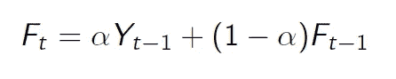

方程:简单指数平滑(图片来自作者)

为了创建衰减，我们必须选择一个阿尔法参数。较大的 alpha 值意味着我们希望强调最近的数据而不是过去的数据。随着 alpha 值变小，我们开始更多地强调过去的数据。找到 alpha 最佳值的一种方法是执行搜索程序，看看哪个模型产生的均方误差(MSE)最小。SES 肯定不是最强的预测方法，但是，它可以为您的预测分析提供一个良好的基线。

# 霍尔特-温特斯

霍尔特-温特斯法是什么？它属于用于定量预测的族平滑方法。它不仅说明了数据集的趋势，还说明了它的季节性。**趋势**是数据集移动的长期方向(通常为正或负)。**季节性**是对一段时间内发生的规律性变化的衡量。

霍尔特-温特斯有两种方法:加法和乘法。这两种方法首先将使用简单回归来估计水平和趋势。第一个β系数(B0)最初是回归的截距。第二个β系数(B1)是回归的初始斜率估计值。季节性成分被估计为数据的平均值(通常，每个平均值使用 3-4 个观察值是可取的)。

加法需要一个固定的季节性因素。在这种情况下，静止意味着组件在数据集中是水平的。当水平、增长率和季节性**可能发生变化时，我们将使用加法。**

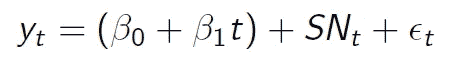

方程:霍尔特-温特斯加法(图片来自作者)

霍尔特-温特斯加法还有许多子成分。


等式:硬件添加水平估计值(图片来自作者)

第一个部分是在时间段 *t* 的水平估计，使用阿尔法平滑参数、增长值和季节性部分。

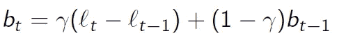

等式:硬件增加增长率估计值(图片来自作者)

第二部分是增长率的估计值，使用平滑常数γ。

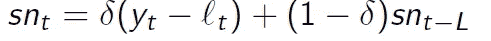

等式:硬件加上季节性因素(图片来自作者)

第三个因素是季节变化，它有一个平滑常数δ。

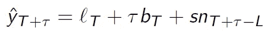

等式:硬件添加点估计值(图片来自作者)

一旦我们计算了所有的成分，我们就可以开始对数据集进行点估计(预测)。

乘法说明了季节因素的增加，在应用中更常用。它的组成部分类似于加法，但在相互作用上有所不同。

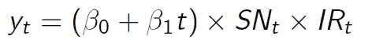

等式:霍尔特·温特斯乘法(图片来自作者)

霍尔特-温特斯乘法方法与加法方法具有相同的组成部分，但变量的相互作用不同。

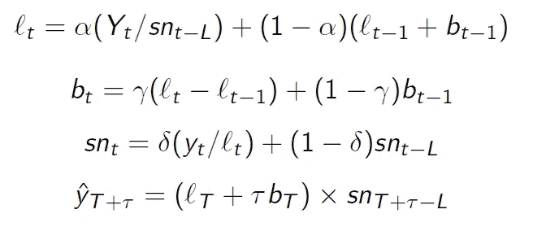

等式:硬件多组件(图片来自作者)

# 分析

我正在进行的分析将预测我在接下来的 4 个月应该为食品杂货支付多少(完整代码可以在[这里](https://github.com/benmccloskey/Forecasting/blob/main/Groceries.ipynb)找到)。很明显，这只是一个预测，根据我有限的数据，我可能想用新的观察结果来重新预测我未来的杂货账单。还有许多因素会对我的杂货账单产生巨大影响，我没有考虑这些因素，例如通货膨胀。

我计划今天用两种不同的平滑方法进行实验，看看哪种方法在为数据创建预测方面做得更好。我将使用的第一种平滑方法是简单的指数平滑法，因为它适用于呈现恒定趋势的数据。我还将研究霍尔特-温特斯方法，该方法通常处理显示趋势和季节性的数据。

首先，装入包:

```
import numpy as np
import pandas as pd
import matplotlib.pyplot as plt
from statsmodels.tsa.api import Holt
```

今天的大部分代码都改编自 statsmodels，专门用于预测，可以在这里找到。

## 资料组

我今天使用的数据集是我自己在过去 16 个月里获得的。你可以在这里找到数据集[的副本](https://github.com/benmccloskey/Forecasting/blob/main/grocery_dataset.xlsx)。将数据集读入 Python:

```
#Read in the data
df = pd.read_excel('grocery_dataset.xlsx',index_col='PERIOD')
df.head()
```

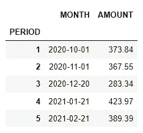

图:数据集的前五行(图片来自作者)

读入数据集后，我们希望删除**月份**列，只关心案例中的时间段。

```
#At this point, I am only worried about the periods, not the months 
df.drop(['MONTH'],axis=1,inplace=True)
df.head()
```

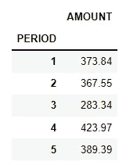

图:清理过的数据集(图片来自作者)

绘制一段时间的成本(美元)图显示趋势相当平缓。虽然没有表现出巨大的趋势，但我怀疑如果我们在 18 个月后重新进行这一分析，我们将会由于通货膨胀而出现上升趋势。

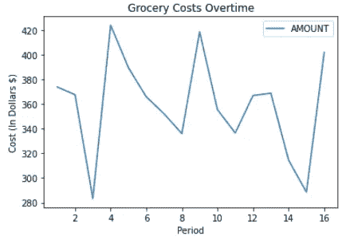

图:时间成本(图片来自作者)

```
df.plot(title='Grocery Costs Overtime',xlabel='Period',ylabel="Cost (In Dollars $)")
plt.show()
```

# 简单指数平滑(SES)

回想一下，使用 SES 方法会给我们一个线性的预测。这可能不是预测未来每月杂货支出的最佳方式，但至少可以帮助预测下个月的支出。

首先，我们要符合模型。我选择使用 0.8 的 alpha。

```
ses_fit = SimpleExpSmoothing(df, initialization_method="estimated").fit(
    smoothing_level=0.8, optimized=False
)
ses_forecast = ses_fit.forecast(4).rename(r"$\alpha=0.8$")
```

一旦模型合适，我们就可以根据实际数据绘制预测图。

```
plt.figure(figsize=(12, 8))
plt.plot(df, marker="o", color="black")
plt.plot(ses_fit.fittedvalues, marker="o", color="red")
(line3,) = plt.plot(ses_forecast, marker="o", color="red")
plt.legend([line3], [ses_forecast.name])
```

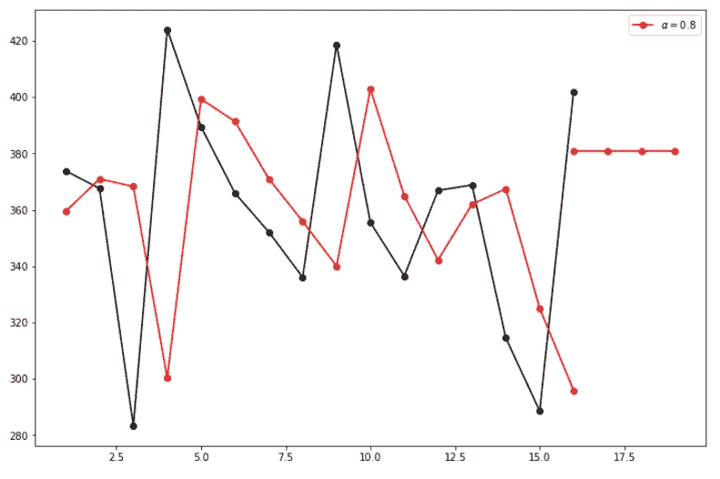

图:SES 预测(图片来自作者)

如上所述，预测是线性的，这就是为什么 SES 可能不是预测你长期杂货账单的最佳方法，但它仍然可以给我们一些关于下个月预期花费的洞察力。让我们看看模型预测了什么。

```
ses_forecast
```

运行这段代码，该模型预测下个月的杂货支出大约为 380.67 美元。

# 霍尔特-温特斯

虽然 SES 有助于理解我下个月可能的杂货账单，但它本质上是线性的，因此我们还想实施 Holt-Winters 方法，看看我们是否可以获得未来几个月杂货支出的预测。

```
hw_add = ExponentialSmoothing(
    df,
    seasonal_periods=4,
    trend="add",
    seasonal="add",
    use_boxcox=True,
    initialization_method="estimated",
).fit()
hw_mul = ExponentialSmoothing(
    df,
    seasonal_periods=4,
    trend="mul",
    seasonal="mul",
    use_boxcox=True,
    initialization_method="estimated",
).fit()ax = df.plot(
    figsize=(10, 6),
    marker="o",
    color="black",
    title="Forecasts from Holt-Winters' multiplicative method",
)
ax.set_ylabel("Cost of Groceries ($)")
ax.set_xlabel("Period")
hw_add.fittedvalues.plot(ax=ax, style="--", color="red")
hw_mul.fittedvalues.plot(ax=ax, style="--", color="green")hw_add.forecast(12).rename("Holt-Winters (add-add-seasonal)").plot(
    ax=ax, style="--", marker="o", color="red", legend=True
)
hw_mul.forecast(12).rename("Holt-Winters (add-mul-seasonal)").plot(
    ax=ax, style="--", marker="o", color="green", legend=True
)plt.show()
```

绘制模型，我们可以看到他们是如何预测未来的。

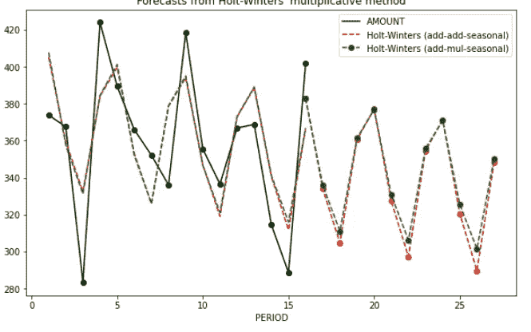

图:硬件添加/多型号(图片来自作者)

这两个模型在创建数据预测方面都做得相当好。与 SES 方法相比，我们可以看到 Holt-Winters 是一种更好的方法，因为它不产生线性预测。在查看具体的模型指标之前，我可能会使用乘法方法作为我的预测模型，因为它似乎比加法方法预测的值要高一些。我选择这种模式的两个原因是，我理解由于通货膨胀，价格可能会在不久的将来上涨，我宁愿高估我的杂货账单，也不愿低估它。

```
results = pd.DataFrame(
    index=[r"$\alpha$", r"$\beta$", r"$\phi$", r"$\gamma$", r"$l_0$", "$b_0$", "SSE"]
)
params = [
    "smoothing_level",
    "smoothing_trend",
    "damping_trend",
    "smoothing_seasonal",
    "initial_level",
    "initial_trend",
]
results["Additive"] = [hw_add.params[p] for p in params] + [hw_add.sse]
results["Multiplicative"] = [hw_mul.params[p] for p in params] + [hw_mul.sse]
```

接下来，我们将获得模型度量来比较它们的性能。

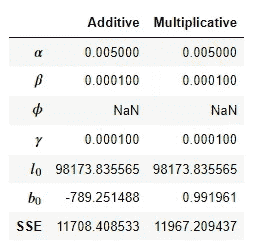

图:模型度量(图片来自作者)

虽然加法方法确实有较低的 SSE，但我仍然使用我的判断来使用乘法方法进行预测。现在我们有了他们的方法，让我们看看模型预测未来 4 个月的食品支出。

```
hw_add.forecast(4)
```

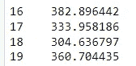

图:硬件添加预测(图片来自作者)

加法模型预测我接下来 4 个月的账单是 **$382.90、$333.96、$304.64 和$360.70。**

```
hw_mul.forecast(4)
```

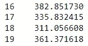

图:硬件倍增。预测(图片来自作者)

乘法预测我接下来 4 个月的账单是 **$382.85，$335.83，$311.06 和$361.37。**这一模型仍然非常接近加法模型，但略高一点。总的来说，这两个模型都给了我一个更好的主意，让我知道在接下来的 4 个月里，我应该如何支付我的食品杂货账单！

# 结论

今天我们看了两种方法，可以方便地预测我们未来的杂货账单(或任何账单！).虽然 SES 模型能够提供预测，但它仅创建线性预测，因此对于预测一个月以上逐月变化的账单，它对我们没有用处。如果使用 SES，他们可以在本月结束后预测下个月的账单。将当月数据添加到原始预测中。霍尔特-温特斯的模型做得更好，让我对未来 4 个月的预期支出有了一些了解。永远记住，预测从来都不是完美的，不应该只看表面。我用这些预测来帮助我了解未来 4 个月我应该为食品杂货分配多少钱，然而，我总是想记住，生活是不可预测的，如果事情没有按计划进行，你应该总是有 B 计划。

**如果你喜欢今天的阅读，请给我一个关注！另外，在**[**LinkedIn**](https://www.linkedin.com/in/benjamin-mccloskey-169975a8/)**上加我，或者随时联系！感谢阅读！**

**来源**

1.  数据集是我自己收集的。
2.  今天的部分代码改编自这里的。