# 使用递归神经网络的在线学习预测呼吸运动，用于更安全的肺部放射治疗

> 原文：<https://towardsdatascience.com/forecasting-respiratory-motion-using-online-learning-of-rnns-for-safe-radiotherapy-bdf4947ad22f>

## UORO 在 Matlab 医疗时间序列预测中的应用

[国家癌症研究所](https://unsplash.com/@nci?utm_source=medium&utm_medium=referral)在 [Unsplash](https://unsplash.com?utm_source=medium&utm_medium=referral) 上拍摄的照片

T2020 年全球新增肺癌病例约 200 万例，肺癌患者 5 年相对生存率略高于 22% [ [1](https://doi.org/10.3322/caac.21660) ， [2](https://seer.cancer.gov/statfacts/html/lungb.html) ]。这推动了肺部放射治疗的研究，人工智能是实现这一目标的工具之一。

你有没有想过人工智能如何改善肺癌的治疗？为什么递归神经网络(RNN)特别有助于这项任务？还有，什么是在线学习，为什么它在这种情况下特别有用？

在这里，我将通过总结我最近发表在“生物医学中的计算机方法和程序”上的研究文章“使用经无偏在线递归优化训练的递归神经网络预测外部标记物的位置用于安全肺癌放疗”，并介绍其主要发现[【3】](https://doi.org/10.48550/arXiv.2106.01100)，尽我所能回答这些问题。

*除特别注明外，所有图片均为作者所有。*

# 1.为什么我们在肺部放射治疗中需要时间序列预测

肺部肿瘤随着呼吸运动而移动。因此，精确地瞄准它们是具有挑战性的，因为在放射治疗过程中的实时成像具有局限性。

在一系列计算机断层扫描(CT)图像中，呼气相(左)和吸气相(右)末期的胰腺肿瘤。由于呼吸运动，肿瘤的质心上下移动，并且肿瘤形状也随着该运动而改变。[【4】](https://doi.org/10.15083/00073584)原图，经作者许可编辑。

外部标记是放置在胸部的金属物体，可以使用空间回归模型(也称为对应模型)来帮助推断胸部肿瘤的位置。

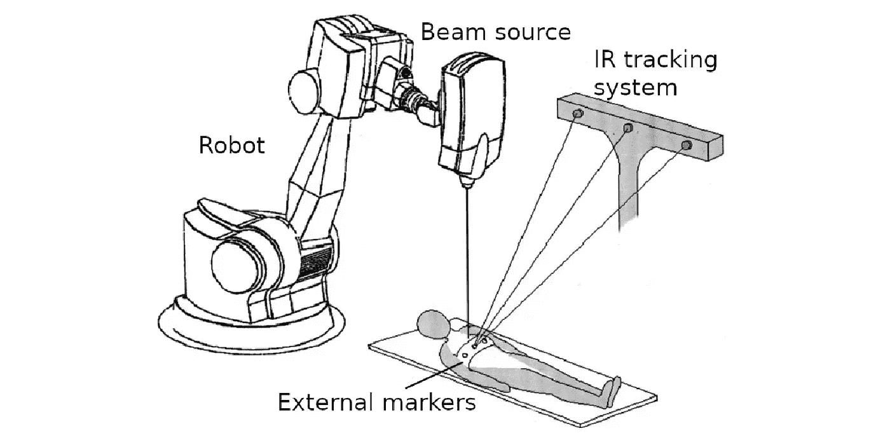

放射治疗系统(射波刀),使用外部标记引导放射束。经 Wiley 许可，改编自[【5】](https://doi.org/10.1118/1.1774132)，版权 2004 美国医学物理学家协会。

即使利用外部标记的红外跟踪，肿瘤的位置也难以精确估计，因为这些内部-外部对应模型固有的不精确性，而且因为治疗系统受到由于图像采集、机器人控制和辐射束激活引起的延迟。这种延迟会阻止有效的肿瘤照射，并导致对健康组织的过量剂量，从而导致肺炎等副作用，这种情况可能会危及生命。

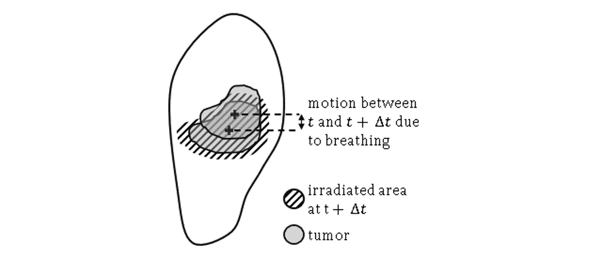

由于总系统延迟δt 未得到补偿，健康肺组织受到过度照射。考虑到诸如治疗期间肿瘤形状变化的影响，这里用斜线表示的照射区域大于肿瘤尺寸。转载自[【6】](https://doi.org/10.1016/j.compmedimag.2021.101941)，版权 2021，经爱思唯尔许可。

为了解决系统延迟的问题，可以使用过去的呼吸数据来预测肿瘤位置。在如上所述的带有标记的外部引导的情况下，我们可以预测标记的位置。

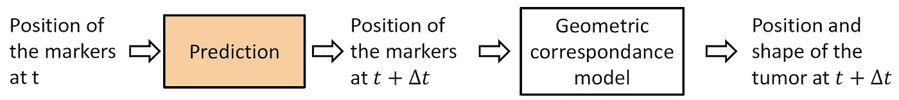

使用对应模型从外部标记位置测量中导出肿瘤的未来位置。在这项研究中，我专门关注预测步骤，以补偿治疗系统的延迟。

# 2.我们的方法

## 2.1.数据集

在这项研究中，我使用了由九个序列组成的 [ExtMarker](https://paperswithcode.com/dataset/extmarker) 数据集，其中包含健康个体胸部三个外部标记的 3D 位置。采样频率为 10 Hz，脊柱方向的运动幅度在 6mm-40mm 之间。该数据集是公开的，更多信息可在[【7】](https://doi.org/10.48550/arXiv.1508.00749)中找到。我们将每个序列的数据分为训练集、交叉验证集和测试集。

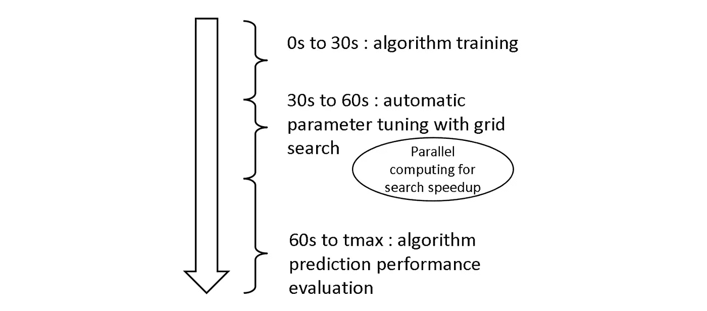

对于包含标记位置的 9 个序列中的每一个，将数据划分为训练集、交叉验证集和测试集。

预测呼吸运动是具有挑战性的，因为诸如振幅和周期的呼吸特征在每个记录中是变化的，即使它看起来主要是周期性的。此外，在大约一半的记录中，个人被要求说话或笑，这使得任务更加复杂。在现实世界中，也会发生突发的呼吸异常，如咳嗽、打嗝或打哈欠，这就是为什么挑战记录是有益的。

## 2.2.让我们进入 RNNs 的世界。

备注:本节中的方程最好在计算机显示器上查看。

RNNs 是一种特殊类型的神经网络，配备有反馈回路，使它们能够记住随着时间推移获得的信息。当我们进行预测时，标记在过去和未来的位置分别是网络的输入和输出。预测是一个自我监督的学习问题，因为不需要人工注释。这项研究使用了一个简单的香草架构，只有一个隐藏层。

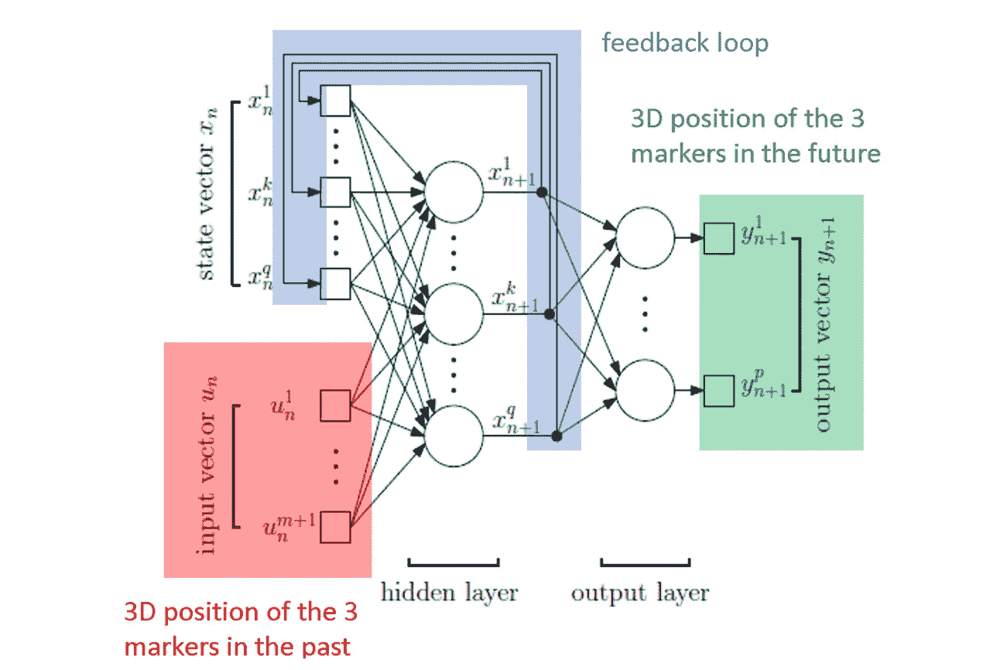

预测标记位置的 RNN 的结构。输入向量 uₙ对应于过去的位置，输出向量 yₙ₊₁对应于预测的位置。经爱思唯尔许可，改编自[【6】](https://doi.org/10.1016/j.compmedimag.2021.101941)，版权 2022

rnn 通常使用时间反向传播(BPTT)进行离线训练。离线学习指定了一个学习过程，其中有两个独立的训练和推理步骤。在我们的研究中，我们使用在线学习，这意味着训练和推理是同时进行的。在放射治疗的情况下，这使得网络能够适应看不见的呼吸模式，尽管只看到有限的数据。事实上，由于有关个人信息保护的法规，人工智能医疗应用的数据收集通常很困难。这项研究调查了 UORO[【8】](https://doi.org/10.48550/arXiv.1702.05043)(一种最近使用 RNNs 进行在线学习的方法)预测呼吸运动的效率。

下面简单讨论一下 UORO 是如何工作的。首先，让我们写出 RNN 方程。下面的第一个方程(状态方程)描述了内部状态向量 *x* ₙ的演化，第二个方程(测量方程)能够计算输出向量 *y* ₙ₊₁. *θ* ₙ和 *u* ₙ分别指定参数向量和输入向量。注意，参数向量依赖于 *n* ，因为我们执行在线学习。

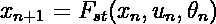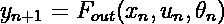

我们寻求最小化的损失函数是:

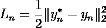

在这个等式中， *y* ₙ *** 指定地面实况标签(我们想要预测的标记的位置)。我们可以使用 *y* ₙ的定义和链式法则计算损失相对于 *θ* 的导数:

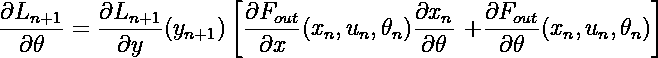

类似地，通过将链式法则与测量方程结合使用，我们可以推导出以下方程:

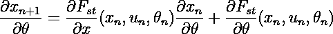

第一个等式能够计算作为影响矩阵∂xₙ/∂ *θ的函数的损失梯度。*第二个方程让我们在每个时间步递归更新影响矩阵。对于我们的特定网络，所有其他偏导数都可以使用损耗 *L* 的定义和选择的函数 *F* ₒᵤₜ和 *F* ₛₜ 来计算；在我们的工作中，后者分别是线性函数和单元双曲正切。这种在每个时间步计算损失梯度的方法被称为实时递归学习(RTRL)。RTRL 的主要缺点是计算量大，因为更新成本是*o(q⁴*，其中 *q* 是隐藏单元的数量。这特别是由于影响矩阵的大小，它有许多条目，我们需要在每个时间步更新。UORO 的主要思想是将矩阵估计为两个随机向量的乘积(换句话说，它由无偏的秩为 1 的矩阵估计器近似)，并在每个时间步长更新它们:

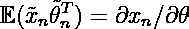

同样，我不会在这里详细描述这两个向量是如何更新的。重要的一点是，有一种有效的方法来压缩包含在影响矩阵中的信息，使得能够将计算成本降低到 *O(q )* 。

我将在文章结尾的附加部分描述 UORO 核心的数学属性，所以请务必跟上:)

在这项研究中，我对每个序列独立进行预测，并使用网格搜索进行交叉验证。

## 2.3.在 Matlab 中实现 UORO

我们来试着了解一下 UORO 在 Matlab 中的基本实现。这里我将描述一下我的论文对应的 [Github 库的`rnn_UORO`功能。如果您对 Python 有所了解，那么这里没有什么好害怕的，因为这两种语言的语法非常接近。如果您对代码不感兴趣或者喜欢直接分析结果，可以跳过这一部分。](https://github.com/pohl-michel/time-series-forecasting-with-UORO-RTRL-LMS-and-linear-regression)

顺便提一下，我还想提一下 realpython.com 的深度指南，题为[“Matlab 与 Python:为什么以及如何进行转换”](https://realpython.com/matlab-vs-python/)，它比较了 MATLAB 和 Python，并从我在 MATLAB 的经历中帮助我学习 Python(反正它们是非常相似的语言)。如果你精通 Python 并且想更好地理解 Matlab 语法，你也可以阅读。

首先，我定义了一个辅助函数来根据状态方程实现正向传播(参见 2.2 节)。Matlab 中的函数是使用`function`关键字定义的，而`def`关键字是在 Python 中使用的。在这段代码中，`myRNN`是一个包含 RNN 参数的 [Matlab 结构数组](https://www.mathworks.com/help/matlab/ref/struct.html)(这或多或少相当于 Python 中的字典和 C 语言中的结构)。我选择激活函数`phi`作为双曲正切函数。它是使用一个[匿名函数](https://www.mathworks.com/help/matlab/matlab_prog/anonymous-functions.html)实现的，这个函数相当于 Python 中的 [lambda 函数](https://realpython.com/python-lambda/#python-lambda-and-regular-functions)。

Matlab 中的状态方程带有线性状态函数 *F* ₛₜ和双曲正切激活函数

我还使用了另一个辅助函数来执行一个梯度下降步骤，在每个时间步进行剪辑。这里，`theta`是 RNN 参数向量，`dtheta`是损耗梯度。通过实验，我发现削波有助于稳定 RNN 的行为并获得更好的性能。如果你在 [GitHub 库](https://github.com/pohl-michel/time-series-forecasting-with-UORO-RTRL-LMS-and-linear-regression)中查看我的代码，你会注意到我也实现了自适应矩估计(ADAM)。然而，我在实验中注意到，后者并没有提高预测的准确性。因此，在我的文章中，我只报告了用梯度下降法获得的结果。

Matlab 中带裁剪的梯度下降步长

用于训练 RNN 的主函数将分别包含 RNN 参数和预测超参数的结构`myRNN` 和`pred_par`以及包含输入和输出数据(标记的位置)的 2D 数组`Xdata`和`Ydata`作为输入。

UORO 在 Matlab 中的实现

首先，我们定义包含有用信息的变量，比如数组的大小(第 3 行到第 11 行)。

然后，我们在时间步长上循环，并使用上面的辅助函数`RNNstate_fwd_prop`执行正向传播(第 13 到 21 行)。这些行包括使用测量方程(带有线性输出函数)和瞬时误差(参见第 2.2 节)计算的 *y* ₙ₊₁。 [tic](https://www.mathworks.com/help/matlab/ref/tic.html) 功能用于告诉计算机“启动秒表”测量当前时间步长对应的计算时间。

第 23 行和第 45 行之间的代码部分非常数学化。我不会在这里深入细节，但我会从整体的角度解释发生了什么。首先，您可以看到有一个使用 [rand](https://www.mathworks.com/help/matlab/ref/rand.html) 函数随机初始化的向量`nu`(第 30 行)。这里重要的一点是两个向量`myRNN.xtilde`和`myRNN.theta_tilde`是从那个随机向量中计算出来的(第 44 和 45 行)。这些对应于我们在 2.2 节中提到的两个随机向量，其乘积是影响矩阵∂xₙ/∂ *θ* 的无偏估计。你可以看到它们在每个时间步递归更新。另一个重要的行是从这两个向量计算损失梯度估计值`gtilde`(第 27 行)。如果你对底层数学感兴趣，我想让你参考一下关于 UORO[【8】](https://doi.org/10.48550/arXiv.1702.05043)的原始论文和我的文章[【3】](https://doi.org/10.48550/arXiv.2106.01100)，它首次提供了香草 RNNs 情况下`myRNN.dtheta`、`myRNN.dtheta_g`、`dx`的闭合形式表达式。这些在该实现中用于计算损耗梯度。此外，在这个故事的结尾有一个额外的部分，涵盖了 UORO 所依赖的基本数学属性，所以请继续关注我:)

最后，我们用上面描述的`update_param_optim`辅助函数更新梯度估计(第 51 行)。我使用了[整形](https://www.mathworks.com/help/matlab/ref/reshape.html)函数和切片，因为权重矩阵`myRNN.Wa`、`myRNN.Wb`和`myRNN.Wc`被硬编码为 2D 数组，连接这些权重的向量`theta_vec`是一个线向量。最后，我更新状态向量，并存储计算时间(用 [toc](https://www.mathworks.com/help/matlab/ref/toc.html) )和瞬时损耗，供以后分析。

我的 Github 库中的代码略有不同，因为它也处理 GPU 计算，但是为了解释简单，我跳过了这一部分。此外，我通过实验发现，使用我的 GPU 会使 UORO 计算变慢。所以我这篇文章只报道 UORO 对应 CPU 计算的性能。

# 3.结果

## 3.1.预测行为的定性观察

我们先来定义这里的基本术语。我们称之为“水平”,用 *h* 表示进行预测的提前时间间隔，信号历史长度(SHL)表示时间间隔，其信息用于在给定的时间步长进行单次预测。

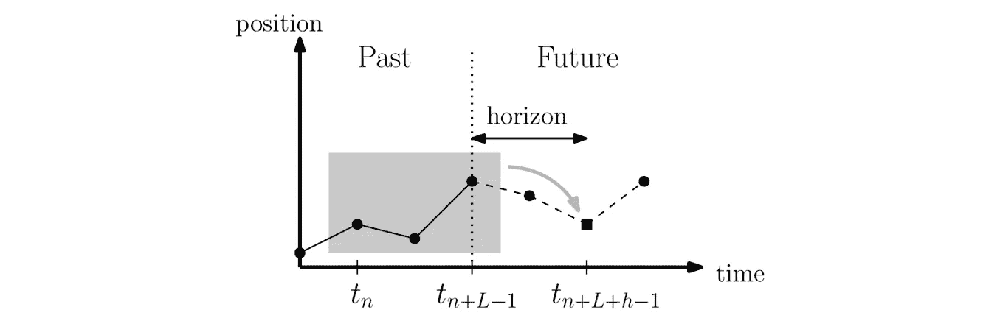

预测 1D 位置信号。SHL 和 horizon 分别用 h 和 l 表示，转载自[【3】](https://doi.org/10.48550/arXiv.2106.01100)，版权 2022，经爱思唯尔许可。

让我们首先在视觉上定性地检查序列 1 中标记 3 的预测运动(不规则呼吸)沿着脊柱方向对于不同的水平值。

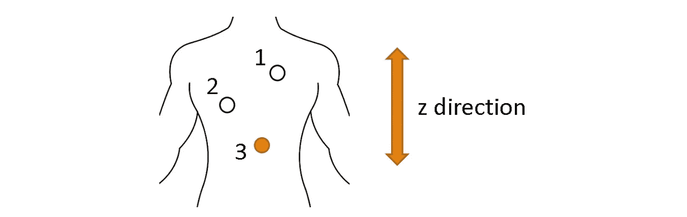

一个对象胸部上的三个标记随着呼吸运动而移动。

下图似乎表明 UORO 比 RTRL 和最小均方误差(LMS)更精确。事实上，我们限制了与 RTRL 关联的隐藏单元和 SHL 的数量，以保持可接受的计算时间。此外，LMS 是自适应线性滤波器，不具有 RNNs 的代表能力。

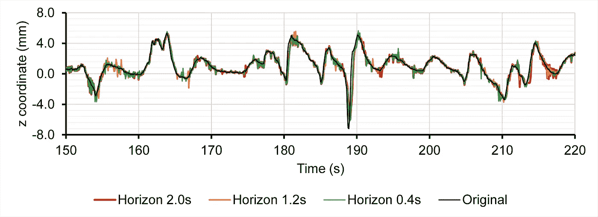

用 UORO 训练的 RNN 预测序列 1 中标记 3 的 z 坐标(脊线轴)。转载自[【3】](https://doi.org/10.48550/arXiv.2106.01100)，版权 2022，经爱思唯尔许可。

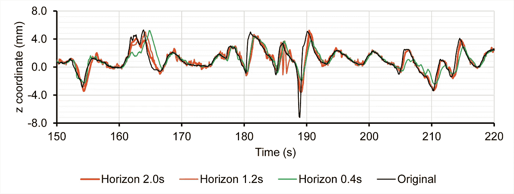

用 RTRL 训练的 RNN 预测序列 1 中标记 3 的 z 坐标(脊柱轴)。转载自[【3】](https://doi.org/10.48550/arXiv.2106.01100)，版权 2022，经爱思唯尔许可。

我们观察到 LMS 给出的预测具有高抖动，即，它在地面实况标记坐标周围振荡很多。

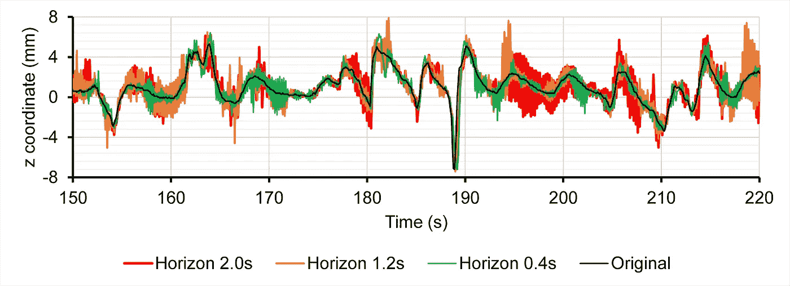

用 LMS 预测序列 1 中标记 3 的 z 坐标(脊线轴)。经爱思唯尔许可，转载自[【3】](https://doi.org/10.48550/arXiv.2106.01100)，版权 2022。

## 3.2.数值预报精度

我承认我选择了上面的例子，因为它使 UORO 看起来很好。尽管如此，在某些情况下，UORO 的表现不如其他方法。让我们仔细看看，当我们对 0.1s 和 2.0s 之间的水平值和九个序列的数值精度指标进行平均时，会发生什么情况。事实上，之前有报道称，放射治疗中的潜伏期范围在 0.1 秒和 2.0 秒之间[【9】](https://doi.org/10.1109/MCSE.2010.99)。

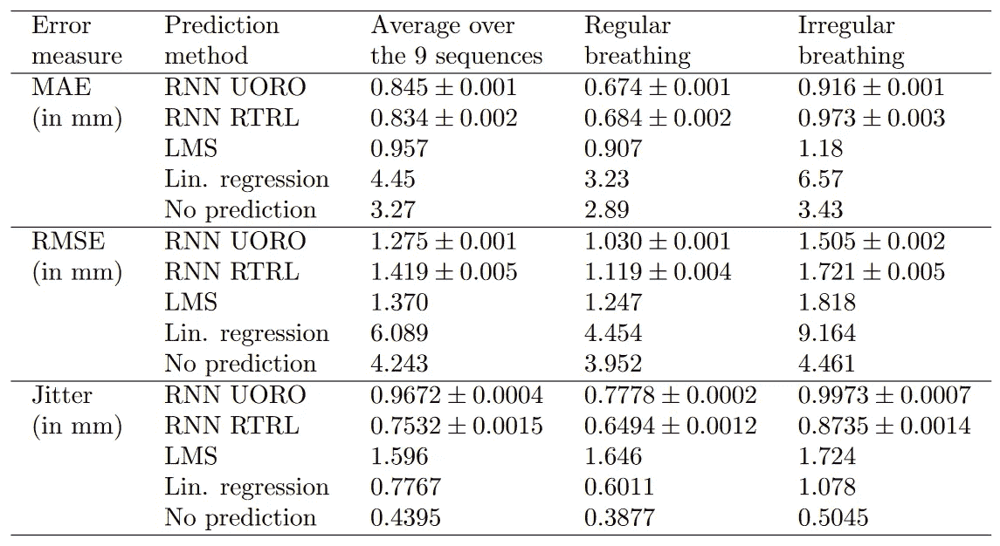

各算法预测性能的比较。每个误差值对应于测试集在所考虑的序列和 0.1s 到 2.0s 之间的水平值上的给定性能测量的平均值。改编自[【3】](https://doi.org/10.48550/arXiv.2106.01100)，版权 2022，经 Elsevier 许可。

我报告了几个指标，因为它们给出了关于每个算法的预测行为的不同信息。从严格意义上讲，平均误差(MAE)是一段时间内的平均绝对误差，均方根误差(RMSE)惩罚更高的偏差，抖动衡量预测信号的振荡幅度。振荡太多的预测是不希望的，因为它们使得控制引导辐射束的机器人更加复杂。

当查看九个序列的平均误差度量时，我们观察到 RTRL 在 MAE 方面优于 UORO，但是当查看 RMSE 时，情况正好相反。LMS 精度相对较好，但抖动较大。当然，当仅考虑对应于规则呼吸的序列时，误差较低，而当观察对应于不规则呼吸的序列时，误差较高。

但是不同的系统有不同的延迟时间。在每种情况下，最佳算法的选择取决于所考虑的放射治疗系统的等待时间。因此，我将预测误差绘制成水平值的函数 *h.*

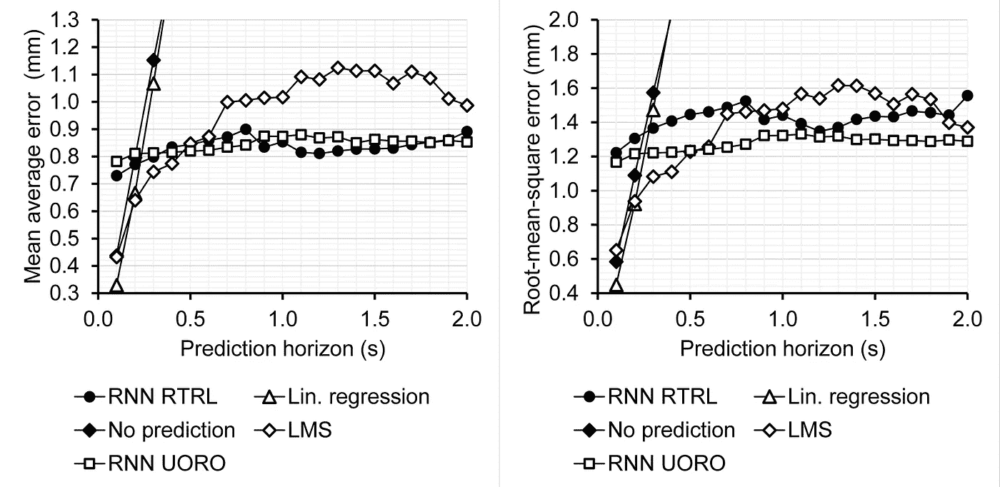

根据预测范围预测每个算法的性能。每个点对应于 9 个序列中测试集的一个性能测量的平均值。经爱思唯尔许可，转载自[【3】](https://doi.org/10.48550/arXiv.2106.01100)，版权 2022。

因为超参数优化导致对于不同的 *h* 值的不同超参数选择，所以图表看起来具有局部不规则性。然而，随着 *h* 的增加，误差总体上趋于增加。我们观察到，对于低的 *h* 值，线性预测实际上是最准确的预测算法。LMS 对于中间值 *h* 也很有效。

下图总结了每种算法在 RMSE 和抖动方面的性能。顺便提一下，在我的原始文章中，我使用了一个类似的图表，用“归一化 RMSE”来描述性能，缩写为 nRMSE，而不是 nRMSE 前者是在评估性能时额外考虑信号幅度的措施。我们再次观察到，对于对应于不规则呼吸的信号，RMSE 和抖动都较高。给定可接受的抖动水平和特定的地平线值，这种 2D 表示可以帮助找到具有最高预测准确度的算法。

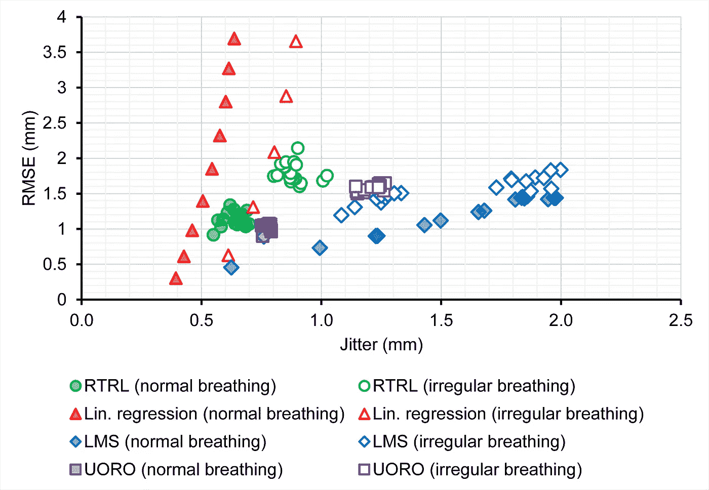

每个算法在 RMSE 和抖动方面的预测性能。每个点对应于对于单一水平值的规则或不规则呼吸序列的测试集的给定算法的 RMSE 和抖动的平均值。对应于具有高层位值的线性回归的数据点由于对应于高 RMSE 值而没有显示出来。

## 3.3.超参数优化

先说超参数优化。我们之前指出，我们使用交叉验证来选择网络超参数，以获得最佳性能。我发现在这项研究中，学习速度和 SHL 是对表现影响最大的因素。因此，让我们仔细看看他们的选择如何影响预测的准确性。

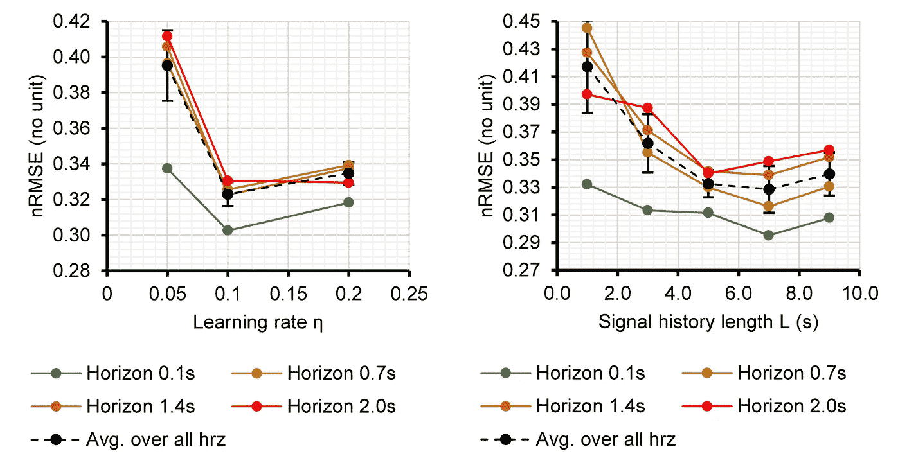

对于
不同的水平值，交叉验证集 UORO 的预测 nRMSE 作为学习率和 SHL 的函数。黑色虚线对应 0.1 秒至 2.0 秒范围内的 nRMSE 最小值平均值，相关误差条对应这些范围内的标准偏差。转载自[【3】](https://doi.org/10.48550/arXiv.2106.01100)，版权 2022，经爱思唯尔许可。

我们再次观察到，地平线 *h* 越高，预测误差越高。在高值的 *h* 的情况下，网络看起来更有效，具有更高的学习率和更低的 SHL。换句话说，在这种情况下，当只考虑最近的信号并在输入呼吸模式发生变化时更快地调整权重时，网络工作得更好。

## 3.4.时间性能

计算时间是评估我们算法的最重要的标准之一。我们观察到预测时间随着 SHL 的增加而增加，SHL 与输入层的大小和隐藏单元的数量成比例。线性回归似乎是最快的预测方法，其次是 LMS。UORO 能够在我的机器上执行预测的速度比 RTRL 快大约 100 倍，这是他们各自计算复杂度 *O(q )* 和 *O(q⁴)* 的直接结果。

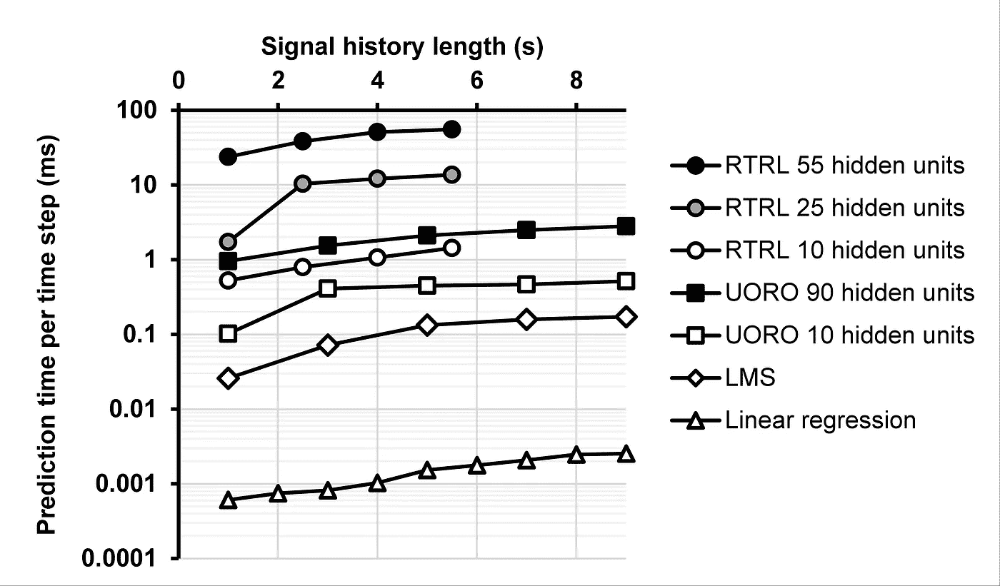

计算时间(戴尔英特尔酷睿 i9–9900k 3.60 GHz CPU 32Gb RAM，带 Matlab)。改编自[【3】](https://doi.org/10.48550/arXiv.2106.01100)，版权 2022，经爱思唯尔许可。

# 4.总之

这项工作是首次将 UORO 训练的 RNNs 应用于放射治疗中的呼吸运动补偿。UORO 是一种在线学习算法，能够学习以流方式到达的数据，这使得对不规则呼吸具有高鲁棒性，并且比传统学习算法需要更少的数据。因此，它有可能减少对健康组织的辐射，从而避免气胸等副作用。

据我们所知，我们使用最广泛的水平值范围 *h* 来比较关于呼吸运动预测的文献研究中的不同预测算法。我们发现线性回归在 0.1s ≤ *h* ≤ 0.2s 时 RMSE 最低，其次是 0.3s ≤ *h* ≤ 0.5s 时的 LMS，以及 *h* ≥ 0.6s 时的 UORO，呼吸信号采样频率为 10Hz。

如果您对这个故事感兴趣，请不要犹豫阅读最初的研究文章，在那里我更广泛地涉及了这个主题并讨论了数学细节(这篇文章也是第一篇提供与 UORO 中的损失梯度相关的一些表达式的详细计算的文章)。数据集和 Matlab 代码是公开可用的，所以如果你愿意，你可以用它们来做你自己的实验。如果你愿意的话，也请考虑引用我的研究文章。

非常感谢您花时间阅读本文。我真诚地希望你能喜欢学习一些有趣的东西。请不要犹豫，在评论区告诉我你的想法。:)

# 5.奖金:排名第一的把戏

我想提一下作为 UORO 基础的核心数学性质，它是在[【10】](https://doi.org/10.48550/arXiv.1507.07680)中首次介绍的。这是:

给定矩阵的分解 *A* 为秩 1 外积的和

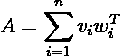

·独立随机符号 *ν* ᵢ **∈** {-1，1}，和一个向量 *ρ* 的 *n* 正实数，以下量

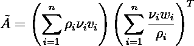

满足:

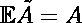

此外，选择

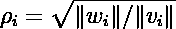

最小化近似值的方差。

这个性质的第一部分相对容易证明，它是由期望算子的线性性产生的。方差最小化部分需要更详细的分析。虽然我不会在这里对后者做出评论，但我想在 2.3 节中与 Matlab 实现做一个链接。您可以查看代码，看到我的实现中的变量`nu`对应于上面的向量ν(第 30 行)。变量`rho0`和`rho1`(第 40 和 41 行)对应于上述公式中的量 *ρ* ᵢ。还要注意后者是如何表示为代码中两个向量的范数的平方根的。出现在这些分数周围的变量`pred_par.eps_normalizer`是为了保证数值的稳定性。

为了推导 UORO 算法，秩 1 技巧实际上结合描述影响矩阵∂xₙ/∂ *θ* 的递归更新的方程应用了两次(参见第 2.2 节)。证明细节在原始 UORO 文件[【8】](https://doi.org/10.48550/arXiv.1702.05043)中。

# 参考

1.  Sung Hyuna、Jacques Ferlay、Rebecca L. Siegel、Mathieu Laversanne、Isabelle Soerjomataram、Ahmedin Jemal 和 Freddie Bray，[2020 年全球癌症统计:全球 185 个国家 36 种癌症发病率和死亡率的全球估计数](https://doi.org/10.3322/caac.21660) (2020 年)，ca:临床医生癌症杂志
2.  国家癌症研究所-监测、流行病学和最终结果项目，[癌症统计
    事实:肺癌和支气管癌](https://seer.cancer.gov/statfacts/html/lungb.html)(2022)[2021 年 6 月 15 日获取]
3.  Pohl Michel、Mitsuru Uesaka、Hiroyuki Takahashi、Kazuyuki Demachi 和 Ritu Bhusal Chhatkuli，[使用经过无偏在线递归优化训练的递归神经网络预测外部标记的位置，用于安全肺癌放射治疗](https://doi.org/10.48550/arXiv.2106.01100) (2022)，《生物医学中的计算机方法和程序》
4.  Ritu Bhusal Chhatkuli，[利用主成分分析和多通道奇异光谱分析开发无标记肿瘤预测系统，并在放射治疗中进行实时呼吸相位识别](https://doi.org/10.15083/00073584) (2016)，东京大学博士论文
5.  Schweikard Achim，Hiroya Shiomi 和 John Adler，[放射外科中的呼吸跟踪](https://doi.org/10.1118/1.1774132) (2004)，医学物理学
6.  Pohl Michel、Mitsuru Uesaka、Kazuyuki Demachi 和 Ritu Bhusal Chhatkuli，[使用经过实时递归学习训练的递归神经网络预测胸部内部点的运动，用于肺癌放射治疗中的潜伏期补偿](https://doi.org/10.1016/j.compmedimag.2021.101941) (2021)，计算机化医学成像和图形
7.  Krilavicius Tomas、Indre Zliobaite、Henrikas Simonavicius 和 Laimonas Jaruevicius，[预测放射治疗中实时肿瘤跟踪的呼吸运动](https://doi.org/10.48550/arXiv.1508.00749) (2016)，ArXiv.org
8.  Corentin Tallec 和 Yann Ollivier，[无偏在线递归优化](https://doi.org/10.48550/arXiv.1702.05043) (2017)，ArXiv.org
9.  维尔马·普纳姆、吴焕梅、马克·兰格、因陀罗·达斯和乔治·桑迪森，[调查:用于图像引导放射治疗的实时肿瘤运动预测](https://doi.org/10.1109/MCSE.2010.99) (2010)，科学计算&工程
10.  Ollivier Yann、Corentin Tallec 和 Guillaume Charpiat，[在线无回溯训练循环网络](https://doi.org/10.48550/arXiv.1507.07680) (2015)，ArXiv.org