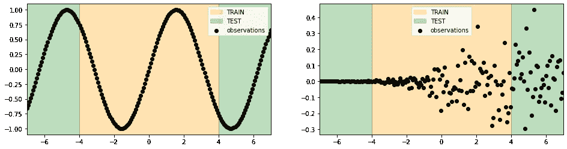
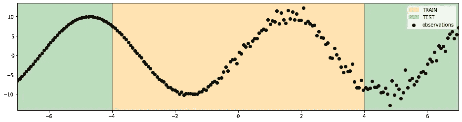
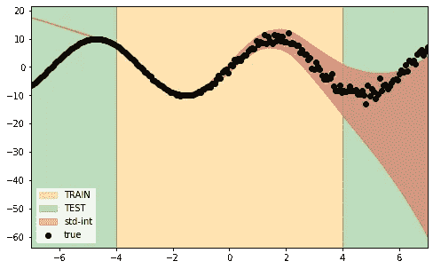
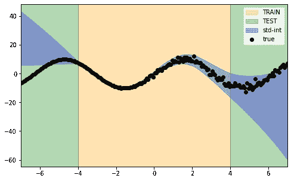

# 用深度学习中的线性模型预测不确定性

> 原文：<https://towardsdatascience.com/forecasting-uncertainty-with-linear-models-like-in-deep-learning-bc58f53938>

## 将任意的和认知的不确定性纳入预测区间

在 [Unsplash](https://unsplash.com?utm_source=medium&utm_medium=referral) 上 [engin akyurt](https://unsplash.com/@enginakyurt?utm_source=medium&utm_medium=referral) 拍摄的照片

通常，机器学习行业的应用程序不会考虑如何产生不确定性估计。在许多现实世界的任务中，不仅需要做出准确的预测。**提供模型结果的置信度对于做出最有效的决策可能至关重要**。

除了一些深度学习技术或者其他特殊情况，**产生信心估计并不是免费的午餐**。我们可以把产生置信度得分的所有解决方案看作是标准训练和预测阶段的一个独立步骤。最简单和直观的方法在于[使用残差自举作为估计观测值和预测值之间不确定性的方法](https://medium.com/towards-data-science/add-prediction-intervals-to-your-forecasting-model-531b7c2d386c)。**基于 Bootstrap 的技术是接近不确定性领域的起点**。

使用 bootstrapping，我们可以用较少的努力和简单的假设为我们的预测建立一个置信度。另一方面，与盲目使用 bootstrap 规则相比，产生可靠和校准的估计可能需要更多的关注和验证。

首先要记住的是，我们不想优化预测模型来产生最佳的逐点预测。有准确的预测是可取的，但提供可靠的界限，其中我们有信心观察值下降，将是梦幻般的。换句话说，有好的预测是一个起点，但是**建立信心评估在大多数时候是一项单独的任务**，应该使用适当的评分方法进行验证。

其次，我们应该记住存在两种不同的不确定性来源。我们分别指的是任意的和认知的不确定性。可以确定的是，所有的 AI 预测总是不确定的。由于这个原因，**一个好的置信度应该包含任意的和认知的不确定性**。

在这篇文章中，我们介绍了一种在回归任务中为我们的机器学习模型提供置信度估计的方法。所提出的方法只是作为预测之后的一个附加步骤。它适合一个单独的线性模型，通过最小化一个“特别的”损失函数来专门预测样本的不确定性。为了对这个主题有一个更技术性的概述，我建议[这篇文章](https://arxiv.org/abs/2204.09308)也适用于神经网络生态系统之外。

# 实验设置

所提出的解决方案的先决条件可以概括为两个一般概念:

*   **适应性**:作为流程中的一个附加步骤，我们的解决方案应该适用于每个预测解决方案的末尾。
*   **完备性**:该方法应该足够好，能够涵盖任意的和认知的不确定性场景。

作为起点，**我们必须获得一个经验表示来对预测模型**的方差进行数值估计。在这个意义上，高斯负对数似然(NLL)损失是一个完美的候选。

高斯负对数似然公式[图片由作者提供]

在上述损失中，主要涉及 3 个条款:

*   *yᵢ:* 我们用来建立预测模型的目标值。
*   *μ* ( *xᵢ* ):预测模型做出的逐点预测。
*   *∑*(*xᵢ*):估计的不确定性，确切地代表了我们想要预测的东西。

为了提供不确定性的样本估计，我们认为给出了 *yᵢ* 和 *μ* ( *xᵢ* )。这意味着我们已经拟合了我们选择的预测模型。为了最小化 NLL 损失，我们拟合了一个线性模型，该模型试图预测 *σ* ( *xᵢ* )的最佳值。在最小化结束时，**我们有一个线性模型，它接收我们处理的特征作为输入，并返回每个观察值的不确定性预测**。

# 预测不确定性

让我们来看看所提议的方法在起作用。

我们在固定域中生成正弦数据，在一个方向上增加高斯噪声。我们明确地选择了这些数据，以观察一个模型在其知识领域之外可以预测什么。尽管数据非常简单，但我们并不期望我们的模型能在列车边界之外很好地推广。

原始正弦曲线(左)。噪音增加(右侧)。[图片由作者提供]

原始正弦曲线加上不断增加的噪声。[图片由作者提供]

另一方面，**我们的不确定性估计应该概述我们的模型在其知识领域之外做出预测的困难**。

在下图中，我们描述了使用多层感知器回归器的预测，通过建议的方法获得的不确定性。生成的西格玛间隔的宽度随着数据中噪声的增加而增加。这是正确的，这意味着我们可以将数据中存在的噪声捕捉为一种不确定性(任意不确定性)。

包含任意不确定性的适马区间。[图片由作者提供]

下一步，我们想看看我们是否能把模型预测的不准确性(认知不确定性)作为一个额外的不确定性来源。在这种意义上，我们期望在训练边界之外看到两个方向上的置信带增长，因为模型不适合预测该范围之外的数据。

包含任意和认知不确定性的适马区间。[图片由作者提供]

在上图中，我们观察到的正是我们的目标。**我们的 sigma 区间同时封装了来自数据和模型结果的不确定性**。我们通过在系综格式中应用我们的方法简单地获得了这个结果。换句话说，我们拟合多个多层感知器回归器，并将它们组合以构建高斯混合。混合物的平均值和标准偏差分别作为真实值和不确定性的预测返回。

仔细观察两种方法中的西格玛预测，有助于区分两种不确定性来源的考虑方式。

只有任意不确定性(红色)和任意加认知不确定性的适马区间宽度。(蓝色)[图片由作者提供]

# 摘要

在这篇文章中，我们介绍了一种评估模型不确定性的方法。我们提供了一个奇特而巧妙的实现，它包括拟合一个线性回归来预测每个逐点预测的标准偏差。我们还发现了如何将任意的和认知的来源结合到我们的信心预测中。作为一个附加值，建议的实现似乎适用于所有具有内置外推能力的模型。

[查看我的 GITHUB 回购 ](https://github.com/cerlymarco/MEDIUM_NoteBook)

保持联系: [Linkedin](https://www.linkedin.com/in/marco-cerliani-b0bba714b/)

## 参考

马蒂亚斯·瓦尔登格罗-托罗；丹尼尔·萨罗莫·莫里。( *arXiv* 2022) [对任意性和认知不确定性的深入研究](https://doi.org/10.48550/arXiv.2204.09308)。