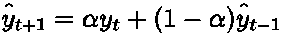
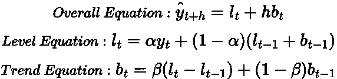
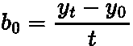
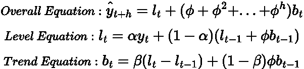
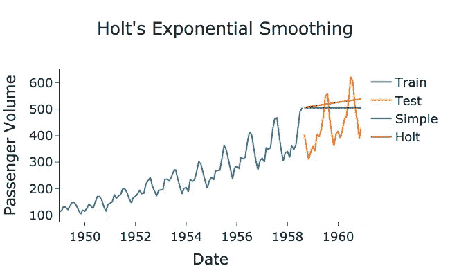
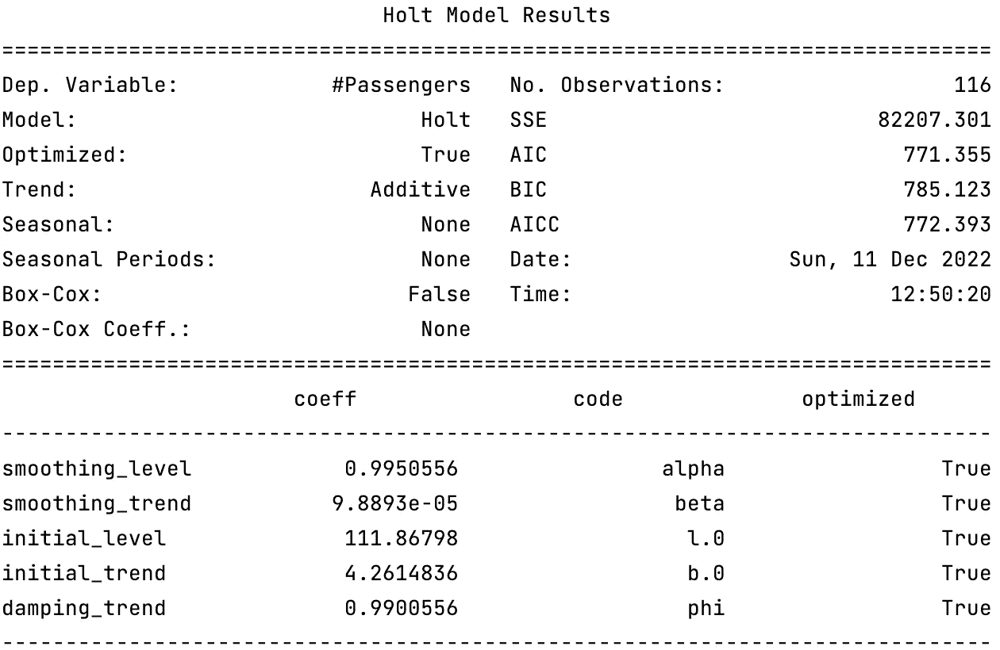

# 霍尔特线性趋势指数平滑的时间序列预测

> 原文：<https://towardsdatascience.com/forecasting-with-holts-linear-trend-exponential-smoothing-af2aa4590c18>

## 指数平滑模型中的趋势补偿


[杰瑞米·托马斯](https://unsplash.com/@jeremythomasphoto?utm_source=medium&utm_medium=referral)在 [Unsplash](https://unsplash.com?utm_source=medium&utm_medium=referral) 上拍照

# 背景

在我的[上一篇](https://medium.com/towards-data-science/forecasting-with-simple-exponential-smoothing-dd8f8470a14c)文章中，我们介绍了 [**指数平滑**](https://en.wikipedia.org/wiki/Exponential_smoothing) 的思想来构建预测模型。指数平滑法的要点是对最近的观测值给予更多的权重，而对更多的历史观测值给予更少的权重。

我们介绍的第一个模型是*简单*指数平滑。“简单”部分是指模型不考虑[趋势](https://medium.com/towards-data-science/time-series-stationarity-simply-explained-125269968154)或[季节性](https://medium.com/towards-data-science/seasonality-of-time-series-5b45b4809acd)，只预测*水平*。这导致这种特殊的模型经常对大多数时间序列提供不充分的预测。因此，我们需要从这个简单的方法进一步迭代。

在来了 [**霍尔特的线性趋势法**](https://en.wikipedia.org/wiki/Exponential_smoothing#Double_exponential_smoothing_(Holt_linear)) (也称为双指数平滑)，顾名思义，就是在简单的指数平滑模型中加入一个(线性)趋势成分。在这篇文章中，我们将介绍霍尔特线性趋势模型的理论和实际应用。

# 霍尔特的线性趋势模型理论

## 简单指数平滑

让我们首先回顾一下简单的指数平滑方程:



作者在 LaTeX 中生成的方程。

这里***【ŷ_{t+1}】***是我们预测的时间步长， ***y_t*** 是时间序列的最近观测值， ***ŷ_{t-1}*** 是之前的预测， ***α*** 是取值为 ***0 ≤ α ≤ 1 的平滑因子。*** 我们看到，预测仅仅是对以前观测值的加权平均，这就是指数平滑的本质。

上述等式可以改写为分量形式:


作者在 LaTeX 中生成的方程。

其中 ***h*** 是我们预测的未来时间步，我们让***l _ t****=****【ŷ_{t+1}】***来明确地证明这是水平分量。如果你想了解更多关于简单指数平滑的知识，请参考我以前的文章:

[](/forecasting-with-simple-exponential-smoothing-dd8f8470a14c)  

## 添加趋势

如前所述，该模型没有趋势或季节成分，并导致[持平预测](https://medium.com/towards-data-science/basic-forecasting-techniques-ef4295248e46)(所有预测将相同并等于最近观察到的值)。因此，1957 年 [Charles Holt](https://en.wikipedia.org/wiki/Charles_C._Holt) 扩展了这个模型，加入了一个趋势成分， ***b_t*** :



作者在 LaTeX 中生成的方程。

其中 ***b_t*** 为预测趋势分量，****b _ { t-1 }***为之前的预测趋势， ***β*** 为可取值为 ***0 ≤ β ≤ 1 的趋势平滑因子。****

*趋势方程是根据水平分量的逐级变化计算的。此外，从总体方程来看，趋势分量现在正乘以时间步长 ***h*** ，因此预测不再是平坦的，而是*h 的线性函数。因此，模型的名称为*霍尔特线性趋势法。***

**对于这个模型，我们需要为趋势分量设置一个初始值，常见的选择是:**

****

**作者在 LaTeX 中生成的方程。**

**其中 ***t*** 是时间序列中的某个任意时间步长。这基本上只是一个[平均预测模型](https://medium.com/towards-data-science/basic-forecasting-techniques-ef4295248e46)。**

## **抑制**

**目前这种公式的一个问题是，预测在未来会任意增加或减少。事实上，没有什么东西会无限增长或衰减。因此，通常会添加一个抑制性术语***【ϕ***】,以缩减长期预测:**

****

**作者在 LaTeX 中生成的方程。**

**其中 ***ϕ*** 的值可以是 ***0 < ϕ < 1*** 。不能是 ***0*** 或 ***1*** 的原因是为了确保确实发生一些阻尼。如果 ***ϕ=1*** 那么这个模型就是普通的霍尔特线性趋势法。**

**现在让我们用 Python 实现这个新的指数平滑模型！**

# **Python 实现**

**下面是在一个非常简单的数据集上使用[stat models](https://www.statsmodels.org/dev/generated/statsmodels.tsa.holtwinters.Holt.html)包实现 Holt 线性趋势方法的代码片段:**

> **这些数据是美国航空公司的乘客数据集，来自拥有 CC0 执照的 Kaggle。**

**作者 GitHub 要点。**

****

**作者用 Python 生成的图**

**我们观察到霍尔特的方法捕捉到了趋势，而简单的指数平滑模型只是一个像我们预期的平面预测。然而，房间里仍然有一头大象。我们的时间序列具有相当高且明显的季节性，这是霍尔特的模型所没有捕捉到的。我将在下一篇文章中讨论如何处理季节性，但是现在我们可以得出结论，霍尔特的方法只适用于没有季节性的数据。**

**通过对拟合的模型对象调用以下方法，可以进一步诊断拟合的霍尔特模型:**

```
**model_holt.summary()**
```

****

**作者用 Python 生成的图像。**

**这里的`smoothing_level`是指平滑电平参数 ***α*** ，非常大，表示电平变化非常频繁。然而，`smoothing_trend`指的是平滑趋势参数***【β***，非常低，意味着趋势几乎没有太大变化。最后，`damping_trend`，也就是***【ϕ】***，很大，说明我们需要预测未来很长一段时间，才能观察到上升趋势的衰减。**

# **总结和进一步的思考**

**在本文中，我们展示了 Holt 的线性趋势方法在将趋势合并到指数平滑中的数学原理，以及如何用 Python 实现该模型。当数据有趋势但没有季节性成分时，Holt 的方法产生最好的预测。在以后的文章中，我们将回顾一下 [Holt Winters](https://en.wikipedia.org/wiki/Exponential_smoothing#Triple_exponential_smoothing_(Holt_Winters)) 模型，该模型增加了季节性。**

**本文中使用的完整代码可以在我的 GitHub 中找到:**

**[](https://github.com/egorhowell/Medium-Articles/blob/main/Time%20Series/Exponential%20Smoothing/holts_forecasting.py)  

# 参考资料和进一步阅读

*   *预测:原理与实践:*【https://otexts.com/fpp2/】T4

# 和我联系！

*   要在媒体上阅读无限的故事，请务必在此注册！ 💜
*   [*当我在这里发布注册邮件通知时获得更新！*](/subscribe/@egorhowell) 😀
*   [*LinkedIn*](https://www.linkedin.com/in/egor-howell-092a721b3/)*👔*
*   *[*碎碎念*](https://twitter.com/EgorHowell) 🖊*
*   *[*github*](https://github.com/egorhowell)*🖥**
*   **[](https://www.kaggle.com/egorphysics)**🏅****

> ***(所有表情符号由 [OpenMoji](https://openmoji.org/) 设计——开源表情符号和图标项目。许可证: [CC BY-SA 4.0](https://creativecommons.org/licenses/by-sa/4.0/#)*****