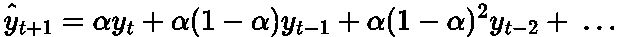
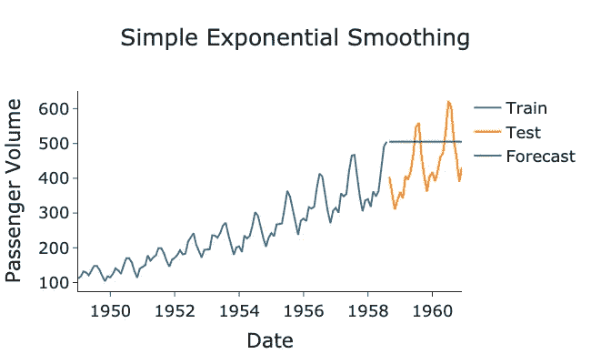
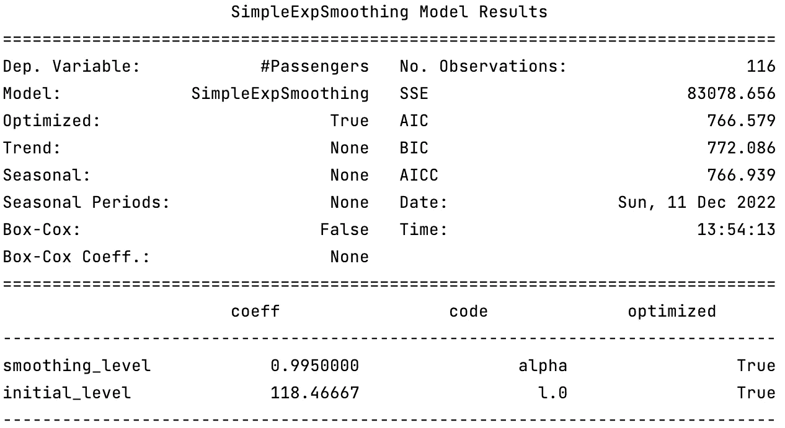

# 简单指数平滑的时间序列预测

> 原文：<https://towardsdatascience.com/forecasting-with-simple-exponential-smoothing-dd8f8470a14c>

## 指数平滑的介绍以及用 Python 实现指数平滑进行预测。


瑟奎拉在 [Unsplash](https://unsplash.com?utm_source=medium&utm_medium=referral) 上拍摄的[照片](https://unsplash.com/@shotbycerqueira?utm_source=medium&utm_medium=referral)

# 背景

预测领域包含各种各样的模型。在我之前的帖子中，我们讨论了一些[基本预测技术](https://medium.com/towards-data-science/basic-forecasting-techniques-ef4295248e46)，它们通常为迭代和构建更复杂的模型提供了良好的基础。这些基本模型的一个自然迭代是 [**指数平滑**](https://en.wikipedia.org/wiki/Exponential_smoothing) 。

指数平滑的想法起源于 20 世纪 50 年代，基本上是一种奇特的方式，表明我们将更加重视最近的观察结果。较老的观测值将会以指数衰减的速率得到较少的权重。因此，它被称为指数平滑。

您可以将它看作是简单预测模型和平均预测模型之间的中间值，在简单预测模型中，我们将预测值设置为等于最近的观测值，在平均预测模型中，我们将预测值设置为等于所有历史观测值的平均值。如果你想了解更多关于天真和平均预测模型的内容，请点击这里查看我以前的帖子:

[](/basic-forecasting-techniques-ef4295248e46) [## 基本预测技术

### 一些非常简单的预测模型概述

towardsdatascience.com](/basic-forecasting-techniques-ef4295248e46) 

在本文中，我想介绍最基本的指数平滑模型，以及如何用 Python 实现它。

# 什么是*简单*指数平滑？

## 概观

如上所述，这篇文章是关于指数平滑家族中最基本的模型，*简单指数平滑*。这个模型简单的原因是因为它没有考虑趋势或季节性。然而，这是一个很好的起点，可以在以后添加进一步的复杂性。如果你想了解更多的趋势和季节性，请参考我以前的文章:

[](/seasonality-of-time-series-5b45b4809acd) [## 时间序列的季节性

### 对季节性如何影响时间序列分析的直觉

towardsdatascience.com](/seasonality-of-time-series-5b45b4809acd) [](/time-series-decomposition-8f39432f78f9) [## 时间序列分解

### 将时间序列分解成基本的构建块

towardsdatascience.com](/time-series-decomposition-8f39432f78f9) 

一般来说，当您的数据没有任何趋势或季节性时，这个简单的模型是最好的。或者，您可以通过执行差分和 Box-Cox 变换来转换数据，使其保持平稳，从而消除其趋势和季节性。要了解更多关于这些转换的信息，请点击这里查看我以前的帖子:

[](/time-series-stationarity-simply-explained-125269968154) [## 时间序列平稳性的简单解释

### 时间序列建模中平稳性需求的简单而直观的解释。

towardsdatascience.com](/time-series-stationarity-simply-explained-125269968154) [](/box-cox-transform-for-time-series-cc45f26082c6) [## 时间序列的 Box-Cox 变换

### 如何使用 Box-Cox 变换创建平稳时间序列？

towardsdatascience.com](/box-cox-transform-for-time-series-cc45f26082c6) 

## 理论

(简单)指数平滑的一般数学公式如下:



作者在 LaTeX 中生成的方程。

其中***【ŷ_{t+1}】***为预测值， ***y_t* ，** ***y_{t-1}*** 和****y _ { t-2 }***为时间序列的前一次观测值， ***α*** 为平滑参数，取值 ***0 ≤ α ≤ 1*** 平滑参数是我们在拟合这个模型时需要估计的主要参数。该参数通常由最小二乘法的 [**，**](https://en.wikipedia.org/wiki/Least_squares) 来计算，幸运的是大多数计算软件包已经为我们完成了！*

> *平滑参数也可以通过预测者的直觉来选择。*

****α*** 的值越高，越重视最近的观察，反之亦然，对于 ***α*** 的值越低。如果 ***α=1，*** 那么我们恢复原始预测模型，其中所有预测都等于最近的观察。*

*我们可以简化上面的公式，用之前的预测来表达，***【ŷ_{t-1}】*:***

**

*作者在 LaTeX 中生成的方程。*

*这种重新表述的证明相当琐碎，但有点详尽，所以我在这篇文章中省略了它。不过有兴趣的读者可以在这里找到推导[！](https://otexts.com/fpp2/ses.html)*

*像所有的时间序列一样，指数平滑法通常被分解成它们的组成部分，如*水平*、*趋势*和*季节性*。由于简单的指数平滑法既不考虑趋势也不考虑季节性，因此它只包含水平分量， ***l_t:****

**

*作者在 LaTeX 中生成的方程。*

*其中 ***h*** 是我们正在预测的未来时间步，我们已经使***l _ t****=****【ŷ_{t+1}】***明确声明这是级别组件。这种简单指数平滑的数学表示可能看起来没有用，因为只有一个组件，但是当添加更多组件(如趋势和季节性)时，它变得非常强大。*

*现在这些理论已经足够了，让我们来看一个 Python 中的真实例子！*

# *在 Python 中实现指数平滑*

*下面是使用 [statsmodel](https://www.statsmodels.org/dev/examples/notebooks/generated/exponential_smoothing.html) 包对美国航空公司乘客数据集进行简单指数平滑的实现:*

> *数据[来源于拥有 CC0 许可证的 Kaggle](https://www.kaggle.com/datasets/ashfakyeafi/air-passenger-data-for-time-series-analysis) 。*

*作者 GitHub 要点。*

**

*作者用 Python 生成的图*

*预测显然不太好，但这确实是最简单的指数平滑模型。需要注意的一点是，预测是平的，这显然是由于模型没有趋势或季节性成分。还有进一步的模型，如霍尔特·温特的[](https://en.wikipedia.org/wiki/Exponential_smoothing#Triple_exponential_smoothing_(Holt_Winters))****，我将在后面的帖子中讨论，这些模型对这些额外的组件进行建模。*****

*****我们可以通过运行以下方法提取拟合模型的详细信息:*****

```
*****model.summary()*****
```

**********

*****作者用 Python 生成的图像。*****

*****该模型发现平滑参数的最佳值 ***α、*** ( `smoothing_level`)为 **0.995** 。这是非常高的，表明趋势相当不稳定，变化频繁。预测者(或读者)也可以根据自己的判断对模型进行诊断。*****

# *****总结和进一步的思考*****

*****在这篇文章中，我们介绍了指数平滑的概念。这一系列中最基本的模型是简单指数平滑，因为它不包含趋势或季节成分。它只是增加了最近观察值的权重，减少了历史观察值的权重，这个权重由一个平滑参数决定。在 Python 示例中，该模型没有提供良好的预测，因为数据表现出明显的季节性和明显的趋势。*****

*****本文使用的完整代码可以在我的 GitHub 中找到:*****

*****[](https://github.com/egorhowell/Medium-Articles/blob/main/Time%20Series/Exponential%20Smoothing/simple_exp_smoothing.py) [## Medium-Articles/simple _ exp _ smoothing . py at main egorhowell/Medium-Articles

### 此时您不能执行该操作。您已使用另一个标签页或窗口登录。您已在另一个选项卡中注销，或者…

github.com](https://github.com/egorhowell/Medium-Articles/blob/main/Time%20Series/Exponential%20Smoothing/simple_exp_smoothing.py) 

# 参考资料和进一步阅读

*   *预测:原理与实践:*【https://otexts.com/fpp2/ 

# 和我联系！

*   [*要想在媒体上阅读无限的故事，请务必在这里注册！*](/@egorhowell/membership) 💜
*   [*在我发布注册邮件通知时获得更新！*T13*😀*](/subscribe/@egorhowell)
*   [*领英*](https://www.linkedin.com/in/egor-howell-092a721b3/) 👔
*   [*碎碎念*](https://twitter.com/EgorHowell) 🖊
*   [*github*](https://github.com/egorhowell)*🖥*
*   *[](https://www.kaggle.com/egorphysics)**🏅***

> ***(所有表情符号由 [OpenMoji](https://openmoji.org/) 设计——开源表情符号和图标项目。许可证: [CC BY-SA 4.0](https://creativecommons.org/licenses/by-sa/4.0/#)********