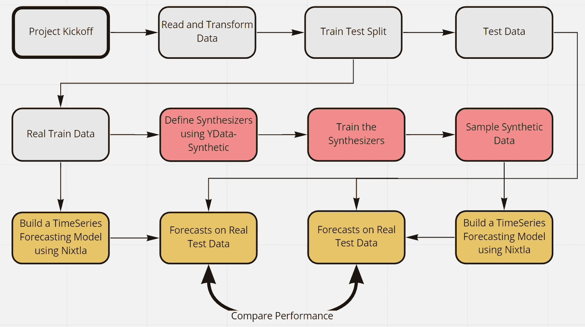

# 利用大规模合成数据进行预测(Nixtla & YData)

> 原文：<https://towardsdatascience.com/forecasting-with-synthetic-data-at-scale-nixtla-ydata-404b65600876>

# 利用大规模合成数据进行预测(Nixtla & YData)

## 制作合成时间序列数据，然后用深度学习模型进行预测

*由***和* [*YData*](http://YData.ai) *组成。* [*费德里科·加尔萨·拉米雷斯*](https://medium.com/u/2855bd3e0293?source=post_page-----404b65600876--------------------------------) *和* [*马克斯·梅根塔尔*](https://medium.com/u/76b639655285?source=post_page-----404b65600876--------------------------------) *。**

## *介绍*

*在这篇文章中，我们解释了如何使用 [nixtlats](https://github.com/Nixtla/nixtlats) 和 [ydata-synthetic](https://github.com/ydataai/ydata-synthetic) ，开源和免费的 python 库允许您生成合成数据来训练最先进的深度学习模型，而不会明显损失数据质量。我们开发了一个不直接访问原始数据的深度学习预测管道，并表明合成数据对模型的性能影响最小。*

## *动机*

*在过去的十年中，基于神经网络的预测方法在大规模预测应用中变得无处不在，超越了行业界限，进入了学术界，因为它在许多实际任务中重新定义了最先进的技术，如需求规划、电力负荷预测、逆向物流、天气预测，以及 M4 和 M5 等预测比赛。*

*然而，对于那些对创建预测感兴趣的人来说，一个问题是不使用原始数据的模型开发或软件测试；这可能是因为实际数据需要时间来收集，对其使用有限制，或者数据根本不存在。在许多应用程序中，用户不希望模型能够访问实际数据，特别是如果模型训练是在云中或基础设施之外进行的。上述情况极大地限制了实践，阻止了使用可用云对大型数据集的模型进行缩放。*

*这篇文章展示了如何使用`nixtlats`和`ydata-synthetic`来解决这个问题。首先，用户可以使用`ydata-synthetic`创建合成数据；合成数据是人工创建的，并保留原始数据属性，在合规的同时确保其商业价值。随后，用户可以使用`nixtlats`训练最先进的神经预测算法，而无需访问原始数据。一旦模型经过训练，就可以将模型发送给原始数据的所有者，并对其基础设施的安全性进行推断。下图描述了该过程。*

**

*作者图片*

*我们评估并显示，与原始模型的预测相比，合成模型的预测性能保持不变。*

# *图书馆*

*库`nixtlats`和`ydata-synthetic`在 [PyPI](https://pypi.org/project/nixtlats/) 中可用，所以你可以使用`pip install nixtlats`和`pip install ydata-synthetic`来安装它们。*

## *数据*

*为了评估管道，我们考虑每年的 [M4 竞赛](https://www.kaggle.com/yogesh94/m4-forecasting-competition-dataset)数据集。数据集最初是[公开发布的](https://github.com/Mcompetitions/M4-methods)，它是带着[完全开放访问许可](https://github.com/Mcompetitions/M4-methods/issues/16)发布的。M4 主要预测竞赛引入了一种新的多变量时间序列模型，称为指数平滑递归神经网络(ESRNN)，它在基线和复杂时间序列集合上以较大优势获胜。*

*我们将使用`nixtlats`库来方便地访问数据。*

*在本例中，我们使用 1000 个年度时间序列。*

*`M4.load`方法返回训练集和测试集，所以我们需要将它们分开。该库还提供了各种各样的数据集，[参见文档](https://nixtla.github.io/nixtlats)。*

*`nixtlats`需要虚拟测试集来进行预测，因此我们将训练数据与零值测试数据相结合。*

## *管道*

## *使用 ydata-synthetic 创建合成数据*

*在本节中，我们使用来自`ydata-synthetic`的`TimeGAN`模型合成由`Y_df_train`定义的训练数据。查看[后的合成时间序列数据:GAN 方法](/synthetic-time-series-data-a-gan-approach-869a984f2239)，您可以了解更多关于`TimeGAN`模型的信息。*

*以下线路训练`TimeGAN`模式，*

*因此，对象`synth_data`包含合成训练数据。为了使用`nixtlats`,我们需要将`synth_data`转换成熊猫数据帧。使用下面几行代码可以很容易做到这一点。*

## *使用 nixtlats 训练深度学习模型*

*在本节中，我们使用以前的合成数据来训练 M4 竞赛的获胜者 ESRNN 模型。这种模式是混合的；一方面，它通过指数平滑模型局部拟合每个时间序列，然后使用递归神经网络训练水平。您可以通过使用 ESRNN 模型查看 Python 中的[预测来了解关于此模型的更多信息。](https://medium.com/analytics-vidhya/forecasting-in-python-with-esrnn-model-75f7fae1d242)*

*模型培训的流程遵循 PyTorch 的通用实践。首先必须实例化一个`Dataset`。`TimeSeriesDataset`类允许在每次迭代中返回完整的序列，这对于 ESRNN 之类的递归模型很有用。为了进行实例化，该类接收目标系列`Y_df`作为包含列`unique_id`、`ds`和`y`的 pandas dataframe。此外，还可以包括临时外生变量`X_df`和静态变量`S_df`。在这种情况下，我们只使用原始模型中的静态变量。*

*接下来我们需要做的是定义`nixtlats`中包含的 ESRNN 模型如下:*

*然后我们可以这样训练它，*

## *用真实数据训练的模型*

*为了比较提供相似结果的两种解决方案，在本节中，我们使用原始数据训练模型。*

*然后我们可以这样训练它，*

## *比较预测*

*最后，我们使用原始数据对两个模型进行预测，`model_synth`用合成数据训练，`model`用原始数据训练。首先，我们定义测试数据集和加载器。*

*以下几行用综合模型获得预测，*

*同样，下面几行通过用真实数据训练的模型获得预测，*

*现在，我们使用平均百分比误差(MAPE)及其对称版本(SMAPE)将两个模型的性能与真实值进行比较。`nixtlats`提供的功能可以轻松做到这一点。*

*正如我们所见，考虑到 MAPE 损失，即使是用`ydata-synthetic`生成的合成数据训练的模型也能产生更好的预测。*

## *结论*

*合成数据有广泛的应用。在这篇文章中，我们展示了创建合成数据的完整管道，并使用它来训练最先进的深度学习模型。正如我们所看到的，性能没有受到损害，甚至对于某些指标来说，性能甚至更好。*