# 用树预测:时间序列的混合分类器

> 原文：<https://towardsdatascience.com/forecasting-with-trees-hybrid-classifiers-for-time-series-b2509abf15f8>

## 构建用于时间序列预测的有效混合随机森林分类器

在 [Unsplash](https://unsplash.com?utm_source=medium&utm_medium=referral) 上由 [Karthikeyan Perumal](https://unsplash.com/@karthikeyan_600?utm_source=medium&utm_medium=referral) 拍摄的照片

当处理时间序列时，我们习惯于考虑传统的预测任务，其中我们必须逐点预测一些感兴趣的 KPI 的未来值。还有一些情况下，我们必须预测系统的状态。这种状态可能采用离散值，并且是已知回归变量之间的一些组合的结果。换句话说，**我们必须在依赖于时间的场景中解决分类任务。**

**时间序列分类问题的建模与标准分类任务的建模非常相似**。我们只需要关注我们所掌握的数据的时间动态。在这个意义上，基于树的算法的使用在一些基本假设下可能是最佳的。基于树的模型的威力是众所周知的，并且有文献记载。最近，我们注意到在非标准表格任务中，这类模型的采用也有所增加。我们特别指的是所有关于时间序列预测的应用。这项工作[在该领域做出了显著贡献](https://www.sciencedirect.com/science/article/pii/S0169207021001679)，与深度学习解决方案相比，梯度推进模型表现出色。

在之前的帖子中，我们开始研究这个领域，并发现了如何在时间序列预测场景中构建有效的基于混合树的预测器。随着我们的发现的成功，我们试图在分类环境中复制类似的方法。**我们希望通过混合线性模型和随机森林来测试不同的混合分类器解决方案。**

在[这部作品](https://arxiv.org/ftp/arxiv/papers/2009/2009.00534.pdf)中介绍了优秀的杂交候选人。它旨在引入各种加权随机森林版本，以利用集成学习的有效性。特别是，我们对基于堆叠的随机森林感兴趣，该森林对每个决策树做出的出袋(OOB)预测进行逻辑回归训练。

另一个有趣的混合随机森林架构在这里展示[。作者提出了两步学习过程，其中，在对原始数据拟合线性模型之后，对从上一步获得的残差拟合随机森林(为了方便起见，我们将其称为“*线性森林”*)。在](https://arxiv.org/pdf/1904.10416.pdf) [**线性树**](https://github.com/cerlymarco/linear-tree) 包中提供了一个有效且兼容 scikit-learn 的线性森林实现。这个库提供了混合线性模型和决策树的学习能力的**算法的实现(如 *LinearTree* 、 *LinearForest* 或 *LinearBoosting* )。**

在本文中，我们试图通过从头开始构建我们的混合随机森林预测器来解决一个**超越概率问题。**我们的任务是**提前预测时间序列超过固定阈值的概率。**我们专注于二进制分类，这里我们只登记两种状态:*高于*或*低于*阈值。

# 实验设置

我们从一些简单的随机漫步开始产生一些人工序列。我们认为它们是在预测时观察到的，即它们是我们可以用来构建预测算法的数据。预测的目标是已知随机游走的线性组合，其中每个序列的贡献大小是从指数分布中随机生成的。

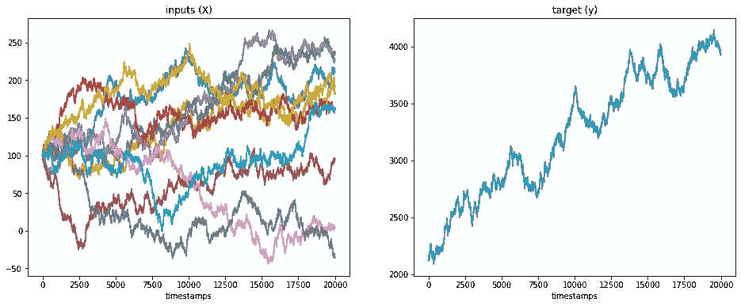

输入和目标生成流程示例(图片由作者提供)

从这些方面来说，我们似乎正在准备执行一项回归任务。我们对预测目标的准时值不感兴趣。取而代之的是，我们专注于从两个连续的时间步骤中检测目标何时可能记录到*突变*。

*突变*的定义取决于领域，根据应用领域可以有不同的解释。在我们的实验环境中，假设我们对预测目标与前一步相比何时出现负变化感兴趣。我们需要区分我们的目标系列，并应用一个固定的阈值(以零为中心的水平线)来区分正负变化。

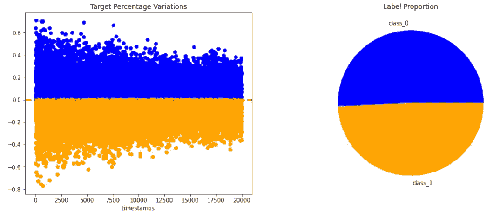

阈值等于 0%的二进制标签生成(图片由作者提供)

我们的预测模型必须被训练以区分这两个创建的类。有了这种数据和以零为中心的固定阈值，我们面临的分类问题就产生了一种近乎完美的平衡状态。为了让事情更刺激，我们可以想象在不平衡的环境下工作。假设我们也对预测目标何时记录到*显著的*负变化感兴趣。这可以通过设置低于零的阈值来实现。

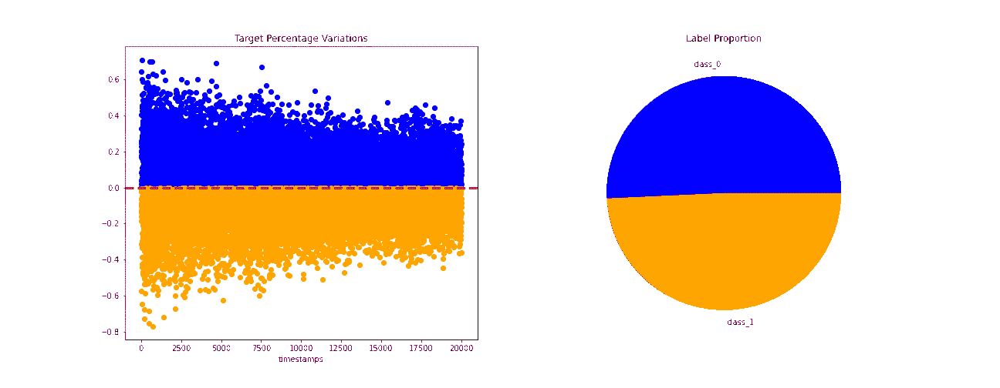

作为阈值水平函数的二进制标签生成(图片由作者提供)

这样，阈值越低，要预测的感兴趣的负变化就越高(即标签分布越不平衡)。

# 结果

至此，我们已经为建模做好了准备。我们选择了三种不同的预测架构来测试我们的二元分类问题。我们从 scikit-learn 中提供的标准随机森林分类器开始。然后，作为*的混血儿*，我们要测试一个加权随机森林和线性森林。提醒一下:

*   **加权随机森林**是堆叠模型的一个特殊版本，其中估计器是使用袋外预测来拟合的。
*   **线性森林**反复提供混合线性和随机森林结果的预测。

我们生成 100 对不同的特征(X)和目标(y ),以模拟更多不同的场景。对于每个场景，我们尝试使用不同阈值级别的所有提到的分类器来理解不平衡上下文中的行为。作为预处理，我们对输入特征进行简单的一阶微分。

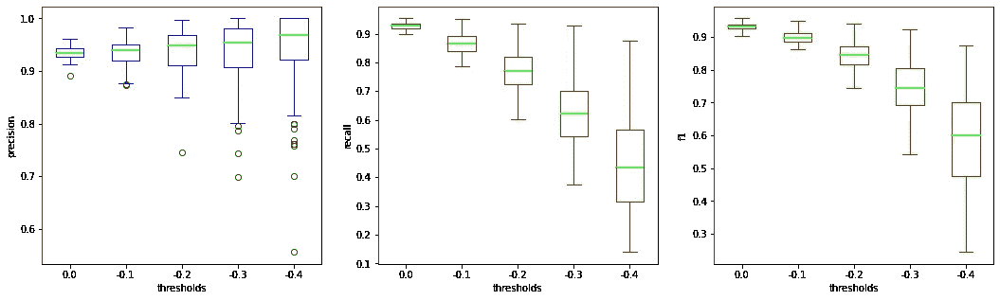

标准随机森林的测试数据结果(图片由作者提供)

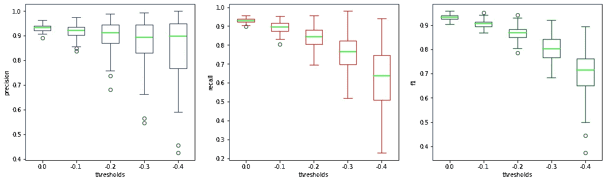

加权随机森林的测试数据结果(图片由作者提供)

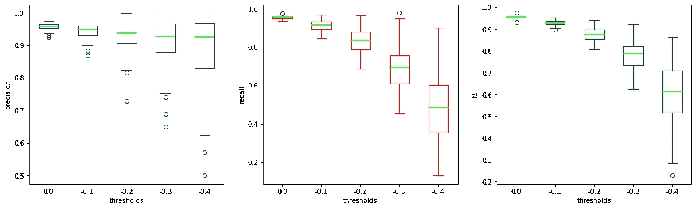

线性森林的测试数据结果(图片由作者提供)

对于所有测试的算法，当不平衡变得更强时(即阈值越低)，我们记录到性能下降(如预期的那样)。

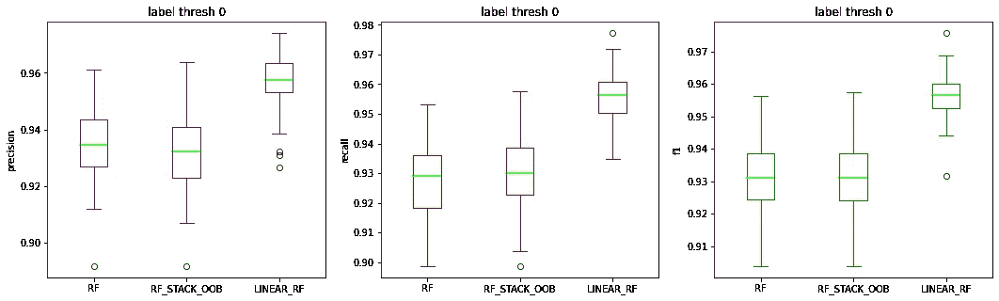

目标变化阈值固定为 0%的测试数据结果(图片由作者提供)

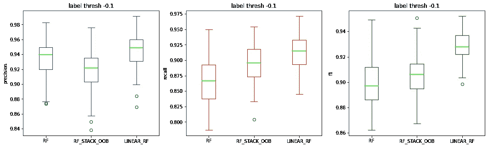

目标变化阈值固定为-0.1%的测试数据结果(图片由作者提供)

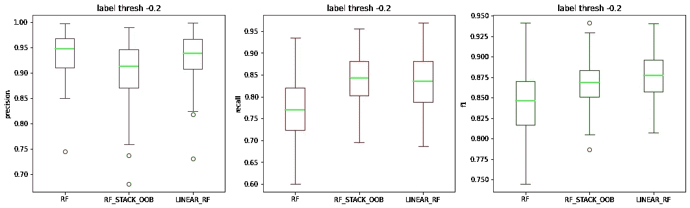

目标变化阈值固定为-0.2%的测试数据结果(图片由作者提供)

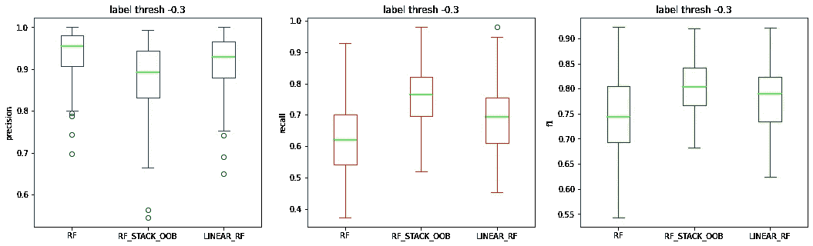

目标变化阈值固定为-0.3%的测试数据结果(图片由作者提供)

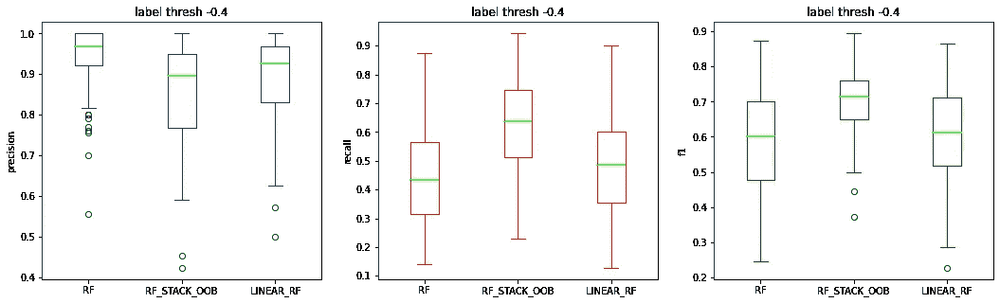

目标变化阈值固定为-0.4%的测试数据结果(图片由作者提供)

查看每个阈值设置中的性能，我们会注意到不同的模式。标签越平衡，线性森林记录的性能(在精确度和召回率方面)越好。标签分布越不平衡，加权随机森林的召回率越高。相反，标准随机森林可能总是在不平衡的上下文中达到最佳精度。

# 摘要

在这篇文章中，我们从一个标准的时间序列预测问题切换到一个更有趣的分类任务。尽管有这种变化，我们还是采用了所有对用基于树的算法建模时间相关系统有用的预防措施。在这个意义上，我们测试了不同的混合随机森林体系结构，这些体系结构显示出是更经典的随机森林分类器的有价值的替代方案。

[**查看我的 GITHUB 回购**](https://github.com/cerlymarco/MEDIUM_NoteBook)

保持联系: [Linkedin](https://www.linkedin.com/in/marco-cerliani-b0bba714b/)