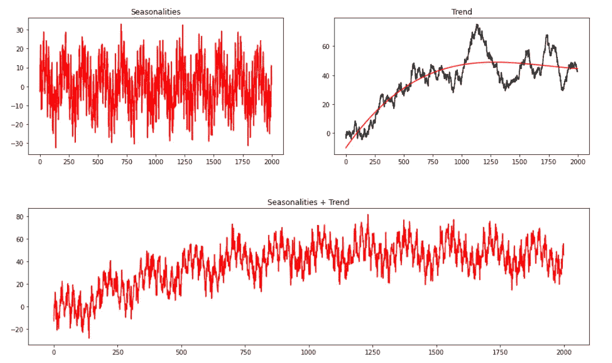
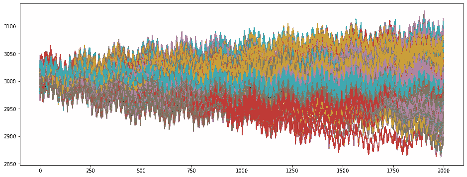
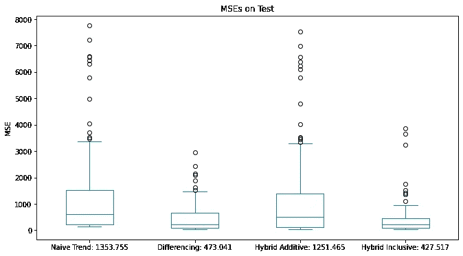
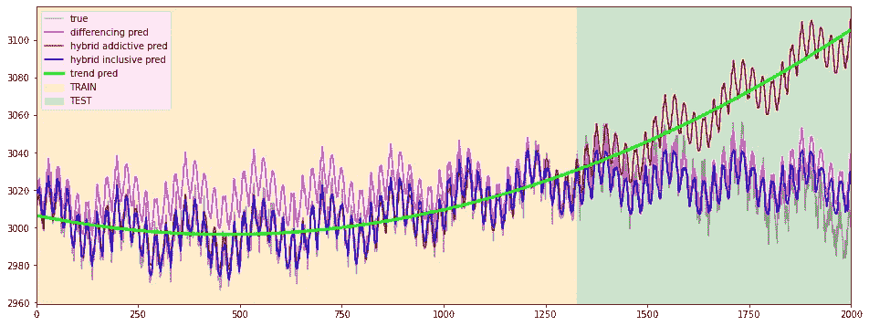
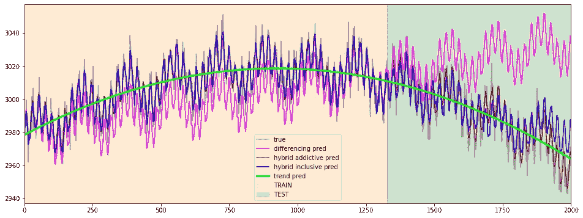
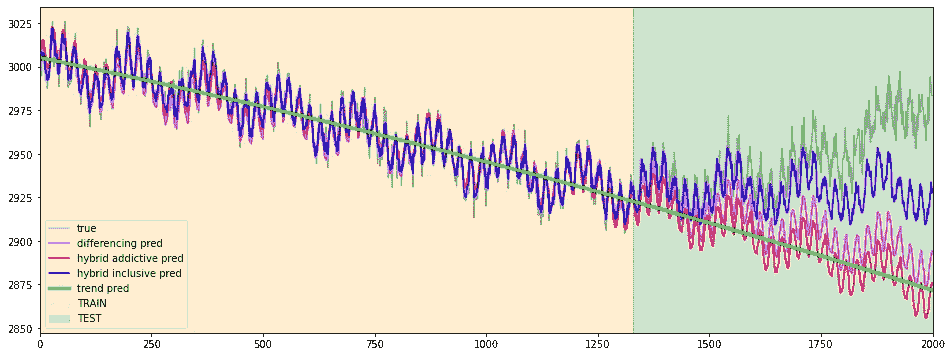

# 用树预测:时间序列的混合建模

> 原文：<https://towardsdatascience.com/forecasting-with-trees-hybrid-modeling-for-time-series-58590a113178>

## 构建有效混合预测器的简单步骤


[梁杰森](https://unsplash.com/@ninjason?utm_source=medium&utm_medium=referral)在 [Unsplash](https://unsplash.com?utm_source=medium&utm_medium=referral) 上的照片

**基于树的算法**在机器学习生态系统中众所周知。到目前为止，他们以主导每个表格监督任务的方法而闻名。给定一组表格式的特性和一个要预测的目标，它们可以获得令人满意的结果，而不需要太多的努力或特殊的预处理。在他们学习过程的基础上，分裂标准只关注相关特征和有用值的范围是有效的。

他们的有效性是有据可查的，而且似乎在各种意想不到的领域逐年增加。非常有趣的是在[这部作品](https://www.sciencedirect.com/science/article/pii/S0169207021001679)中概述的证据。它旨在说明梯度推进模型在时间序列预测领域取得的成就，以及它们如何优于深度学习方法。这听起来很奇怪，因为**基于树的算法在建模依赖于时间的现象方面名声不佳**(至少直到今天)。

基于树的模型的弱点是，从技术上讲，它们不能根据比训练数据中看到的更高/更低的特征值进行推断。对于他们来说，预测可见区间之外的值几乎是不可能的。相反，经典线性回归可能较少受到数据动态行为的影响。**既然线性回归擅长外推趋势，而梯度推进擅长学习交互，为什么不把它们结合起来呢？**我们的目标是创造“混合”预测器，结合互补的学习算法，让一个的优势弥补另一个的劣势。

在处理深度学习时，更容易想到“混合模型”。神经网络的无限架构组合和个性化训练过程在定制方面提供了很大的好处(例如，[指数平滑叠加 LSTM](https://github.com/Mcompetitions/M4-methods/blob/slaweks_ES-RNN/118%20-%20slaweks17/ES_RNN_SlawekSmyl.pdf) )。用树模型开发定制的混合解决方案更加棘手。在这种意义上，一个很好的资源由 [**线性树**](https://github.com/cerlymarco/linear-tree) **:** 表示，这是一个 python 包，它提供了混合模型架构，混合了基于树的模型和线性模型的学习能力。不仅如此， *LGBM* 或 *XGBoost* 还引入了在树叶中使用线性近似来拟合梯度增强的能力。

**在本帖中，我们试图从零开始构建我们的混合预测器**。我们需要做的就是遵循两步走的方法来学习下划线系统模式。

# 实验设置

为了设计有效的混合体，我们需要对时间序列是如何构造的有一个总体的了解。许多时间序列可以通过将仅仅三个**成分** ( *趋势*、*季节*和*周期*)加在一起加上一个本质上不可预测的项(*误差*)来精确描述。

```
series = trend + seasons + cycles + error
```

学习时间序列成分可以被理解为一个迭代过程:

*   首先学习趋势，将其从原始序列中减去，得到残差序列；
*   其次，从去趋势残差中学习季节性，减去季节；
*   最后，学习周期并减去周期。

换句话说，我们使用一种算法来拟合特定的分量序列，然后使用第二种算法来拟合残差序列。最终预测是各种模型组件预测的相加。

为了试验混合模型的构建，我们开始生成一些具有双重季节性模式和趋势成分的模拟序列。



合成时间序列生成(图片由作者提供)

未知趋势是通过拟合随机行走序列的三次多项式获得的。结果是一条平滑的趋势线，该趋势线被添加到季节性成分中，以获得要预测的最终时间序列。我们以这种方式生成多个时间序列，并尝试预测它们，为各种解决方案设定基准。



合成时间序列(图片由作者提供)

我们尝试了四种不同的方法:

*   在选择最佳多项式基之后，拟合一个简单的线性模型；
*   用差分变换变换目标以使其静止；
*   **混合添加剂**。首先，用最佳多项式基拟合一个线性模型来推断趋势。其次，用梯度推进对去趋势序列建模；
*   **杂交包容**。拟合梯度增强，还包括外推趋势(通过用最佳多项式基拟合线性模型获得)作为特征。

除了简单的解决方案，所有的方法都使用一些样条变换作为特征。他们很容易通过观察序列来捕捉季节性模式。通过在训练数据上搜索最佳多项式基来选择最佳趋势。拟合梯度增强，同时使用时间交叉验证策略搜索一些最佳参数配置。

# 结果

对于我们处理的每个系列，我们尝试所有提到的方法，并将结果存储在测试数据中。



记录在测试数据上的均方误差(图片由作者提供)

混合包含方法获得最低的平均测试误差，其次是差分方法。混合添加剂的表现低于我们的预期，因为它记录的误差几乎是差分法的三倍。一般来说，在对动态系统建模时，区分目标总是一个很好的基准(就像我们实验中展示的那样)。最令人惊讶的是混合方法之间的巨大性能差异。让我们直观地检查一些结果，看看会发生什么。



预测对比(图片由作者提供)



预测对比(图片由作者提供)



预测对比(图片由作者提供)

从上面的一堆图片中，我们可以更好地理解加法的“失败”。它的表现与之前的趋势拟合度密切相关。如果趋势估计不准确，最终的预测也是无用的。由于趋势作为一个特征包含在模型中，这种行为通过包容性混合方法得以缓解。因此，梯度提升可以校正/减轻最终预测误差。

# 摘要

在这篇文章中，我们介绍了构建时间序列混合预测模型的不同方法。需要强调的重要一点是，除了这里显示的方式之外，还有许多方式可以组合机器学习模型。尽管如此，如果我们清楚地知道标准算法是如何工作的，就更容易调试或理解我们混合创造的可能的缺点或陷阱。

**作为下一个阅读的话题，我建议** [***用树预测:时间序列的混合分类器***](/forecasting-with-trees-hybrid-classifiers-for-time-series-b2509abf15f8) **。**

[**查看我的 GITHUB 回购**](https://github.com/cerlymarco/MEDIUM_NoteBook)

保持联系: [Linkedin](https://www.linkedin.com/in/marco-cerliani-b0bba714b/)