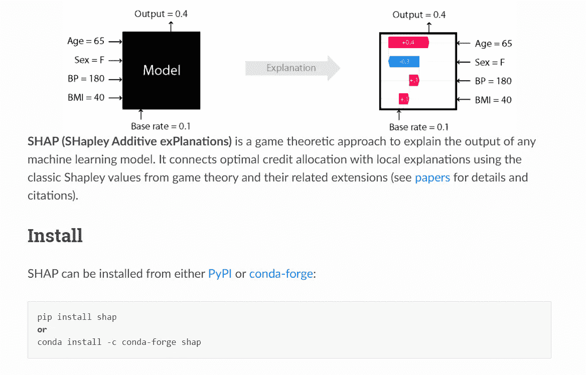
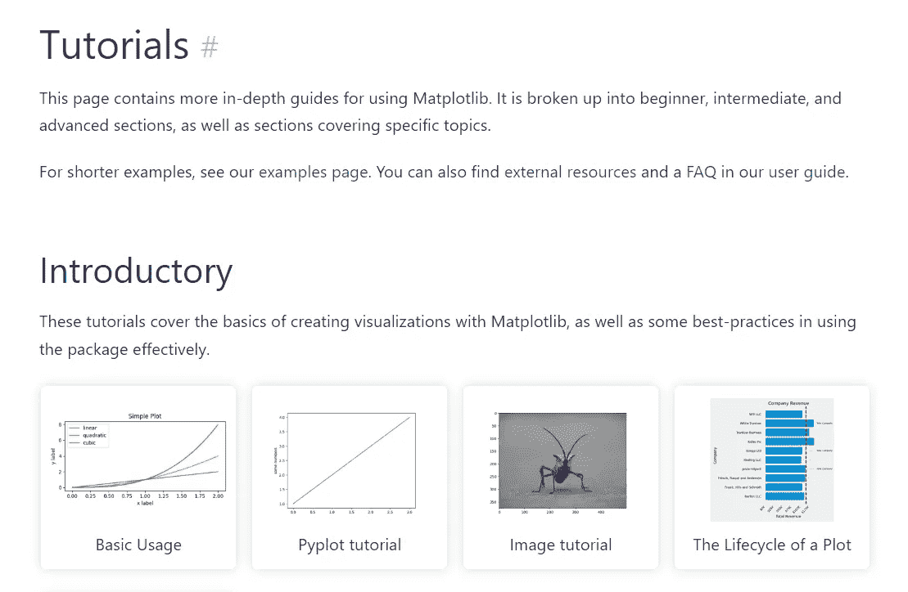
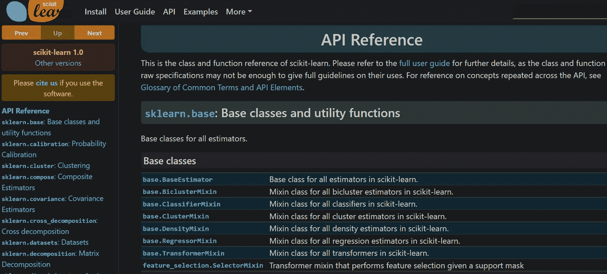
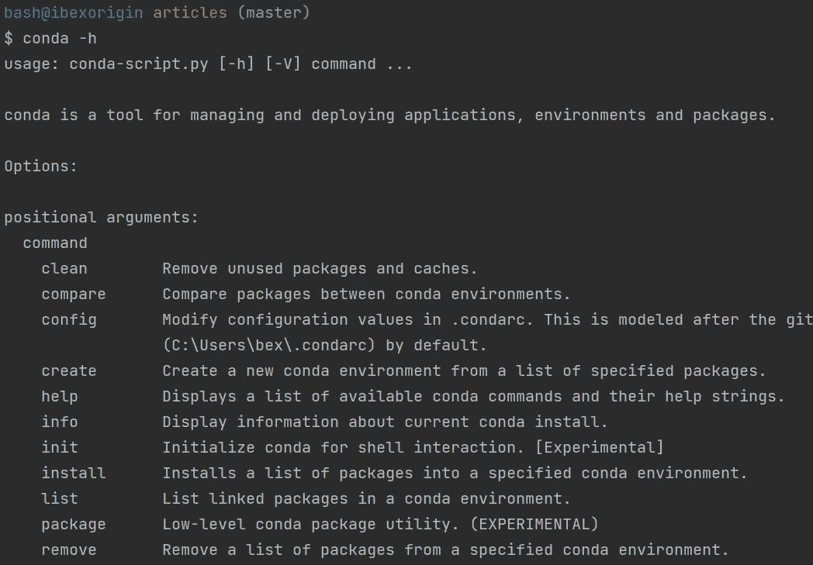

# 别管路线图了！以下是如何快速掌控数据科学堆栈的方法

> 原文：<https://towardsdatascience.com/forget-roadmaps-here-is-how-to-dominate-the-data-science-stack-blazingly-fast-a49e62f2bcf>

## 以前所未有的方式学习新软件包

# 为什么要这么做？

在生产率大师中，有一个术语叫做“流动状态”。当你全神贯注于你正在努力做的事情，以至于进入某种恍惚状态时，就会发生这种情况。你不能让你的手指离开键盘。他们开始按照自己的意愿工作，一次不用思考几个小时就能写出质量最好的代码。

你正在做所谓的“深度工作”——在这段时间里，你最有生产力和创造力，并且处于“心流”中。一周内你进入心流的次数越多，你的高质量工作就越多。唯一的要求——不能分心。

即使是最微小的事情，比如检查你的电子邮件，偷看你的通知，或者对我们程序员来说最重要的事情——谷歌一下。都是摩擦。他们*扼杀*创造力*扰乱*你的思维过程。深度工作就像睡眠——一旦你醒来，你就不能从你停止的地方继续。你得回去睡觉了。再一次。

那么，你如何将注意力分散、重复的谷歌搜索降到最低呢？(不幸的是，你无法消除它们)。

很简单——您必须对所需的工具、库和框架了如指掌。

今天很少去 Sklearn 或者熊猫文档。作为用户，我对这些库的结构和 API 设计了如指掌。即使我忘记了一个类名或一个参数，我也知道 Jupyterlab 和 PyCharm 的相关快捷方式，这些快捷方式可以在一秒钟内显示我需要的内容。

我是如何在这些图书馆(以及其他许多图书馆)变得如此优秀的？我利用自己设计的成熟的学习框架，在每一个项目上都投入了大量的时间。使用它，您可以在几个小时或一两天内学习任何中小型库(如果库非常庞大的话)(如 Tensorflow 或 NumPy)。

在整篇文章中，我将详细概述框架的每个步骤。最后，您将有一个强大的公式来深入学习任何新的包，这样您就很少需要回到文档中。

<https://ibexorigin.medium.com/membership>  

获得由强大的 AI-Alpha 信号选择和总结的最佳和最新的 ML 和 AI 论文:

<https://alphasignal.ai/?referrer=Bex>  

# 飘飘欲仙

不同的包在依赖性或计算开销方面有不同的要求。正如您将对许多包重复这一学习过程一样(我希望如此)，让您的本地环境充满新的 Conda envs 不是一个选项。

此外，大多数数据科学软件包，如 SHAP 和 UMAP，都需要大 CPU 和 GPU，所以云环境应该是你的首选。最好的选择是[谷歌 Colab](https://colab.research.google.com/?utm_source=scs-index) 或者 [Kaggle 内核](https://www.kaggle.com/code)。两者都在编码环境和硬件方面提供了大量的好处。

此外，它们都运行在 Linux 上，如果你有一台 Linux 机器，你会遇到的一些库更容易安装。试图在 Windows 上安装 Tensorflow GPU 的人知道我在说什么😉。

# 从快速入门开始

您访问新软件包文档的第一页是快速入门。如果没有，可能会有一个安装页面，或者只有主页就可以了。您希望形成学习该软件包是否值得的初步印象，如果值得，学习如何安装它。

除非软件包需要第三方软件，否则简单的`pip`或`conda`安装就足够了。从现在开始，我将使用 SHAP 图书馆的文档给出例子——一个极好的框架来解释黑盒模型和深度神经网络。

SHAP 文档主页。

# N-tab 规则

安装完成后，您可以离开文档并在 Google 上搜索“*your _ package _ name*tutorial”

你在不同的标签页中打开一些文章的链接，开始专心阅读它们。你不希望 YouTube 视频的一半时间都花在看那个人输入代码上，浪费你的时间在填充语句上。

通过阅读一些关于您的软件包的文章，您可以对它所解决的问题的上下文以及它是如何解决问题的有所了解。您还会接触到它的基本 API。此外，一个好的教程会解释大多数与您的软件包相关的术语和概念，所以当文档中突然提到它们时，您不会迷路。

最后，你选择一两篇文章来最好地解释这个包，如果你在接下来的步骤中需要的话，把它们的标签打开。

# 转到教程部分或用户指南

现在，是时候打开文档的教程页面了。您的软件包文档可能没有单独的教程部分。在这种情况下，您可以搜索“示例”页面，或者在文档的搜索栏中输入“示例”一词。搜索“用户指南”也可以。

如果你运气好，并且你的包被广泛传播，很有可能它会有一个全面的教程页面。例如，Matplotlib 将其教程分为三个难度级别。它的所有代码示例都是由包创建者编写的，运行速度很快，允许您快速试验代码:

Matplotlib 文档的屏幕截图

你学习的核心部分就发生在这个阶段。您应该一个接一个地打开每个教程，仔细阅读解释，并将每个代码块复制到您的环境中。

我建议每块至少花 2-5 分钟。首先，逐行运行它，对它们进行注释和取消注释。然后，更改不同参数的值，看看它们对输出有什么影响。我在 Jupyter Lab 上使用“Shift + Tab ”,它在弹出窗口中显示类或函数 docstring 以获得可能的想法。

尽管前几个教程要花几个小时，但当您转到后续页面时，花费的时间会更少，因为函数和类会开始重复。

# API 参考

现在，我们进行最后的润色。API 参考页面通常在文档的末尾，它显示了包中每个模块、类和函数的列表。

将有数百个参考，所以你只需要探索你需要的功能。您已经知道自己想要什么，因为您已经花了相当长的时间来了解这个软件包，注意到了它的优点和缺点，并且对如何使用它有了很好的想法。

Sklearn API 参考页面

找到将来可能会用到的函数后，打开它们的文档，试着用这些例子做几次。我还建议至少读一遍其他函数和类名。通常，您会遇到一些边缘情况，这些情况可能会被隐藏在 API 参考中的某个函数很好地解决。

# CLI 呢？

如果您的软件包也有一个 CLI 工具呢？

通常情况下，CLI 适用于对命令行有经验并且已经知道核心包 API 的人。这就是为什么你需要在最后阶段学习它。

如果您的软件包有 CLI 工具，它也会有单独的 CLI 参考页面。您应该在一个单独的选项卡上打开它，并像在 API 参考部分那样阅读它。

我还大量使用了`--help`或`-h`标志。例如，在`conda`之后使用`-h`会显示 Anaconda CLI 的所有子命令:

作者图片

我主要对`create`、`install`和`remove`子命令感兴趣，因为我只需要这些子命令来管理环境。在将每个子命令与`conda`关键字组合后，我再次添加`-h`标志，得到另一组子命令。我试用我需要的那些，并继续添加`-h`旗帜，直到我对整个过程感到满意。

这就是你如何成为命令行忍者！

# 摘要

数据科学堆栈势不可挡。你需要学习和练习的东西太多了。为了最大限度地利用你的时间，你需要聪明地学习，尽可能让每一次学习都富有成效。主要思想是全面地学习每一个包、库和框架，这样你就不必浪费宝贵的时间重新学习了。

此外，对所需的包和工具了如指掌，使您能够深入、不间断地工作，极大地提高了您的输出能力。