# 卷积神经网络中的前向和后向传播

> 原文：<https://towardsdatascience.com/forward-and-backward-propagation-in-convolutional-neural-networks-64365925fdfa>

## 理论与代码


[https://unsplash.com/@fabioha](https://unsplash.com/@fabioha)

## 介绍

如果你在这里，你一定听说过卷积神经网络，也许你现在正试图了解它们是如何工作的。在这种情况下，本文将通过使用一些可视化的例子来帮助您了解 CNN 中的向前和向后传球是如何执行的。
我假设你熟悉 CNN 中的填充和步长，并且对反向传播和链式法则有一些基本的了解。

## 正向传播

我们从形状为 **5x5** 的**一个输入**和形状为 **3x3** 的**一个滤波器**开始。我们假设通道数 **C = 1** ， **stride = 1** 。

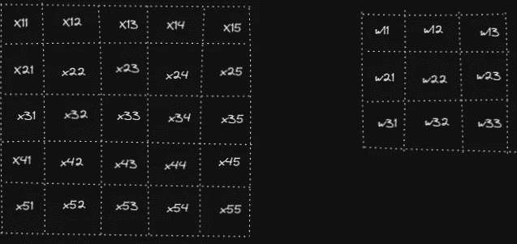

按作者分类的图像—输入和过滤器权重(图 1)

我们用 **pad = 1** 进行填充，使卷积运算后的输出和输入的形状相同。

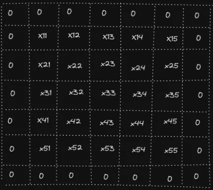

按作者分类的图像—填充输入(图 2)

实际上，我们可以使用下面的公式来计算**输出形状**:
*H _ out = floor(1+(H+2 * pad-HH)/stride)
W _ out = floor(1+(W+2 * pad-WW)/stride)*
其中 *H* 是输入的高度， *HH* 是滤波器的高度
*W* 是输入的宽度

在我们的例子中我们得到:
*H _ out*= floor(1+(5+2 * 1–3)/1)= 5
*W _ out*= floor(1+(5+2 * 1–3)/1)= 5

卷积运算中的前向传递由输入上的重叠滤波器权重组成，将它们相乘并将结果相加以获得输出。下面的动画显示了对 *y* ₁₁、*y*₁₂*t44】和 *y* ₅₅的计算(类似地，其他输出*yᵢ*ⱼ*也被计算)**

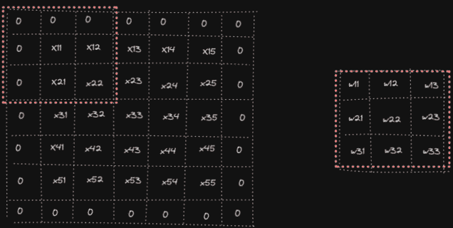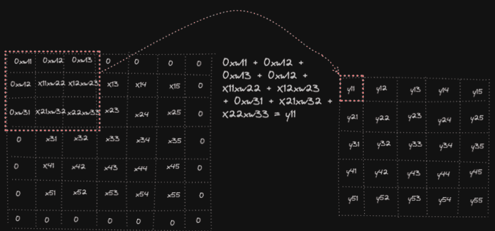

作者提供的图像—正向卷积运算(图 3)

在代码中:

## 反向传播

我们需要计算输出 Y 相对于输入 X、滤波器 W 和偏置 b 的导数，计算相对于偏置 b 的导数很容易，我建议您在阅读完本教程后亲自尝试一下，您一定能够做到！现在让我们最后从**∂*y/******∂*x***开始:*

*让我们先看看输出 y 对 x 的第一个元素的导数是什么，也就是说，我们要计算 *∂Y/ ∂x₁₁* 。我们可以注意到 x₁₁影响了 *y* ₁₁ *，y* ₁₂ *，y*₂₁*和 *y* ₂₂，因为它参与了这些输出单元格的计算。于是我们得到
*∂*y/*∂*x*₁₁*=*∂*y*₁₁*/*∂*x*₁₁*+*∂*y**/*∩*x【t34* ∂*x*₁₁*= w*₂₂*+w*₂₁*+w*₁₂*+w*₁₁
以类似的方式我们可以计算 x 的元素的其他偏导数***

> *还要注意，∂X 的形状与**未填充的** X 的形状相同，所以我们不需要计算关于填充元素的导数*

*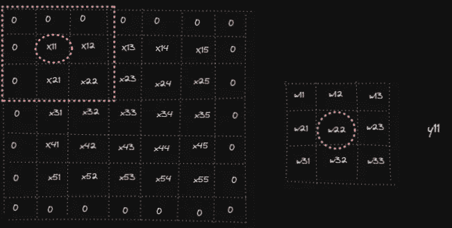**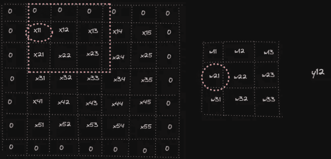**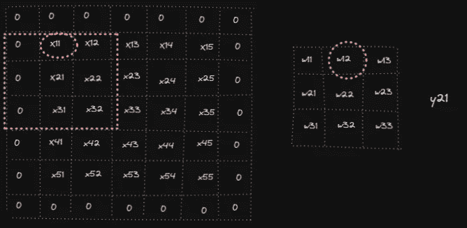**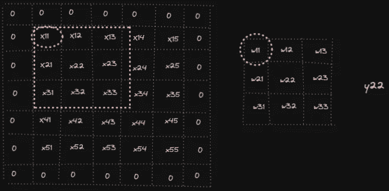*

*来自作者的图像-输入反向传播(图 4)*

*还有更多的内容。当进行反向传播时，当我们按照链式法则进行反向传播时，我们通常有来自下一层的输入梯度。在这种情况下，我们假设卷积层之后是，我们将得到 y 相对于损耗 l，∂L/∂Y.的入射梯度，它与 y 的形状相同，这是我们唯一需要知道的，因为我们不会在本文中计算这一导数。*

*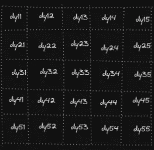*

*作者图片— ∂L/∂Y 衍生矩阵(图 5)*

*因此，当计算∂Y/∂x11 时，我们还需要将∂Y/∂x 乘以相应的引入导数∂l/∂y:
(1)∂*y/*∂*x*₁₁*=*∂*l/*∂*y*t73】*≈*y* ∂*x*₁₁*+*∂*l/*∂*y*₂₁***∂*y*₂₁*/*∂*x*⃈*+*∂*l/* w₂₁*+dy*₂₁** w*₁₂*+dy*₂₂** w*₁₁*

*如果我们在通过所有宽度( *W1* )和高度( *H1* )的第一次循环后打印出 *w_idxs* 和 *y_idxs* ，我们将得到 w 和∂L/∂Y 矩阵的相应单元格，以计算∂ *Y/* ∂ *x* ₁₁:*

```
*w_idxs = [(1, 1), (1, 0), (0, 1), (0, 0)]
y_idxs = [(0, 0), (0, 1), (1, 0), (1, 1)]*
```

*在*图 4* 中，我们从 1 开始索引，因此如果我们将 1 加到 *w_idxs* 和 *y_idxs* 中，我们会看到，在最后一行中，为了获得关于 x，dx₁₁的第一个元素的导数，我们将与上面公式中完全相同的元素相乘。*

*为了计算 ***∂Y/ ∂W*** ，我们以类似的方式进行(注意，为了避免图像过多，我们没有显示所有的操作):*

*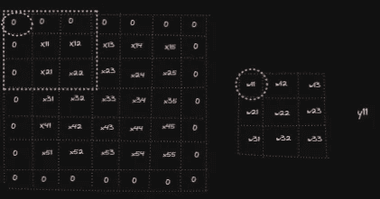**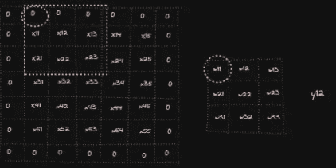**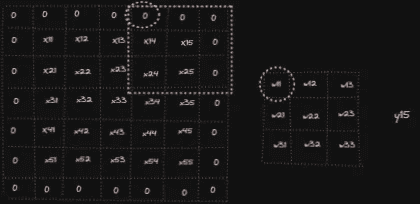**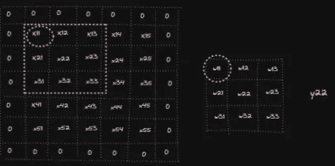**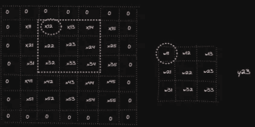**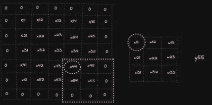*

*作者图片—权重反向传播(图 6)*

*查看 *dY/dw* ₁₁ *，*我们可以看到*w*₁₁*t29】的变化会影响**所有 *yᵢ* ⱼ** 的每一个 *i，j* 。现在，我们需要考虑 X_padded，而不是从 1 到 5 进行索引，X_padded 将从 0 到 6 进行索引。**

*(2)∂*y/*∂*w*₁₁*=*∂*l/*∂*y*₁₁***∂*y*₁₁*/*∩*w*≿*+*∩*l* ∂*y*₄₅***∂*y*₄₅*/*∂*w*₁₁*+*∂*l/*∂*y*t89】*∂*y**

**正如我们可以看到的，因为每一个权重影响每一个输出所有元素传入的导数∂ *L/* ∂ *Y* 被用来计算∂*y/*∂*w*ᵢⱼ**

**如果我们查看被求和以计算 *dw[0，0]* (忽略滤波器和通道):
给定 *padded_x* :**

**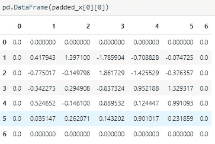**

**作者图片—填充输入具体示例(图 7)**

**和 *dout* 导数:**

**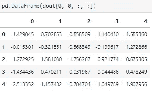**

**图片由作者—∂L/∂Y 具体举例(图 8)**

**我们将从 *padded_x* 从 *x₀₀* 到 *x₄₄* 中选择的元素相乘**

**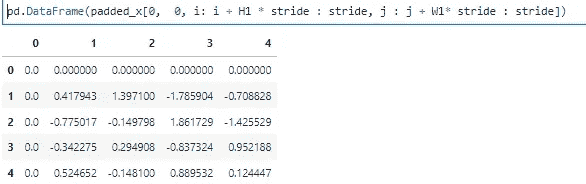**

**按作者分类的图像—选定的填充输入(图 9)**

**用*的所有元素对*进行 dout，然后像(2)中那样对所有元素求和:**

**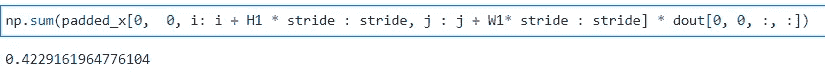**

**作者提供的图片—渐变结果 W 矩阵的第一个元素(图 10)**

**请注意，我们已经看到了假设 1 个通道和 1 个滤波器的向前和向后传递，但是代码能够处理多个通道和滤波器，并且到目前为止您已经阅读的解释很容易推广。**

## **结论**

**你现在应该很好的理解了在 CNN 中向后和向前传球是如何完成的。显然，你不需要手动实现它们——在上面的代码片段中，我们使用的循环很容易理解，但是非常慢而且效率很低！不过不要担心，有很多包可以使用非常高效的实现为您完成所有工作。**

## **参考**

**[http://cs231n.stanford.edu/](http://cs231n.stanford.edu/)**