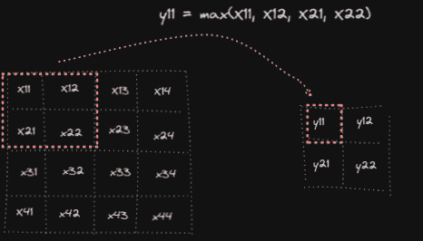
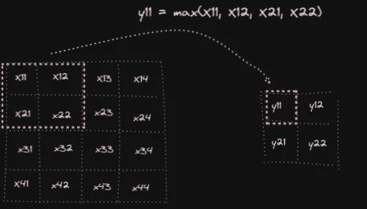
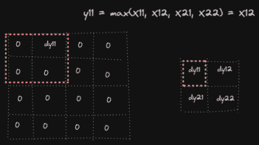
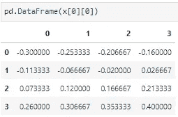
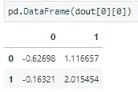
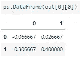
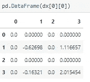

# 卷积神经网络中最大池层数的前向和后向传播

> 原文：<https://towardsdatascience.com/forward-and-backward-propagation-of-pooling-layers-in-convolutional-neural-networks-11e36d169bec>

## 理论与代码

## 介绍

在上一篇文章中，我们看到了如何在 CNN 中进行卷积运算的前向和后向传播。发现在卷积层之后应用汇集层提高了性能，有助于网络更好地概括并减少过拟合。这是因为，给定一个特定的网格(池高 x 池宽),我们只从中采样一个值，忽略特定的元素并抑制噪声。此外，因为池化减少了来自前一层的特征图的空间维度，并且它不添加任何要学习的参数，所以它有助于降低模型复杂性、计算成本并导致更快的训练。

## 正向传播

我们假设在卷积运算之后，我们得到形状为 **4x4 的输出。**然后我们要做最大汇集，使**汇集高度**、**汇集宽度**和**步幅**都等于 **2。**池化类似于卷积，但不是在权重和输入中的区域之间进行元素级乘法，然后对它们求和以获得输出矩阵中某个单元的元素，而是简单地从该区域中选择最大元素。以下可视化将阐明:

按作者分类的图像-正向传播

池化操作后的**输出形状**使用以下公式获得:
*H _ out = floor(1+(H-pool _ height)/stride)
W _ out = floor(1+(W-pool _ width)/stride)*
其中 *H* 是输入的高度， *pool_height* 是池化区域的高度
*W* 是输入的宽度，

*在我们的例子中我们得到:
*H _ out*= floor(1+(4–2)/2)= 2
*W _ out*= floor(1+(4–2)/2)= 2*

*这是它在代码中的实现方式:*

## *反向传播*

*与卷积运算不同，我们不必在这里计算权重和偏差导数，因为合并运算中没有参数。因此，我们需要计算的唯一导数是关于输入的，**∂*y/******∂**我们知道，关于输入的导数将具有与输入相同的形状。再来看第一个元素**∂*y/******∂*x—***∂*y/*∂*x*₁₁.***

****

**按作者分类的图像-汇集第一个元素**

**很明显，只有当 *x* ₁₁是关于第一区域的第一汇集操作中的最大元素时，∂*y/*∂*x*₁₁=∂y₁₁/∂*x*₁₁的导数才不为零。假设第一区域中的最大元素是 *x* ₁₂，∂y₁₁/∂*x*₁₂=∂x₁₁/∂*x*₁₂= 1，并且在第一池区域中相对于其他 x *ᵢ* ⱼ的导数为零。同样，因为我们有一个来自下一层的引入导数，我们需要按照链式法则将局部梯度乘以引入梯度。因此，假设 dy₁₁to 是引入的导数，对于第一个区域，除了∂x₁₁/∂x₁₂= 1 *dy₁₁= dy₁₁.，所有的梯度都为零**

****

**按作者分类的图像—反向传播**

**在代码中:**

**因此，假设以下输入和输入导数:**

****

**按作者分类的图像—输入**

****

**按作者分类的图片—即将推出的衍生产品**

**输出和相对于输入的梯度将是:**

****

**按作者分类的图像-输出**

****

**按作者分类的图像—输入渐变**

## **结论**

**如果您阅读了我的前一篇关于卷积运算的前向和后向传播的文章，我相信这篇文章对您来说是小菜一碟！
池化操作对于更好的模型泛化、降低复杂度和提高训练速度非常重要。然而，有人声称这在某些情况下可能是不好的，因为通过下采样特征，我们可能会丢失一些重要的信息，这些信息对于正确地分类对象是至关重要的。然而，在构建 CNN 模型时，池层的优势足够大。**

## **参考**

**【http://cs231n.stanford.edu/】**