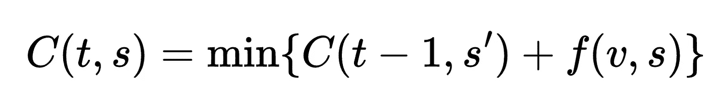

# 基础 RL:动态编程

> 原文：<https://towardsdatascience.com/foundational-rl-dynamic-programming-28f96f6fb40e>

## 强化学习之路

作者使用人工智能工具 Midjourney 生成的封面照片(许可为知识共享非商业性 4.0 资产许可证)

通过前面两篇文章:(1) [马尔可夫状态、马尔可夫链和马尔可夫决策过程](/foundational-rl-markov-states-markov-chain-and-markov-decision-process-be8ccc341005),( 2)[求解马尔可夫决策过程](/foundational-rl-solving-markov-decision-process-d90b7e134c0b)，我为开发强化学习(RL)的详细概念奠定了基础。RL 问题被公式化为马尔可夫决策过程(MDP ),其可以被求解为最优策略(即，代理需要采取什么行动来实现目标)。解决方案可以通过扫描整个状态空间来实现，也可以通过其他一些技术来实现，这些技术认为解决方案可以通过解决较小的问题来递归实现。后者是动态编程的话题。

# 动态规划

动态编程是一种通过将复杂问题分解成更小、更简单的子问题来解决它们的方法。这是一种自下而上的方法，首先解决较小的子问题，然后向上组合解决方案来解决较大的子问题。

为了使用动态编程，一个问题必须有两个具体特征:

1.  **最优子结构:**将最优解和更小的子问题组合起来，可以找到整体问题的最优解。
2.  **重叠子问题:**较大问题中的较小子问题相互重叠，这意味着它们共享一些共同元素。这使得我们可以重用已经解决的子问题的解决方案，而不必多次解决它们。

通过使用这两个特征，我们可以有效地解决问题，并使用动态规划找到最有效的解决方案。

我们可以在自动驾驶纵向控制的背景下理解这一点，目标是最大限度地降低油耗。考虑车辆的状态由 *(v，a)，即*速度和加速度组成。我们可以将可能的动作定义为加速、减速或保持恒定速度。 *f(v，a)* 可以将油耗作为速度和加速度的函数。这是一个非常合理的油耗函数(见[【4】](https://doi.org/10.1145/3459609.3460530))。

> 我们可以使用动态规划来寻找在给定时间范围内最小化总燃料消耗的最佳行动顺序。

我们可以定义成本函数 *C(t，s)* ，其表示在时间 *t* 达到状态 *s* 的最小燃料消耗，并使用以下递归:

等式 1。价值函数

其中 *s* 是 *s* 的前身。

我们可以通过跟踪在每个时间步采取的行动来获得最佳的行动顺序，以达到当时的最低成本。例如，在时间 *t* 处，车辆处于状态 *s = (v，a)* 并且达到该状态的最小成本是 *C(t，(v，a))* 。如果通过在时间 *t-1* 采取“加速”动作达到了最小成本，那么最佳动作序列包括在时间 *t-1* 的“加速”。

上例的 pythonic 化伪代码可以在[https://gist . github . com/rahulbhadani/a 119916d 26 e 251 b 939 b 817 DDE 03 ad 032](https://gist.github.com/rahulbhadani/a119916d26e251b939b817dde03ad032)找到。

# 近似动态规划

近似动态规划(ADP)用于解决有时很大很复杂的问题，并且通常(但不总是)是随机的。

> ADP 用于克服通常在贝尔曼方程中观察到的维数灾难。

ADP 是关于学习什么和如何学习，以便随着时间的推移做出更好的决定。

在 ADP 中，真值函数 *Vπ(s)* 被其统计近似值 *Vπ*(s)代替。*此外，ADP 在时间上向前迈进，但有一些变化。近似函数 *Vπ*(s)* 可以通过多种方式确定，例如:

1.  查找表格
2.  参数模型
3.  非参数模型

或者，蒙特卡罗方法可用于近似期望值。

许多方法如离散模型、神经网络和核回归可以是上述三种策略的组合。我们需要一个单独的讨论线程来详细讨论价值函数的近似值。

读者应该注意，对于 ADP，策略可能不是最优的，我们需要与次优策略妥协。

# 结论

在本文中，我以自动驾驶中的纵向控制为例讨论了动态编程的细节。动态规划是解决处于强化学习问题核心的 MDP 的有效方法。在本系列的下一篇文章中，我将讨论价值迭代和策略迭代。即将到来的未来文章将致力于用于近似价值函数的策略。

如果您尚未阅读基础 RL 系列的前两篇文章，请务必阅读:

1.  [https://towards data science . com/fundamental-rl-Markov-States-Markov-chain-and-Markov-decision-process-be 8 CCC 341005](/foundational-rl-markov-states-markov-chain-and-markov-decision-process-be8ccc341005)。
2.  [https://towards data science . com/fundamental-rl-solving-Markov-decision-process-d 90 b 7 e 134 c 0b](/foundational-rl-solving-markov-decision-process-d90b7e134c0b)

 [## 基础 RL:马尔可夫状态、马尔可夫链和马尔可夫决策过程

### 强化学习之路

towardsdatascience.com](/foundational-rl-markov-states-markov-chain-and-markov-decision-process-be8ccc341005)  [## 基础 RL:求解马尔可夫决策过程

### 强化学习之路

towardsdatascience.com](/foundational-rl-solving-markov-decision-process-d90b7e134c0b) 

> 你喜欢这篇文章吗？[给我买杯咖啡](https://www.buymeacoffee.com/rahulbhadani)。
> 
> 喜欢我的作品吗？加入我的[邮件列表](https://rahulbhadani.medium.com/subscribe)。
> 
> 想了解更多 STEM 相关话题？加入[介质](https://rahulbhadani.medium.com/membership)

# 参考

1.  深度强化学习，莫希特·塞沃克，[https://doi.org/10.1007/978-981-13-8285-7](https://doi.org/10.1007/978-981-13-8285-7)
2.  深度强化学习，Aske Plaat，[https://doi.org/10.1007/978-981-19-0638-1,](https://doi.org/10.1007/978-981-19-0638-1,)施普林格新加坡
3.  强化学习和随机优化:连续决策的统一框架。)，威利(2022)。精装本。ISBN 9781119815051。
4.  Lee，J.W .，Gunter，g .，Ramadan，r .，Almatrudi，s .，Arnold，p .，Aquino，j .，Barbour，w .，Bhadani，r .，Carpio，j .，Chou，F.C .和 Gibson，m .，2021 年 5 月。飞行器动力学、不稳定性、能量模型和稀疏流平滑控制器的综合框架。在*数据驱动和智能信息物理系统研讨会论文集*(第 41–47 页)。[https://doi.org/10.1145/3459609.3460530](https://doi.org/10.1145/3459609.3460530)
5.  《你应该知道的近似动态规划》*海军研究后勤(NRL)* 56，第 3 期(2009 年):239-249 页。[https://doi.org/10.1002/nav.20347](https://doi.org/10.1002/nav.20347)
6.  布索尼乌、卢西恩、巴特·德舒特和罗伯特·巴布斯卡。"近似动态规划和强化学习."在*交互式协作信息系统*中，第 3–44 页。施普林格，柏林，海德堡，2010。[https://www.dcsc.tudelft.nl/~bdeschutter/pub/rep/10_028.pdf](https://www.dcsc.tudelft.nl/~bdeschutter/pub/rep/10_028.pdf)