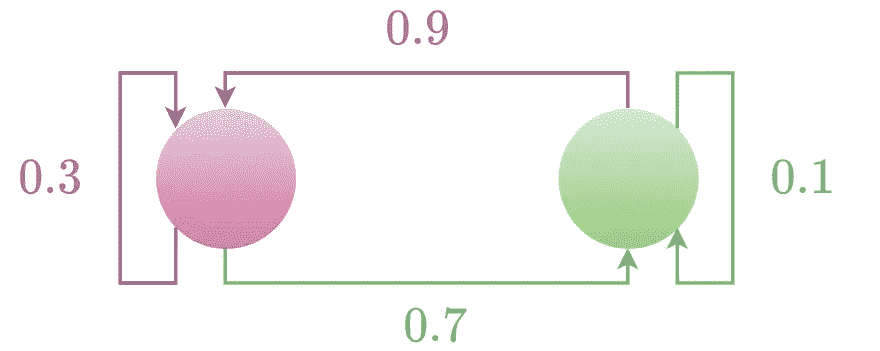

# 基础 RL:马尔可夫状态、马尔可夫链和马尔可夫决策过程

> 原文：<https://towardsdatascience.com/foundational-rl-markov-states-markov-chain-and-markov-decision-process-be8ccc341005>

## 强化学习之路


作者使用人工智能工具 Dreamstudio 生成的封面照片(授权为[https://creativecommons.org/publicdomain/zero/1.0/](https://creativecommons.org/publicdomain/zero/1.0/)

R 强化学习(RL)是一种机器学习，在这种机器学习中，代理通过试错来学习与其环境进行交互，以使回报最大化。它不同于监督学习，在监督学习中，代理根据标记的示例进行训练，也不同于无监督学习，在无监督学习中，代理学习识别未标记数据中的模式。在强化学习中，代理人学习在一个环境中采取行动以获得最大的回报，如赢得分数或赢得游戏。

> 强化学习对于广泛的应用是有用的，包括机器人、自然语言处理和游戏。

在本文中，我构建了一些基本概念来理解强化学习。在[的下一篇文章](/foundational-rl-solving-markov-decision-process-d90b7e134c0b)中，我会谈到马尔科夫决策过程的解决方案。

</foundational-rl-solving-markov-decision-process-d90b7e134c0b>  

# 代理人、行动、奖励和目标

在 RL 中，我们有一个代理，我们使用某种算法训练它采取某些行动，使回报最大化，以达到最终目标。最终目标可能是非常遥远的未来，或者不断变化(就像自主导航一样)。

# 马尔可夫状态

在强化学习中，状态是指主体所处的当前情境或环境。它表示代理在给定时间点拥有的关于其环境的信息。例如，自主车辆的位置和速度可以是 RL 问题中的状态。代理使用状态信息来决定下一个时间步采取什么行动来最大化奖励。

在 RL 中，我们关心马尔可夫状态，其中状态具有所有未来状态仅依赖于当前状态的性质。这意味着主体不需要记住它与环境交互的全部历史来做决定。相反，它可以简单地关注当前状态并据此采取行动。这使得学习过程更加有效，因为代理不必存储和处理大量信息。此外，它使代理的行为更可预测，因为它完全由当前状态决定。这在许多应用中都很有用，比如机器人和控制系统。

我们可以将车辆的马尔可夫状态编码如下:

```
# define the states of the vehicle
STOPPED = 0
MOVING_FORWARD = 1
MOVING_BACKWARD = 2

# define the actions of the vehicle
STOP = 0
MOVE_FORWARD = 1
MOVE_BACKWARD = 2

# define the Markov state of the vehicle
class VehicleMarkovState:
  def __init__(self, state, action):
    self.state = state
    self.action = action

# define a function to encode the Markov state of the vehicle
def encode_markov_state(vehicle_state, vehicle_action):
  return VehicleMarkovState(vehicle_state, vehicle_action)

# example: encode the Markov state of a vehicle that is moving forward
markov_state = encode_markov_state(MOVING_FORWARD, MOVE_FORWARD)
print(markov_state.state)  # prints 1 (MOVING_FORWARD)
print(markov_state.action)  # prints 1 (MOVE_FORWARD)
```

# 马尔可夫链

马尔可夫链是一个有限状态机，其中每个状态都是一个马尔可夫状态。马尔可夫链由许多状态组成，具有从一个状态到另一个状态的转移概率。在马尔可夫链中，转移到特定状态的概率取决于当前状态和经过的时间，而不用担心过去发生了什么。

马尔可夫链不同于随机过程，因为在随机过程中，现在发生的事情取决于过去发生的事情，而不仅仅是最近发生的事情。

让我们考虑一个例子:



图一。一个马尔可夫链，图片由作者提供

我们有两个马尔可夫状态 A，和 B，从 A 到 B 的转移概率是 0.7，从 B 到 A 的转移概率是 0.9，从 B 到 B 的转移概率是 0.1，从 A 到 A 的转移概率是 0.3。这个想法如图 1 所示。我们可以用 Python 对此进行编码，如下所示:

```
# define the states of the Markov chain
A = 0
B = 1

# define the transition probabilities
transition_probs = [[0.3, 0.7],  # transition probabilities from A
                    [0.9, 0.1]]  # transition probabilities from B

# define a class to represent the Markov chain
class MarkovChain:
  def __init__(self, states, transition_probs):
    self.states = states
    self.transition_probs = transition_probs

# define a function to encode the Markov chain
def encode_markov_chain(markov_states, markov_transition_probs):
  return MarkovChain(markov_states, markov_transition_probs)

# example: encode the Markov chain
markov_chain = encode_markov_chain([A, B], transition_probs)
print(markov_chain.states)  # prints [0, 1]
print(markov_chain.transition_probs)  # prints [[0.3, 0.7], [0.9, 0.1]]
```

# 马尔可夫决策过程

马尔可夫决策过程或 MDP 是马尔可夫链的延伸。在 MDP，根据某种动作**和**，状态从一个马尔可夫状态转换到另一个马尔可夫状态。这种转变会带来相应的回报。MDP 是一个 4 元组模型(𝓢、𝓐、𝓟、𝓡)，其中 *s* ∈ 𝓢是一个状态， *a* ∈ 𝓐是当代理是一个状态 *s* 时采取的一个动作，𝓟 *(s' | s，a)* 是在动作 *a* (或一些动作)的影响下从 *s* 转移到状态*s’*的转移概率矩阵

**策略函数:**在 RL 文献中通常用π表示的策略函数规定了从状态空间𝓢到动作空间𝓐.的映射

MDP 可以用来模拟自动驾驶汽车的决策过程。在这种情况下，MDP 的状态可能表示汽车和环境中其他对象(如其他汽车和障碍物)的不同位置和速度。MDP 的动作可能代表自动驾驶汽车可以采取的不同动作，例如加速、刹车或转弯。MDP 的奖励可能代表不同行为的价值或效用，例如避免碰撞或快速到达目的地。使用 MDP，自动驾驶汽车可以学习采取最大化其回报的行动，例如避免碰撞和快速到达目的地。

本文为开始强化学习提供了第一手基础。在下一篇文章中，我将讨论更多的概念，比如价值函数、动态规划、如何求解马尔可夫决策过程以及部分可观测性 MDP。

第二部分:[https://towards data science . com/fundamental-rl-solving-Markov-decision-process-d 90 b 7 e 134 c0b](/foundational-rl-solving-markov-decision-process-d90b7e134c0b)

</foundational-rl-solving-markov-decision-process-d90b7e134c0b>  

# 参考

1.  罗纳德·霍华德(1960)。 [*动态规划和马尔可夫过程*](http://web.mit.edu/dimitrib/www/dpchapter.pdf) (PDF)。麻省理工学院出版社。
2.  强化学习和随机优化:连续决策的统一框架。)，威利(2022)。精装本。ISBN 9781119815051。

> 你喜欢这篇文章吗？给我买杯咖啡。
> 
> 喜欢我的作品吗？加入我的[邮件列表](https://rahulbhadani.medium.com/subscribe)。
> 
> 想了解更多 STEM 相关话题？加入[介质](https://rahulbhadani.medium.com/membership)