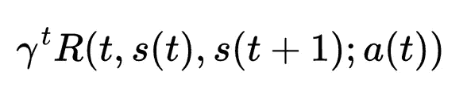
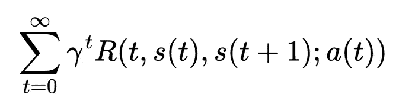
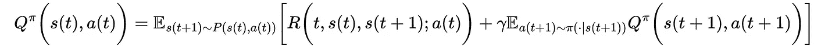

# 基础 RL:求解马尔可夫决策过程

> 原文：<https://towardsdatascience.com/foundational-rl-solving-markov-decision-process-d90b7e134c0b>

## 强化学习之路


作者使用人工智能工具 Dreamstudio 生成的封面照片(授权为[https://creativecommons.org/publicdomain/zero/1.0/](https://creativecommons.org/publicdomain/zero/1.0/)

在[的第一部分](/foundational-rl-markov-states-markov-chain-and-markov-decision-process-be8ccc341005)中，我讨论了一些基本概念来为强化学习(RL)建立基础，如马尔可夫状态、马尔可夫链和马尔可夫决策过程(MDP)。强化学习问题是建立在 MDP 之上的。

[](/foundational-rl-markov-states-markov-chain-and-markov-decision-process-be8ccc341005)  

MDP 是一个 4 元组模型(𝓢、𝓐、𝓟、𝓡)，其中 *s* ∈ 𝓢是一个状态， *a* ∈ 𝓐是当代理是一个状态 *s* 时采取的一个动作，𝓟*(s“| s，a)* 是在动作 *a* 的影响下从 *s* 转移到状态*s’*的转移概率矩阵(或者

**策略函数:**策略函数，在 RL 文献中通常用π表示，规定了从状态空间𝓢到动作空间𝓐.的映射

> MDP 的目标是找到一个最大化长期回报的最优策略。

# 贴现因素

MDP 需要一个离散时间的概念，因此 MDP 被定义为一个离散时间随机控制过程。在 RL 的上下文中，每个 MDP 由折扣因子γ (gamma)来参数化，该折扣因子γ确定未来奖励相对于当前奖励的重要性。换句话说，这是一个衡量未来的回报相对于现在的回报对代理人有多大价值的指标。折扣因子是一个介于 0 和 1 之间的值，其中值 0 意味着代理人只关心眼前的奖励，并将完全忽略任何未来的奖励，而值 1 意味着代理人将把未来的奖励视为与现在获得的奖励同等重要。

例如，在代理人在两个行动 A 和 B 之间做出决定的情况下，这两个行动将导致不同的未来奖励序列，折扣因子可以用于确定这些不同奖励序列的相对值。如果折扣因子低，那么代理人将更有可能选择导致即时奖励的行动，而如果折扣因子高，代理人将更有可能选择导致更大金额的未来奖励的行动。

一般来说，折扣因子是 MDP 中的一个重要考虑因素，因为它允许代理人用长期奖励来换取短期奖励，并平衡即时满足的需求和延迟满足的潜在好处。

因此，在 RL 环境中的 MDP 是(𝓢，𝓐，𝓟，𝓡，γ)。

# 奖励公式

考虑到贴现因子γ，在时间 *t* 的回报可以写成



等式 1。时间步长 *t* 的奖励。

总奖励，即所有时间的累积奖励是



等式 2。累积奖励

最大化累积回报的π策略是我们的 MDP 问题的解决方案。

## 我们来看一个例子(自动驾驶代理):

在自动驾驶的情况下，可以使用马尔可夫决策过程来对车辆的决策过程进行建模，以便在长期内最小化燃料消耗。在这种情况下，系统的状态可以由车辆的当前速度和加速度来表示，目标是找到将最小化燃料消耗的最佳动作序列。

车辆的瞬时燃料消耗可以建模为函数 *g(v，a)* ，其中 *v* 是当前速度，而 *a* 是当前加速度。该函数可用于评估给定状态下每个可能行动的成本，马尔可夫决策过程可用于寻找将最小化车辆长期燃料消耗的最佳行动序列。

例如，在当前速度为 *v* 且当前加速度为*a*的给定状态下，MDP 可以考虑一系列可能的动作，例如加速、减速或保持当前速度。可以使用函数 *g(v，a)* 来评估每项措施的成本，并根据哪项措施将导致长期最低的燃油消耗来选择最佳措施。然后，可以在每个后续状态下重复该过程，以找到最大限度降低燃油消耗的最佳行动顺序。

> **需要强调的重要一点是，在上面的例子中，我没有考虑转移概率𝓟，这是为了让我们的例子更容易理解，也更符合实际。**

## 一些 python 代码:

考虑一个 MDP，其中状态为速度和加速度，速度的最小值为 0 米/秒，最大值为 50 米/秒，加速度的最小值为-4.5 米/秒，最大值为 3.0 米/秒，它们中的每一个都以 0.1 量化。我们可以考虑以下构造函数中的 MDP 类:

```
def __init__(self, velocity_min, velocity_max, acceleration_min, acceleration_max, velocity_step, acceleration_step, acceleration_min_accelerate, acceleration_max_accelerate):
        # Define minimum and maximum values for velocity and acceleration
        self.VELOCITY_MIN = velocity_min
        self.VELOCITY_MAX = velocity_max
        self.ACCELERATION_MIN = acceleration_min
        self.ACCELERATION_MAX = acceleration_max

        # Define quantization step for velocity and acceleration
        self.VELOCITY_STEP = velocity_step
        self.ACCELERATION_STEP = acceleration_step

        # Define minimum and maximum values for acceleration when accelerating or decelerating
        self.ACCELERATION_MIN_ACCELERATE = acceleration_min_accelerate
        self.ACCELERATION_MAX_ACCELERATE = acceleration_max_accelerate

        # Calculate number of possible values for velocity and acceleration
        self.num_velocity_values = int((self.VELOCITY_MAX - self.VELOCITY_MIN) / self.VELOCITY_STEP) + 1
        self.num_acceleration_values = int((self.ACCELERATION_MAX - self.ACCELERATION_MIN) / self.ACCELERATION_STEP) + 1

        # Create list of possible values for velocity and acceleration
        self.velocity_values = [self.VELOCITY_MIN + i * self.VELOCITY_STEP for i in range(self.num_velocity_values)]
        self.acceleration_values = [self.ACCELERATION_MIN + i * self.ACCELERATION_STEP for i in range(self.num_acceleration_values)]
```

期望的动作可以是加速、减速或保持车辆的恒定速度。

```
 # Function to calculate available actions in a given state
    def calculate_actions(self, v, a):
        # Initialize list of available actions
        actions = []

        # If current velocity is less than maximum, add option to accelerate
        if v < self.VELOCITY_MAX:
            for a_new in self.acceleration_values:
                if self.ACCELERATION_MIN_ACCELERATE <= a_new <= self.ACCELERATION_MAX_ACCELERATE:
                    actions.append((v, a_new))

        # If current velocity is greater than minimum, add option to decelerate
        if v > self.VELOCITY_MIN:
            for a_new in self.acceleration_values:
                if -self.ACCELERATION_MAX_ACCELERATE <= a_new <= -self.ACCELERATION_MIN_ACCELERATE:
                    actions.append((v, a_new))

        # Add option to maintain current velocity and acceleration
        actions.append((v, a))

         return actions
```

接下来，我们可以定义一个函数来计算预期油耗:

```
# Function to evaluate the expected fuel consumption for a given state and action
    def evaluate_fuel_consumption(self, v, a, v_new, a_new):
        # Calculate expected fuel consumption for current state and action
        fuel_current = self.fuel_consumption(v, a)
        fuel_new = self.fuel_consumption(v_new, a_new)
        return fuel_current + fuel_new
```

计算最优策略的一种简单方法是扫描整个状态空间:

```
# Function to find the optimal action in a given state, based on minimizing expected fuel consumption
    def find_optimal_action(self, v, a):
        # Calculate available actions in current state
        actions = self.calculate_actions(v, a)

        # Initialize minimum expected fuel consumption
        min_fuel = float("inf")

        # Initialize optimal action
        optimal_action = None

        # Iterate over available actions and find action with minimum expected fuel consumption
        for v_new, a_new in actions:
            fuel = self.evaluate_fuel_consumption(v, a, v_new, a_new)
            if fuel < min_fuel:
                min_fuel = fuel
                optimal_action = (v_new, a_new)

        return optimal_action

    # Function to calculate the optimal policy for the MDP
    def calculate_optimal_policy(self):
        # Initialize dictionary to store optimal policy
        optimal_policy = {}

        # Iterate over all possible states and calculate optimal action for each state
        for v in self.velocity_values:
            for a in self.acceleration_values:
                optimal_policy[(v, a)] = self.find_optimal_action(v, a)

        return optimal_policy
```

以上代码片段的测试实现如下:

```
# Create MDP instance
mdp = MDP(VELOCITY_MIN, VELOCITY_MAX, ACCELERATION_MIN, ACCELERATION_MAX, VELOCITY_STEP, ACCELERATION_STEP, ACCELERATION_MIN_ACCELERATE, ACCELERATION_MAX_ACCELERATE)

# Calculate optimal policy for the MDP
optimal_policy = mdp.calculate_optimal_policy()

# Print optimal policy for the first few states
for i in range(10):
    for j in range(10):
        print(optimal_policy[(mdp.velocity_values[i], mdp.acceleration_values[j])])
```

上面例子的完整代码可以从[https://gist . github . com/rahulbhadani/92d 3 be 52529 a 64372 c 796 ca 5 e 7 CB 3770](https://gist.github.com/rahulbhadani/92d3be52529a64372c796ca5e7cb3770)下载。

> 现在，我们可能会问一个问题:上述实现是否高效？

我们清楚地看到，上面的实现扫描了整个状态空间，效率不是很高。为了提高这种实现的效率，我们可以使用动态编程来存储每个状态的最佳动作，然后使用存储的值来计算整个 MDP 的最佳策略，而不需要迭代所有可能的状态。通过利用任何给定状态的最优策略仅取决于从当前状态可以到达的状态的最优策略的事实，这将允许更有效地计算最优策略。

另一种选择是使用函数逼近来逼近最优策略，这比显式计算所有可能状态的最优策略更有效。这可以通过在状态空间的代表性样本上训练诸如神经网络(深度 RL)的模型，然后使用训练的模型来预测任何给定状态的最佳动作来完成。

在这一点上，我们应该可以轻松地讨论贝尔曼方程、动态规划和 Q 函数。

> 贝尔曼方程在控制理论或控制工程中也称为汉密尔顿-雅可比方程。

# 贝尔曼方程:价值函数和 Q 函数

在上述定义的 MDP 中，目标是长期最小化燃料消耗，贝尔曼方程在确定最优策略中起着重要作用。贝尔曼方程提供了状态值和从当前状态可达到的状态值之间的递归关系，可用于通过找到导致具有最高值的状态的动作来确定最佳策略。

这种递归使用迭代计算机科学算法来解决，如动态规划和线性规划。它们的变化导致了多种 RL 训练算法。

状态值和状态-动作值的贝尔曼方程分别称为值函数和 Q 函数。

## 价值函数

在 MDP，状态的值被定义为从当前状态开始的长期的预期燃料消耗。我们称之为价值函数。

数学上，价值函数可以写成


等式 3。价值函数。

其中 *P( s(t)，a(t) )* 在动作 *a(t)* 的影响下，从状态 *s(t)* 到 *s(t +1 )* 的转移概率。等式 3 的定义是从 [1](https://doi.org/10.1007/978-981-19-0638-1) 得到的值函数的修改形式。

价值函数可用于通过将当前状态下的预期燃料消耗与下一状态下的预期燃料消耗相加来计算状态的价值，其中下一状态下的预期燃料消耗通过在当前状态下可采取的所有可能行动中取最大值来计算。这个过程可以递归地重复，以计算每个状态的值，从初始状态开始，向后工作到最终状态。

一旦使用贝尔曼方程计算了所有状态的值，就可以通过找到导致每个状态具有最高值的状态的动作来确定最优策略。然后，该最佳策略可用于确定在每个状态下采取的最佳行动，以便在长期内将燃料消耗降至最低。

## q 函数

在上面定义的 MDP 的情况下，目标是在长期内最小化燃料消耗，Q 函数是将每个状态和动作对映射到实数的函数，表示从该状态开始并采取该动作的长期内的预期燃料消耗。

数学上，Q 函数可以写成



等式 4。q 函数

这是在[ [1](https://doi.org/10.1007/978-981-19-0638-1) 中使用的 Q 函数的修改形式。

可以使用贝尔曼方程来计算 Q 函数，该方程提供了状态值和从当前状态可以达到的状态值之间的递归关系。可以通过将当前状态下的预期燃料消耗与下一状态下的预期燃料消耗相加来计算 Q 函数，其中下一状态下的预期燃料消耗是通过采取当前状态下可以采取的最大总可能行动来计算的。

一旦使用贝尔曼方程计算出所有状态-动作对的值，就可以通过找到使每个状态的 Q 函数最大化的动作来确定最佳策略。然后，该最佳策略可用于确定在每个状态下采取的最佳行动，以便在长期内将燃料消耗降至最低。

让我们看看他们如何寻找本文中的例子。

```
 class MDP:
    # ...

    # Function to calculate the value function for the MDP
    def calculate_value_function(self):
        # Initialize dictionary to store values of each state
        values = {}

        # Iterate over all possible states and calculate value of each state
        for v in self.velocity_values:
            for a in self.acceleration_values:
                values[(v, a)] = self.evaluate_value(v, a, values)

        return values

    # Function to evaluate the value of a state using the Bellman equation
    def evaluate_value(self, v, a, values):
        # Check if value of current state has already been calculated
        if (v, a) in values:
            return values[(v, a)]

        # Calculate available actions in current state
        actions = self.calculate_actions(v, a)

        # Initialize maximum expected fuel consumption
        max_fuel = float("-inf")

        # Iterate over available actions and find action with maximum expected fuel consumption
        for v_new, a_new in actions:
            fuel = self.evaluate_fuel_consumption(v, a, v_new, a_new)
            if fuel > max_fuel:
                max_fuel = fuel

        # Return maximum expected fuel consumption
        return max_fuel
```

```
class MDP:
    # ...

    # Function to calculate the Q-function for the MDP
    def calculate_q_function(self):
        # Initialize dictionary to store values of each state-action pair
        q_values = {}

        # Iterate over all possible states and actions
        for v in self.velocity_values:
            for a in self.acceleration_values:
                for v_new, a_new in self.calculate_actions(v, a):
                    q_values[((v, a), (v_new, a_new))] = self.evaluate_q_value(v, a, v_new, a_new, q_values)

        return q_values

    # Function to evaluate the Q-value of a state-action pair using the Bellman equation
    def evaluate_q_value(self, v, a, v_new, a_new, q_values):
        # Check if Q-value of current state-action pair has already been calculated
        if ((v, a), (v_new, a_new)) in q_values:
            return q_values[((v, a), (v_new, a_new))]

        # Calculate expected fuel consumption in current state
        fuel = self.evaluate_fuel_consumption(v, a, v_new, a_new)

        # Calculate expected fuel consumption in next state by taking maximum over all possible actions
        max_fuel = float("-inf")
        for v_next, a_next in self.calculate_actions(v_new, a_new):
            fuel_next = self.evaluate_q_value(v_new, a_new, v_next, a_next, q_values)
            if fuel_next > max_fuel:
                max_fuel = fuel_next

        # Return expected fuel consumption in current state plus expected fuel consumption in next state
        return fuel + max_fuel
```

当然，该示例忽略了转移概率的概念，因此用于优化燃料消耗的示例的值函数和 Q 函数比用于一些现实世界的实际问题要简单得多。

在本文中，我讨论了通过求解 MDP 来获得最优策略、关联值函数和 Q 函数，这些函数可用于以最优方式求解 MDP。

在下一篇文章中，我将在强化学习问题的背景下讨论动态编程。在以后的文章中，我将讨论深层的 RL 概念以及在这种场景中引入神经网络，并给出一些仿真示例。加入我的[电子邮件列表](https://rahulbhadani.medium.com/subscribe)，让我未来的文章直接发送到你的收件箱。

如果你还没有看完基金会 RL 系列的第一篇文章，请一定要去看:[https://towards data science . com/fundamental-RL-Markov-States-Markov-chain-and-Markov-decision-process-be 8 CCC 341005](/foundational-rl-markov-states-markov-chain-and-markov-decision-process-be8ccc341005)。

> *你喜欢这篇文章吗？* [*给我买杯咖啡*](https://www.buymeacoffee.com/rahulbhadani) *。*
> 
> *爱我的文字？加入我的* [*邮箱列表*](https://rahulbhadani.medium.com/subscribe) *。*
> 
> *想了解更多 STEM 相关话题？加入* [*中等*](https://rahulbhadani.medium.com/membership)

# 参考

1.  深度强化学习，Aske Plaat，[https://doi.org/10.1007/978-981-19-0638-1,](https://doi.org/10.1007/978-981-19-0638-1,)施普林格
2.  强化学习和随机优化:连续决策的统一框架。)，威利(2022)。精装本。ISBN 9781119815051。
3.  罗纳德·霍华德(1960)。 [*动态规划与马尔可夫过程*](http://web.mit.edu/dimitrib/www/dpchapter.pdf) (PDF)。麻省理工学院出版社。