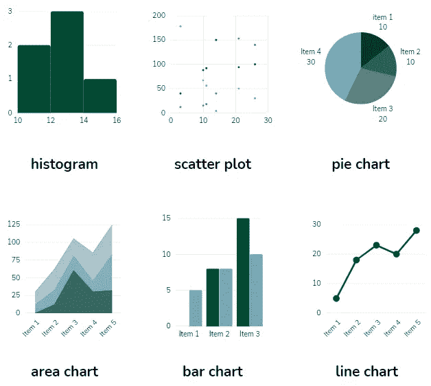
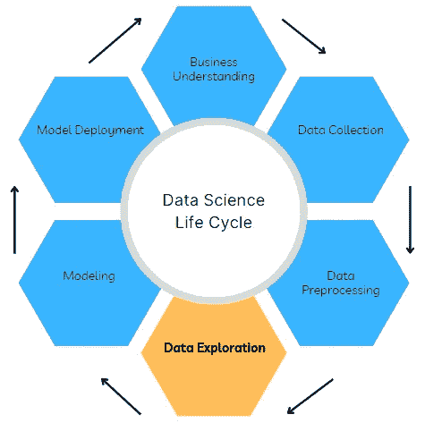

# 探索性数据分析中要避免的四个常见陷阱

> 原文：<https://towardsdatascience.com/four-common-pitfalls-to-avoid-in-exploratory-data-analysis-85d822dd5e34>

## 用数据讲述可操作的故事

凯尔·格伦在 [Unsplash](https://unsplash.com?utm_source=medium&utm_medium=referral) 上的照片

## 介绍

在本文中，我将分享数据探索中的四个常见错误以及如何避免它们。

探索性数据分析(EDA)是使用图形表示和汇总统计来发现数据中的趋势和模式。EDA 的流行图形包括[散点图](https://chartio.com/learn/charts/what-is-a-scatter-plot/)、[条形图](https://docs.tibco.com/pub/spotfire/7.0.1/doc/html/bar/bar_what_is_a_bar_chart.htm)、[直方图](https://asq.org/quality-resources/histogram)、[圆环图](https://www.tibco.com/reference-center/what-is-a-donut-chart)和[热图](https://chartio.com/learn/charts/heatmap-complete-guide/)。此外，作为描述数据集的措施的汇总统计包括计数、平均值、中值、标准差和[偏斜度](https://codeburst.io/2-important-statistics-terms-you-need-to-know-in-data-science-skewness-and-kurtosis-388fef94eeaa)。

作者图片

EDA 是数据科学项目生命周期中的关键步骤之一，有助于在机器学习建模之前更好地理解数据。它还可以通过可操作的见解产生一些快速的胜利，为企业创造价值。

作者图片

EDA 的主要目标是识别数据中的错误，更好地理解数据，检测异常值，并揭示变量之间的关系。

## 探索性数据分析中的陷阱

为了实现 EDA 的既定目标，数据从业者在数据探索过程中必须避免以下陷阱:

1.  **不明确的业务问题**

每个数据科学项目的核心都是需要解决的业务问题。如何规划季节性销售？应该向不同的客户提供什么类型的促销？这些是可能会提出的一些问题。然而，数据从业者不一定精通业务，经理也不一定是数据专家，这会导致不良的业务问题。此外，现有数据可能不足以回答相关问题。

*避免这个陷阱的技巧:*

*   尽早从利益相关者那里获得反馈。
*   尽快明确需求。
*   将 EDA 视为一个迭代过程，需要频繁地循环返回给涉众。

**2。浅薄的见解**

快速发现的愿望并不完全错误。然而，你认为伟大的洞察力可能只是对利益相关者“陈述显而易见的事情”。问题“那又怎样？”非常常见，数据从业者必须在分析期间为此做好准备。想象一下，告诉销售团队，客户 A 是今年花钱最多的人。是的，这是真的，但他们可能已经知道这一点。

*避免这个陷阱的技巧:*

*   根据业务问题以及如何增加价值来定制您的发现。
*   回答“那又怎样？”事先提问(确保见解可行)。
*   当你发现见解时，对初步结果进行一些早期讨论。

**3。错误的推论**

数据从业者可能会得出错误的结论，原因有几个。常见的包括缺乏领域知识，将相关性视为因果关系，以及忽略[混淆变量](https://www.scribbr.com/methodology/confounding-variables/)。

*避免这个陷阱的技巧:*

*   扩展你的业务领域知识。
*   提高你的统计技能。
*   在分析过程中咨询业务涉众。

**4。可视化效果不佳**

可视化会出什么问题？很多！仅举几个:图形选择不好，轴比例误导，使用太多颜色，对观众中的一些色盲不敏感，显示错误的单位。关于如何正确地进行数据可视化，有大量的资源。因此，本节的提示是帮助提高数据可视化技能的教程链接。

*资源:*

*   [https://online.hbs.edu/blog/post/bad-data-visualization](https://online.hbs.edu/blog/post/bad-data-visualization)
*   [https://www . data pine . com/blog/missinging-data-visualization-examples/](https://www.datapine.com/blog/misleading-data-visualization-examples/)
*   [https://www.jotform.com/blog/bad-data-visualization/](https://www.jotform.com/blog/bad-data-visualization/)

## 结论

在本文中，我们讨论了数据探索中的常见陷阱以及如何避免它们。此外，我们强调了 EDA 的目标，并提供了一些资源来提高您的数据可视化技能。

我希望你喜欢这篇文章，直到下次。干杯！

*有什么更有趣的？你可以通过下面我的推荐链接订阅 Medium 来获得更多我和其他作者的启发性文章，这也支持我的写作。*

<https://aolaoye.medium.com/membership> 