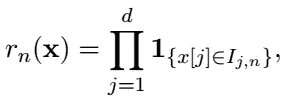
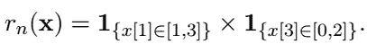
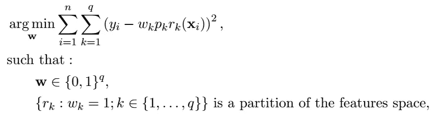

# 你应该在 2022 年使用的四种可解释的算法

> 原文：<https://towardsdatascience.com/four-interpretable-algorithms-that-you-should-use-in-2022-56b76974889b>

## 为了做出最好的决定，我们必须了解他们

图片来自 [Pixabay](https://pixabay.com/) 由 [geralt](https://pixabay.com/fr/users/geralt-9301/) 拍摄。

新的一年开始了，是时候下好决心了。其中之一可能是使决策过程更具可解释性。为了帮助你做到这一点，我提出了四个可解释的基于规则的算法。这四种算法都使用决策树作为规则生成器(如随机森林、AdaBoost、梯度提升等)。).换句话说，这些可解释的算法中的每一个都通过拟合黑盒模型并生成可解释的规则集成模型来开始其过程。

尽管它们都被宣称是可解释的，但它们是用不同的概念*可解释性*开发的。你可能知道，这个概念在数学上很难被很好地提出。因此，作者用他们自己的可解释性定义设计了可解释的算法。

为了避免详述，这里我假设数据由 *d* 数量特征组成，并且如果观察位于特征空间 *ℝᵈ* 的超矩形内，则规则是值为 1 的二元变量。换句话说，规则 *rₙ* 定义如下:

其中*x【j】*是的值，观察值 **x** 为第*个*特征， *Iⱼ,ₙ* 为ℝ.的区间规则和区间由 *n、*索引，n 是样本 *Dₙ.中的观察次数*规则中的 ***长度*** 是规则定义中的区间数 *s Iⱼ,ₙ* ≠ℝ，可能与 *d* 不同。例如，条件“ *If feature_1 in [1，3] AND feature_3 in [0，2]* ”定义了超矩形 *[1，3] × ℝ × [0，2] × ℝᵈ⁻中长度为 2 等于 1 的规则。**规则可以写成如下:*

**

# *1.RuleFit (2008 年)。*

*第一种算法是最流行的，也是最古老的。RuleFit 是在[1]中引入的。它生成一个稀疏线性模型，该模型以决策规则的形式包含选定的交互影响。*

***动机:**这个算法的思想来源于双重观察:基于规则的模型的主要缺点是难以捕捉线性依赖；另一方面，线性模型不能捕捉特征之间的相互作用。因此，RuleFit 的思想是通过创建一个稀疏线性模型，并以决策规则的形式添加交互效果，将这两种类型的算法结合起来。*

> *“使用集成学习，不要求基函数必须从同一个参数基学习器生成。”*

*该算法包括两个步骤。第一个是规则生成，第二个是规则选择。*

***规则生成:**作者已经提出使用集成树算法，例如随机森林、AdaBoost 和梯度提升。然后，作为规则，以上述形式提取每棵树的所有节点(内部和末端)。*

***规则选择:**这些提取的规则，连同原始的输入特征，然后被输入到一个 L1 正则化的线性模型，也称为 Lasso，它估计每个规则和每个变量对输出目标的影响，同时估计这些影响中的许多为零。为了使每个线性项具有与典型规则相同的先验影响，作者建议对原始输入特征进行归一化。*

***可解释性:**众所周知，套索惩罚是有选择性的。因此，使用这种正则化，作者期望许多系数具有零值，从而生成一个可解释的模型。*

> *出于解释的目的，希望集合由“简单”的规则组成，每个规则由少量变量定义。*

*此外，作者提出了许多公式来计算规则拟合模型中任何预测因子的*重要性*，并研究*交互效应。所有这些指标都是为了帮助统计学家理解生成的模型。**

***备注:**在实践中，RuleFit 很难解释。由于被激活的规则所暗示的预测来自套索拟合，所以规则可以覆盖正面的例子，但是仍然具有负面的预测。此外，有时生成的模型具有太多非零权重的规则，因此变得无法为人所理解。*

***包:** RuleFit 在以下 GitHub 项目中用 *Python* 实现: [imodels](https://github.com/csinva/imodels) 和 [rulefit](https://github.com/christophM/rulefit) 。RuleFit 也有几个 *R* 软件包。*

# *2.节点收获(2010 年)。*

*这种算法已在[2]中提出。该算法将随机森林的所有节点和树叶视为规则，并解决线性二次问题以拟合每个节点的权重。因此，估计器是节点的凸组合。*

***动机:**节点收获算法(NH)背后的思想是在给定一组 *q* 规则 *Q* 的情况下选择特征空间的最佳划分。最小化问题可以正式写成*

**

*其中 *wₖ* 是规则的权重 *rₖ* 和 *pₖ* 是规则的预测 *rₖ* (通常是经验条件期望 *Y* 给定 *X ∈ rₖ).**

*不幸的是，这个方程很难求解，特别是因为对于 *k ∈ {1，…，q}* 的约束 *wₖ ∈ {0，1}* 并不对应于凸可行域。在本文[2]中，作者提出了一种方法来适应这个优化问题，使其可解。*

> *“NH 的主要思想是，如果权重仅被约束为非负，则解决最佳经验划分问题在计算上变得可行。”*

***规则生成:**在本文中，作者推荐使用随机森林算法，并用大小为 *n/10* 的数据的子样本来拟合每棵树，而不是通常的 bootstrap 样本，以加快计算速度并增加规则集的多样性。然后，满足最大交互顺序(规则长度)的给定条件和最小尺寸(规则覆盖的观察数量)的给定条件的每棵树的所有节点被添加到规则集 *Q* 。最后，如果 *Q* 中的规则数量低于选定数量 *q* ，则重复该过程。*

***规则选择:**为了解决优化问题，作者对原规则做了两处修改。第一个是用经验分割条件来代替分割特征空间的条件。这意味着每个观察必须恰好被一个选择的规则覆盖。第二个修改是通过允许权重向量*取区间[0，1]中的值而不是二进制集{0，1}来放松对权重向量 ***w*** 的约束。由于这些变化，新的最佳经验分割问题可以用二次规划求解器来解决。**

****可解释性:**可解释性由交互次数的选择来保证。它必须小于或等于 3。事实上，很难理解一个包含三个以上特征的规则。而且，即使 *Q* 中的规则数量很大，优化问题的求解也要给大多数规则赋予 0 的权重。**

> **“绝大多数节点[..]将接收零权重，除了通过经验划分的约束之外，稀疏性没有被明确地实施。”**

**然而，根据我的经验，选择的规则数量仍然太高，无法创建一个可解释的模型，然而，该模型仍然相当准确。**

****备注:**在本文中，作者提出了一种在 *Q* 的大小大于观测值数量时，更快解决优化问题的降维方法。他还提出了在实践中运行良好的 NH 参数的缺省值。最后，他建议规范化，以提高可解释性。**

****包:**节点收割已经在[节点收割](https://cran.microsoft.com/snapshot/2014-12-27/web/packages/nodeHarvest/)包的 *R* 中实现。**

# **3.SIRUS (2021)。**

**SIRUS 算法已在[3]中引入，并在[4]中扩展。它使用修改的随机森林来生成大量规则，然后使用大于调整参数 *p₀* 的冗余来选择这些规则。为了确保生成的规则中有冗余，特征被离散化。**

****动机:**这个算法的主要优点是稳定。对于来自同一分布的两个独立样本，选择的规则集几乎相同。事实上，对作者来说，稳定性被视为可解释性的关键特征之一。**

****规则生成:** SIRUS 使用稍微修改过的随机森林。首先，使用边际分布的经验 *q* 分位数将特征离散化到 *q* 个箱中。离散化是稳定性的基础，只要 *q* 不太小，就能保证精度。为了加强可解释性，树的深度被限制为 2，而通常的随机森林算法推荐深度树。这意味着 SIRUS 规则生成过程的每棵树最多有 6 个节点(根节点不算)。最后，每棵树都被一个 *aₙ* 观测值的子样本代替，其中 *aₙ* 是 SIRUS 的一个参数。**

****规则选择:** SIRUS 生成了许多树(通常有 10000 棵),它选择了其中很大一部分共享的规则。为了能够识别这些规则，SIRUS 计算了森林中的一棵树包含特定路径的经验概率。然后，它选择经验概率大于或等于选定参数 *p₀ ∈ (0，1)* 的所有规则。不幸的是，这些方法在选择的规则列表中产生大量冗余，并且选择过程需要后处理。如果规则 ***r*** 是具有在林中具有较高频率的路径的规则的线性组合，则 ***r*** 从所选规则集中移除。**

****可解释性:**选择过程中的后处理确保只保留长度最短的规则。的确，一个规则只能是长度更短的规则的线性组合。**

> **“在我们的例子中，恰好 p₀参数本身就足以控制稀疏度”**

****备注:**离散化过程在 SIRUS 中是强制性的。首先，它增加了算法的稳定性。其次，它能够创建具有通用规则的决策树。事实上，如果特征是连续的，决策树算法在两个独立的样本中为相同的规则切割相同的精确值的概率是零。
作者还证明了路径概率估计的一致性和渐近收敛到完全稳定(即对于从同一分布中抽取的两个独立样本，选择的规则集完全相同)。最后，作者给出了一些参数调整的技巧。**

****包:** SIRUS 已经在 [sirus](https://cran.r-project.org/web/packages/sirus/) 包中的 *R* 中实现。**

# **4.覆盖算法(2021)。**

**这种算法已在[5]中提出。该算法提取一个稀疏规则集，该规则集考虑了树集合的所有节点和叶子，这些节点和叶子是根据它们的统计特性选择的，以形成“*准覆盖*”(这意味着覆盖是渐近的)。然后，使用所谓的*分割技巧*将覆盖转化为分割，以创建回归函数的一致估计量。
我在之前的一篇文章《如何处理重叠规则》中已经讲过分区的诀窍了？”。**

****动机:**想法是生成回归函数的可解释的、一致的基于规则的估计量。在文献中，一致的估计量必须由长度规则 *d* 产生。而对于一个大的 *d* ，规则就变得无法解释了。为了绕过这个限制，作者引入了*重要*和*不重要*规则的概念。重要规则可以被认为是目标变量表现出与其平均行为显著不同的行为的规则。并且无关紧要的规则可以被认为是目标变量具有非常低的方差的规则。作者还取消了有覆盖物的条件。这意味着所选规则的集合不必覆盖特征空间；这一限制被更灵活的*准覆盖*限制所取代。覆盖算法是这些概念的一个例子。**

****规则生成:**如同在 RuleFit 中一样，集成树算法如随机森林、AdaBoost 和梯度增强可以用作规则生成器。然后，提取每棵树的所有节点(内部和终端)作为规则，仅保留长度小于或等于指定参数值(通常为 3)的规则。**

****规则选择:**选择过程分为两步。首先，该算法提取重要的规则，按照覆盖率递减的方式对它们进行排序。该算法试图通过排除那些重叠太多的规则来用这些规则覆盖经验特征空间。第二，如果覆盖不完整，该算法试图通过添加无关紧要的规则来扩展覆盖，通过增加方差来排序它们**

****可解释性:**可解释性由所选规则集中少量的短规则来保证。事实上，如果一个决定是基于两个或三个长度相等的规则，那么它就更容易理解。此外，重要和不重要规则的概念有助于用户识别感兴趣的领域。无关紧要的规则表示发生不多的领域，与突出感兴趣的领域的重要规则形成对比。**

****备注:**本文的主要结果是由一组显著和不显著规则构造的回归函数的可解释估计量的相合性证明。如上所述，该算法只是一个示例，用于显示如何在预测算法中使用重要和不重要的规则。事实上，它不能产生一致的估计量，因为规则生成器不能完全满足某些条件。这种算法目前是积极研究的主题。**

****包:** CoveringAlgorithm 已经在 *Python* 中开发了 GitHub 包 [CoveringAlgorithm](https://github.com/VMargot/CoveringAlgorithm) 。**

# **结论**

**有趣的是，每个算法都有不同的目标:规则匹配和节点收获的准确性，SIRUS 的稳定性和覆盖算法的简单性。受益于这些先前的研究，我正致力于一种定量的方法来衡量基于这三联体的可解释性:可预测性、稳定性和简单性。第一种致力于基于树的算法和基于规则的算法的方法发表在 [MDPI 人工智能杂志](https://www.mdpi.com/journal/ai)(TDS 版本已经发布[在这里](/how-to-measure-interpretability-d93237b23cd3))。我目前正在对这种方法进行扩展，使其独立于算法，并能够比较任何预测算法的可解释性。**

# **关于我们**

**[Advestis](https://www.advestis.com/) 是一家欧洲合同研究组织(CRO ),对统计学和可解释的机器学习技术有着深刻的理解和实践。Advestis 的专长包括复杂系统的建模和时间现象的预测分析。**

***领英*:【https://www.linkedin.com/company/advestis/】T4**

# **参考**

**[1]j . h .和波佩斯库，2008 年。通过规则集成的预测学习。*《应用统计学年鉴》*， *2* (3)，第 916–954 页。**

**[2]2010 年，纽约州梅因绍森市。节点收获。*《应用统计学年鉴》*，第 2049–2072 页。**

**[3]c . bénard，g . Biau，Veiga，s .和 s .和 s . swoon et，e .，2021 年。SIRUS:稳定且可解释的分类规则集。*电子统计杂志*， *15* (1)，第 427–505 页。**

**[4]c . bénard，g . Biau，Veiga，s .和 s .和 s . o . s .，2021 年 3 月。通过规则提取的可解释随机森林。在*人工智能和统计国际会议*中，第 937–945 页。PMLR。**

**[5] Margot，v .，Baudry，J.P .，Guilloux，f .和 Wintenberger，o .，2021 年。使用数据相关覆盖的一致回归。*电子统计杂志*， *15* (1)，第 1743–1782 页。**