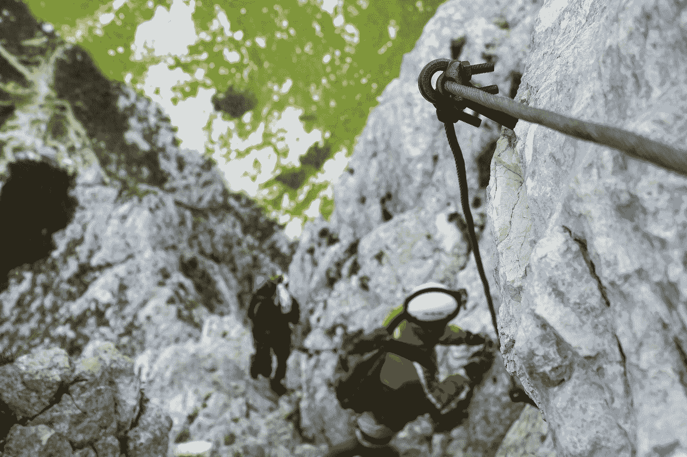

# 四种强大的算法，近距离观察

> 原文：<https://towardsdatascience.com/four-powerful-algorithms-up-close-bbf78426688b>

也许你正在迈出机器学习的第一步。也许你已经探索前沿研究很多年了。无论如何，我们认为你会喜欢这个星期的算法为中心的版本的变量。毕竟，熟悉模型的内部运作对于数据科学家和 ML 从业者来说都是一项至关重要的技能——而且你可以继续磨练多年。让我们开始吧。(如果你想尝试一些完全不同的东西，可以看看下面其他一些优秀的文章。)

*   蜂群能告诉我们关于商业结果的什么？ 在他的第一篇 TDS 文章中， [Naresh Ram](https://medium.com/u/a5665b0dac5f?source=post_page-----bbf78426688b--------------------------------) 展示了对进化算法——在这种情况下是人工蜂群(ABC)算法——和商业决策的交叉的有趣的深入探究。这是一个全面的理论介绍，还包括一个完整的代码实现，供你们中间的修补者使用。
*   [**用一个医疗用例**](/predicting-diabetes-with-random-forest-classifier-c62f2e319c6e) 观察一个随机的森林。分类和预测是机器学习在医疗保健领域的两个关键应用。[Lopamudra Nayak](https://medium.com/u/d75f7bceb150?source=post_page-----bbf78426688b--------------------------------)——另一位首次获得 TDS 的作者！—分享了一个精辟的实践教程，展示了如何基于随机森林分类器构建糖尿病预测模型。

照片由[弗兰蒂塞克·杜里斯](https://unsplash.com/@modry_dinosaurus?utm_source=medium&utm_medium=referral)在 [Unsplash](https://unsplash.com?utm_source=medium&utm_medium=referral) 上拍摄

*   [**获取层次聚类的基础知识对**](/hierarchical-clustering-explain-it-to-me-like-im-10-f949f8f3f80) 。有时，在一头扎进所有的编码、测试和微调之前，慢慢进入一个主题会有所帮助。例证:Shreya Rao 的初学者友好算法介绍的最新补充。它耐心地引导读者了解层次聚类的具体细节(并配有整洁的手工插图)。
*   [**关于魏斯费勒-雷曼算法的局限性——以及如何超越它们**](/graph-neural-networks-beyond-weisfeiler-lehman-and-vanilla-message-passing-bc8605fa59a) 。如果你这周有 30 分钟的空闲时间，我们鼓励你找到一种比阅读[迈克尔·布朗斯坦](https://medium.com/u/7b1129ddd572?source=post_page-----bbf78426688b--------------------------------)的最新贡献更有启发性的方式来使用它们。它为图形神经网络探索了一个有前途的新方向——物理学启发的“连续”学习，它避开了消息传递，并开辟了一系列强大的新工具。

寻找更多阅读推荐？我们希望如此，因为我们最近发表了一些优秀的新帖子。例如:

*   [Kate Wall](https://medium.com/u/dccf6b066551?source=post_page-----bbf78426688b--------------------------------) 解释了[如何利用 Matplotlib 为您的各种业务发布需求制作精美的 pdf](/level-up-with-python-quickly-produce-pdfs-with-stunning-visuals-d6750c9c7be2)。
*   [在最新的 TDS 播客](/out-of-distribution-generalization-66b6f8980ef3)中， [Jeremie Harris](https://medium.com/u/59564831d1eb?source=post_page-----bbf78426688b--------------------------------) 与 Irina Rish 聊起了她在人工智能研究人员当今面临的一些最棘手问题上的工作。
*   Python 还是 SQL？对于李逸来说，答案是“为什么不两者兼而有之？”阅读这篇文章来学习如何从 Python 中自动执行 SQL 查询。
*   机器学习云服务伴随着巨大的碳足迹。Chaim Rand 认为供应商是时候转向无排放的 T21 计算实例了。

我们希望你喜欢本周的阅读和探索！如果你有一个有趣的项目或话题要告诉我们(和我们的读者)，为什么不把它发给我们呢？

直到下一个变量，

TDS 编辑