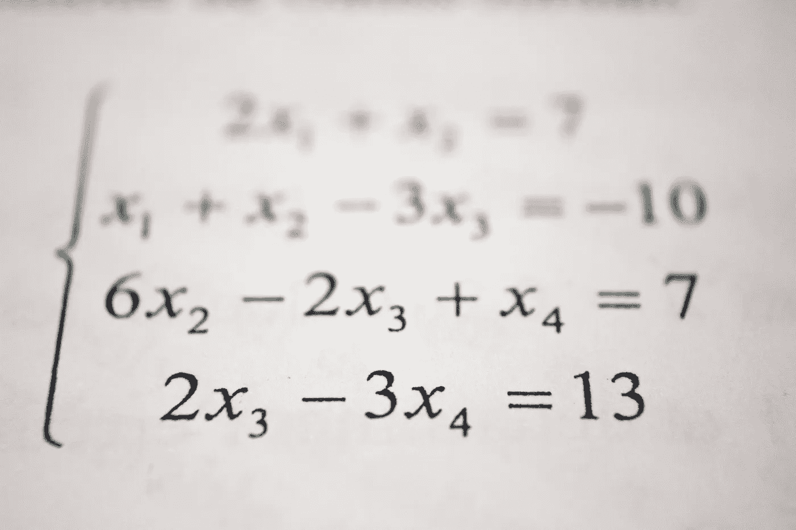
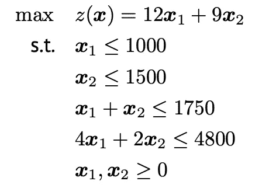
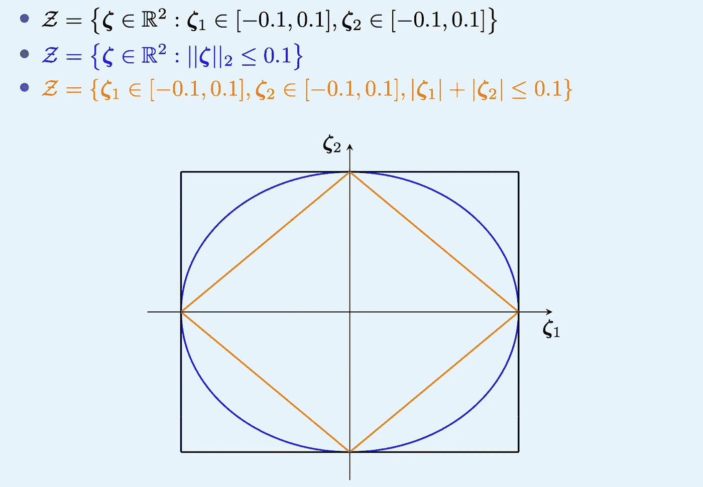
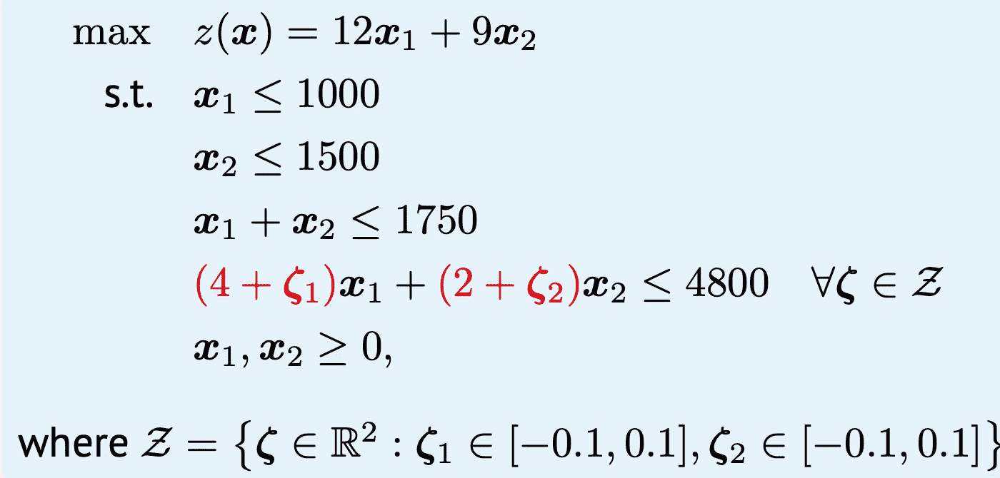
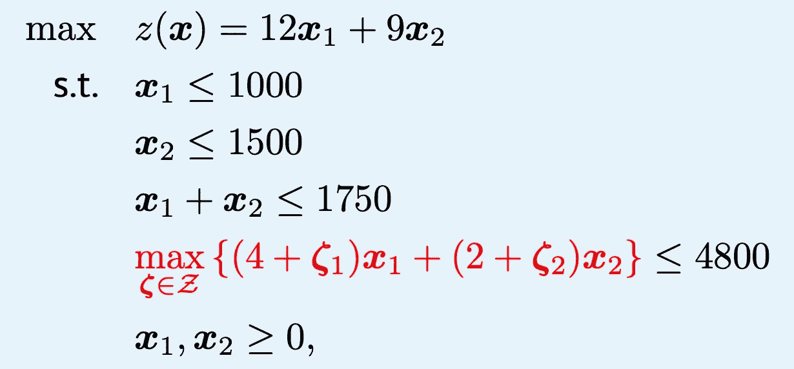
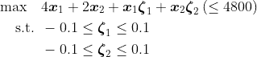
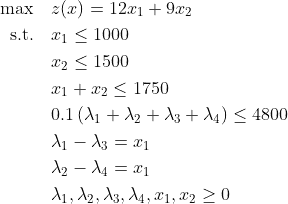

# 强健线性程序的四个步骤

> 原文：<https://towardsdatascience.com/four-steps-to-robustify-your-linear-program-281477bd8190>

## 以及它如何帮助你烘焙蛋糕

安托万·道特里在 [Unsplash](https://unsplash.com/s/photos/math?utm_source=unsplash&utm_medium=referral&utm_content=creditCopyText) 上拍摄的照片

在大学的第一年，我接触了线性编程，这为我打开了一个全新的世界。教授们教我们使用 LP 在广泛的领域中对各种问题建模。这吸引了我，因为它可以给出一个最优的解决方案——如果问题足够小的话——并且相对容易构建。由于对这种方法过于热衷，我几乎在每个 uni 项目中都使用了这种方法，甚至最终我的整个论文都是以 LP 为基础的。

直到我读硕士的第二年，我才意识到我从来没有学会如何在构建 LPs 时将**不确定性**考虑在内。当我现在看它的时候，感觉很傻。毕竟，你有多少次听说数据是 100%准确的，或者在他们的实验中有零估计误差的研究？可能永远不会，对吧？基本 LPs 通常基于**精确的输入**数据，并且不考虑那些输入值可能不完全准确。这些模型缺乏对不同最坏情况的鲁棒性。例如，如果你正在烘烤一个蛋糕，但是由于浪费，你每次消耗的配料都不一样，你可能希望有一个永远有效的解决方案，不管溢出多少。如果你想实现稍微复杂一点的数学模型，包括不确定性，你可能需要一个健壮的 LP 版本。

对我来说足够幸运的是，我上了一堂数学最优化的课，在课上他们详细地讨论了这个话题。其中一点是 LP 的**稳健性**可以归结为 **4 个步骤**，我将在本文中解释。

# 定义

首先，**健壮**是什么意思？一个健壮的解决方案在某种程度上是可行的——并且不会严重恶化——以应对输入数据的变化。换句话说:它优化了你的最坏情况。就蛋糕烘焙的例子而言，你总是希望能够烘焙出一个蛋糕，不管蛋糕是否溢出。

# 基本 LP

假设我们只需要 4 种原料来烘焙一个蛋糕:牛奶、鸡蛋、面粉和糖，我们的面包店出售两种蛋糕。它们分别产生 12 美元和 9 美元的利润，然而，它们有不同的配方。第一个蛋糕需要一单位的牛奶和面粉以及四单位的糖。第二个需要一个单位的鸡蛋和面粉以及两个单位的糖。由于面包店相当小，每天只有 1000 单位的牛奶、1500 单位的鸡蛋、1750 单位的面粉和 4800 单位的糖。

问题是:在不超过最大配料量的情况下，我们应该烘烤多少种类型的蛋糕才能使我们的利润最大化？下面，你可以找到对应的 LP。

资料来源:A. Zocca & R. Paradiso，来自 VU 阿姆斯特丹。

由于我们面包店的蛋糕是手工制作的，有时会洒一点糖。在决定最佳烘焙策略时，我们希望将这一点考虑在内。聪明的面包师想要确定最佳的生产组合，这种组合在糖消费波动的情况下仍然可行。然而，前面提到的 LP 没有做到这一点。因此，我们需要增加一些不确定性。

# 不确定集

不确定性有许多不同的种类和味道，但在这篇文章中，我将坚持三个基本的**不确定性集合**:

*   盒子不确定性集合(黑色)
*   椭球(bal)不确定性集(蓝色)
*   多面体不确定集(橙色)

不确定集是不确定参数可能取值的集合。在我们的示例中，有两个参数:每个蛋糕一个溢出参数。下面，你可以看到三个不确定性集合。

资料来源:A. Zocca & R. Paradiso，来自 VU 阿姆斯特丹。

如你所见，盒子不确定性集合(用黑色方块表示)是最保守的。毕竟它覆盖了不确定性状态空间中最大的面积。正方形的角表示两个不确定参数可以同时具有极值。球的不确定性(用蓝色圆圈表示)不会出现这种情况:不包括拐角。多面体不确定性集(用橙色菱形表示)甚至更进一步。根据你对保守主义的偏好，你可以为你自己的问题选择这些集合中的一个。为了简单起见，我们在我们的例子中采用盒不确定性集。

# 台阶

为了使 LP 稳健，**应该采取四个步骤**:

1.  构造**标称**问题
2.  构建**对手**问题
3.  找出对立的**对偶**
4.  **插头**标称问题中的对偶

## 名义问题

名义上的问题是简单地写下你最初的 LP，我们已经做了几段了。然而，也有必要确定不确定的参数，我们迄今为止还没有这样做。下面，你可以看到红色的是什么改变了:我们增加了不确定的参数。它们来自一个盒子不确定性集合，在最后一行用数学方法定义。

资料来源:A. Zocca & R. Paradiso，来自 VU 阿姆斯特丹。

很明显，两个不确定参数的最保守值为 0.1。然而，为了举例，我将解释你如何从数学上得到这个。

## 对手问题

请记住，我们希望针对最坏的情况优化我们的策略。因此，我们引入一个人造对手，它的目标是让你的优化变得可怕。下面，你可以看到红色的对手是如何工作的。它想最大化糖约束的左边，以使你的最优解不那么好。

资料来源:A. Zocca & R. Paradiso，来自 VU 阿姆斯特丹。

这是我们想要关注的红色部分。我们最大化约束的左侧，同时确保不违反不确定性集合的约束。下面可以看到由此产生的对手问题，可以看作是“对手”的数学模型。

对手问题。

## 双重的

找到对手问题后，是时候构建相应的对偶了。如果你对原始问题和对偶问题的概念不熟悉，看看这个视频。下面，你可以发现对抗性的双重问题。

双重问题。

## 即插即用

对偶问题可以代替名义问题中的红色约束。生成的稳健 LP 如下所示:

LP 的健壮版本。

这种 LP 的好处是它对输入数据的变化保持可行。如果洒了一点糖，最佳烘焙策略不需要改变。这使得数学建模更加现实，因此更适用于现实生活中的例子。

# 外卖

如果您的数学模型的输入数据不准确或不可靠，那么稳健地强化您的 LP 是值得的。这可以通过四个步骤完成:

1.  构造出**名义上的**问题
2.  构建**对手**问题
3.  找到敌对双方的**对偶**
4.  **塞**标称问题中的对偶

然而，如果你发现这个概念仍然相当模糊，不要担心。你已经听说过这件事了。老实说，烤蛋糕的时候谁还需要 LP 呢？烘焙快乐！

Monika Grabkowska 在 [Unsplash](https://unsplash.com?utm_source=medium&utm_medium=referral) 上的照片

# 参考

A. Zocca 博士和 R. Paradiso 博士在阿姆斯特丹自由大学的数学优化课程中，2021/2022。