# 内核大小为 1024x1024 或更大的傅立叶卷积

> 原文：<https://towardsdatascience.com/fourier-cnns-with-kernel-sizes-of-1024x1024-and-larger-29f513fd6120>

## 卷积神经网络中的多维傅立叶变换


照片由 [Edz Norton](https://unsplash.com/@edznorton?utm_source=medium&utm_medium=referral) 在 [Unsplash](https://unsplash.com?utm_source=medium&utm_medium=referral) 上拍摄

C 最近，选择性神经网络(CNN)得到了广泛的应用。不管它们是否成功，卷积都是低效的。滑动窗口需要许多计算，并且限制了内核的大小。同时，通常在[3，3]到[7，7]之间的小核限制了感知场，并且需要许多层来捕捉输入张量的全局背景(例如 2D 图像)。图像越大，小滤镜的效果越差。这就是为什么你很难找到输入高分辨率图像的 CNN。

如果我告诉你有一种方法可以将内核大小扩展到[1024，1024]甚至更大，有一种方法可以在给定的输入分辨率下增加内核大小，而对推理时间几乎没有影响，如果有一种方法可以在不丢失几乎任何信息的情况下大幅降低特征图的空间维度，又会怎么样呢？

所有这些承诺都基于一个简单的数学属性:傅立叶变换的卷积定理(准确地说是互相关定理),我将向您展示如何正确地利用它！

> 注意:随着这篇文章，我在我的 GitHub 上发布了一个包含所有代码的[笔记本](https://github.com/sascha-kirch/ML_Notebooks/blob/main/2D_FFTs.ipynb)

# 概述

1.  [卷积的缺陷](#e0f2)
2.  [2D 离散傅立叶变换结果](#69b2)
3.  [发现 2D FFT 频谱](#5a4c)
4.  [在 TensorFlow 中实现](#dc1b)
5.  [结论](#5720)
6.  [进一步阅读和链接](#4720)

# 卷积的缺陷

让我们回顾一些基础知识。卷积是应用于两个函数的数学运算。让我们从一维情况开始:

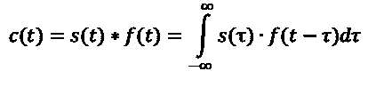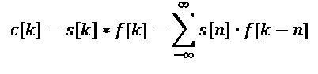

1D 卷积，(上)连续 1D 卷积，(下)离散 1D 卷积

换句话说:取两个信号，一个保持原样，另一个绕坐标轴翻转。将固定信号上的翻转信号从负无穷大移动到正无穷大(或者直到信号的所有非零部分都已重叠)。对于每个步骤，计算元素乘积并对所有值求和。结果值是该特定步骤的卷积结果。卷积也可以应用于二维信号(例如图像):

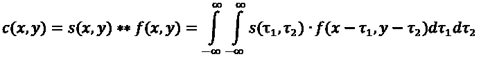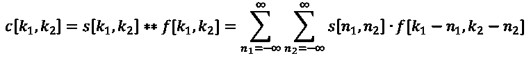

2D 卷积，(上)连续 2D 卷积，(下)离散 2D 卷积

但是为什么我之前提到了互相关呢？这是因为卷积和互相关实际上是以相同的方式计算的，唯一的区别是滤波器被翻转了。这由不同的符号表示:

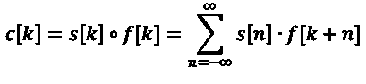

(上)离散卷积和(下)离散互相关之间的比较

TensorFlow 和 PyTorch 实际上是在计算输入信号和可学习滤波器的互相关，而不是卷积。有关系吗？不尽然！由于滤波器是由网络学习的，所以滤波器是否翻转并不重要。网络会自己找出什么是最好的。不翻转过滤器甚至可以节省一些计算。但是，如果过滤器是固定的，这意味着如果您加载一个训练好的模型，您应该知道它是使用互相关还是卷积来训练的，并且最终必须翻转过滤器的权重。

你应该记住两件事:

1.  需要大量的计算来计算输出序列中的单个点。
2.  输入信号越大(即图像的分辨率越高)，滤波器必须移动得越频繁，因此需要更多的计算。这同样适用于较大的过滤器。

更多的计算意味着更多的内存和更长的等待时间，直到结果可用。CNN 的后果是显而易见的:更低的输入分辨率和更小的滤波器。问题:更少的像素意味着更少的细节，更小的过滤器导致更小的感受野。网络需要有多个连续的卷积层，以增加接收域。网络变得更深，这又给培训带来了新的挑战。

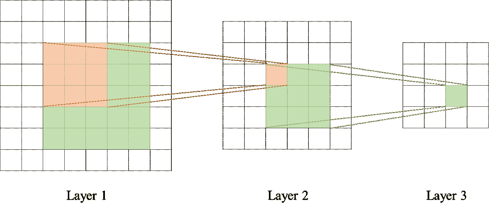

卷积神经网络感受野的增长

# 2D 离散傅立叶变换来拯救

从数学上讲，时间变量 t 的实函数或复函数 x(t)的傅立叶变换是实频率变量 f 的复函数 X(f ):

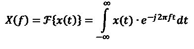

傅里叶变换

你也可以说我们将信号从时域投射到频域。通过这样做，我们可以受益于傅立叶变换的特殊性质，即卷积定理和相关定理。

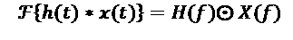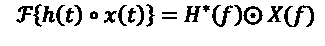

傅立叶定理，(上)卷积定理，(下)互相关定理

这些特性非常重要，也是本文的基础:时域中的卷积/相关对应于频域中简单的逐元素乘法。但这有什么好激动的呢？如前所述，卷积需要很多计算，特别是对于大图像和过滤器。其复杂度与序列长度成二次比例，即 O(N)。根据卷积定理，我们只需要对变换后的输入和变换后的滤波器执行逐元素乘法。存在有效的算法来计算傅立叶变换，即快速傅立叶变换(FFT)，其将复杂度降低到 O(N log(N))。而最好的部分，只要滤波器作为输入信号更小，计算要求是不变的。不管我们的过滤器的内核大小是[3，3]还是[1024，1024]。在 TensorFlow 中实现的部分中的细节。

傅立叶变换也存在于实数或复数离散信号 x[k]中，其分配实数变量 n 的复数离散信号 X[n]:

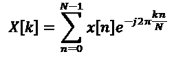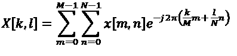

离散傅立叶变换，(上)1D 离散傅立叶变换，(下)2D 离散傅立叶变换

离散傅立叶变换(DFT)注定用于数字信号处理，因为计算机以离散值存储信号。

> 注意:离散信号是时间离散和数值离散的。时间离散型，因为它以特定的时间间隔进行采样；数值离散型，因为每个值都由特定数量的位表示，例如 INT32 为 32 位。

在使用 DFT 时，我们需要记住一些含义:

1.  假设输入信号是周期性的，并且采样一个完整的周期
2.  产生的光谱是周期性的

> 注:图像可以被解释为空间信号，而不是时间信号。在计算机上，图像是空间离散的，因为值存储在像素中，这些像素是从具有空间分布的单元的图像传感器中采样的或者被数字化的。

二维 DFT(以及 2D 连续傅立叶变换)可以分成连续的 1D DFT，其中行和列可以分别计算。

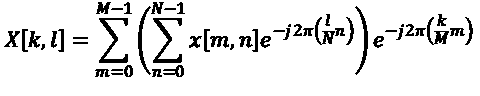

2D DFT 在连续的 1D DFT 中分离

这至少有两个优点:第一，可以重复使用 1D DFT 的算法，第二，有助于建立 2D DFT 的直觉，因为行和列可以单独解释。

但是当然，离散傅立叶变换有一个小细节:**卷积定理不适用于 DFT。**

两个信号的 DFT 的乘积对应于由算子⊛表示的它们的循环卷积，而不是它们的线性卷积。

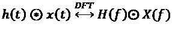

DFT 的循环卷积定理

循环卷积是以信号长度 N 重复的周期性信号，而线性卷积的长度为(N+F-1)，其中 F 是滤波信号的长度。因此，如果您盲目地在频域中求乘积，您会将长度为(N+M-1)的信号压缩到长度为 N 的信号中，这可以被视为时域中的**混叠，从而在最终结果中产生不需要的伪像。幸运的是，循环卷积和线性卷积共享一些值，即(N-F+1)。剩余的(F-1)值被绕回并干扰信号的其他值。**

这里有一个想法:如果被包装的值干扰的值为零，意味着没有干扰，那会怎么样？这意味着我们可以从循环卷积中重建线性卷积。当信号至少用(F-1)零填充时，包装值不会干扰真实值。然后，我们可以循环地将包装的值移回它的位置，并裁剪填充的值。详细信息将在实施部分显示。

我不再赘述所有的数学细节，并在文章末尾链接了更多的资源。

# 发现 2D DFT 频谱

现在我们已经讨论了理论，让我们发现一些 2D 傅立叶变换，并加强我们对 2D 傅立叶变换的直觉。

## 基本测试信号及其对细胞神经网络的影响

考虑像素强度遵循对角正弦波的图像。你期望什么样的振幅谱？如前所述，2D 傅立叶变换可以通过将 2D 傅立叶变换沿着图像的每个轴分成多个 1D 傅立叶变换来计算。如果你想象沿着横轴行走，你会遇到重复的模式。如果你想象沿着纵轴行走，情况也是如此。因此，在第四象限(右下)，即频率成分为正值的象限内，很自然地会出现高频谱值。

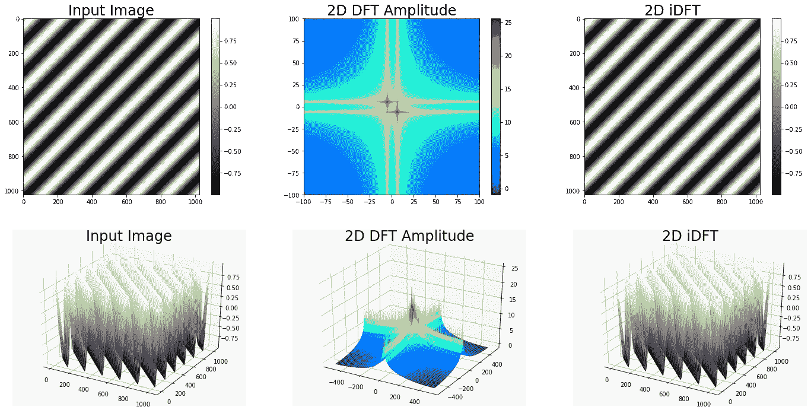

对角正弦输入图像的 2D DFT(上图)图像图，(下图)作者的 3D 图

> 注意:2D 振幅谱在绘制时通常使用对数函数进行缩放，因为图像无论其内容如何都具有高偏移，因为它们通常以无符号整数表示，而无符号整数仅表示正值。

现在，让我们考虑具有不同边长的矩形的输入图像。如果你再次想象沿着每个轴走，你将在水平轴上遇到一个具有短脉冲宽度的矩形，在垂直轴上遇到一个具有较宽脉冲宽度的矩形。如果你熟悉信号理论，你会立即想到你的频谱有某种 sinc 函数，其中 sinc(x)=sin(x)/x。

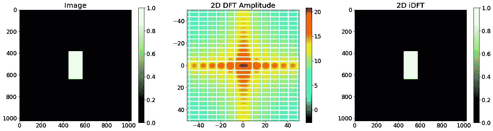

不同边长矩形的 2D DFT

如果你期待一个正弦函数，你是完全正确的。频谱由沿两个轴的正弦函数组成。这里可以做一个 ***基本面观察*** : 横轴作为纵轴有较高的频率成分，过零点在横轴更分散。这一观察有两层含义:

1.  输入图像中的窄空间特征在振幅谱中具有高频分量，因此它们具有高带宽。高带宽滤波器容易产生噪声。
2.  光谱与输入图像中要素的空间长度成反比。窄特征导致宽光谱，宽特征导致窄光谱。

这对于我们的 CNN 来说意味着什么呢？根据我们上面的观察，这应该意味着具有小滤波器的***CNN 充当高带宽滤波器，因此容易产生输入噪声*** *。*滤波器尺寸越大，滤波器带宽越低，选择性越强。

## 图像的 2D DFT 和频域滤波

既然我们已经讨论了一些基本信号，让我们研究真实图像的 2D DFT。

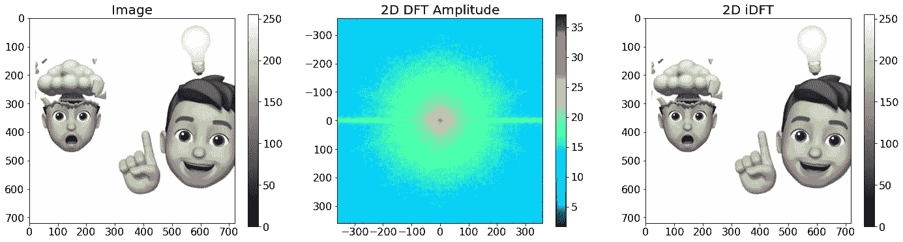

作者的图像的 2D DFT

频谱的中心表示频率为零，也称为偏移。离中心越远，输入中的频率成分越高。记住这一点，你可以很容易地得出一个高通滤波器和一个低通滤波器。

高通滤波器抑制低频，保留高频成分。这种行为可以通过这样的滤波器来实现，该滤波器在靠近中心的位置具有 0，而在远离中心的位置具有 1。通过将滤波器与频谱相乘，然后计算傅立叶逆变换来应用滤波器。

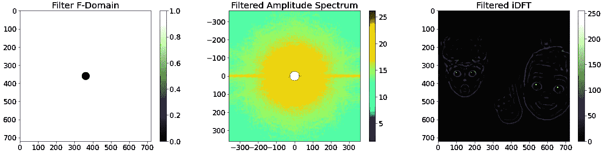

作者的高通滤波器

如上图所示，高通滤波器可以用作边缘检测器。图像中的边缘的特征在于像素值的突变，因此它具有高梯度。梯度越高，涉及的频率越高。

另一方面，低通滤波器抑制高频分量，保留低频分量。低通滤波器可以通过在中心区域为 1 而在外部区域为 0 的掩模来实现。

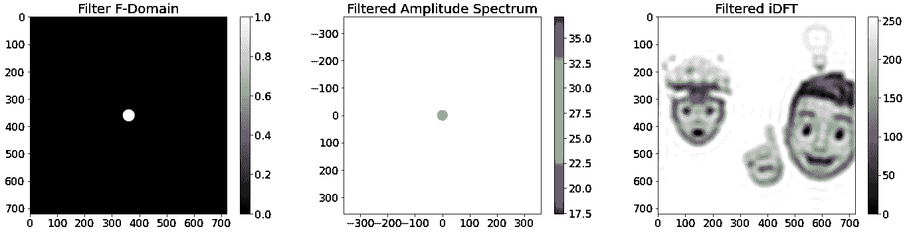

作者的低通滤波器

经过低通滤波的图像看起来模糊不清，失去了清晰度。计算机视觉中使用的典型滤波器是高斯滤波器。它也是一个低通滤波器，但对于较高的频率，滤波效果逐渐增强，而不是突然截止频率。它使图像平滑。下图由高斯滤波器滤波，其方差(sigma 平方)等于之前圆形低通滤波器的截止频率。


作者的高斯滤波器(平滑)

图像模糊，但失真较少。它看起来更光滑。

机器学习应用的一个非常有趣的过滤器是矩形过滤器。卷积神经网络通常逐渐减小空间宽度并增加通道数量。汇集，如最大汇集或平均汇集经常被用来减少空间宽度。如果我们在频域中汇集呢？

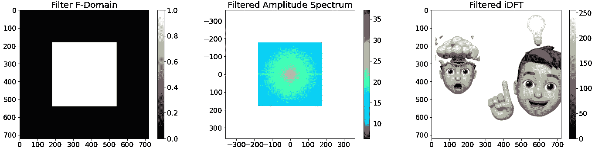

作者的矩形过滤器

通过在频域中应用矩形滤波器，我们可以彻底去除频率分量，而不会对空间域中的图像质量产生大的影响。

DFT 对于实输入有一个有趣的性质:它关于原点共轭对称。对称性意味着频谱包含冗余，在计算过程中可以忽略这些冗余，以进一步加快处理速度。下图显示了这种变换及其从光谱重建的逆变换。

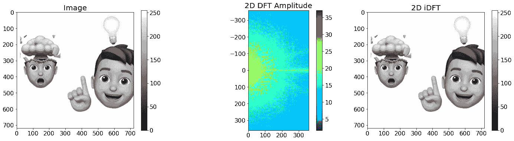

作者的图像的 2D 快速傅立叶变换

**从本节中取走:**

1.  低频成分在 2D 频谱的中心，而高频成分远离中心
2.  您可以利用 DFT 的对称性来减少所需的计算资源，只计算 rDFT。
3.  小尺寸滤波器由于其高带宽而易于产生噪声。

这是我为生成这些图而创建的笔记本:

[](https://github.com/sascha-kirch/ML_Notebooks/blob/main/2D_FFTs.ipynb) [## ML _ Notebooks/2D _ ffts . ipynb at main sascha-kir ch/ML _ Notebooks

### 机器学习相关笔记本合集分享。-ML _ Notebooks/2D _ ffts . ipynb at main…

github.com](https://github.com/sascha-kirch/ML_Notebooks/blob/main/2D_FFTs.ipynb) 

# TensorFlow 中的实现

利用离散傅里叶变换实现线性卷积，我们已经具备了所有条件。

概括地说，我们需要实施以下 6 个步骤:

1.  填补输入图像以避免时域中的混叠
2.  对图像大小进行填充过滤，以准备元素乘法
3.  计算输入图像和滤波器的 2D rFFT
4.  变换输入和变换滤波器的逐元素乘法
5.  计算滤波输入的 2D 逆 rFFT 以获得循环卷积
6.  从循环卷积重建线性卷积

## 步骤 1 —填充输入图像

为了避免时域中的混叠效应，我们需要用至少(F-1)零点来填充图像，其中 F 是滤波器的边长。此外，计算 DFT 的 FFT 算法对于信号长度为 2 的幂(例如 128，512，1024)特别有效。

至少有两种选择来填充输入图像:首先，我们手动填充图像。其次，我们将 FFT 的序列长度设置为填充信号的长度。我更喜欢后者。

下面的代码手动填充图像。

这里是我在计算 FFT 时指定更高序列长度的首选方法:

```
# image is of shape [b,c,h,w]
padding **=** GetImagePadding(filter_shape[0]) 
image_shape **=** (input_shape[0],
               input_shape[1],
               input_shape[2]**+**2*****padding,
               input_shape[3]**+**2*****padding)image_shape **=** FillImageShapeToPower2(image_shape)

F_image **=** tf**.**signal**.**rfft2d(image, fft_length**=**[image_shape[**-**2],image_shape[**-**1]])
```

## 步骤 2-根据图像大小填充滤镜

因为我们需要用变换后的滤波器计算变换后图像的元素乘积，所以在计算傅立叶变换之前，我们需要将滤波器填充到填充后图像的大小。过滤器用零填充。同样，我建议通过正确设置 fft 计算的 fft _ lenght 参数来填充滤波器，即

```
F_filter **=** tf**.**signal**.**rfft2d(filter, fft_length**=**[image_shape[**-**2],image_shape[**-**1]])
```

## 步骤 3 —计算 2D rfft

我们已经准备好输入信号，现在可以计算填充图像和填充滤波器的 FFT:

```
# Image shape [b,c,h,w], Filter shape [out, in , k, k]
F_image **=** tf**.**signal**.**rfft2d(image, fft_length**=**[image_shape[**-**2],image_shape[**-**1]])F_filter **=** tf**.**signal**.**rfft2d(filter, fft_length**=**[image_shape[**-**2],image_shape[**-**1]])
```

我们利用实输入的共轭对称性，仅使用 [rfft2d](https://www.tensorflow.org/api_docs/python/tf/signal/rfft2d) 计算 2D 信号的实 FFT。具体来说，我们输入无填充信号，并将 fft_length 设置为大于输入长度的值。这将自动用零填充信号。

**重要** : TensorFlow 对 [rfft2d](https://www.tensorflow.org/api_docs/python/tf/signal/rfft2d) 的实现计算输入的最后两个维度上的 fft。不像在 [numpy 的实现](https://numpy.org/doc/stable/reference/generated/numpy.fft.rfft2.html)中，你不能通过参数改变维度。因此，图像的形状是[批次、通道、高度、宽度]，内核的形状是[输出过滤器、输入过滤器、内核高度、内核宽度]

如果我们在频域中执行卷积，我们就完成了。由于 TensorFlow 实际上实现了互相关，因此我们需要对变换后的滤波器进行共轭，以获得一致的结果:

```
F_filter **=** tf**.**math**.**conj(F_filter)
```

## 步骤 4—变换图像和变换滤波器的相乘

如果我们只有单个图像和单个过滤器，则逐元素乘法将简单地为`F_image*F_folter`。在一个真实的场景中，我们通常以批处理的形式有多个图像，并且我们并行地应用多个过滤器。我们需要重新排列输入信号的维度，并利用阵列广播来执行此操作，而不涉及任何循环。

TensorFlow 的 [einsum()](https://www.tensorflow.org/api_docs/python/tf/einsum) 函数可用于轻松重塑维度。箭头左边的字符描述输入形状，右边的字符描述输出形状。图像和过滤器的尺寸以这样一种方式重新排列，即当计算元素乘积时，所有批次和所有输出过滤器将被[广播](https://numpy.org/doc/stable/user/basics.broadcasting.html)。乘法之后，通过整形和减小输入滤波器维度来恢复初始形状。

## 步骤 5 —计算逆 2D rFFT

[逆 FFT](https://www.tensorflow.org/api_docs/python/tf/signal/irfft2d) 简单地取自具有与 FFT 相同的 fft_length 参数的滤波信号:

```
out **=** tf**.**signal**.**irfft2d(filterd_image, fft_length**=**[image_shape[**-**2],image_shape[**-**1]])
```

## 步骤 6-从循环卷积重建线性卷积

记住，要从循环卷积重建线性卷积，我们需要执行两个步骤:首先，我们需要按照填充量循环移位结果。第二，我们需要截断到我们感兴趣的区域，所有批次的图像的初始形状和新的通道数。

```
#Circular shift
out **=** tf**.**roll(out,shift **=** [2*****padding,2*****padding],axis **=** [**-**2,**-**1]) #Truncation
out **=** tf**.**slice(out, 
               begin **=** [0, 0, padding, padding], 
               size**=**[input_shape[0], 
                     filter_shape[**-**1],  
                     input_shape[2], 
                     input_shape[3]]
               )
```

仅此而已！
下面的代码显示了步骤 1 到 6 的完整实现:

> 注意:傅立叶域中的卷积也以 TensorFlow 层的形式实现，作为我的 DeepSaki 包的一部分，可以在 [GitHub](https://github.com/sascha-kirch/DeepSaki/blob/25613bd7d5a98e41aa2ce7a2da1b02abdcd2989f/DeepSaki/layers/fourier_layer.py#L5-L159) 上找到或从 [PyPi](https://pypi.org/project/DeepSaki/) 下载。

# 确认

你可能会问自己:**但是这真的有用吗？**一起来看看吧！所有验证步骤都包含在本文的[笔记本中。](https://github.com/sascha-kirch/ML_Notebooks/blob/main/2D_FFTs.ipynb)

首先，我们将查看两个函数的内核大小的执行时间(秒): [tf.nn.conv2d()](https://www.tensorflow.org/api_docs/python/tf/nn/conv2d) 和我们的实现。

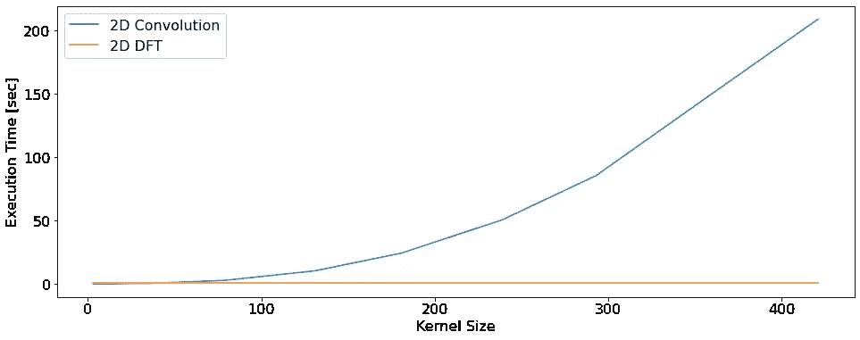

2D 卷积和 2D DFT 卷积的执行时间与内核大小。图像大小:550x550x1，批次:1，过滤器:1(作者)

正如您所料，2D 卷积的执行时间会随着内核大小的增加而增加。另一方面，无论滤波器大小如何，2D DFT 卷积在执行时间上是恒定的。这是因为滤镜被填充到图像的大小。如果过滤器越大，填充的值就越少。

现在让我们来看看调查结果中的差异。为此，我们在 720x720 像素的图像上应用大小为 3x3 的具有 8 个过滤器的内核。我们通过两种算法运行它，并计算绝对差的平均值和标准偏差。

```
convResult **=** CalcConv(image, filter)
dftResult **=** CalcDFT2D(image, filter)

error **=** tf**.**math**.**abs(convResult**-**dftResult)
mean = tf**.**math**.**reduce_mean(error)
std = tf**.**math**.**reduce_std(error)# Mean Absolute Error: 0.001560982083901763
# Standard deviation: 0.0015975720016285777
```

均值和标准差都很低。这种差异来自于数字的不准确性。当观察滤波后的图像和相应的振幅谱时，我们可以看到它们是不可区分的。

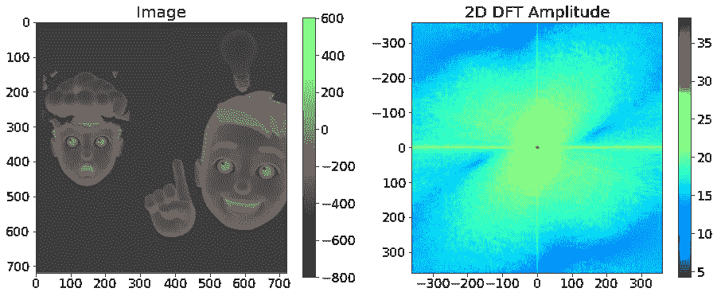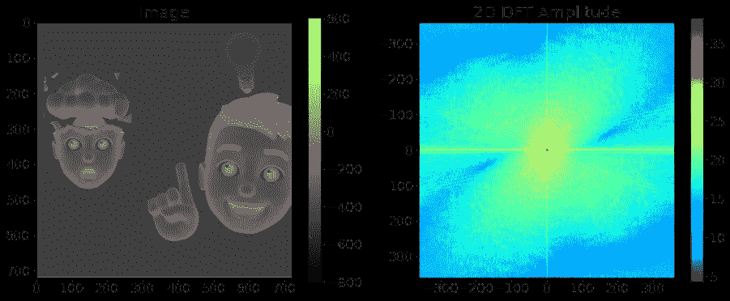

过滤图像和 2D 光谱的直接比较。(上)2D 线性卷积(下)2D DFT 卷积作者

# 结论

我们已经了解了卷积和 DFT 背后的数学基础，通过观察不同的光谱获得了一些直觉，查看了 TensorFlow 中的代码，并最终验证了结果的正确性。

设计在频域而不是空间域工作的层带来了新的机会，特别是对于大输入图像和大滤波器尺寸。绕过频域似乎有悖直觉，但实际上加快了计算速度。

# 进一步阅读和链接

[](https://github.com/sascha-kirch/ML_Notebooks/blob/main/2D_FFTs.ipynb) [## ML _ Notebooks/2D _ ffts . ipynb at main sascha-kir ch/ML _ Notebooks

### 机器学习相关笔记本合集分享。—ML _ Notebooks/2D _ ffts . ipynb at main…

github.com](https://github.com/sascha-kirch/ML_Notebooks/blob/main/2D_FFTs.ipynb) [](https://github.com/sascha-kirch/DeepSaki) [## GitHub - sascha-kirch/DeepSaki:可重用机器学习代码的集合，包括模型…

### 欢迎 AI enthuisiasts 来到 DeepSaki，这是一个可重用机器学习代码的集合。💪 🤖 🤘使用的 ML 框架是…

github.com](https://github.com/sascha-kirch/DeepSaki) [](https://pypi.org/project/DeepSaki/) [## 迪普萨基

### 欢迎 AI enthuisiasts 来到 DeepSaki，这是一个可重用机器学习代码的集合。:肌肉::机器人::金属:ML…

pypi.org](https://pypi.org/project/DeepSaki/)  [## 循环卷积与线性卷积:有什么区别？

### 什么是循环卷积，它与线性卷积有什么不同？卷积的定义和…

thewolfsound.com](https://thewolfsound.com/circular-vs-linear-convolution-whats-the-difference/)