# 用于数据科学和机器学习的免费云 CPU

> 原文：<https://towardsdatascience.com/free-cloud-cpus-for-data-science-and-machine-learning-e4a7fc13043e>

## *含电池。附带 Jupyter 笔记本和预装的 python 包*


卡斯帕·卡米尔·鲁宾在 [Unsplash](https://unsplash.com?utm_source=medium&utm_medium=referral) 上的照片

# 介绍

我们选择在本地机器上使用云 CPU 而不是 CPU 的原因有很多。

1.  CPU 工作负载:第一个也是最明显的优势是使用云 CPU 可以从本地机器上释放 CPU 工作负载。如果您的本地计算机中有一个旧的 CPU，这将是非常有益的。
2.  代码共享:使用托管在云中的 Jupyter 笔记本使得代码共享更加容易。只需将其公开并共享笔记本的 URL。
3.  存储:这些平台还为您的数据提供存储空间，这有助于释放本地机器中的存储空间。

在这篇文章中，我们将看看 3 个平台，它们为您的机器学习项目提供免费和无限制的 CPU 使用时间。

# 数据砖

Databricks 是数据科学家、分析师和工程师用于开发和部署 ETL 管道、机器学习模型和数据分析的数据科学、数据工程和机器学习平台。Databricks 提供免费的社区版帐户，您可以通过云托管的 Jupyter 笔记本(又名 Databricks 笔记本)获得自己的工作空间。要注册 Databricks 社区版:

1.  转到:[https://databricks.com/try-databricks](https://databricks.com/try-databricks)
2.  填写您的详细信息


作者图片

3.点击“社区版入门”


作者图片

4.验证您的电子邮件地址

**创建集群**

登录后，您将看到以下主页。我们需要一个活跃的集群来开始处理数据集。让我们创建一个。

1.  转到左侧面板，单击“计算”

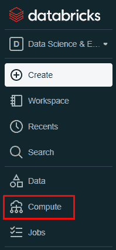

作者图片

2.点击“创建集群”

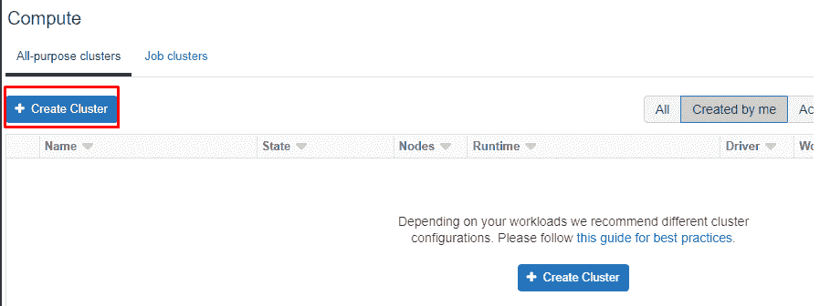

作者图片

3.为集群命名，选择 Databricks 运行时版本，然后单击“创建集群”

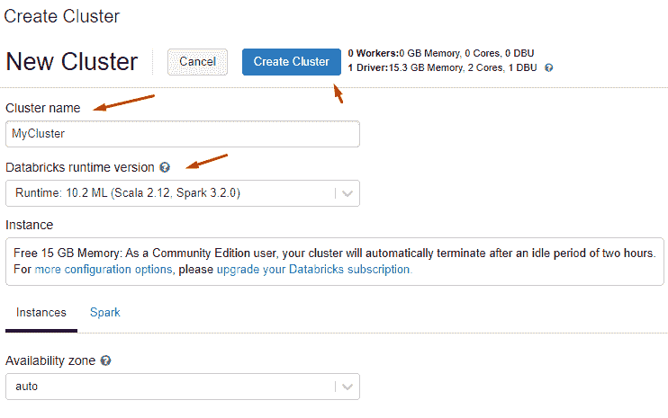

作者图片

Community edition 用户有权使用一个 15GB RAM 的驱动程序节点(2 个内核),而没有工作节点。Databricks ML 运行时支持 Scala、Spark (Pyspark)并预装了常用的数据科学 python 包，如 pandas、numpy、scikit-learn 等。

**上传数据**

1.  让我们以虹膜数据集为例。我们可以从 [UCI 资源库](https://archive.ics.uci.edu/ml/datasets/Iris)下载。
2.  提取 zip 文件。数据是 CSV 格式的。
3.  在 Databrick 的左侧面板上，单击“数据”选项卡

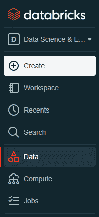

作者图片

4.要将 CSV 文件上传到 Databricks，请单击“上传文件”

5.浏览选择文件或简单地将其拖放到灰色框中

6.单击“在笔记本中创建表格”

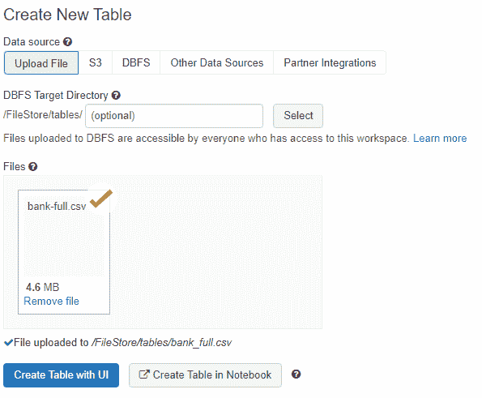

作者图片

7.在笔记本单元格中，将`infer_schema`和`first_row_is_header`更改为`True`，将`delimiter`更改为`;`

```
# File location and type
file_location = "/FileStore/tables/bank_full.csv"
file_type = "csv"# CSV options
infer_schema = "True" # change to True
first_row_is_header = "True" # change to True
delimiter = ";" # Change to ;# The applied options are for CSV files. For other file types, these will be ignored.
df = spark.read.format(file_type) \\
  .option("inferSchema", infer_schema) \\
  .option("header", first_row_is_header) \\
  .option("sep", delimiter) \\
  .load(file_location)
```

8.在最后一个单元格中，您可以使用变量`permanent_table_name`命名表格，并将数据帧`df`写入表格

```
permanent_table_name = "bank_marketing"
df.write.format("parquet").saveAsTable(permanent_table_name)
```

9.这将在左侧面板的`data`选项卡下创建一个新表

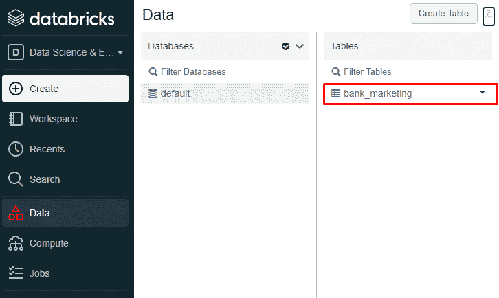

作者图片

10.现在，我们可以在新笔记本中使用该表。转到左侧选项卡中的`Create`并创建一个笔记本。给笔记本分配一个`Name`和`Cluster`


作者图片

11.将表格读入新笔记本

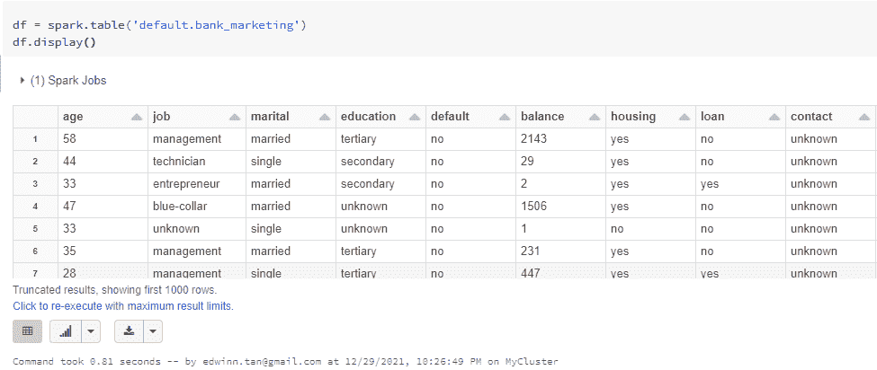

作者图片

**分享笔记本**

要共享笔记本，请点击笔记本右上角的`publish`按钮

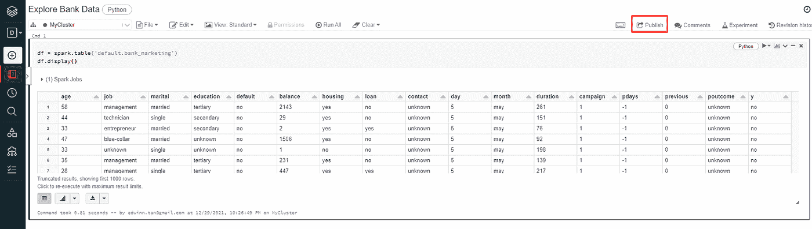

作者图片

# Google Colab

由 Google 支持的 Google Collaboratory 是一个 Jupyter 笔记本集成开发环境，可以使用无限的免费 CPU。它还配有有限的免费 [GPU 和 TPU](https://medium.com/@edwin.tan/free-gpus-for-training-your-deep-learning-models-c1ce47863350) 。你只需要一个谷歌账户就可以开始了。Google Colab 允许您将 Google Drive 安装为项目的存储文件夹，免费版本的 Google Drive 配有 15GB 的存储空间。

**如何使用 Google Colab？**

1.  转到[谷歌合作实验室](https://colab.research.google.com/)
2.  创建新笔记本
3.  要使用已经存储在 Google drive 中的数据，请单击左侧面板中的“安装驱动器”图标

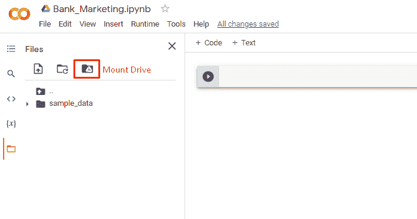

作者图片

4.安装驱动器后，我们会在目录中看到一个`drive`文件夹。这是你的 google drive 目录。

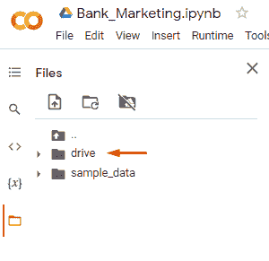

作者图片

5.阅读 csv 文件

```
import pandas as pd
df = pd.read_csv('/content/drive/path/to/data.csv')
```

**分享笔记本**

要共享笔记本，请点击笔记本右上角的`share`按钮。

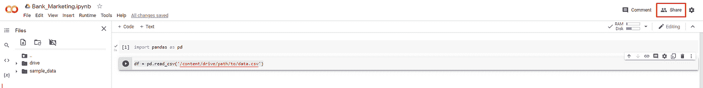

作者图片

# 卡格尔

Kaggle 提供 CPU 时间无限，GPU 时间有限的 Kaggle 笔记本。Kaggle 上有一个丰富的数据集库，你可以把它添加到你的 Kaggle 笔记本上开始使用。

如何使用 Kaggle 笔记本

1.  创建一个 Kaggle 帐户
2.  创建笔记本

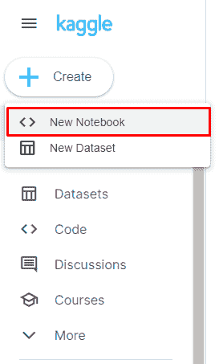

作者图片

3.使用`Add data`按钮选择一个数据集。我们可以上传自己的数据集或使用现有的 Kaggle 数据集。

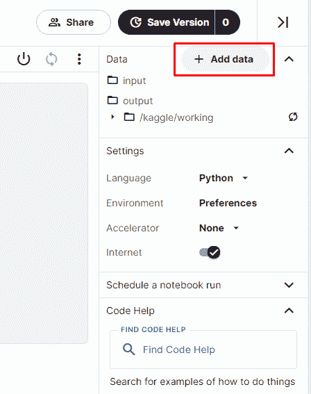

作者图片

**分享笔记本**

要共享笔记本，请单击右上角的`share`按钮，将笔记本公开。

# 结论

我们为云托管的 Jupyter 笔记本电脑探索了 3 种不同的选项，提供免费和无限制的 CPU 运行时间。这些平台提供 12GB-15GB 的 RAM，使其适合为中小型数据集训练经典机器学习模型。如果你正在训练深度学习模型，建议使用 GPU 而不是 CPU。查看我的另一篇关于[免费云 GPU 的文章，用于训练你的深度学习模型](https://medium.com/@edwin.tan/free-gpus-for-training-your-deep-learning-models-c1ce47863350)。