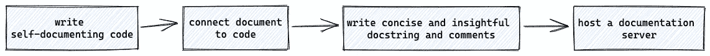
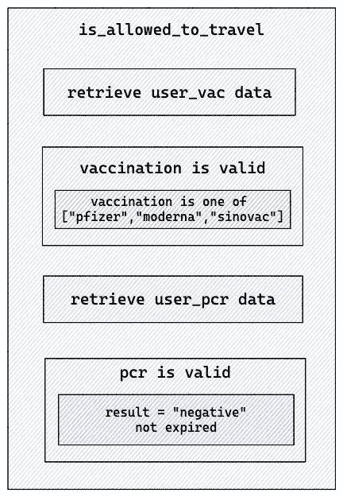
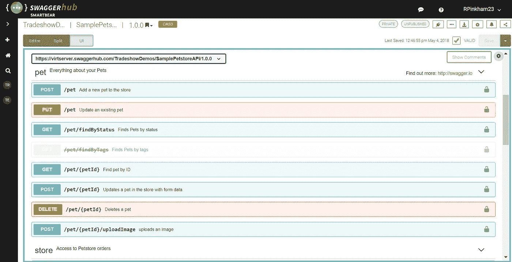

# 从厌恶到激情:如何用 Python 写文档

> 原文：<https://towardsdatascience.com/from-aversion-to-passion-how-to-write-documentation-in-python-fdfefde34ca9>

## 代码更多的是被阅读而不是被编写

帕特里克·托马索在 [Unsplash](https://unsplash.com/) 上的照片

到无论是谁在读这篇文章，你一定是世界上最关心文档的顶尖工程师之一:)。文档技术从来没有得到开发人员社区的足够重视。

为什么会有这种反感？嗯，写不难，写清楚很难。这适用于所有人，包括开发者。它需要我们组织自己的思想，并清晰地表达出来。通常，一个问题没有单一的解决方案，所以除了写下已经做了什么，我们还需要一个背后的基本原理。而如果你写得不好，只会适得其反。

但是对我来说，这种现象的主要原因是——没有文档不会阻止软件的功能。没有文档的蹩脚代码，只要还能用，还是会出货的。这就像是一笔科技债务，等待着一位先驱将其带到桌面上。对于快速增长的公司来说，它大多被搁置在积压订单的底部。

在这篇文章中，我不想说服你从今天开始处理那些过时的票。然而，我想告诉你一些小技巧，从项目一开始就让这个记录过程**变得更容易、更愉快**。你可以在你的下一个项目中运用它们，带着一个全新的思维和积极的记录态度。

作为这篇文章的范围，我将讨论记录你的源代码的 4 个步骤。自述文件或图表等一般项目文档不在此范围内。

创建 Python 文档的 4 个步骤

## 最简单的方法——不要记录任何东西

是的，你没看错。文档的一个大问题是，随着软件的发展，它们会过时。作为一个读者，如果你不断发现文档和代码之间的差异，你会在某个时候放弃阅读它。

这就是为什么自文档化代码的想法脱颖而出。Python 就是一个很好的例子。我想分享两个创建自文档化代码的技巧。

第一个技巧是尽可能多地跟随 Python 习语。Python 被设计成一种高度可读的语言。它更频繁地使用英语关键词，而其他语言使用标点符号。Python 确实带来了很多语法上的好处，所以代码 like 不需要注释。

如果你想更新你的 Python 习语的知识，看看这个 [Youtube 视频](https://www.youtube.com/watch?v=OSGv2VnC0go)和我的[以前关于写 Python 代码的文章](https://medium.com/p/208ec1513c49)。

使用正确的 Python 习语有助于读者理解代码的最底层。但是为了理解代码在做什么，有必要阅读每一行吗？

这个问题把我们带到了第二个技巧——创建概念模型，从上到下设计代码结构。我们先来看这个例子。

该功能根据乘客的疫苗接种记录和聚合酶链式反应测试检查其是否被允许旅行。尽管代码遵循了 Python 习语，但它却因为放入了太多的信息而让用户陷入了困境。代码可以重构为更清晰的格式。我们来读另一个版本。

很明显，这个版本的台词更多。但是用户关心的仅限于函数`is_allowed_to_travel()`,它本身读起来就像一个文档。用户可以决定是否要深入了解细节(例如，检查有效聚合酶链式反应测试的定义)。

如果我们将该功能分成几个逻辑单元，那将是—检索用户疫苗接种数据->验证用户疫苗接种记录->检索用户聚合酶链式反应测试数据->验证用户聚合酶链式反应测试。视觉表现是这样的:

逻辑表示(由[高](https://medium.com/u/2adc5a07e772?source=post_page-----fdfefde34ca9--------------------------------)创建)

每个蓝框可能包含低级逻辑单元。经验法则是**把你的顶层函数当作一个‘粘合函数’来缝合你的底层逻辑单元**。每个逻辑单元都是一个动作。

这给我们带来两个好处。第一，代码可读性更好，并且可以自我解释。第二，通过分离独立的逻辑单元，代码库更易于维护、重用和测试。每当引入新的疫苗接种时，我们只需要改变`VaccinationRecord`类，而不需要更新任何其他函数。这也被称为 [*关注点分离*](https://en.wikipedia.org/wiki/Separation_of_concerns) *—* 一种将程序分成不同部分的设计模式。

除了分离逻辑，这段代码还创建了几个概念模型，如`VaccinationRecord`、`PCRRecord`和`DBConnection`。每个模型管理其对象周围的属性和行为。我们正在逐渐进入面向对象编程的世界，在本文中我不会叙述太多。但总的来说，OOP 会把一个大问题分解成可解决的小块，这有助于开发者和用户解决或理解问题。

总之，遵循 Python 习语、分离逻辑单元和应用面向对象的设计提高了整体的可读性，从而将您从维护过时的文档中解放出来。

## 将文档链接到代码

编写自文档代码是一个很大的进步，但它不能解决所有的问题。这有点可悲，因为不是每个人都理解代码，因此开发人员必须用自然语言编写文档并保持更新。

问题是如何绑定文档和代码，使得一方的改变会影响另一方。我们寻求的解决方案是以下两种之一:

*   一个可以基于代码自动生成文档的框架。
*   一个可以基于文档自动生成代码的框架。

对于第一个场景，一个很好的例子是自动生成 [Swagger](https://swagger.io/) ，这是一组围绕 OpenAPI 规范构建的工具，可以帮助您设计、构建和记录 REST API。许多现有的 Python API 框架如 [FastAPI](https://fastapi.tiangolo.com/features/#automatic-docs) 和 [connexion](https://connexion.readthedocs.io/en/latest/quickstart.html#the-swagger-ui-console) 都支持自动生成 Swagger UI，它描述了你的整个 API，包括端点、参数、认证等。它完全依赖于实际的实现，所以不需要注释或 docstring。

来源:[https://swagger.io/tools/swagger-ui/](https://swagger.io/tools/swagger-ui/)

每次更改 API 设计时，Swagger UI 都会更新。所以开发者不需要担心它的新鲜度。

另一方面，第二个场景引入了一种不同的工作方式，在这种方式中，文档是预先创建的。在敏捷软件开发中，这个过程被称为[行为驱动设计](https://en.wikipedia.org/wiki/Behavior-driven_development)(BDD)——一个鼓励软件项目中开发者和企业之间协作的过程。与传统的软件开发不同，BDD 要求开发人员在编码前用结构化的自然语言列出需求。

这种语言被称为小黄瓜，它允许用消费者能够理解的逻辑语言来描述预期的软件行为。在 Python 中， [pytest-bdd](https://pypi.org/project/pytest-bdd/) 实现了 Gehkerin 语言，以支持自动化项目需求测试并促进 bdd。

让我们在 pytest-bdd 中实现上面的例子。开发者首先用 Gherkin 语言描述预期的行为，给出关键字*, When，Then。*

特征文件中的示例

*   *给定*描述了测试前的前提条件和初始状态——乘客的情况。
*   *当*描述动作时——检查乘客。
*   *然后*描述动作的结果——乘客被允许/不被允许。

第二步是为每个语句创建一个测试函数。这是整合发生的地方。该测试将文档与代码连接起来，并确保一方的逻辑变化会影响另一方。

测试代码示例

对于特征文件中的每个语句，必须创建一个测试函数。Python 文件中的文本必须逐字符匹配特征文件。它的主要优点是确保文档的新鲜性和正确性。

我使用 pytest-bdd 大约有 2.5 年了。我发现它在协作主要发生在开发人员和非开发人员之间的环境中非常有用。协作的价值在于最初的头脑风暴会议，而不在于开发人员不断向不同的利益相关者解释事情应该如何运作的后续会议。利益相关者可能会感谢工程师的支持，但在我看来，这是一种浪费的合作，因为时间不是花在创造新东西上，而是花在解释现有东西应该如何工作上。

BDD 的方法鼓励多个涉众在最初的集思广益阶段进行高质量的合作。结果(也称为特征文件)成为程序的输入和商业用户的阅读材料。这将减少不必要的会议。

在本节中，我们看到了集成文档和代码的两种不同方式。目标是确保它的新鲜性和正确性，从而提高开发者和用户之间的协作效率。

## Docstring v.s .注释

尽管 BDD 在开发过程中很有帮助，但它的主要目标受众是非技术用户。对于为开发人员设计的程序，编写特征文件可能是一项开销。开发人员通常更喜欢在他们的代码上记录和注释。

在我们深入之前，我们需要区分文档和注释。一般来说，文档向用户描述功能，而注释向维护人员和开发人员描述代码。

根据维基百科的说法，评论有多种用途:

*   规划和评审:在编写实际代码之前，编写伪代码来概述意图。应该在实现完成后删除它。
*   代码描述:总结代码，说明程序员的意图。注意，这可能是代码应该被重构和自我解释的标志。
*   基本原理:解释选择一种技术或算法的原因。
*   标签:添加代码标签，如 TODO、BUG、FIXME。它们也许可以被 IDE 工具搜索到，比如 vscode 中的 [Todo Tree。](https://marketplace.visualstudio.com/items?itemName=Gruntfuggly.todo-tree)

除了 [PEP8](https://pep8.org/#maximum-line-length) 中定义的 72 个字符的最大长度外，评论的格式没有太多限制。另一方面，docstring 有自己的约定，在 [PEP 257](https://www.python.org/dev/peps/pep-0257/) 中有描述。Docstring 可以进一步分为三类:

*   类文档字符串
*   包和模块文档字符串
*   脚本文档字符串

许多 Python 包中使用了一些众所周知的 docstring 格式。选择哪种格式并不重要，但是在整个项目中应该坚持使用相同的格式。

*   [reStructuredText](https://docutils.sourceforge.io/rst.html) :官方 Python 文档标准。这是一种非常丰富的格式，不仅适用于 docstring，还广泛用作文档化的 Markdown 格式。

重构文本的一个例子

*   Google docstrings : Google 推荐的文档格式。这也是我最喜欢的格式。

Google docstring 的一个例子

*   Numpy docstring: NumPy 的 reStructuredText 和 Google Docstrings 的组合。

Numpy docstring 的示例

可以使用类似于 [Pyment](https://github.com/dadadel/pyment) 的工具来自动生成 docstring 或将 docstring 从一种格式转换成另一种格式。像 [autoDocstring](https://marketplace.visualstudio.com/items?itemName=njpwerner.autodocstring) 这样的 Vscode 扩展也能够使用简单的快捷方式创建一个 Docstring 结构。

99%的软件和软件包都有 docstring 和注释，而不管其他格式的文档。一般来说，docstring 和 comments 应该保持简洁，以便于维护，但仍然要足够详细，以便新用户理解如何使用该对象。

## Python 文档服务器

最后一步是在 web 服务器上发布 docstring，并使用户可以访问它。因此，用户能够在实际下载软件包之前理解如何使用它。有一些现有的工具可以基于文档字符串自动生成 HTML 文档。

*   sphinx :迄今为止最全面的文档生成器。它最初是为 Python 创建的，现在已经将其功能扩展到了多种语言。它读取 reStructuredText 中的 docstring 并生成 HTML 输出。大多数著名的 Python 包都使用它来生成文档，如 [Flask](https://flask.palletsprojects.com/en/2.0.x/) 、 [Pytest](https://docs.pytest.org/en/7.0.x/) 、 [Jinja](https://jinja.palletsprojects.com/en/3.0.x/) 等。但是老实说，假设你在一个新的项目上工作，设置需要一些努力。
*   pdoc :一个轻量级的文档生成器。它比 sphinx 更简单，因为它不需要任何配置。适合小型项目。但是与 sphinx 相比，它的定制选项较少，因此不适合大型项目。
*   [Doxygen](https://www.doxygen.nl/index.html) :另一个支持多种编程语言的文档工具。但是它在 Python 社区中不如 Sphinx 受欢迎，因为它主要不是为 Python 设计的，而且外观不如 Sphinx 好看。

他们产生的输出是 HTML 页面。您可以使用额外的工具，如[Read Docs](https://docs.readthedocs.io/en/stable/tutorial/)来托管这些静态文件，并将其公之于众。

## 结论

我们已经讨论了一些技术来使文档化过程变得更加容易和愉快。

编写自我文档化的代码是每个开发人员都应该做的事情。它保持了代码库的整洁，更容易维护和共鸣。Python 开发者应该利用 Python 的语法优势。

使用像 FastAPI 或 pytest-bdd 这样的框架来集成文档和代码。一方的逻辑变化会自动影响另一方，这样我们就可以避免过时的文档。

但是不可避免的是，随着程序变大或公开，开发人员将花费时间为用户和共同维护者编写 docstring 和注释。其目的是告知他人如何使用该物品或故意选择背后的理由。对于新用户来说，重要的是要保持文字简洁，但也要有足够的信息量。

最后但同样重要的是，您希望发布 docstring 以获得更多的读者。Sphinx 和 pydoc 等工具生成静态 HTML 页面，这些页面可以在 Nginx 等 web 服务器上托管并读取文档。

文档不仅仅是为了它而创建的。开发人员必须确保文档是在创造价值，而不是迷惑用户。我希望这篇文章能在一定程度上消除你对文档的厌恶。如果你有更多的建议，请在下面评论并告诉我们。

## 参考

<https://kislayverma.com/programming/how-to-write-self-documenting-code/>   