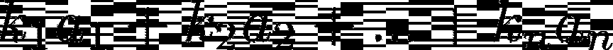
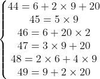
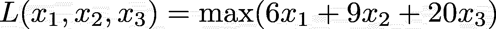
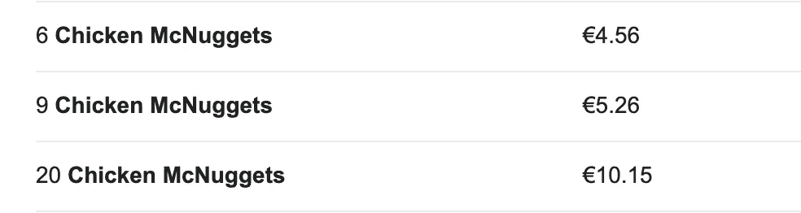
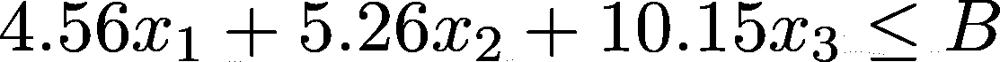

# 从麦乐鸡到数据科学，使用 Python

> 原文：<https://towardsdatascience.com/from-chicken-mcnuggets-to-data-science-using-python-78bd525338e2>

梅根·赫斯勒在 [Unsplash](https://unsplash.com/s/photos/mcdonalds?utm_source=unsplash&utm_medium=referral&utm_content=creditCopyText) 上拍摄的照片

## 你的麦当劳订单将永远不会相同

> "你在麦当劳点过 43 块麦乐鸡吗？"

当我第一次听到这个故事时，我完全惊呆了，但事实上，麦乐鸡有一个数学故事，而且非常有趣。

原来你只有几盒 **6** 、 **9** 和 **20** 麦乐鸡。当数学家亨利·皮乔托和他的儿子一起吃饭时，他开始思考他可以用这三个值的组合订购的实际数字。这个数字被称为****。****

**我们将从给出我们正在考虑的离散域的深度细节开始，并最终解决关于它的一个**优化问题。** 我们开始吧！**

# **1.数学问题**

**我们试图解决的数学问题被称为[**硬币问题**](https://en.wikipedia.org/wiki/Coin_problem) **。这个问题最一般的表述如下:****

**给定 a1，a2，一个正整数，使得 [gcd](https://en.wikipedia.org/wiki/Greatest_common_divisor) ( *a* 1， *a* 2，…，*a*)= 1，我们要找出不能表示为这个数的圆锥组合的最大数，也就是说:**

****

**我用 LaTeX2png.com 制作的图像**

**其中 k1、k2 和 kn 为非负整数。那我们的数字是多少？嗯……其实是 **43** 。**

**有几种方法可以找到这个结果，但我觉得下面的方法更直观。**

**我们有以下结果:**

****

**我用 LaTeX2png.com 制作的图像**

**对于所有大于 49 的值，我们可以简单地从这 5 个数字开始，加上 6 的倍数。让我们证明这一点:**

**给定一个数(大于 50)，这个函数给出你需要给 44 到 49 中的一个数加多少个 6。例如，82 是 46+6x6= 6+2x20+6x6=7x6+2x20**

**很好，但是所有的数字都是真的吗？**是的，的确是**。这是一个从 50 到 1000 的例子:**

**好，我们知道不会有大于 43 的麦乐鸡数量。但是 43 是不是我们不能通过组合 6、9 和 20 个麦乐鸡创造出的最大数字呢？**

**我们来证明一下。**

> ****注意！**我确信有比我即将提出的方法计算量更低的方法。尽管如此，由于我们只考虑了最多 43 个麦乐鸡，代码运行速度非常快，不需要任何优化。**

**我们基本上想做一个超级简单的**网格搜索**，搜索所有我们可以选择的可能数量的盒子。**

**给定一个特定的数量，我们能做的第一件事就是找出只使用一个盒子可以订购的麦乐鸡的最大数量，而不超过这个数量**。我用一个例子来解释最后一句话:****

**假设我们想点 23 份麦乐鸡。我们知道，考虑 20x2、9x3 或 6x4 的麦乐鸡块进行网格搜索是没有意义的，因为如果我们考虑 4 盒 6 个麦乐鸡块，我们会得到 24 个，这大于 23，同样的推理适用于 20 和 9。**

**因此，根据您想要订购的麦乐鸡数量，我们希望找到 6 盒、9 盒和 20 盒的合理范围。然后我们将进行网格搜索，看看我们想要查找的值是否在网格中。要做到这一切，只需运行以下代码:**

**这里有一个例子:**

****而且，正如你可能看到的，43 是你不能点的麦乐鸡数量:(****

**让我们来看看你不能点的麦乐鸡的清单:**

**而且可以看到， **43 是最大的一个。****

# **2.让我们来谈谈数据科学**

****我觉得这个问题超级酷**。这个整数域的特殊性质是，它不遵循我们在处理连续数时习惯遵循的直觉推理。**

**如果你有三个整数，前面的系数可以是连续的，你实际上是在玩实定义域。当你强迫系数为整数时，你会得到一个充满“漏洞”的定义域。**

**但是如果我们想解决这个问题，在这个领域:**

> **“我想尽可能多地吃麦乐鸡，用有限的预算，只用 6 块、9 块或 20 块麦乐鸡做成的盒子”。**

**最后，我们考虑一个**离散线性优化问题。****

**我们使用术语“优化”来表示我们:**

*   **想要**最大化**某事:那是我们的麦乐鸡数量，**
*   **我们的预算有一些限制**
*   **我们模型中的一切都是线性的**
*   **你不能订购 3.14 盒麦乐鸡，所以这实际上是一个**离散的**问题**

**我们希望最大化的功能如下:**

****

**x1，x2 和 x3 是你订购的 6，9 和 20 个盒子的数量，图片是我用 LaTeX2png.com 制作的**

**现在我们知道下面的麦乐鸡是这样的:**

****

**作者图片**

**因此约束变成:**

****

**我用 LaTeX2png.com 制作的图像**

**为了解决这个问题，我们使用了一个名为****的库。** 最后你会知道，给定你的投入预算:****

****A.**你要吃多少块麦乐鸡**(例如 55 块麦乐鸡)
B. **你要吃多少块麦乐鸡**(例如一个 6 盒、两个 20 盒和一个 9 盒)****

****重要的是要说**这是最优解。这意味着给定一定的预算，你不能吃得比这个多。很酷吧？:)******

****下面是实现这一点的代码:****

1.  ******安装库:******

****2.**定义问题:******

****3.您的最佳订单已经准备好了！****

******例如，如果你有 30 欧元，你可以订购 52 块麦乐鸡，订购 2 盒 20 块麦乐鸡和 2 盒 6 块麦乐鸡。这是你用 30 块钱最多能吃多少麦乐鸡:)******

****这是**沙克**的普通午餐:****

> ******注意！优化是一个巨大的领域，尽管我非常了解基本概念，但我远不是这个领域的专家。更多请阅读[这里](https://en.wikipedia.org/wiki/Linear_programming)，这里[这里](/linear-programming-for-data-scientists-e9cf1ddf1331)或者[这里](https://towardsdatascience.com/tagged/linear-programming)。******

# ****3.结论****

****线性(离散)优化是如此有趣。我们倾向于认为线性模型是一个特殊且非常具体的领域，大部分时间都远离现实世界的问题。我希望我用这个有趣的例子向你们展示了，大多数时候，情况恰恰相反:)****

****如果你喜欢这篇文章，你想知道更多关于机器学习的知识，或者你只是想问我一些你可以问的问题:****

****A.在 [**Linkedin**](https://www.linkedin.com/in/pieropaialunga/) 上关注我，在那里我发布我所有的故事
B .订阅我的 [**简讯**](https://piero-paialunga.medium.com/subscribe) 。这会让你了解新的故事，并给你机会发短信给我，让我收到你所有的更正或疑问。
C .成为 [**推荐会员**](https://piero-paialunga.medium.com/membership) ，这样你就不会有任何“本月最大数量的故事”，你可以阅读我(以及成千上万其他机器学习和数据科学顶级作家)写的任何关于最新可用技术的文章。****