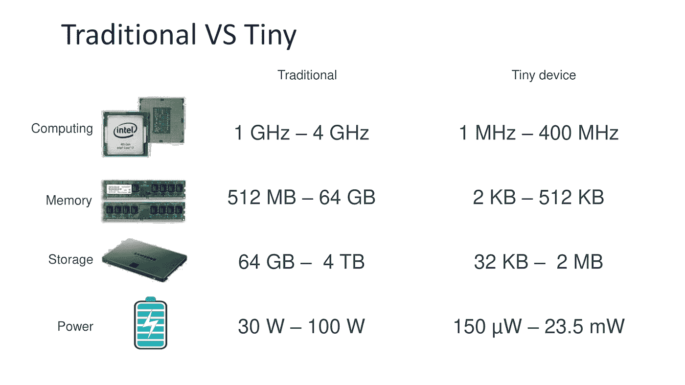
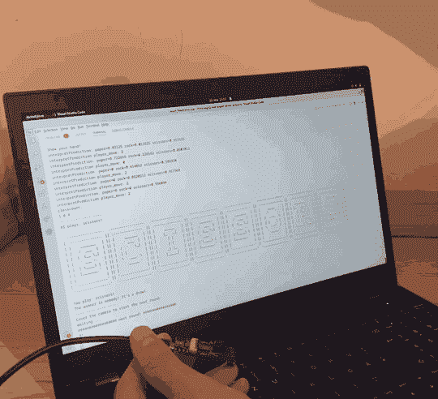
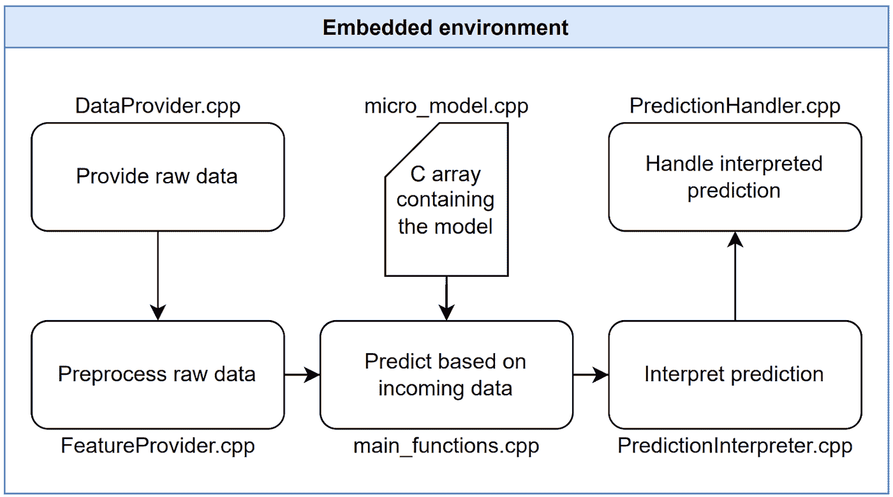
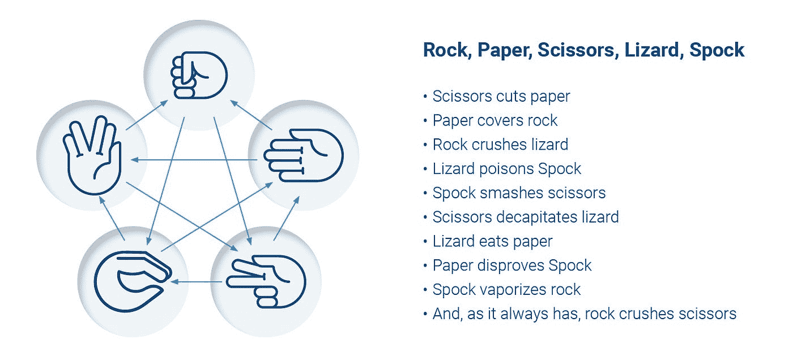

# 从数据科学到碳足迹合规:探索 TinyML 的世界

> 原文：<https://towardsdatascience.com/from-data-science-to-carbon-footprint-compliance-discover-the-world-of-tinyml-ae06418e6672>

## **使用 TensorFlow Lite Micro**

图由 itemis AG，[https://info . item is . com/IOT-systems/download-tinyml-rock-paper-scissors-dataset/](https://info.itemis.com/iot-systems/download-tinyml-rock-paper-scissors-dataset/)(经许可)

*合著* [*尼古拉·里德*](https://www.linkedin.com/in/nikolasrieder/) *和* [*拉斐尔·塔佩大师*](https://www.linkedin.com/in/rafael-tappe-maestro/) *。*

# 摘要

你想扩展你在人工智能方面的专业领域，并想探索一种更节能的机器学习(ML)方法。本文将向您介绍微控制器上的 ML(MCU)，也称为微型机器学习(TinyML)。准备好在剪刀石头布上输给 MCU 吧。您将涉及数据收集和预处理、模型设计以及如何让您的模型在 MCU 上运行。我们的例子为您提供了自始至终完成您自己的 TinyML 项目所需的一切。

# 什么是 MCU

MCU 代表微控制器单元。MCU 具有连接到各种输入和输出引脚的弱处理器。与你的电脑不同，MCU 没有完整的操作系统，一次只能处理几个进程。MCU 还具有少量内存和 RAM。

对于我们的项目，来自 Espressif 的 ESP-EYE 板是理想的。该板将 ESP32 微控制器与已经连接的摄像头捆绑在一起，为我们节省了一些工作。

# 我为什么要在乎 TinyML？

像 DeepMind 和 OpenAI 这样的科技公司凭借专家和 GPU 的力量主导了 ML 领域。特别是自然语言处理(NLP)中的模型，如 GPT-3，需要几天的时间来并行使用几十个高性能 GPU 进行完整的训练周期。这伴随着高能耗，并且随着 NLP 模型每年进一步增长，它们对能量的需求也在增长。开发成本是单个训练周期的数倍，并且需要额外的计算时间来优化超参数。TinyML 通过变小来扭转局面。由于内存限制，大型人工智能模型不适合微控制器。下图显示了硬件要求之间的差异。

图由 itemis AG，[https://app.hubspot.com/documents/761475/view/277264732?accessId=dc8033](https://app.hubspot.com/documents/761475/view/277264732?accessId=dc8033)

与在云中使用人工智能服务相比，MCU 上的 ML 提供了哪些优势？我们发现您可能希望使用 TinyML 的七个主要原因。

成本
购买和运行微控制器都很便宜。

**环保** 在微控制器上运行 AI 几乎不消耗能源。

**集成** 微控制器可以轻松集成到现有环境中，例如生产线。

**隐私和安全** 数据可以在本地设备上处理。数据不一定要通过互联网发送。

**快速原型** TinyML 使您能够在短时间内开发出概念验证解决方案。

**自主可靠** 微型设备可以在任何地方使用，甚至在没有基础设施的时候。

**实时** 数据在微控制器上无延迟处理。唯一的限制是 MCU 的处理速度。

你可能想知道这些点有多大，尤其是在能源消耗方面。本地加工真的这么重要吗？甚至一个谷歌搜索消耗的能量相当于给一个 60 W 的灯泡供电 17 秒。TinyML 的有效性被 Siri、Google Assistant 和 Alexa 等语音助手所利用，其中唤醒词识别在本地进行。最近，iOS 上的听写功能也可以在本地将语音转录为文本。那是 TinyML 在行动。从更大的角度来看，随着更多智能设备的上线，TinyML 是不可避免的。产生、共享、消费或存储的数据量呈指数级增长。2010 年，这一数字达到了 2 千兆字节(ZB)，预计到 2025 年将增长到 181 千兆字节。TinyML 正好符合全球可持续发展的努力。

# 石头剪刀布

作者提供的数据

你曾经在石头、布、剪刀和人工智能的比赛中输过吗？还是想通过打败一个 AI 来打动朋友？您将使用 TinyML 与 ESP-EYE 板进行游戏。这个用例很好地概述了 TinyML 的功能。开发的模型使用卷积层，因此您将了解在 TensorFlow Lite Micro 中使用卷积层的复杂性。您也可以调整我们的项目来识别您的猫！这个项目也将展示 TinyML 在准确性方面的局限性。你需要采取五个步骤来实现你的项目。以下部分提供了必要步骤的高级概述。如果您想更深入地了解一下，请查看我们项目库中的文档。它解释了漂亮的细节。

# 收集数据

收集好的数据是 ML 的关键部分。为了让事情运转起来，你需要拍摄你的手形成石头、布、剪刀手势的图像。越独特的图像越好。人工智能将学习你的手可以在不同的角度，位置或灯光变化。数据集包含记录的图像和每个图像的标签。

最好使用同样的传感器和环境来运行你的人工智能，也用来训练它。这将确保模型熟悉传入的数据。例如，考虑温度传感器，由于制造差异，对于相同的温度具有不同的电压输出。就我们的目的而言，这意味着用 ESP-EYE 摄像机在统一的背景上记录图像是理想的。在部署期间，人工智能将在类似的背景下工作得最好。你也可以用网络摄像头记录图像，但可能会损失一些准确性。由于单片机的能力有限，我们记录和处理 96×96 像素的灰度图像。收集数据后，我们将数据分为训练集和测试集。

作者照片

按照上面的步骤，你收集的图像应该看起来像这样。如果你现在不想收集数据，你可以在这里下载我们现成的数据集[。](https://info.itemis.com/iot-systems/download-tinyml-rock-paper-scissors-dataset/)

# 预处理数据

在我们的数据集中，我们使用 ESP-EYE 和网络摄像头记录图像。由于 ESP-EYE 可以捕获分辨率为 96×96 的灰度图像，所以我们不需要在这里做进一步的处理。然而，我们需要将网络摄像头图像缩小并裁剪为 96×96 像素，并将它们从 RGB 转换为灰度格式。最后，我们归一化所有的图像。下面，你看到我们处理的中间步骤。

作者照片

# 设计一个模型

由于我们正在处理图像处理，卷积层对我们的模型至关重要。因为 MCU 上的内存非常有限，所以我们不能使用深度架构。即使是为边缘设备设计的型号，如 [MobileNet](https://keras.io/api/applications/mobilenet/) 及其后继产品也太大了。因此，我们的模型依赖于三个卷积层模块，包括卷积、批量归一化和最大池。用 L2 和 L1 正则化来正则化卷积层，以减少过拟合。通常，我们使用 ReLU 激活。

在第三卷积块之后使用 9 个神经元的密集层。最后，是一个密集的 softmax 层。

# 超参数

我们使用[随机搜索](https://keras.io/api/keras_tuner/tuners/random/)来调整超参数。与其他超参数优化方法相比，随机搜索易于实现、理解、并行化，并且搜索可以随时停止和恢复。使用随机搜索，我们为 100 个模型训练了 20 个时期，每个时期的挂钟持续时间为 10 小时。一个有趣的结果是 SGD 优化优于 Adam。我们知道，亵渎。搜索还应用于正则化参数、卷积滤波器的数量、内核大小和步幅以及学习速率。

# 转换模型

在训练我们的模型之后，我们获得了张量流格式的 AI 模型。因为 ESP-EYE 不能解释这种格式，我们将模型转换成微处理器可读的格式。我们从转换成 TfLite 模型开始。TfLite 是一种更紧凑的 TensorFlow 格式，它使用量化来减小模型的大小。TfLite 通常用于世界各地的边缘设备，如智能手机或平板电脑。最后一步是将 TfLite 模型转换为 [C](https://en.wikipedia.org/wiki/C_(programming_language)) 数组，因为微控制器不能直接解释 TfLite。

# 嵌入式环境

在本节中，我们将讨论在 MCU 上运行的代码。你可能知道微控制器通常是用 C/C++编程的。嗯，有 [MicroPython](https://micropython.org/) ，但那是另一个故事了。在继续之前，你至少应该对 C/C++有一个基本的了解。有大量有用的教程和初学者指南，可以学习一些人称之为所有编程语言之母的东西。

让我们看看在 MCU 上会发生什么。在下图中，您可以看到我们代码的结构。我们从读取相机传感器的原始数据开始，稍后我们可以将这些数据提供给模型。然后，我们将用于训练数据的相同预处理应用于输入的原始数据。之后，我们将预处理后的数据传输到主函数，在这个函数中，预测由 [TensorFlow Lite Micro](https://www.tensorflow.org/lite/microcontrollers) 库完成。由于我们使用 softmax 层，最大概率是给定图像的预测类。为了提高准确性，我们在短时间内拍摄 5 幅图像，以进行整体预测。最后一步是模型自己采取行动。

作者提供的数据

为了充分理解 C/C++方面发生了什么，我们建议您看一下代码。为此，我们想给你指出正确的方向。由于 C++程序是从 main.cpp 文件开始的，所以这可能是您希望所有内容都集中在一起的地方。但是，您应该查看 main_functions.cpp 及其循环函数。该功能在无限循环中执行，也称为[超级循环](https://stackoverflow.com/questions/44429456/what-is-super-loop-in-embedded-c-programming-language)，不断重复上图中的步骤。

# 部署模型

现在我们可以将我们的模型部署到微处理器上。在我们构建(编译)和刷新 C++程序之前，我们需要放置新的 C 数组，它将我们的模型编码到目标文件 micro_model.cpp 中。替换 C 数组的内容，不要忘记替换数组长度变量 micro_model_len。我们提供了脚本 model_to_mcu.py 来简化这个过程。就是这样！

# 结论

通过这篇文章，我们希望为您带来机器学习的新视角。大数据、云部署和昂贵的培训并不是数据科学的唯一发展方向。TinyML 减少了 AI 模型的碳足迹，并搭建了一座通往嵌入式系统和物联网世界的桥梁。边缘计算启发我们提出比云或桌面 PC 更自然的人工智能部署。TinyML 并非没有挑战，例如 C 和 C++的流行以及 TensorFlow Lite Micro 与经典 TensorFlow 相比的功能不完整性。

# 展开示例

挑战一下怎么样？人生的新目标？想打动老朋友还是找新朋友？通过添加蜥蜴和斯波克，将石头、剪子、布带到下一个级别。你的 AI 朋友将会是一个更接近统治世界的技能。嗯，首先你应该看看我们的石头、布、剪刀[库](https://github.com/itemis/tflite-esp-rock-paper-scissors)并且能够复制上面的步骤。自述文件将帮助您了解详细信息。下图解释了扩展游戏的规则。你需要添加两个额外的手势和一些新的输赢条件。

照片由 itemis AG，[https://info . item is . com/IOT-systems/download-tinyml-rock-paper-scissors-dataset/](https://info.itemis.com/iot-systems/download-tinyml-rock-paper-scissors-dataset/)

# 开始你自己的项目

如果你喜欢这篇文章，并想开始自己的项目，我们为你提供了一个项目模板，使用相同的简单管道作为我们的石头，布，剪刀项目。你可以在这里找到模板。不要犹豫，通过社交媒体向我们展示你的项目。我们很好奇你能创造什么！

你可以在这里和那里[找到更多关于 TinyML](https://tinymlbook.files.wordpress.com/2020/01/tflite_micro_preview.pdf) [的信息。皮特·沃顿的书是一个很好的资源。](https://info.itemis.com/en/webinar/tinyai-tinyml-for-iot?utm_campaign=IoT%20Webinar&utm_source=Corporate%20Website&utm_medium=news_module&utm_term=en)

# 参考

*   谷歌搜索的能源成本。访问时间:2022 年 10 月 26 日。
    [https://business . direct energy . com/blog/2017/11 月/powering-a-google-search](https://business.directenergy.com/blog/2017/november/powering-a-google-search)
*   创建数据的增长。访问时间:2022 年 10 月 26 日。
    [https://www . statista . com/statistics/871513/world wide-data-created/](https://www.statista.com/statistics/871513/worldwide-data-created/)