# 从图 ML 到深度关系学习

> 原文：<https://towardsdatascience.com/from-graph-ml-to-deep-relational-learning-f07a0dddda89>

## 走向[深度关系学习](https://medium.com/tag/deep-relational-learning)

## [*整合神经网络*](/what-is-neural-symbolic-integration-d5c6267dfdb0) *与* [*关系学习*](/what-is-relational-machine-learning-afbe4a9c4231) *以达到超越当前状态的结构化深度学习模型，如图神经网络*

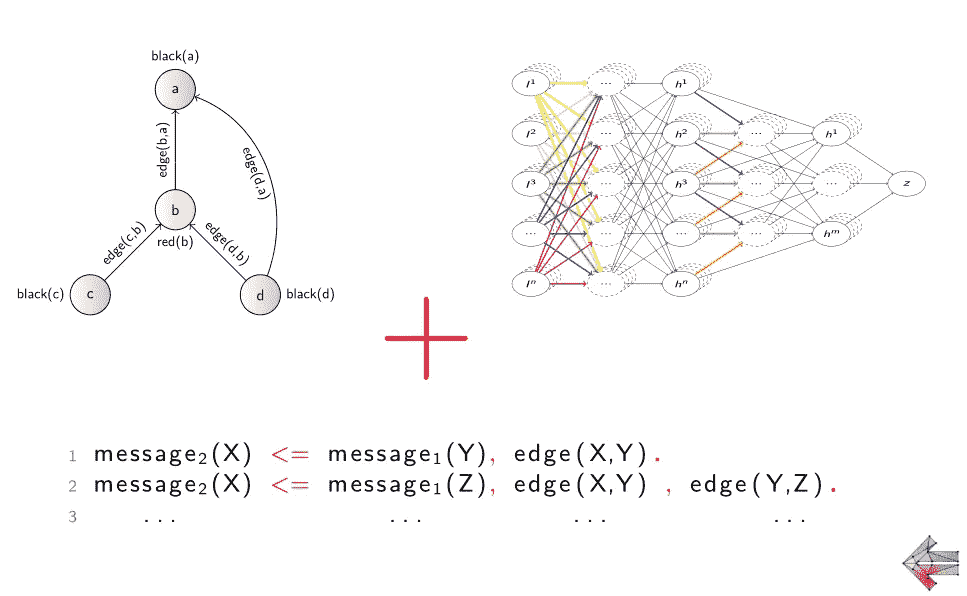

深度关系学习旨在使**神经网络**能够进行 [**关系学习**](https://medium.com/@sir.gustav/what-is-relational-machine-learning-afbe4a9c4231) ，即捕捉像关系逻辑(程序)的语言一样有表现力的学习表示。图片由作者提供。

图形结构化数据无处不在。随着最近深度学习的出现，研究人员开始用神经网络探索这种数据表示似乎是很自然的。目前，我们经历了*图形神经网络**【GNN】*类的爆炸，无数的[模型](https://github.com/thunlp/GNNPapers#basic-models)以各种(吸引人的)名字被提出。然而，这些模型中的大多数都是基于相同的简单图形传播原理。

为了从更广阔的视角来看待这个问题，我们将在这里从 [*关系机器学习*](https://link.springer.com/referenceworkentry/10.1007%2F978-0-387-30164-8_719) 的一般视角来揭示潜在的 GNN 原则，这一点我们在[上一篇文章](https://medium.com/@sir.gustav/what-is-relational-machine-learning-afbe4a9c4231)中讨论过。

*   与(主要)经验驱动的深度学习相反，关系机器学习在很大程度上建立在*关系逻辑*的形式语言上，而反过来又提供了一些用于表示和操作结构化数据的坚实原则，如各种*集合、图表和关系数据库*。

在这篇文章中，我们将探索一种优雅的方式来连接*关系学习*和 [*神经网络*](/what-is-neural-symbolic-integration-d5c6267dfdb0) 。这将允许我们以一种非常*透明*的方式优雅地捕捉 GNN 模型，允许随后将[推广到超越其当前状态](https://arxiv.org/abs/2007.06286)的 [***深度关系学习***](https://medium.com/towards-data-science/beyond-graph-neural-networks-with-pyneuralogic-c1e6502c46f7) 。

# 神经网络关系学习简史

虽然对于我们许多人来说，最近 GNNs 的普及可能是我们第一次遇到从结构化数据中学习的，但实际上已经有很长一段时间的研究旨在将机器学习模型外推至这些数据表示。

在 [*关系学习*](https://link.springer.com/referenceworkentry/10.1007%2F978-0-387-30164-8_719) 的保护伞下，这个问题已经被根植于*关系逻辑*及其概率扩展的方法统治了几十年，这些方法被称为 [*统计关系学习*](https://link.springer.com/referenceworkentry/10.1007%2F978-0-387-30164-8_786) (SRL)。

然而，神经网络提供了高效的*潜在表示学习*，这超出了逻辑系统的能力。这里，不是将符号视为独立的原子对象，而是引入了学习*嵌入的思想，即(离散)符号对象的分布式固定大小数值(向量)表示。*

*   *它可以追溯到线性关系嵌入[2]，随后的论文提出了不同的模式来改善学习并将符号的嵌入扩展到它们的组合中。这个工作流还包括现在广泛流行的“word 2 vec”[3]。*

*学习结构的嵌入，如*树*，然后追溯到递归自联想记忆【4】。在这些作品中,(逻辑)关系的表示通常作为对象对(嵌入)之间的相似性度量来处理，例如通过张量来参数化。这种方法后来成为流行的*递归神经网络*【6】。*

*与此同时，关系学习社区也提出了各种修改，以使经典神经网络适应关系(逻辑)表示。在很大程度上本着 SRL 的精神，这里宣布的模型目标是正确地组合*选择*和*聚集*偏差，即学习如何选择关系模式以及如何同时从它们中聚集信息。*

*   *仅考虑这里的*聚合*设置对应于“[多实例学习](https://link.springer.com/referenceworkentry/10.1007/978-0-387-30164-8_569)”，即从(独立的)样本集学习，这也在关系学习社区中提出[8]。最近，类似的模型也随着“*深集*”[7]和类似的架构而复活。*

*这种 SRL 观点激发了“*关系神经网络*”[9]——一种基于特定关系数据库模式的结构模型，样本将从该模式中抽取。然后引入了一种类似的方法，分别作为(原始) ***图形神经网络*** *模型*(GNN)【10】的*图形*数据。当时，在[11]和[12]中进一步回顾和比较了这两种“竞争”方法。*

> *这里的重要见解是，这些方法遵循了动态构建 神经模型的 [**概念。这种计算模式的转变使得能够应用从原始关系数据中进行端到端学习的核心思想。与基于将结构预处理成固定大小的向量(张量)的(命题化)方法相比，这允许模型直接利用输入示例呈现的关系偏差。**](/what-is-neural-symbolic-integration-d5c6267dfdb0)*

## *图形神经网络的先验知识*

*现代的 GNN 变体可以被视为这一原始 GNN 概念的延续(尽管它们通常更简单[13])。这里一个常见的解释建立在“消息传递”的概念上，每个节点都被视为向输入图 **Xi** 中的邻居发送“消息”。虽然这一解释与魏斯费勒-雷曼启发法有一些重要的联系，但⁴直接通过其底层*计算*图 **Gi** 的结构来查看 gnn 可能更具启发性，类似于查看经典的深度学习模型。*

*从这个角度来看，⁵ GNNs 可以被视为标准的 *CNN* 技术的扩展，即*卷积*和*聚集*到*不规则*图结构 **Xi** ，在节点( *N* )之间具有任意边( *E* )。为了促进这一点，他们*从每个*输入图形* **Xi** 中动态*展开每个*计算图形* **Gi** ，而不是固定像素网格上的静态架构。*

*这样，GNN 就是一个简单的“标准”多层前馈 CNN 架构，唯一需要注意的是,*计算图* **Gi** 中每层 *k* 的结构准确反映了*输入图* **Xi** 的结构。*

**

*一个典型 GNN(“g-Sage”)的计算图，在每一层内具有权重共享(“卷积”)，在一些不规则输入图 **X** (紫色，左侧)上展开。单个卷积运算节点( **C** 、**、**橙色)之后是聚合运算( **Agg** 、蓝色)，其形成输入到输入图的下一层表示( **X** )(浅紫色)。图片由作者提供(来自[32])。*

*P 具体来说，每个*输入*图 **Xi** 中的每个节点 *N* 都可以关联一个特征向量(或嵌入)，形成*计算*图 **Gi** 中的输入层表示。
对于下一层 *k* 表示的计算，每个节点 *N* 通过聚集 *A* 【池化】 *M : (N，M)∈ E* 在*输入*图 **Xi** 中相邻的相邻节点*的值来计算自己的隐藏表示 *h(N)* 。这些可以通过某个参数函数 *C* (卷积)进一步转换，该参数函数在各层 *k* 内与*相同的参数化* *W₁* 重复使用:**

*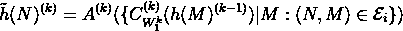*

*   *在一些 GNN 模型中，该 h 表示通过另一个 *Cw₂* 与来自前一层*k1*的“中心”节点的 *N* 表示进一步*组合*，以获得层 k 的最终更新值，如下所示:*

*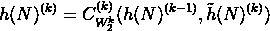*

*然后，他的通用“聚合和组合”[17]计算方案涵盖了各种流行的 GNN 模型，然后简化为特定聚合 *A* 和激活/卷积 *Cw* 的选择。例如在 GraphSAGE [18]中，操作是*

*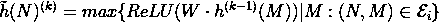**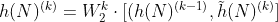*

*而在流行的图卷积网络[19]中，这些甚至可以合并成一个单一的步骤*

*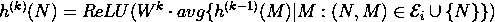*

*同样的一般原则也适用于许多其他 GNN 作品[17]。⁰*

> ***批判的视角。**最近，已经提出了这个计算公式的大量不同变体。本质上，每一个这样引入的 GNN 变体都提出了(共同的)激活和聚集功能的某种组合，并且/或者提出了用从其他神经架构借用的层来扩展该模型。最终，在新的 GNN 名字下引入这些普通 DL 模块的详尽组合导致了我们今天看到的 GNN[动物园](https://pytorch-geometric.readthedocs.io/en/latest/notes/cheatsheet.html#graph-neural-network-operators)模型，具有很大程度上模糊的性能【21】。*

*要真正看透模型的原理，现在看来，在这个相当常见的“低挂果实”收集的早期研究阶段之后，GNN 领域可能会受益于一些更深入的见解…*

## *对称的观点*

*M. Bronstein 等人对 GNN 模型类最近的(r)发展提出了一个非常有见地的观点，通过对每个领域中的 ***对称性*** 的基本假设来观察 DL 架构。从几何领域中常见的对称概念开始，这种方法后来被创造为“ [*几何深度学习*](https://geometricdeeplearning.com/) ”(请在 Medium 上查看[迈克尔·布朗斯坦](https://medium.com/u/7b1129ddd572?source=post_page-----f07a0dddda89--------------------------------)的优秀文章系列)。*

*自然地，所有的机器学习模型本质上都试图探索输入数据分布中的对称性，即某种形式的重复规律。然而，在一些结构化模型类中，这种规律性也存在于模型*参数空间*中。*

*在深度学习中，这可能是最有名的 CNN，旨在反映像素网格中的*不变性* w.r.t .平移(shift)，这是这种几何对称*最流行的例子*。*

*   *这意味着无论你将输入模式转移到哪里(在“感受野”的范围内)，模型输出都将保持不变。*

*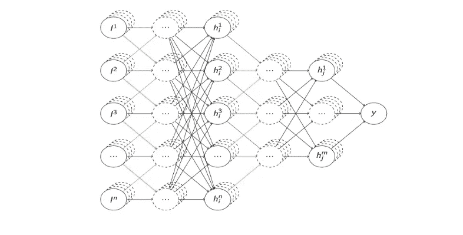*

*CNN 卷积层中的对称(规则)加权共享模式。图片由作者提供。*

*以类似的方式，递归和递归神经网络被设计成在线性和树形结构中反映*递归对称性*。*

**

*递归(左)和递归(右)神经网络的公共权重分配方案和对称性。图片由作者提供(来自[32])。*

*最后，gnn 试图用一般的*图不变量*做同样的事情，也就是关于*图同构*(置换)对称的函数。*

*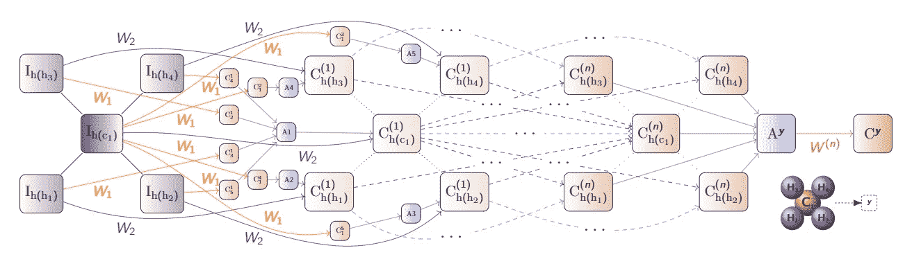*

*应用于高度对称分子(甲烷)的图形神经网络中的规则权重分配模式。图片作者([来源](https://arxiv.org/abs/2007.06567))。*

*在*集合*上反映*完全置换*对称性的模型，例如“*深集合*”，可以被视为一种“基础情况”，其中*所有可能的输入置换都被认为是等价的。**

*   *而在前面的模型中，只有可能的输入排列的子集被不变地处理(想象一下，例如，移动一只猫的图像与随机移动它的所有像素)。*

*自然地，在每个学习领域中结合关于相应对称形式的正确先验最终导致更好的样本效率和泛化，并且历史证明允许利用这种先验的模型非常有用。*

# *超越几何对称*

*传统上，大多数深度学习进展都是通过应用程序根据经验驱动的，而不是一些先前自上而下的理论分析。这也许也激发了对计算机视觉中出现的几何对称性的主要方向的探索，这是最普遍的应用领域。然而，神经网络中的对称性不需要局限于几何。*

***举例。为了简单的演示，让我们回顾一下[上一篇关于神经符号整合的文章](https://medium.com/@sir.gustav/what-is-neural-symbolic-integration-d5c6267dfdb0)中的简单逻辑 XOR 例子。***

*   *在那里，我们解释了编码简单的逻辑函数，如 AND 和 OR，如何在神经网络的早期进化中发挥重要作用，早期“神经网络”无法学习 XOR 问题导致了重大挫折。*

*尽管几十年来 XOR 问题的解决方案已经广为人知，但有趣的是，即使使用现代的深度学习，正确地学习仍然是非常重要的！特别地，虽然最佳解决方案可以由少至 2 个(或者甚至 1 个)隐藏神经元组成，但是实际上很难正确地训练如此小的网络的参数，因为优化将大部分被次最佳解决方案卡住。(自己轻松试试吧！)*

*只有当我们采用普通的(“蛮力”)方法将网络参数化增加到比必要的维数高得多的维数时(app。10+隐藏神经元进行二进制异或)，训练最终变得可靠。*

*虽然蛮力通常是深度学习中的一个答案，例如当诉诸数据集扩充时，我们可以通过将正确的先验纳入模型来做得更好。特别地，这里我们知道异或函数是*对称的*因为 XOR(x₁,x₂) = XOR(x₂,x₁).因此，我们不需要单独处理所有的排列，函数的神经参数化也应该有一些内部对称性。*

*因此，代替(常见的)过度参数化方法，我们实际上可以保持小的网络规模，并且*通过*绑定权重*来进一步减少*参数的数量。*

*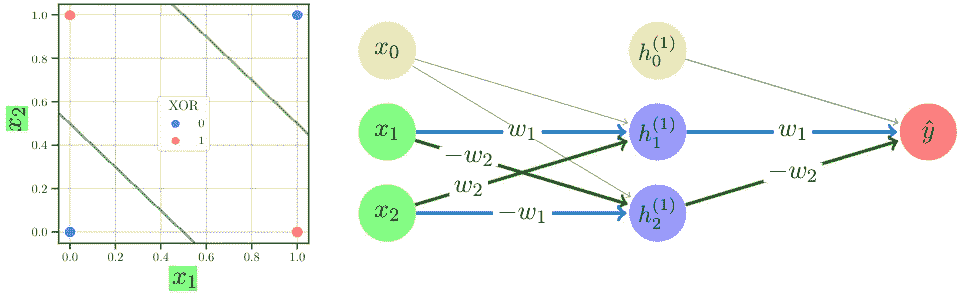*

*二进制 XOR 函数学习的(自动诱导的)对称权重共享先验的例子。图片来自作者的学生马丁·克鲁茨基。*

*然后，这种权重共享显著地改进了逻辑函数的学习，类似于在计算机视觉(和其他应用)中通过卷积使用几何对称性的 DL 模型的⁵。*

## *用逻辑捕捉对称*

> *如果我们可以从将正确的先验知识编码到模型中开始，而不是在顶级通用模型上修补过度参数化和其他经验(蛮力)技巧，这不是很好吗？*

*[几何深度学习运动](https://geometricdeeplearning.com/)现在用基于几何对称性的神经网络实践观点提出了这样一个有趣的观点。然而，这个原理长期以来也在 [*关系学习*](https://medium.com/@sir.gustav/what-is-relational-machine-learning-afbe4a9c4231) 领域中被研究，作为逻辑上的 ***背景知识****并入。**

> **这两种方法之间有什么联系吗？关系逻辑与(几何)对称性有什么关系吗？**

**是的。尽管被 DL 支持者普遍忽视(或轻视)，关系逻辑*实际上是捕捉各种对称和离散领域规则的完美形式。⁶***

**到与“几何”解释一致，让我们从*集合*中置换对称的最简单概念开始。有了逻辑，就不需要为此重新发明轮子了，因为我们已经在逻辑中将集合定义为满足给定属性的对象 X 的枚举，即{ X | X 是一个节点}或简单的 *N(X)* 对于一些一元(属性)关系 N。请注意，在集合的这种表示中，没有关于元素 X 的任何排序的概念，因此相应的排列对称性在设计中得到考虑！**

**然后，这可以直接推广到图形，这只是一个二元逻辑关系的情况。因此，为了表示一个图，我们可以写 *Edge(X，Y)* 来表示它的所有边的集合。自然，我们在这里也可以将相应节点的集合指定为*节点(X)* 和*节点(Y)* 。同样，在这种表示中，没有关于节点或边的任何排序的概念。**

*   **此外，关系逻辑并不仅限于图，同样的原理直接应用于更高级的结构 *Relation(X，Y，Z，…)* 以及它们通过逻辑连接词的组合(例如，形成*关系数据库*和 SQL 的形式模型)。**

**虽然每个(以前的)计算机科学学生肯定都熟悉这种形式(数据库)表示和相应的*关系*代数/逻辑运算，但这种形式概念能否用于机器学习实践可能并不明显。
然而，这已经被*确切地*的观点 ***解除了建模*** 的范式【27】(在我们的[以前的文章](https://medium.com/@sir.gustav/what-is-relational-machine-learning-afbe4a9c4231)中描述了*的关系学习)*，这里的*的关系逻辑*的表达形式主义已经被*直接*用于捕捉机器学习中的*对称性*问题。**

**重要的是，这里的对称不仅仅是描述性的，关系逻辑已经被直接用于*编码图形模型*，比如在流行的[马尔可夫逻辑网络](/what-is-relational-machine-learning-afbe4a9c4231)【16】。**

**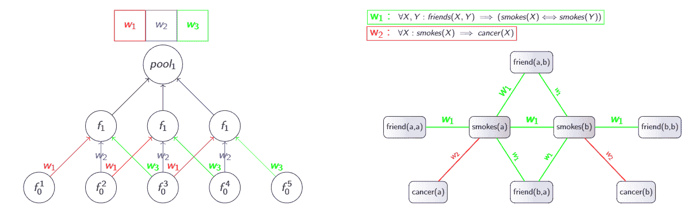**

**分别来自深度学习和[统计关系学习](/what-is-relational-machine-learning-afbe4a9c4231) (SRL)领域的 CNN(左)中卷积滤波器展开的对称权重共享模式和 MLN(右)中提升的逻辑模板之间的类比。作者图片。**

**然而，尽管用关系逻辑将领域对称性的先验编码到*图形*模型中已经研究了几十年，但在深度学习方面似乎令人惊讶地缺乏。**

*   **当然，深度学习社区对逻辑有一定的厌恶。尽管如此，考虑到神经网络和*命题*逻辑之间的历史[相互作用](https://medium.com/@sir.gustav/what-is-neural-symbolic-integration-d5c6267dfdb0)，神经网络中基于逻辑的对称性缺乏基础似乎有些令人惊讶。**

**然而，正是标准神经网络的“命题固定”限制了它们在学习问题中捕捉有趣的(提升的)对称，并使深度学习与关系逻辑的集成变得复杂，正如上一篇文章中所概述的[。](https://medium.com/@sir.gustav/what-is-neural-symbolic-integration-d5c6267dfdb0)**

# **深度关系学习**

> **但是等一下，现在我们有强大的 GNNs！他们不再受命题固定的困扰，因为他们可以捕捉图形数据。难道我们现在就不能把一切都变成图，用 GNNs 来解决我们所有的问题吗？**

**当然，图形是无处不在的，如果你尝试，你可以将手头的任何问题以某种方式转化为图形表示。因此，这是非常方便的只是应用一个[过剩](https://pytorch-geometric.readthedocs.io/en/latest/notes/cheatsheet.html#graph-neural-network-operators)现成的 GNN 模型，看看你是否运气好一些调整。⁸**

**然而，请注意，这是另一种“如果你只有一把锤子……”的认知偏见，类似于之前讨论的“将一切都变成向量”的命题化方法论。**

**最后，gnn 只是一种特殊的图传播启发式算法，具有源于底层 WL 的固有限制。重要的是，即使 GNN 可以正确地捕捉图形结构(超越 WL)，这仍然不能保证其实际的*学习*(泛化)能力，类似于它显然不足以坚持基于通用近似定理的简单 2 层神经网络【29】。**

**这就是为什么我们设计越来越复杂的模型和学习表示，直接反映我们问题的结构。因此，将复杂的关系学习表示和推理算法从图和图传播转回到 GNNs 可能不是最好的主意。**

> **因此，如果我们不是试图将更复杂的[关系问题](https://link.springer.com/referenceworkentry/10.1007%2F978-0-387-30164-8_719)表示嵌入到图和 gnn 中，而是可以将关系逻辑的表达用于一些成熟的“**深度关系学习**”，捕捉当前神经模型中的对称性作为特例，类似于提升的图形模型如何在 [SRL](https://link.springer.com/referenceworkentry/10.1007%2F978-0-387-30164-8_786) 中概括标准图形模型，这不是很好吗？**

**正如你现在可能已经猜到的那样，有一个学习框架可以完全做到这一点。具体来说，它采用 [*提升建模*](https://medium.com/@sir.gustav/what-is-relational-machine-learning-afbe4a9c4231) 策略，并将其外推到*深度学习*设置中。然后，这种范式能够将神经网络和命题逻辑之间熟悉的[对应](https://medium.com/@sir.gustav/what-is-neural-symbolic-integration-d5c6267dfdb0)直接带到*关系*层面。**

> **因此，在命题逻辑被提升到关系逻辑的更高表达能力的同样意义上，该框架将经典神经网络提升到这些模型的更具表达能力的版本，称为“**提升的关系神经网络**”[34]。⁵**

## **提升关系神经网络**

**与提升的*图形化*模型类似，“提升的关系神经网络”框架的核心是一种基于关系逻辑的语言，用于定义*神经*模型，进一步简称为“[](https://github.com/GustikS/NeuraLogic)*”。该语言直接源自 Datalog(或 Prolog)，它通常用于高级数据库查询和逻辑编程，具有一个额外的特性——它是*可微分的*。***

*   **虽然现在有许多可区分编程的框架，但 NeuraLogic 的显著不同在于它是*声明性的*。这允许以非常简洁和优雅的方式表达一些复杂的算法和原理，这特别适用于表现出各种规律性(对称性)的*关系*问题。**

****举例。**让我们跟进上面介绍的关系逻辑如何捕捉集合和图形中的对称性的形式原则，并在构建 GNN 时使其*可直接操作*。特别地，我们现在知道图是节点(*节点(X)* 和*节点(Y)* )之间的一组边(*边(X，Y)* )。然后，我们知道通用 GNN *计算规则*是将节点的表示传播/聚集到它们的邻居，这可以放入*逻辑规则*中，如下所示:**

```
**node2(X) <= W node1(Y), edge(X, Y).**
```

**…就是这样，真的！这是神经语言中 gnn(gcn[19]，特别是⁰)的*可运行代码*。内容如下:**

> **"为了计算任何对象 *X* 的表示' *node2* '，聚合所有对象 *Y、*的 a '*W【T21 '-八分表示' *node1* '，其中' *edge* '位于两者之间。"***

*   **那些倾向于关系逻辑的数据库解释的人可能会这样理解:“*在 Y 列上连接表‘node 1’和‘edge’，按 X 分组，并聚合成一个新表‘node 2*’”。**

**在神经对话框架中运行这个逻辑规则与在传统框架中运行 GCN 完全一致，也就是说，它将执行**

**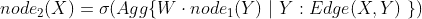**

**前面讨论的公式。当然，激活(*∑*)和聚集( *Agg* )函数(以及其他超参数)的规范也可以添加到规则中。然而，您也可以像这样让它们保持默认值( *tanh+avg* )来享受 GCNs 的基本原理的清晰性，即节点和相应边的局部排列的不变性。**

> **因此，在 NeuraLogic 中，模型对称性先验的定义成为模型本身的代码！**

**重要的是，这个规则是完全通用的，也就是说，在专门为图形或 gnn 设计的整个神经对话框架中没有特定的功能。**

*   **然后，类似的简单提升规则对深度学习模型中的各种递归/递归和其他对称权重共享(卷积)方案进行编码，本文通篇以图片中的颜色为例。**

**这意味着你可以轻松地编写任意的关系规则，编码新颖的神经[建模构造具有高级对称先验的](https://www.jair.org/plugins/generic/pdfJsViewer/pdf.js/web/viewer.html?file=https%3A%2F%2Fwww.jair.org%2Findex.php%2Fjair%2Farticle%2Fdownload%2F11203%2F26415%2F#page=18&zoom=auto,-457,634)，捕捉复杂的*关系*学习原则 [**超越 GNNs**](https://arxiv.org/abs/2007.06286)【36】。**

**先睹为快“超越图神经网络与提升的关系神经网络”[32]**

**虽然我们在这里用提升的关系神经网络对深度关系学习进行了先睹为快的总结，但我们将在下一篇文章中详细探索神经对话框架，在那里我们将展示它的实际用途、表达能力和计算效率。**

**1.最直接，也是历史上占主导地位的方法是将关系数据转化为固定的张量表示，作为预处理([命题化](https://link.springer.com/referenceworkentry/10.1007%2F978-0-387-30164-8_680))步骤，然而，正如前面[和](https://medium.com/p/afbe4a9c4231/edit)所讨论的，这隐藏了许多缺点。**

**[2] A .帕卡纳罗和杰弗里 e .辛顿。"使用线性关系嵌入学习概念的分布式表示."摘自:IEEE 知识与数据工程汇刊 13.2 (2001)，第 232–244 页。刊号:10414347**

**[3]托马斯·米科洛夫、伊利亚·苏茨基弗、程凯、格雷戈·S·科拉多和杰夫·迪恩。"单词和短语的分布式表示及其组合性."载于:神经信息处理系统进展 26 (2013)，第 3111–3119 页。**

**[4]乔丹·波拉克。"递归分布式表示."摘自:人工智能 46.1–2(1990)，第 77–105 页。issn: 00043702。**

**5 杰弗里·e·辛顿。“将部分-整体层次映射到连接主义网络中。”摘自:人工智能 46.1–2(1990)，第 47–75 页。issn: 00043702。**

**[6]理查德·索赫尔、齐丹·陈、克里斯托弗·曼宁和吴恩达。"用神经张量网络进行推理以完成知识库."神经信息处理系统进展。Citeseer。2013 年，第 926–934 页。**

**[7] Zaheer，Manzil 等，《深层集合》 *arXiv 预印本 arXiv:1703.06114* (2017)。**

**[8] Ramon，j .，& DeRaedt，L. (2000 年)。多示例神经网络。在*ICML-2000 关于属性值和关系学习研讨会的会议录*。**

**[9]亨德里克·布洛克尔和沃纳·乌温特斯。"使用神经网络进行关系学习."摘自:ICML 2004 年统计关系学习及其与其他领域的联系研讨会。2004 年，第 23-28 页。**

**[10] Franco Scarselli、Marco Gori、Ah Chung Tsoi、Markus Hagenbuchner 和 Gabriele Monfardini。"图形神经网络模型."摘自:IEEE 神经网络汇刊 20.1 (2008)，第 61-80 页**

**[11] Werner Uwents，Gabriele Monfardini，Hendrik Blockeel，Franco Scarselli 和 Marco Gori。"图形处理的两种联结主义模型:关系数据的实验比较."载于:MLG 2006 年,《利用图表进行挖掘和学习国际研讨会论文集》。2006 年，第 211-220 页**

**[12] Werner Uwents、Gabriele Monfardini、Hendrik Blockeel、Marco Gori 和 Franco Scarselli。"关系学习的神经网络:实验比较."载于:机器学习 82.3(2011 年 7 月)，第 315–349 页。issn: 08856125。**

**[13] Lamb，Luis C .等人,“图形神经网络与神经符号计算的相遇:综述与展望”arXiv 预印本 arXiv:2003.00330 (2020)。**

**14.GNN 模型可以被视为用于图同构驳斥检查的著名的魏斯费勒-雷曼(WL)标签传播算法的连续、可微分版本。然而，在 GNNs 中，不是离散的标签，而是连续的节点表示(嵌入)被连续地传播到节点的邻域中，反之亦然，用于相应的梯度更新。**

**15.接受这种动态*计算图*的观点，这与之前介绍的递归网络非常相似，然后使模型*无状态*，这消除了源于*输入图*内的消息传递解释的可能的歧义。**

**理查森、马修和佩德罗·多明戈斯。“马尔可夫逻辑网络。”机器学习 62.1–2(2006):107–136。**

**[17]徐克玉路、胡、朱尔·莱斯科维奇和杰格尔卡。“图形神经网络有多强大？”载于:arXiv 预印本 arXiv:1810.00826 (2018)。**

**[18]威尔·汉密尔顿、之桃·英和朱尔·莱斯科维奇。"大型图上的归纳表示学习."神经信息处理系统进展。2017，第 1024–1034 页。**

**[19]托马斯·n·基普夫和马克斯·韦林。"图卷积网络的半监督分类."参加:2017 年 4 月 24 日至 26 日在法国 ICLR 土伦举行的第五届学习代表国际会议，会议记录。2017 年，OpenReview.net**

**20.我们注意到我们只讨论了“空间”表示的图形和运算。然而，一些 GNN 方法在频谱、傅立叶域中表示图形和卷积运算。然而，我们注意到，这些又大多遵循相同的“聚合和组合”原则，并可以相应地重写[17]。**

**[21] Dwivedi，Vijay Prakash 等，“基准图神经网络”arXiv 预印本 arXiv:2003.00982 (2020)。**

**22.更准确地说，由卷积滤波器的应用引起的共享权重引入了滤波器的相应变换，同时通过池化将聚合函数(例如，*最大值*或*平均值*)结合在顶部，将其进一步扩展到变换 i *方差*。**

**23.尽管理论上在这里误差函数(例如交叉熵)中没有局部最小值，但是存在朝向参数空间和大鞍点的边界的发散区域，使得基于梯度的优化非常困难。**

**24.类似地，对于更简单的 AND 和 or 函数来说也是如此，然而，这些函数过于琐碎，不足以证明 NNs 的这种过度参数化问题的重要性。
有趣的是，虽然逻辑单元和神经元之间的功能并行性已经得到很好的认可，但就我们所知，以前没有工作利用相应神经权重中逻辑功能的平凡对称性来改善学习。**

**[25]马丁，克鲁茨基。*探索深度学习中的对称性*。理学学士论文。布拉格的捷克技术大学，2021。**

**26.自然地，逻辑更适合描述离散领域中的规律性，而几何解释在连续领域中更自然，如计算机视觉和机器人学。**

**[27] Kimmig，Angelika，Lilyana Mihalkova 和 Lise Getoor。"提升图形模型:一项调查."*机器学习*99.1(2015):1–45。**

**28.考虑到最近围绕 GNN 概念的大肆宣传，以及足够的超参数调整，人们确实已经成功地在广泛的问题上利用了 GNN，这现在变得更加诱人了。
果不其然，甚至逻辑表达式也可以转化为图形表示，如【13】所述。然而，这并不意味着 GNNs 是解决逻辑推理底层问题的合适算法！**

**29 乔治·西本科。"通过叠加一个 s 形函数的近似."*控制、信号和系统的数学*2.4(1989):303–314。**

**30.注意与 GCN 规则的[经典](https://tkipf.github.io/graph-convolutional-networks/)矩阵视图 H = σ (W * H * A) 的对齐，其中 H 是节点表示*矩阵*，A 是邻接矩阵(类似于这里的‘边’谓词)。**

**31.一些重要的评论文章显示，与所有论文中传统上自称的最先进的结果相比，许多这些 GNN 修改的实际性能增益往往相当微不足道，有时甚至无法击败简单的(非结构化)基线模型[21]，使得对大量 GNN 变体的需求有点可疑。**

**32.类似的工作也来自递归转换简化描述的旧思想[5]，自动编码器和许多其他工作都建立在此基础上。**

**33.注意，原则上，*递归*神经网络可以被认为是*递归*神经网络的一般形式，它在序列上递归展开，而*递归*网络在(常规)树上展开。**

**[34] Sourek，Gustav，等人，〈提升关系神经网络〉。*人工智能研究杂志* (2018)。**

**35.有趣的是，这种具有各种建模结构的方法，包括一些 GNN 和子图 GNN [变体](https://www.jair.org/plugins/generic/pdfJsViewer/pdf.js/web/viewer.html?file=https%3A%2F%2Fwww.jair.org%2Findex.php%2Fjair%2Farticle%2Fdownload%2F11203%2F26415%2F#page=18&zoom=auto,-457,634)，已经在 2015 年发表[，后来(2017 年)也](https://arxiv.org/abs/1508.05128)[扩展到这种结构的自动学习](https://link.springer.com/chapter/10.1007/978-3-319-78090-0_10)。然而，对框架的解释根植于关系逻辑而不是(仅仅)图表，这对于 ML 观众来说可能看起来很奇怪。**

**[36]古斯塔夫·索雷克、菲利普·切列兹和 ondřej·库泽尔卡。"超越图神经网络与提升关系神经网络."*机器学习*110.7(2021):1695–1738。**

***作者深深地感谢* [*翁德雷*](https://ida.fel.cvut.cz/~kuzelka/) *对于* [*底层概念中的无数想法解除了关系神经网络*](https://arxiv.org/abs/1508.05128) *。***