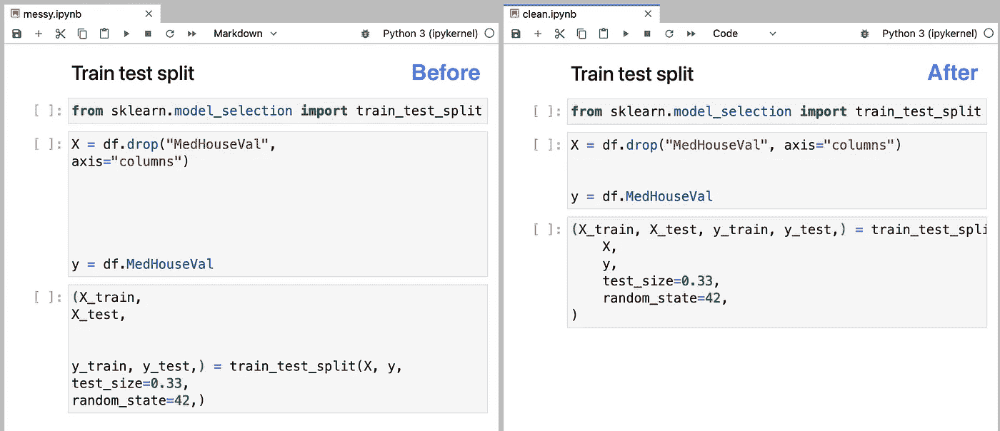
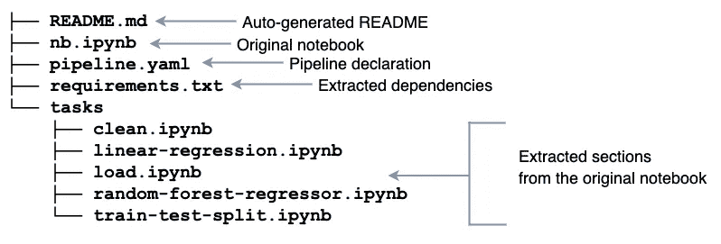
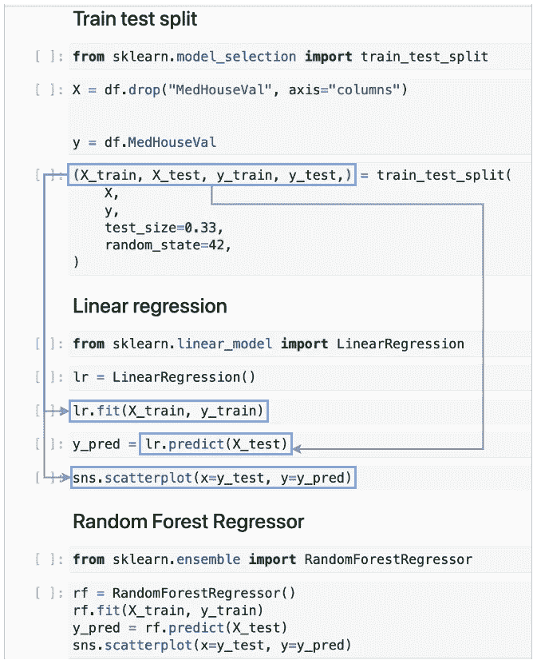
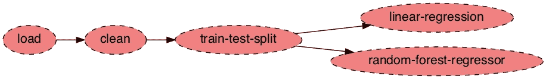

# 从 Jupyter 到 Kubernetes:使用开源工具重构和部署笔记本

> 原文：<https://towardsdatascience.com/from-jupyter-to-kubernetes-refactoring-and-deploying-notebooks-using-open-source-tools-19f99585e923>

## 数据科学软件工程

## 从凌乱的笔记本到在 Kubernetes 上运行的流水线的一步一步的指南


照片由 [Myriam Jessier](https://unsplash.com/@mjessier?utm_source=medium&utm_medium=referral) 在 [Unsplash](https://unsplash.com?utm_source=medium&utm_medium=referral) 上拍摄

笔记本电脑非常适合快速迭代和原型制作，但很快就会变得凌乱不堪。在笔记本上工作之后，我的代码变得难以管理并且不适合部署。在生产中，代码组织对于可维护性至关重要(改进和调试有组织的代码比一个又长又乱的笔记本要容易得多)。

在这篇文章中，我将描述如何**使用我们的开源工具来覆盖数据科学项目的整个生命周期**:从一个凌乱的笔记本开始，直到代码在生产中运行。我们开始吧！

第一步，用自动化工具清理我们的笔记本；然后，我们将使用`soorgeon`自动将我们的单片笔记本重构为模块化管道；之后，我们将测试我们的管道是否运行；最后，我们将把管道部署到 Kubernetes。这个工作流的主要好处是所有步骤都是完全自动化的，所以我们可以返回 Jupyter，迭代(或修复 bug)，并毫不费力地再次部署。

# 清理笔记本



图片作者。

笔记本的交互性使得尝试新想法变得简单，但也产生了杂乱的代码。在探索数据的时候，我们经常在不考虑可读性的情况下匆忙编写代码。幸运的是，有像 [isort](https://github.com/PyCQA/isort) 和 [black](https://github.com/psf/black) 这样的工具可以让我们轻松地重新格式化代码以提高可读性。不幸的是，这些工具只能处理`.py`文件；然而，`soorgeon`使我们能够在笔记本文件上运行它们(`.ipynb`):

*注意:如果你需要一个示例笔记本来尝试这些命令，这里有一个:*

查看本节开头的图片:我在左边的笔记本上引入了一些额外的空白。然而，在应用了`soorgeon clean`(右图)之后，我们看到多余的空白消失了。所以现在我们可以专注于编写代码并应用`soorgeon clean`来轻松使用自动格式化！

# 重构笔记本

在单个笔记本上创建分析是很方便的:我们可以在各个部分之间移动，并且很容易地编辑它们；然而，这有很多缺点:很难协作和测试。在多个文件中组织我们的分析将允许我们定义清晰的边界，因此多个管道可以在项目中工作，而不会相互妨碍。

从单个笔记本到模块化流水线的过程既耗时又容易出错；幸运的是，`soorgeon`可以为我们做这些繁重的工作:

重构后，我们会看到一堆新文件:



图片作者。

Ploomber 自动将我们的笔记本变成一个模块化的项目！它生成一个带有基本指令的`README.md`和一个`requirements.txt`(从`import`语句中提取包名)。此外，它创建了一个包含几个`.ipynb`文件的`tasks/`目录；这些文件来自原始的笔记本部分，由降价标题分开。计算出哪些部分依赖于哪些部分。

如果您喜欢导出`.py`文件；您可以通过`--file-format`选项:

```
soorgeon refactor nb.ipynb --file-format py
```

这次`tasks/`目录会有`.py`文件:

```
 ├── README.md 
  ├── nb.ipynb
  ├── pipeline.yaml
  ├── requirements.txt
  └── tasks
      ├── clean.py
      ├── linear-regression.py
      ├── load.py
      ├── random-forest-regressor.py
      └── train-test-split.py
```

`soorgeon`使用降价标题确定要生成多少输出任务。在我们的例子中，有五个人。然后，`soorgeon`分析代码以解析各部分之间的依赖关系，并添加必要的代码以将输出传递给每个任务。

例如，我们的“训练测试分割”部分创建了一个变量`X`、`y`、`X_train`、`X_test`、`y_train`和`y_test`；最后四个变量由“线性回归”部分使用:



图片作者。

通过确定输入和输出变量，`soorgeon`确定“线性回归”部分依赖于“训练测试分割”部分。此外,“随机森林回归”部分也依赖于“训练测试分割”,因为它也使用“训练测试分割”部分生成的变量。根据这些信息，`soorgeon`构建了依赖图。

# 测试我们的管道

现在是时候确保我们的模块化管道正确运行了。为此，我们将使用工具箱中的第二个包:`ploomber`。Ploomber 允许我们在本地开发和执行我们的管道。

这是输出:

`ploomber`提供大量工具来管理我们的渠道；例如，我们可以生成一个图:



图片作者。

我们可以看到依赖图；有三个串行任务:`load`、`clean`和`train-test-split`。在它们之后，我们看到两个独立的任务:`linear-regression`和`random-forest-regressor`。将我们的工作模块化的好处是我们团队的成员可以独立工作，我们可以[隔离测试任务](https://docs.ploomber.io/en/latest/user-guide/testing.html)，并行[运行独立任务](https://docs.ploomber.io/en/latest/api/_modules/executors/ploomber.executors.Parallel.html)。有了`ploomber`,我们可以继续用 Jupyter 开发管道，直到我们准备好部署！

# 部署

为了简单起见，您可以使用 [cron](https://ploomber.io/blog/cron/) 部署 Ploomber 管道，并按计划运行`ploomber build`。但是，在某些情况下，您可能希望利用现有的基础设施。我们掩护你！使用`soopervisor`，您可以将您的管道导出到[气流](https://soopervisor.readthedocs.io/en/latest/tutorials/airflow.html)、 [AWS 批次](https://soopervisor.readthedocs.io/en/latest/tutorials/aws-batch.html)、 [Kubernetes](https://soopervisor.readthedocs.io/en/latest/tutorials/kubernetes.html) 、 [SLURM](https://soopervisor.readthedocs.io/en/latest/tutorials/slurm.html) 或 [Kubeflow](https://soopervisor.readthedocs.io/en/latest/tutorials/kubeflow.html) 。

`soopervisor add`向我们的项目添加一些文件，比如一个预配置的`Dockerfile`(如果我们愿意，我们可以修改它)。另一方面，`soopervisor export`将我们现有的管道导出到 Argo 工作流，这样我们就可以在 Kubernetes 上运行它。

通过更改`soopervisor add`命令中的`--backend`参数，您可以切换到其他支持的平台。或者，你可以注册[免费云服务](https://docs.ploomber.io/en/latest/cloud/cloud-execution.html)，它允许你用一个命令在云中运行你的笔记本。

# 结束语

笔记本清理和重构既耗时又容易出错，我们正在开发工具来使这一过程变得轻而易举。在这篇博文中，我们从拥有一个单片笔记本到拥有一个在生产中运行的模块化流水线——所有这些都是使用开源工具以自动化的方式实现的。所以请让我们知道你想看什么功能。[加入我们的社区](https://ploomber.io/community)，分享你的想法！

> 嗨！我叫爱德华多，我喜欢写关于数据科学的所有东西。如果您想了解我的最新内容。在 [Medium](https://medium.com/@edublancas) 或 [Twitter](https://twitter.com/edublancas) 上关注我。感谢阅读！

*最初发布于*[*ploomber . io*](https://ploomber.io/blog/notebook-to-kubernetes/)*。*