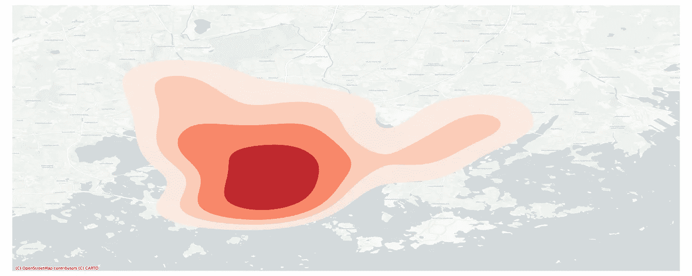
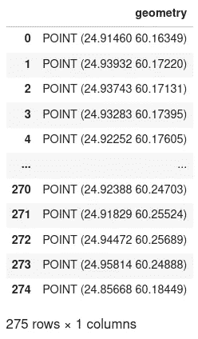
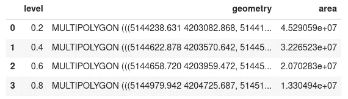
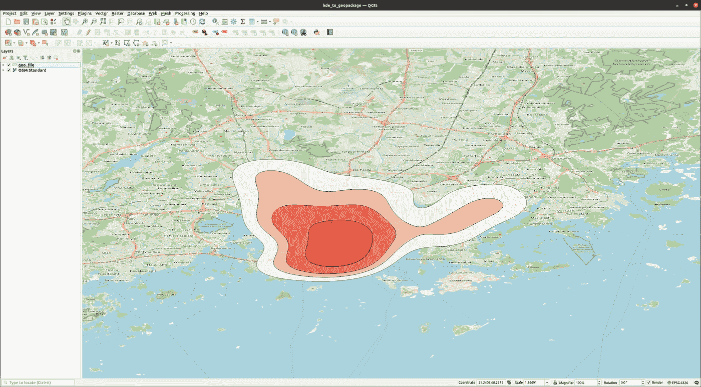

# 从核密度估计到 Python 中的空间分析

> 原文：<https://towardsdatascience.com/from-kernel-density-estimation-to-spatial-analysis-in-python-64ddcdb6bc9b>

# 从核密度估计到 Python 中的空间分析

## 如何将您的 KDE 转化为地理空间数据

图片作者。核密度估计的例子

核密度估计(KDE)是一个有用的分析和可视化工具，通常是可视化或分析工作流的最终产品。核密度估计是很好的可视化，但是它们的使用还可以更进一步。

在这篇文章中，我将展示一种使用 Python 获取内核密度估计图并将它们转换成地理空间数据以便进一步分析的方法。

# 核密度估计

在 [Seaborn](https://seaborn.pydata.org/) 的帮助下，使用 Python 创建内核密度估计图相当简单。我们从读入 GeoPandas 中的点数据集开始。我正在使用芬兰赫尔辛基的自行车共享站的数据集，从 OpenStreetMap 检索，但只要你的数据包含坐标或形状点，你应该没问题。

读入数据

自行车共享站数据框架

有了读入的数据，我们可以开始创建我们的核密度估计。我不会深入讨论 KDE 本身的细节，因为还有很多其他来源，比如 [scikit-learn 文档](https://scikit-learn.org/stable/modules/density.html#kernel-density-estimation)，但是下一个代码块展示了 Seaborn 实现是如何工作的:

创建核密度估计。

这产生了 KDE 图，我们将把它转换成可用于空间操作的有形状的对象:

图片作者。KDE 情节。

## 为每个强度级别创建多重多边形

KDE 图的不同轮廓可以通过我们的 KDE 的`collections`对象来访问。通过对该对象进行迭代，我们可以访问我们之前定义的每个亮度级别的每个轮廓的每个路径。

可能会出现轮廓不连续的情况，因此我们为相同强度级别的每条路径创建一个多边形，然后将它们组合成一个多多边形，为每个强度级别提供一个多多边形。

这里的方法受到了 [StackExchange](https://gis.stackexchange.com/questions/99917/converting-matplotlib-contour-objects-to-shapely-objects) 上的这个线程的启发。

将我们的轮廓转换成多重多边形

## 转换为地理数据

现在我们已经有了一个包含我们的多多边形和相应强度级别的元组列表，我们可以创建一个 Pandas 数据框架，然后我们可以将其转换为 GeoDataFrame。

通过地理数据框架，我们可以访问轮廓的 Shapely 对象，并利用 Shapely 的所有内置操作，例如轻松计算每个轮廓的面积估计值。

转换到地理数据框架并导出数据。

生成的地理数据框架

上面的地理数据框架显示了我们生成的多重多边形以及每个估计等高线的面积计算。由于我们现在有了 Shapely 对象，我们可以使用 Shapely 的任何内置方法来扩展空间分析，或者由于我们已经将地理数据框架导出到地理包，我们可以在 QGIS 等中打开它。

图片作者。在 QGIS 中打开 Geopackage。

# 结论

在这篇文章中，我简单介绍了如何将你的 KDE 图转换成形状优美的物体和地理空间文件，以便你进一步分析。