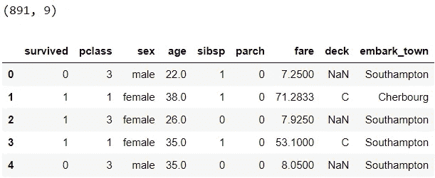
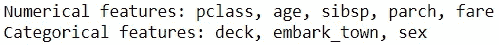
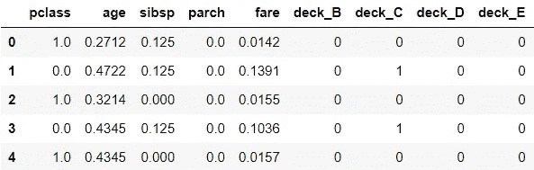
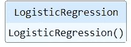
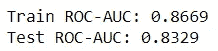
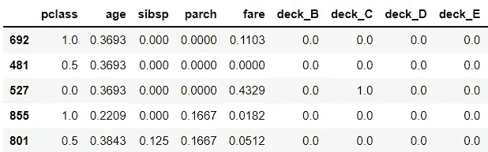
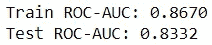
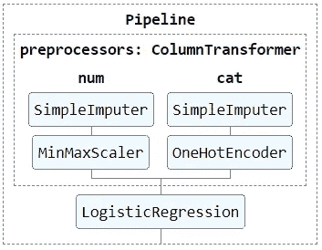
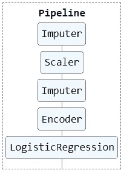
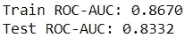

# 从 ML 模型到 ML 管道

> 原文：<https://towardsdatascience.com/from-ml-model-to-ml-pipeline-9f95c32c6512>

[记者王](https://unsplash.com/@sodacheese?utm_source=medium&utm_medium=referral)在 [Unsplash](https://unsplash.com?utm_source=medium&utm_medium=referral) 上拍照

## 数据科学基础

## 使用 Scikit-学习 Python

建立机器学习模型不仅仅是选择正确的算法和调整其超参数。在模型实验开始之前，大量的时间花费在争论数据和特征工程上。这些预处理步骤很容易淹没你的工作流，变得难以跟踪。将注意力从 ML 模型转移到 ML 管道，并将预处理步骤视为构建模型不可或缺的一部分，有助于使您的工作流程更有条理。在这篇文章中，我们将首先看看预处理模型数据的错误方法，然后学习一种正确的方法和两种构建 ML 管道的方法。

照片由 [DaYsO](https://unsplash.com/@dayso?utm_source=medium&utm_medium=referral) 在 [Unsplash](https://unsplash.com?utm_source=medium&utm_medium=referral) 拍摄

*ML 管道根据上下文有多种定义。在本文中，ML 管道被定义为预处理步骤和模型的集合。这意味着当原始数据被传递到 ML 管道时，它将数据预处理为正确的格式，使用模型对数据进行评分，并弹出预测得分。*

# 📦 0.设置

让我们导入库和一个样本数据:titanic 数据集的子集。

我们现在将定义常用变量，以便稍后轻松引用:

是时候看看第一种方法了。

# ❌ 1.错误的方法

在预处理时，像这样使用 pandas 方法并不少见:

仅部分输出

我们估算缺失值，在 0 到 1 之间缩放数值变量和一个热编码分类变量。预处理后，数据被分区并拟合模型:

好的，让我们分析一下这种方法有什么问题:
◼️ **插补:**数值变量应该用训练数据而不是整个数据的平均值进行插补。
◼️ **缩放:**最小值和最大值应根据训练数据计算得出。
◼️ **编码:**类别应该从训练数据中推断出来。此外，即使在预处理之前对数据进行了分区，使用`pd.get_dummies(X_train)`和`pd.get_dummies(X_test)`进行一次热编码也会导致不一致的训练和测试数据(即，列可能会根据两个数据集中的类别而变化)。因此，在为模型准备数据时，`pd.get_dummies()`不应用于一次性编码。

> **💡**测试数据应在预处理前搁置。用于预处理的任何统计数据，例如平均值、最小值和最大值，都应该从训练数据中导出。否则会出现数据泄露问题。

现在，让我们评估模型。我们将使用 ROC-AUC 来评估模型。我们将创建一个计算 ROC-AUC 的函数，因为它将有助于评估后续方法:

# ❔ 2.正确的方法，但是…

我们将首先对数据进行分区，并使用 Scikit-learn 的转换器对数据进行预处理，以通过正确的预处理来防止数据泄漏:

仅部分输出

很好，我们现在可以拟合模型了:

在评估之前，我们需要以同样的方式预处理测试数据集:

太棒了，这次方法是正确的。但是写好代码并不仅仅停留在正确上。对于每个预处理步骤，我们存储了训练和测试数据集的中间输出。当预处理步骤的数量增加时，这将很快变得非常乏味，因此很容易出现错误，比如在预处理测试数据时遗漏了一个步骤。这些代码可以变得更有条理、更简洁、更易读。这就是我们将在下一节中做的事情。

# ✔️ 3.优雅的方法#1

让我们使用 Scikit-learn 的`Pipeline`和`ColumnTransformer`来简化前面的代码。如果你不熟悉它们，[这篇文章](/pipeline-columntransformer-and-featureunion-explained-f5491f815f)简明地解释了它们。

管道:
◼️将输入数据分成数字组和分类组
◼️并行预处理这两组数据
◼️连接来自两组的预处理数据
◼️将预处理数据传递给模型

当原始数据被传递到经过训练的管道时，它将进行预处理并做出预测。这意味着我们不再需要存储训练和测试数据集的中间结果。给看不见的数据打分就像`pipe.predict()`一样简单。那很优雅，不是吗？现在，让我们评估模型的性能:

很高兴看到它与以前的方法的性能相匹配，因为转换完全相同，只是以更优雅的方式编写。对于我们的小例子来说，这是本文展示的四种方法中最好的方法。

Scikit-learn 的开箱即用的变压器如`OneHotEncoder`和`SimpleImputer`快速高效。然而，这些预构建的转换器可能并不总是满足我们独特的预处理需求。在这种情况下，熟悉下一种方法可以让我们更好地控制定制的预处理方式。

# ✔️ 4.优雅的方法#2

在这种方法中，我们将使用 Scikit-learn 创建定制的变压器。看到我们熟悉的相同预处理步骤如何转化为定制的转换器，有望帮助您掌握构建它们的主要思想。如果你对定制变形金刚的用例感兴趣，请查看[GitHub 库](https://github.com/zluvsand/ml_pipeline)。

与以前不同，这些步骤是按顺序一个接一个完成的，每个步骤都将其输出作为输入传递给下一个步骤。是时候对模型进行评估了:

耶，我们刚刚学会了另一种优雅的方式来达到和以前一样的效果。虽然我们在第三种方法中只使用了预构建的转换器，在第四种方法中只使用了定制的转换器，但是它们可以一起使用，只要定制的转换器被定义为与开箱即用的转换器一致地工作。

这就是这篇文章的全部内容！当使用后两种方法时，一个好处是超参数调整可以在整个管道上进行，而不仅仅是在模型上。我希望你已经学会了开始使用 ML 管道的实用方法。✨

迈克尔·泽兹奇在 [Unsplash](https://unsplash.com/?utm_source=medium&utm_medium=referral) 上的照片

*您想访问更多这样的内容吗？媒体会员可以无限制地访问媒体上的任何文章。如果您使用* [*我的推荐链接*](https://zluvsand.medium.com/membership)*成为会员，您的一部分会费将直接用于支持我。*

谢谢你看我的帖子。如果你感兴趣，这里有我的一些帖子的链接:
◼️️ [管道，ColumnTransformer 和 FeatureUnion 解释](/pipeline-columntransformer-and-featureunion-explained-f5491f815f?source=your_stories_page-------------------------------------)
◼️️ [FeatureUnion，ColumnTransformer &管道用于预处理文本数据](/featureunion-columntransformer-pipeline-for-preprocessing-text-data-9dcb233dbcb6)
◼️️ [用](/two-ways-to-create-custom-transformers-with-scikit-learn-b9089acacd37)
的两种方法创建自定义变压器◼️ [用这些技巧丰富你的 Jupyter 笔记本](/enrich-your-jupyter-notebook-with-these-tips-55c8ead25255)
◼️ [用这些技巧组织你的 Jupyter 笔记本](/organise-your-jupyter-notebook-with-these-tips-d164d5dcd51f)
◼️ [解释 scikit-1](/explaining-scikit-learn-models-with-shap-61daff21b12a)

再见🏃💨