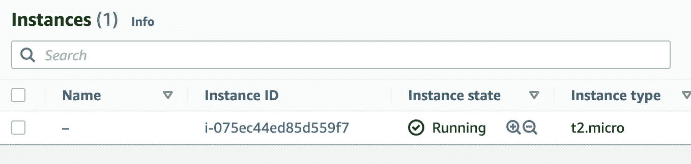
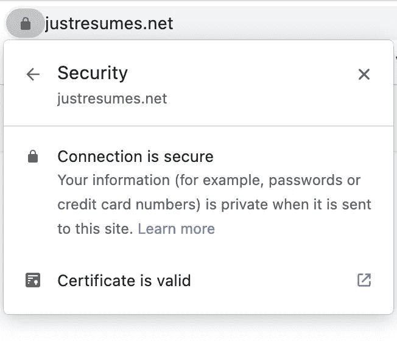
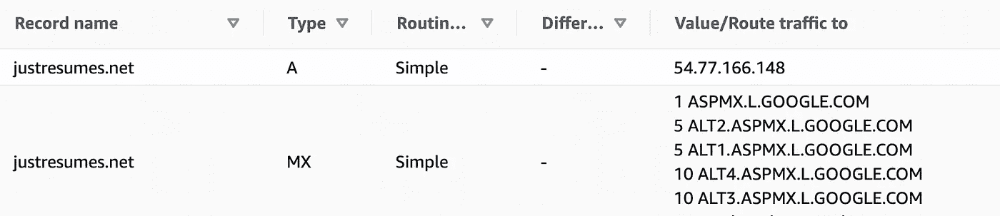
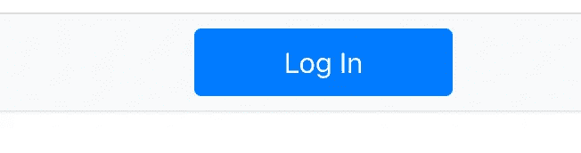
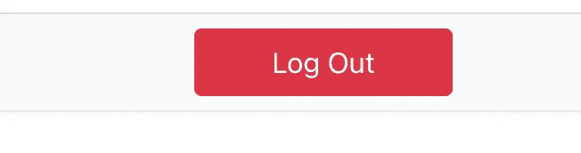

# 从 NLP 原型到生产

> 原文：<https://towardsdatascience.com/from-nlp-prototype-to-production-c2b555488dc5>

## 远远不同于粉笔和奶酪和粉碎技术债务


爱丽丝·帕斯夸尔在 [Unsplash](https://unsplash.com?utm_source=medium&utm_medium=referral) 上的照片

在英语中，我们有这样的说法:‘T4’粉笔和奶酪或者苹果和橘子。原型就像你从架子上摘下的苹果，而在生产环境中部署一个想法更像一个橙子。对我来说，将机器学习解决方案部署到生产中不太像橙子；这更像是种一棵橘子树，然后等待它结果。加上种树、修枝、浇水以及其他任何事情，相当于一个碾压级的[技术债](https://www.bmc.com/blogs/technical-debt-explained-the-complete-guide-to-understanding-and-dealing-with-technical-debt/#:~:text=When%20it%20comes%20to%20software,to%20deliver%20the%20software%20today.)。

如果你在谷歌上搜索“将机器学习模型部署到生产中”，你会找到大量的材料和方法。事实上，在 Medium 上，也有大量的文章。例如， [Isaac Godfried](https://igodfried.medium.com/?source=post_page-----77b4d01dd6f7-----------------------------------) 提供了一篇出色的[文章和一个有用的图表](/deploying-deep-learning-models-part-1-an-overview-77b4d01dd6f7)。此外，[李宗德·韦恩](https://medium.com/@josephleeweien?source=post_page-----e224269c1331-----------------------------------)用 [Flask 和 HTML](https://medium.com/towards-data-science/building-a-web-application-to-deploy-machine-learning-models-e224269c1331) 用户界面提供了一个使用深度学习模型的好例子。

我的任务就是为求职者揭露 NLP 程序，帮助他们改进简历。你可以在[的前一篇文章](https://medium.com/towards-data-science/securing-our-prototypes-2d1f9b21798f)中看到迄今为止所做努力的总结。上次我们谈到了[保护我们的原型:锁定我们的数据科学原型和隐私概念证明](https://medium.com/towards-data-science/securing-our-prototypes-2d1f9b21798f)。这篇文章将总结我从原型到部署的服务以及这两者之间的一切的工作。如果您愿意，您可以观看应用程序部署的视频，这有助于很好地展示这个概念。

作者 YouTube 帐户-作者的视频。

# 主办；主持

如果你正在使用一个模型，并且需要取消一个预测，那么有大量的选择向你开放。其中绝大多数将涉及到模型的阶段化和围绕它包装一个 API。使用该模型需要一种机制来消费 API。例如，您可以建立一个推理服务器，全力以赴采用微服务方法。公开自然语言处理技术有点不同。

我使用了 EC2 实例，但是使用了由 AWS 提供的免费层津贴支持的 t2.micro 服务器。一般来说，我会认为 Heroku 或虚拟服务器，在这种情况下，我的直觉是 EC2。但是，同样，这取决于你能接受和支持什么。



# 堆栈

拥有一个全新的虚拟服务器是非常好的，但它只配备了一个操作系统、一个网络连接和一个防火墙。想象一下 10 年前，启动服务器是多么的不同。然后，它涉及到购买服务器，插入它，连接东西。Omg！

尽管如此，我还是需要在 Ubuntu 服务器上分层！


照片由[莎拉·塞尔韦拉](https://unsplash.com/@saracervera?utm_source=medium&utm_medium=referral)在 [Unsplash](https://unsplash.com?utm_source=medium&utm_medium=referral) 拍摄

你可以把虚拟机想象成美味三明治中的第一片面包！我的三明治看起来像这样

*   **面包 1** : AWS EC2 虚拟机。拥有一台能够按需改变电源的完整服务器让人感到坚定和自信。然而，安全问题是真实存在的，可能是一场噩梦。
*   黄油: [apt](https://ubuntu.com/server/docs/package-management) 和 Ubuntu。所有的计算机都需要操作系统。我熟悉 Ubuntu，但你可以选择 Windows 或 Linux，或者在不同风格的 Linux 之间选择。他们都有不同的口味，有些比其他人更敏锐。黄油会变质，所以要给你的操作系统打补丁。
*   用 Python 填充 1: [FastAPI](https://fastapi.tiangolo.com/) 。提供 NLP 服务需要一个**后端**进程准备好服务这些传入的请求。我的 [NLP 类](https://github.com/CognitiveDave/nlp/blob/main/nlp.py)包括常见的嫌疑人！
*   填充 2: [Gunicorn](https://gunicorn.org/) 。这可能看起来有点奇怪！难道 [Gunicorn 不是一种 WSGI](https://docs.gunicorn.org/en/stable/) 方法，而 FastAPI 是一种 [ASGI 技术](https://learn.vonage.com/blog/2021/11/19/how-wsgi-vs-asgi-is-like-baking-a-cake/)吗？是的，但是 Gunicorn 有一个伟大的工人和过程控制者。
*   灌装 3: [紫玉米](https://www.uvicorn.org/)。ASGI 服务器与 FastAPI 应用程序进行通信。部署 Uvicorn 很有趣，自然地，我使用了 [Gunicorn worker](https://www.uvicorn.org/deployment/) 类。" guni corn-k uvicon . workers . uvicon worker "
*   蛋黄酱:[主管](https://www.digitalocean.com/community/tutorials/how-to-install-and-manage-supervisor-on-ubuntu-and-debian-vps)。" [Supervisor](http://supervisord.org/) 是一个客户机/服务器系统，它允许用户在类似 UNIX 的操作系统上监视和控制许多进程。"。好吧，如果东西倒了，被打翻了，被消费者的需求或坏演员压垮了，难道你不想要一个主管来维持运转吗？
*   Topping:使用 Vue.js 的用户界面。**前端**保持整洁；没有人想要一个混乱的三明治体验！
*   **面包 2** : [Nginx](https://www.nginx.com/) 。三明治的顶部需要结实，传达自信。如果我拿起这个三明治，它还会在一起吗？没人想全身都是三明治！添加 Nginx 可以提供负载平衡、静态文件服务和反向代理服务。

现在，这可能是世界上最神奇的三明治，为预期用户提供了很好的体验。多个 Gunicorn 工人和 Uvicorn 为由 Nginx 监督和代理 FastAPI 端点安排服务应该是一种很好的体验。如果你把你的三明治包在某个包裹里，那是最好的。当我想要一个赛百味三明治时，我知道去哪里，因此如果你想让客户访问你的应用程序，你需要发布你的地址。


马修·巴德梅克在 [Unsplash](https://unsplash.com?utm_source=medium&utm_medium=referral) 上拍摄的照片

# 包装产品

打包应用程序需要一些移动部件和大量的技术债务偿还！

*   一个**域**。首先，我需要一个用户友好的网址。https://www.justresumes.net 是我选择的，我是从 AWS 的 53 号公路上得到的。有很多可用的指南，AWS 会全程帮助你。
*   将服务器连接到一个地址需要一个固定的 IP 地址。你不会希望你的企业名称和地址是可变的！那会让所有人困惑。我使用了来自 AWS 的一个弹性 IP 地址，并将其连接到我的服务器实例(Bread 1)。
*   一个**电子邮件地址**，因为人们可能会有问题或反馈。你需要一个域的电子邮件地址来使用 SSL 证书并有一个联系页面。我使用了一个 [Google workspace 账户](https://workspace.google.com/intl/en_ie/solutions/new-business/)，并按照指南将我的网址与我的收件箱账户连接起来。谷歌为你做这一切！" admin@justresumes.net "
*   一个 [**SSL 证书**](https://www.kaspersky.com/resource-center/definitions/what-is-a-ssl-certificate)**通过验证，安装了和相应的私钥。火狐、Chrome 和 Safari 对网站的安全性有自己的看法。因此，任何没有 SSL 证书的网页都显得“不安全”。我用了一个免费的[教程](https://ubiq.co/tech-blog/nginx-ssl-configuration-step-step-details/)使用 [SSL 来做这一块。90 天的证书只是另一笔等待偿还的技术性债务。](https://www.sslforfree.com/)**
*   **一个博客——很自然地，我为此在媒体上建立了一个[出版物！](https://medium.com/justresumes-net)**

**下面是一些漂亮的截图因为这些东西伤透了我的心！**

## ****连接安全****

****

**作者显示登录页面安全信息的图片。**

## **为电子邮件配置域**

****

**图片来自 53 号公路、托管区域、自定义域电子邮件服务的 DNS 设置—图片由作者提供。**

## **证明**

**没有让我心碎的东西*感谢 [Auth0](https://auth0.com/blog/complete-guide-to-vue-user-authentication/)***

******

***那个看起来很酷的登录按钮——由作者截图***

***登录后,“注销”按钮会以冷红色显示。漂亮！***

******

***那个看起来很酷的注销按钮——由作者提供的 Vue.js 的 Auth0 starter 截图***

***你可以在我准备的的[视频里看我吃那个三明治。](https://youtube.com/playlist?list=PL_7kiTrbF7bhtrAxQArJJzrS05-Z--mnL)***

# ***做三明治***

***编排整个应用程序堆栈有许多部分。事实上，给定开发应用程序所需的材料、步骤和解释，我可以写一本书。***

## ***突出***

*****使用 FastAPI** :最初，我想使用 FastAPI 应用程序提供静态和 JSON 内容(API 端点响应)。然而，那对我不起作用。所以，我决定使用 Nginx 提供静态内容，这意味着 index.html 和所有 vue.js 块都由 Nginx 直接提供。流量通过到套接字的 Nginx 反向代理流向 FastAPI 应用程序。在 Gunicorn 进程的控制下，Uvicorn 工人监控套接字，并对来自客户端的 API 调用做出必要的响应。应用程序由管理员监控和运行，这保证了服务器上应用程序的弹性。我用了一个教程帮我，很高明！***

***[](https://blog.askjarvis.io/fastapi-with-nginx-gunicorn-and-supervisor-on-ec2-2e0258441d7c) [## 带有 Nginx、gunicorn 和 EC2 上的 supervisor 的 FastAPI

### FastAPI 是一个新的 Python web 框架，用于使用 Python 3.6+构建 API，支持并发和类型系统输出…

blog.askjarvis.io](https://blog.askjarvis.io/fastapi-with-nginx-gunicorn-and-supervisor-on-ec2-2e0258441d7c) 

**Nginx 配置:**设计有几个步骤。我用了教程来帮助我，这些都很有帮助。当我们谈论个人或敏感的个人数据时，安全性至关重要。

[](https://ubiq.co/tech-blog/nginx-ssl-configuration-step-step-details/) [## NGINX SSL 配置步骤详细信息- Ubiq BI

### NGINX SSL 配置允许您在您的网站上启用 HTTPS，并保护它们免受恶意攻击。这里有一个…

ubiq.co](https://ubiq.co/tech-blog/nginx-ssl-configuration-step-step-details/) [](https://www.tecmint.com/nginx-web-server-security-hardening-and-performance-tips/) [## 保护、强化和提高 Nginx Web 服务器性能的终极指南

### 在本指南中，我们将介绍 12 个技巧来提高 Nginx 服务器的安全性和性能…

www.tecmint.com](https://www.tecmint.com/nginx-web-server-security-hardening-and-performance-tips/) [](https://www.cloudsavvyit.com/3782/how-to-configure-cache-control-headers-in-nginx/) [## 如何在 NGINX 中配置缓存控制头

### 安东尼·赫丁斯作者安东尼·赫丁斯是 LifeSavvy Media 的常驻云工程师，是一名技术作家…

www.cloudsavvyit.com](https://www.cloudsavvyit.com/3782/how-to-configure-cache-control-headers-in-nginx/)  [## nginx——如何服务一个静态 HTML 页面

### Nginx 是一个强大的反向代理，可以将你的域名从互联网路由到你的应用程序。本教程向您展示了…

futurestud.io](https://futurestud.io/tutorials/nginx-how-to-serve-a-static-html-page)  [## 陷阱和常见错误

### 新老用户都可能遇到陷阱。下面我们概述了我们经常看到的问题，并解释了如何…

www.nginx.com](https://www.nginx.com/resources/wiki/start/topics/tutorials/config_pitfalls/) 

CORS: 我犯了 CORS 错误！所以我不得不使用 CORSMiddleware 来解决这个问题，我不认为这是一个好主意！

```
origins = ["*"]
# Creates app instance
app = FastAPI(openapi_url=None)
app.add_middleware(
CORSMiddleware,
allow_origins=origins,
allow_credentials=True,
allow_methods=["*"],
allow_headers=["*"],
)
```

**生产中的 Swagger UI**:考虑到数据和安全问题，我不喜欢让 Swagger UI (FastAPI 文档)可用。关掉它很容易。

```
app = FastAPI(openapi_url=None)
```

**发送电子邮件:**两难的选择是在后台还是在前台发送。我选择从客户端在 vue.js 中做。到目前为止，我不确定这个决定是否明智。

[](https://www.freecodecamp.org/news/send-emails-from-your-vue-application/) [## 如何使用 EmailJS 从 Vue.js 应用程序发送电子邮件

### 几天前，我决定做一个简单的 Vue 项目，需要通过一个联系人发送电子邮件，我刚刚…

www.freecodecamp.org](https://www.freecodecamp.org/news/send-emails-from-your-vue-application/) 

**认证:**我使用了 Auth0

API 端点安全性是通过 FastAPI 的依赖注入实现的

```
@app.get("/api/private")
async def private(response: Response, token: str = Depends(token_auth_scheme)): result = VerifyToken(token.credentials).verify()
if result.get("status"):
 response.status_code = status.HTTP_400_BAD_REQUEST
 return resultreturn result
```

Auth0 再次提供了前端视图安全性，这里有一个 vue.js 组件作为例子。

```
<template>
<div>
<Highlighter v-if="$auth.isAuthenticated"/>
<Hero v-else  />
</div>
</template>
```

如果用户执行了身份验证，屏幕上会显示一个“荧光笔”组件；否则就是登陆页的‘英雄板块’。

除此之外，做这个三明治并不容易！

# 关闭

从原型到生产应用远比看起来复杂。与粉笔或奶酪的类比大不相同，令人崩溃的技术债务水平让我夜不能寐。此外，安全是根本，互联网上的一切都在不断受到攻击。如果你不相信我，可以查看 Nginx 访问日志。暴力攻击每天都有！

我写这篇文章是为了与数据科学家、分析师和对在生产环境中部署自然语言服务感兴趣的人分享这一经验。我们都同意这不容易！然而，这些讨论是初创企业每天都要面对的，当你读到你的社交媒体账户出现重大中断时，也许你现在有了更好的见解。一个小小的改变可以打破一切！


Erik Mclean 在 [Unsplash](https://unsplash.com?utm_source=medium&utm_medium=referral) 上拍摄的照片

[](https://cognitivedave.medium.com/membership) [## 通过我的推荐链接-大卫·摩尔加入媒体

### 作为一个媒体会员，你的会员费的一部分会给你阅读的作家，你可以完全接触到每一个故事…

cognitivedave.medium.com](https://cognitivedave.medium.com/membership)***