# 卷积神经网络:导论

> 原文：<https://towardsdatascience.com/from-perceptron-to-densenet-an-introduction-to-convolutional-neural-networks-ab37e3b7872e>

## 从感知器到 DenseNet 的短暂旅程

杰姆·萨哈冈在 [Unsplash](https://unsplash.com) 上的照片。

人们可能有理由怀疑，当网上有许多关于同一主题的介绍时，为什么有必要再介绍一次卷积神经网络。然而，本文将读者从最简单的神经网络感知机带到深度学习网络 ResNet 和 DenseNet，(希望)以一种可理解的方式，但肯定是以一种简洁的方式，在几个步骤中涵盖了深度学习的许多基础知识。所以我们开始吧——如果你想的话。

# 介绍

机器学习是人工智能的重要组成部分。它用于许多应用领域，如图像识别、语音识别、风力预测和药物设计。数据科学是一个与人工智能密切相关的新兴领域，专注于学习，预测专注于收集，可视化，推理和学习模型的预处理。特征是描述观察的变量。一个模式****x****∈ℝᵈ*是一组特征。标签 *y ∈ ℝ* 是我们感兴趣的观察结果。模式-标签对形成了基本事实。*

*监督学习通过调整分类器的参数来适应训练模式，从而在训练阶段训练分类器。从形成 *d* 维训练集的一组模式-标签对*(****x****ᵢ，yᵢ)* 与 *i = 1 …，n* 与***x****ᵢ∈ℝᵈ*中，训练一个机器学习模型 *f* ，用于预测适当的标签信息在分类中，标签是离散的，例如 *{0，1}* 并被称为类或类别，而在回归中，标签是连续的。*

# *感知器*

*感知器[1]是一个简单的神经单元(*f:ℝᵈℝ*),汇总加权输入并将其输入激活功能*

*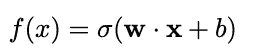*

*这里，***x****∈ℝᵈ*是感知器的输入，***w****∈ℝᵈ*是权重， *b ∈ ℝ* 是偏差， **w** **x** 是所有***x*的分量乘积之和*****

*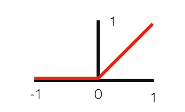*

*激活函数 ReLU 图*

*功能σ*:ℝℝ*是一种激活功能，类似于整流线性单元，简称 ReLU，见图 1:*

*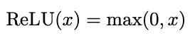*

*ReLU 可以计算得非常快，这解释了它在深度学习方面的成功。在众多进一步激活的功能中，乙状结肠功能是其中之一:*

*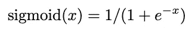*

*将输入映射到 0 和 1 之间的值和双曲正切值:*

*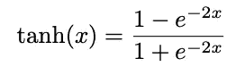*

*映射到区间 *[-1，1]* 。*

*将多个感知器分层允许分离更复杂的集合，也包括像 XOR 问题这样的非线性集合。密集层将众多的感知机放入一层。连续层的所有神经元相互连接，即密集连接。密集层也称为全连接(FC)层。输入层的神经元数量对应于模式的维度。一个多层感知器(MLP)由一个输入层和一个输出层以及一个或多个隐藏层组成，见图 2。*

*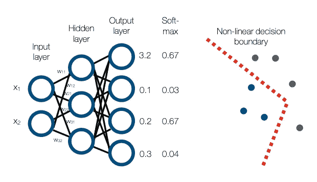*

*图 2:左:有一个隐藏层的 MLP 的插图。右图:多个图层允许非线性分类边界。*

*这个以神经元为节点的 MLP 图中的每条边都配备有自己的权重 *w* ᵢ.如果 ***x*** *∈ ℝᵈ* 是一个层的输入并且***w****∈ℝ^{k×d }*是一个层的权重矩阵，那么*

*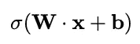*

*是有偏差的加权和***b****∈ℝᵏ*。输出是一个 *k* 维向量，其元素被逐元素地馈送给激活函数σ，从而产生相应层的激活向量。如果需要处理通道信息(图像的 RGB 值),张量的扩展是合理的。信息从输入层传递到输出层。因此，与具有反向连接的循环网络相比，该网络体系结构被称为前馈网络。*

*网络权重和偏差通常统一初始化为小值，如-0.01 到 0.01。或者，Glorot 初始化旨在使一个层的输出方差等于其输入方差。Glorot 从以 0 为中心的正态分布中抽取样本，标准偏差基于输入和输出的数量。*

# *损失函数*

*在分类中使用一个热编码，这意味着一个输出神经元对应于一个返回 1 的输出类，而所有其他神经元返回 0。例如，在数字数据集的 *K=10* 类的情况下，使用一个热编码的 MLP 采用 10 个输出神经元，每个表示一个类，例如**y**=(0,0,1,0,0,0,0,0,0,0)^t 用于*数字 2* )。*

*为了实现对 *K* 类的一个热编码，最后一层的 *k = K* 神经元的最终激活 y’被馈送到 softmax:*

*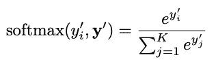*

*它将所有输出调整为 0 到 1 之间的值，而所有输出的总和为 1。这些值将被解释为类别概率。最后，提供 softmax 函数的最高输出的输出神经元确定 MLP 的分类决策，即:*

*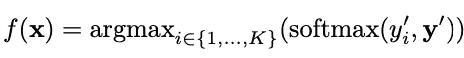*

*利用交叉熵(也称为对数损失)来计算整个训练集的误差，该交叉熵面向香农熵原理。在所有数据训练样本上，我们得到总体平均交叉熵损失如下:*

*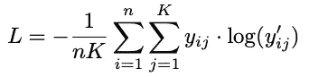*

*其中 *n* 是训练集大小或批量大小， *yᵢⱼ ∈ {0，1}* 是来自训练集的标签的地面真实概率， *y'ᵢⱼ ∈ [0，1]* 是来自 softmax 的第 I 个示例中第 j 个类的预测概率。由于一个热编码，每个图案和每个维度都有一个 *yⱼ* 。对于接近 1 的大差异，罚分产生大的分数，对于接近 0 的小差异，罚分产生小的分数。*

*在回归中，MSE 最常用作损失函数:*

*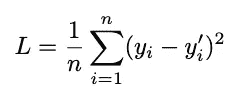*

*对于标签 *y₁、…、yₙ ∈ ℝ* 和输出 *y'₁、…、y'ₙ ∈ ℝ* 。引入的损失函数用于调整神经网络的权重。*

*损失函数用于训练模型，见下一节。但是为了评估分类的准确性，像召回率和精确度这样的测量是有用的。在分类中，一个模式可以被正确分类(真)或不被正确分类(假)。在两类分类场景中，我们可以区分正确分类为正的真正(TP)模式和真正分类为负的真负(TN)模式。假阳性(FP)模式被分类为阳性，但应该是阴性，假阴性(FN)模式被错误地分类为阴性。对于两个以上的标签(阳性和阴性)，混淆矩阵是一个一般化。在矩阵的每个位置，它计算属于属于该行的类的模式的数量，并且被分类到属于该列的类。模型的精度定义为 TPs / (TPs + FPs ),表示正面预测的准确度。同时，被定义为 TPs/(TPs + FNs)的回忆表明实际阳性被发现的程度。*

# *培养*

*学习就是体重适应。训练阶段的典型设置是调整网络的所有权重 ***w*** *ᵢ* 和偏差 *bⱼ* ，使得模式被 MLP 映射以校正训练集的标签。
神经学习中主要的权重自适应算法是反向传播。反向传播对权重执行梯度下降，以最小化损失函数 *L* ，该损失函数例如可以是交叉熵或 MSE。梯度下降是一种优化方法，它将搜索移动到梯度的相反方向。*

*点**处的梯度*δl(****w****)*w***∈ℝᵏ*是一个*k*-偏导数的维向量*∂l(****w****)/∂w*ᵢ*w . r . t .各参数 *wᵢ、I***

**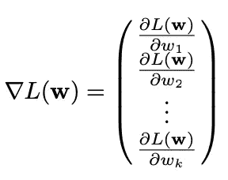**

**梯度下降通常比无向随机搜索更快。对于回归问题，损失定义为残差平方和，对于分类，常见的损失函数是交叉熵损失，参见上面的等式。**

**如果损失函数 *L* 是可微的，可以计算偏导数 *∂L/∂w* w. r. t .权重，从而得到梯度*δl(****w****)*。梯度下降通过以学习率 *η* 进入梯度的相反方向来执行最小化:**

**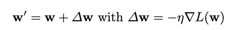**

**此更新也称为普通更新。**

**对于简单的感知器 *f(x)* 与 *f(x) =* σ *(wx + b)* ，具有输入模式 *x* ，目标标签 *y* ，sigmoid 激活函数，以及损耗 *L = 1/ 2 (y —* σ *(z)，*我们示例性地导出反向传播:**

**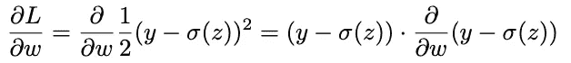**

**用链式法则。常数消失，又是链式法则，利用 sigmoid 的导数，我们得到:**

**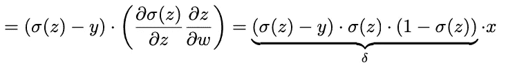**

**在一个时期中，完整训练集的所有模式被呈现给网络。权重更新的一个成功变体被称为随机梯度下降(SGD)。SGD 在呈现一个模式后更新权重并计算梯度。因此，它试图通过一次只考虑一个训练样本来逼近真实梯度。如果训练集被打乱并分成不连续或重叠的批次，则训练可能是有效的。在小批量模式中，用训练样本子集的梯度来训练神经网络。SGD 不如 mini batch 健壮，但它允许更快的步骤。此外，它可能更少陷入局部最优。局部最优采用了比其邻域更好的适应度，但可能不是全局最优，见图 3。**

****

**图 3:局部最优的图示。**

**如果与整个训练集的真正梯度下降相比，小批量梯度下降是正常梯度下降和 SGD 之间的折衷。**

# **动力**

**学习率 *η* 在训练网络中起着重要的作用。动量有助于避免权重更新的振荡，并允许更快的收敛。以下是对权重为 *k* 的多元变量的扩展，即*δ****w****，δl(****w****)∈ℝᵏ*。在经典动量中，旧的权重变化*δ****w***再次应用递减因子*β∈【0，1】*:**

**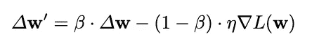**

**term*βδ****w****在极端梯度的情况下减缓自适应过程，防止优化器超调。开始时，*δ****w****被设置为零矢量。左边的图 4 说明了动量原理。****

***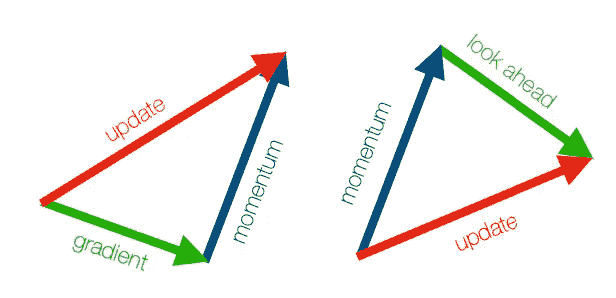***

***图 4:动量图(左)和内斯特罗夫动量图(右)。***

***内斯特罗夫动量是动量更新的延伸。它为凸函数提供了更强的理论收敛保证。实际上，它比标准动量理论更有效。它将动量视为一种前瞻，即首先进入动量方向*βδ****w***，并从那里计算现在略有不同的梯度∇*l(****w****+βδ****w****)在新的前瞻位置:****

***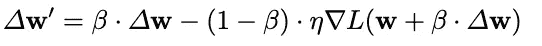***

***图 4(右)展示了内斯特罗夫的势头。过去已经提出了不同的权重更新变体，其中一个突出的变体是 Adam。***

# ***过度拟合***

***专注于适应训练模式的模型可能过度适应训练数据，并且可能学习复杂的适应，尽管期望的模型结构可能不太复杂。这导致模型的泛化能力不足。过度拟合可以通过正则化、交叉验证和退出来避免。***

***正则化基于权重的大小，例如所有权重的平方和，向误差分类或回归误差*L(****w****)*添加惩罚:***

**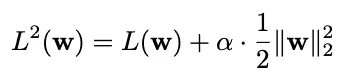**

**带参数 [α](https://www.key-shortcut.com/schriftsysteme/abg-griechisches-alphabet) 的情况下 *L* 正则化，其中**

**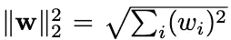**

**是权重向量 ***w*** 的 *L* 范数。大的重量与过度配合有关，而小的重量被认为可以防止过度配合。对权重的惩罚强制小权重，从而防止过度拟合。**

**交叉验证(CV)使用一组训练样本进行训练，并在独立的验证集上评估模型质量。推广到不止一个这样的交叉验证过程，N 重交叉验证将随机混洗的数据集分成 *N* 个分离的子集，参见图 5。每个子集都被排除一次作为验证集。对所有的 *N* 个折叠重复该过程，并对误差进行平均。对独立测试集的最终评估可用于说明模型质量。**

**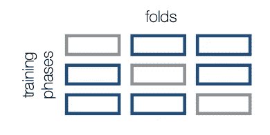**

**图 5: CV 重复地(这里是 3 次 3 折 CV)留下一个(灰色)验证集，并在剩余的(蓝色)折叠上训练模型。**

**一个极端的例子是 *N=n* 的留一交叉验证(LOO-CV)，即每个模式都是一个折叠。从统计学的角度来看，它是有用的，但是由于大量的训练过程，它是非常低效的，因此主要适用于小数据集。**

**控制遗漏验证集上的误差允许早期停止，即，在验证误差增大而训练误差进一步减小的情况下退出训练过程。**

**在训练阶段，Dropout 关闭每个神经元的概率为 *p ∈ [0，1]* ，称为 dropout rate。对于每个隐藏层、每个训练样本和每次迭代，随机分数 *p* 激活被忽略，也称为清零。在测试阶段，所有激活都被使用，但按系数 *p* 减少。这说明了在训练阶段缺少激活的原因。Dropout 也用于卷积层，参见 dropout 部分，它也随机地将激活置零。**

**图 6 显示了辍学情况。灰色神经元不参与训练过程。它们的权重不会更新。**

****

**图 6:在退出期间，神经元以概率 p 被去激活，这里示出了训练期间的灰色神经元。**

**Dropout 迫使网络学习类的多个独立表示，这防止了过度拟合。也可以理解为多个子网的集成学习，将它们的决策结合起来。**

# **卷积层**

**卷积网络很早就已经推出[2]，但 Alex Krizhevsky 在 2012 年的 ImageNet 大规模视觉识别挑战赛中使用 AlexNet 实现了图像识别的突破。图 7 示出了示例性的网络架构。卷积层充当平移不变特征学习器。**

**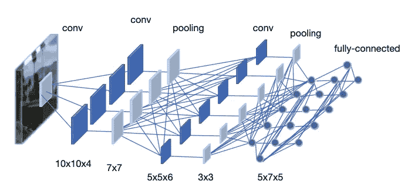**

**图 7:带滤波器和信道的卷积网络架构。**

**设 **X** 为 *H × W × C-* 维度输入。一个卷积层由*C’*乘以 *C m × m* 个滤波器核矩阵组成。对每个输入通道执行卷积运算，并对结果求和。该操作是针对每个过滤器内核执行的。卷积运算将一个 *m × m-* 维内核矩阵 **w** 从左上至右下移动到输入体积，参见图 8，计算:**

**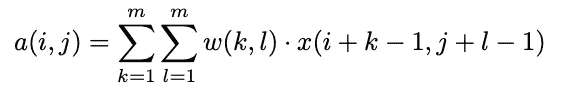**

**滤波器内核 ***w*** 通过反向传播进行调整，并学习有用的特征检测器。输入 ***x*** 和 ***w*** 之间的相似性产生高激活 ***a*** 。每个输入通道的激活被累加，因此由*C’*被加数组成。该过程被重复*C’*次，导致*C’*输出通道用于输出 ***A*** 。**

**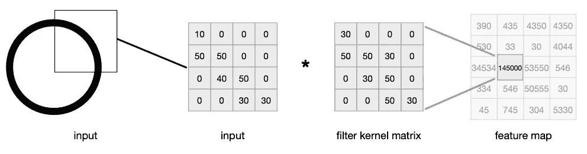**

**图 8:2D 卷积过程的例子。**

**例如，具有 *32 × 32* 彩色图像的 CIFAR-10 网络的第一卷积层可以采用 64×3 滤波器核 *3 × 3* 矩阵。该层将输出 64 个通道。**

**滤波器核在输入体矩阵上移动的步长称为步幅。它采用垂直轴和水平轴。两个轴的步幅都是一个常见的选择，见图 9。较高的值降低了计算和存储的复杂性。为了避免维度收缩，输入体积的边界可以用零填充，例如，通过添加*W-m*零。这个过程称为零填充。**

**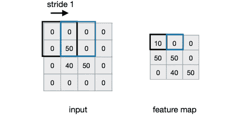**

**图 9:1×1 步的图示。**

**偏差 *b* 可被添加到输出体积，即所有激活。卷积层的输出应用激活函数***A’****=σ(****A****)*，例如 ReLU。汇集层减少了集中于最大或平均激活的维度。滤波器核的数量通常随着网络的深度而增加。**

# **联营**

**卷积层导致激活显著增加。为了减少数量，使用了池层，参见图 10。池化是一种基于渠道的操作。**

**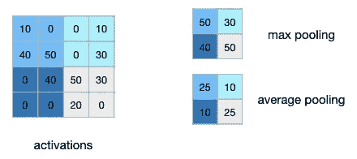**

**图 10: Max pooling 返回输入体积内的最大值，该最大值通常以对应于体积维度的步幅移动(这里是 2x2)**

**设 ***A*** 为激活的特征图，最大池在每个通道上移动一个 *m × m* 方块，选择最大值:**

**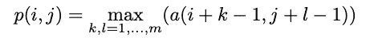**

**平均汇集是使用每个方块的平均值的相应过程。汇集层也可用于替换密集层头(激活的最后一层)。**

**VGG-19 是早期卷积网络的一个例子。它由 19 个权重层组成，对于 224 × 224 RGB 图像的输入具有以下配置:**

**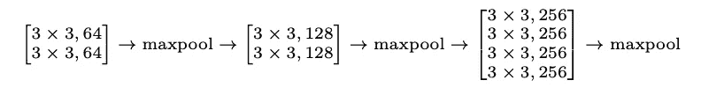****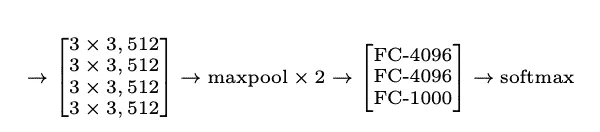**

**FC 表示全连接层。这三个 FC 也被称为 MLP 头。VGG-19 使用了 1.44 亿个参数，是深度架构的一个例子。**

# **雷斯内特**

**一个网络使用的参数和权重越多，它就能代表越多。数百层是可能的，但是训练起来计算量很大。但是非常深的网络容易过度拟合。随着误差以倍增的方式通过网络向后传播，每层中的梯度更新变得更小。这种效应随着层数的增加而增加，称为消失梯度问题。ResNet [3]通过以恒等式 ***X*** 的形式提供快捷连接来解决这个问题，并将它们添加到一个模块的输出 ***R*** 中，这就变成了一个来自输入的残差。残差比恒等式更容易学习。ResNet 模块提供身份，并学习与他们的偏差。层和身份的总和成为一个 ResNet 模块 *R* :**

**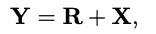**

**而剩余的 ***R*** 就要学会了。为了匹配 **R** 和**t18】xt20】的尺寸，可以添加投影矩阵 ***W*** *ₚ* ，从而得到:****

**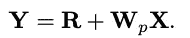**

**图 11 示出了基于两个卷积层的示例性 ResNet 模块。**

**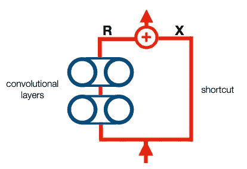**

**图 11:ResNet 模块的标识快捷方式连接。**

**ResNet 原理可以应用于由全连接或卷积层组成的所有类型的模块。甚至快捷连接也可以由覆盖卷积层模块的一个卷积层组成。**

**对最优模型 *f** 的搜索可以被视为在函数类 *F* 中的搜索。在这个空间中，神经网络是由架构、超参数和权重定义的函数 *f ∈ F* 。改变函数类不一定会使其更接近 *f** 。一个 ResNet 模块实现了添加剩余部分的恒等式，从而表示一个嵌套函数，即它持有*f’*⊂*f*，这强制向最优 *f** 移动，参见图 12。**

**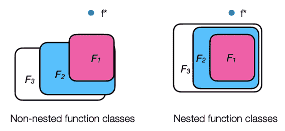**

**图 12:用 ResNet 模块实现的嵌套函数类(右)更接近最佳函数 f *,非嵌套函数类(左)则不一定**

**原始论文中的 ResNet 架构采用 152 层，一个 7 × 7、64 步距 2 卷积和一个 3 × 3 最大池，步距 2 后接以下卷积 ResNet 模块:**

**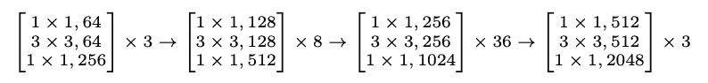**

**由每三个回旋组成。在网络的末端，使用 1000 维全连接层和 softmax 进行平均池化。**

# **DenseNet**

**在 DenseNet [4]中，各层以前馈方式与后续各层相连，参见图 13 或 DenseNet 模块。像泰勒级数展开一样，将函数分解成越来越高的项，DenseNet 用越来越深的层来表示函数。**

**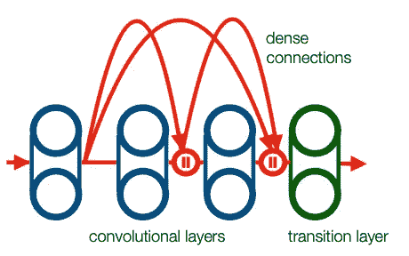**

**图 13:在密集块中，卷积层的每个输出都被馈送到后续层的输入。密集块的最后一层是过渡层。**

**在 *l* 层的密集块中 *l* ⋅ *(l + 1) / 2* 连接被引入。每个卷积层接收所有先前层的输出作为输入，并向每个后续层产生自己的输出。先前层的输出被连接(不像在 ResNet 中那样被求和):**

****

**每一个密集块增加通道的数量。过渡层限制了模型的复杂性，瓶颈 1 × 1 卷积层减少了信道的数量，平均池层，例如，步幅 2 将高度和宽度减半。这样，过渡层减少了输入维度。密集架构允许具有相同性能的不太深(即，更浅)的网络，并且还解决了消失梯度问题。**

# **结论**

**卷积神经网络不仅是人工智能中最重要的方法之一，其基本方法和原理也用于许多其他深度学习算法。例如，反向传播是几乎所有深度学习方法的优化主干，卷积层是众多神经架构的一部分。它们的应用不仅限于图像识别，而且在许多其他领域也得到了证明。如果您想更深入地了解上述主题和实现，请参阅进一步阅读部分的一些参考资料。Python 是深度学习的最佳编程语言，Keras 以及 PyTorch 可以让你轻松访问卷积神经网络。**

***除特别注明外，所有图片均为作者所有。***

# ****延伸阅读****

*   ***潜入深度学习*，张等人，**
*   ***统计学习导论*，第 2 卷，詹姆士等人，[https://hastie.su.domains/ISLR2/ISLRv2_website.pdf](https://hastie.su.domains/ISLR2/ISLRv2_website.pdf)**
*   ***喀拉斯简介*、[https://keras.io/getting_started/](https://keras.io/getting_started/)**
*   ***Keras Simple conv net*、[https://keras.io/examples/vision/mnist_convnet/](https://keras.io/examples/vision/mnist_convnet/)**

# **一些(可能的)参考文献**

**[1] F. Rosenblatt，感知器——一种感知和识别的自动机，康奈尔航空实验室，报告№85-460-1(1957)**

**[2] Y. LeCun，B. Boser，J. S. Denker，D. Henderson，R. E. Howard，W. Hubbard，L. D. Jackel，反向传播应用于手写邮政编码识别，神经计算，1(4):541-551(1989)**

**[3]何克明，张晓明，任树生，孙杰，图像识别的深度残差学习，，第 770-778 页(2016)**

**[4]黄，刘，范德马滕，温伯格，稠密连接卷积网络.CVPR，2261-2269(2017)**