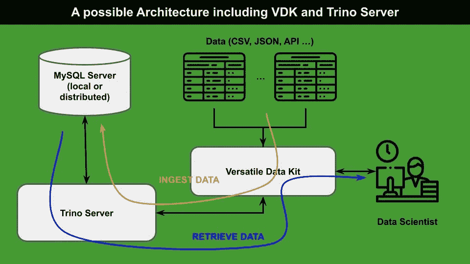
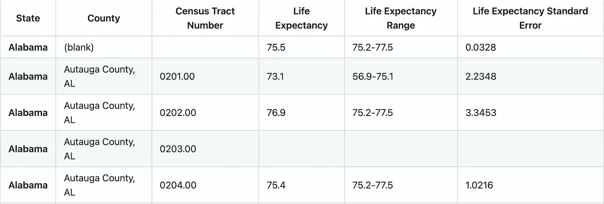
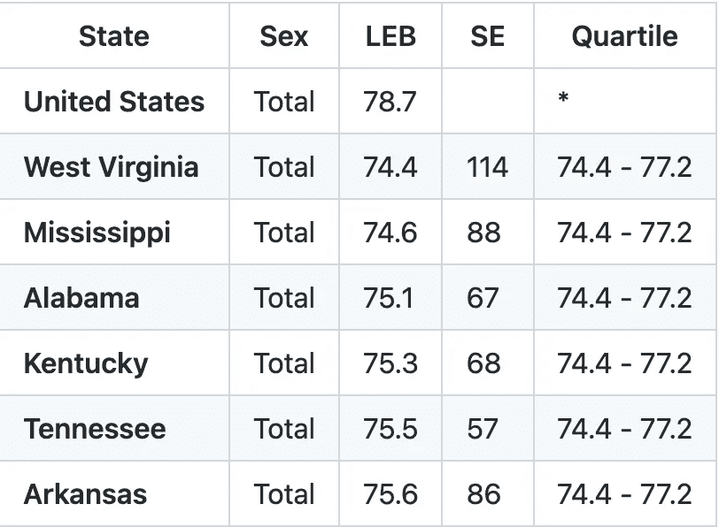
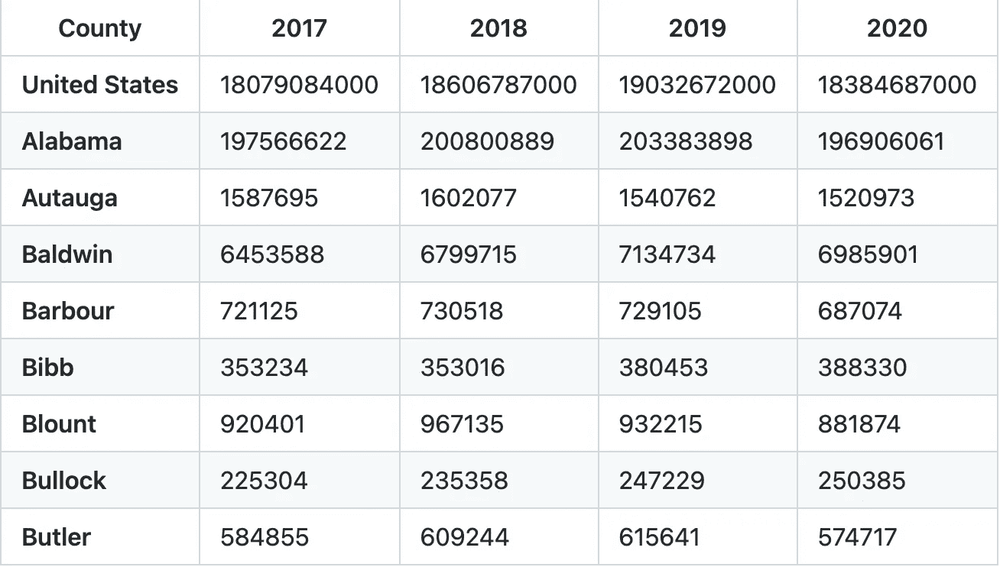
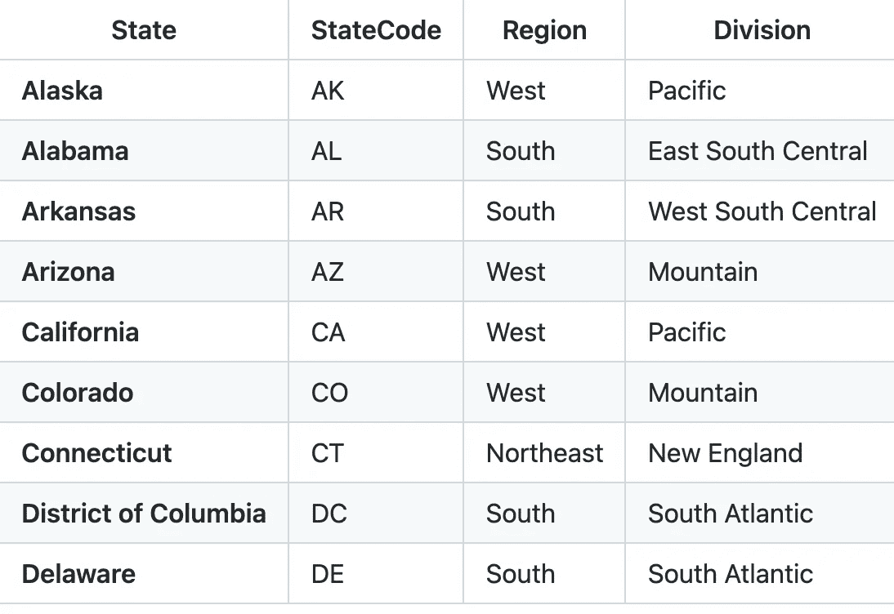
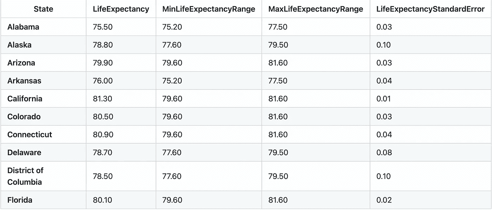
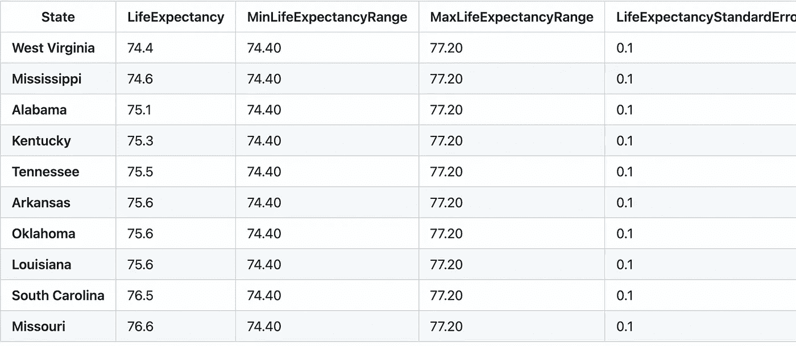
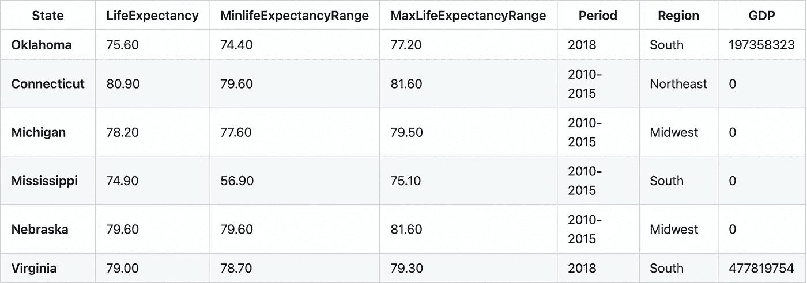

# 从原始数据到干净的数据库:对多功能数据工具包的深入研究

> 原文：<https://towardsdatascience.com/from-raw-data-to-a-cleaned-database-a-deep-dive-into-versatile-data-kit-ab5fd992a02e>

## 数据库ˌ资料库

## 使用通用数据工具包(VMware 最近发布的一个框架)和 Trino DB 的完整示例


马库斯·温克勒在 [Unsplash](https://unsplash.com?utm_source=medium&utm_medium=referral) 上的照片

最近，VMware 发布了一款新的开源工具，名为[通用数据工具包](https://github.com/vmware/versatile-data-kit)(简称 VDK)，可以非常快速地管理数据。该工具允许用几行代码将不同格式的数据接收到一个数据库中。

在我之前的文章中，我描述了一个基本的例子，它使用了 VDK，并且描述了如何安装和运行它。总而言之，您应该:

*   有一个运行的数据库(VDK 以外)
*   在 VDK 中配置数据库接口，包括用户名、口令、主机和端口
*   在 VDK 定义如何使用 SQL 查询或用 Python 实现的更复杂的过程接收数据库中的数据。

一旦您在数据库中获取了数据，您就可以根据需要使用它们，例如，构建有趣的仪表板或可视化。

在本文中，我主要关注一个完整的例子，从数据接收开始，一直到数据处理。该示例使用 Trino 数据库和 MySQL 服务器来存储数据，使用 VDK 来接收数据库中的数据。

下图显示了一个可能的架构，包括 VDK、Trino 服务器和 MySQL 服务器:



作者图片

具体来说，文章组织如下:

*   场景的定义
*   数据库的设置
*   VDK 的数据接收
*   VDK 的数据处理

# 1 情景的定义

该方案的目标是分析美国不同地区的预期寿命，并将它们与该地区的国内生产总值(GDP)进行比较。为了实现这一目标，您应该下载与美国预期寿命相关的数据，并将其与相关的 GDP 合并。

> 这个例子展示了如何通过 VDK 提取和集成这个场景所需的数据。

我们可以使用以下两个数据集，它们都以 CSV 文件的形式提供:

*   [2010-2015 年美国各州和人口普查区的出生时预期寿命](https://catalog.data.gov/dataset/u-s-life-expectancy-at-birth-by-state-and-census-tract-2010-2015)
*   [2018 年美国各州按性别划分的预期寿命](https://catalog.data.gov/dataset/u-s-state-life-expectancy-by-sex-2018)

之前的数据集是在美国政府工程许可下发布的。

除了前面的数据集，我们还可以使用以下附加数据集:

*   [美国各县国内生产总值](https://www.bea.gov/data/gdp/gdp-county-metro-and-other-areas)
*   [美国人口普查局地区和部门](https://raw.githubusercontent.com/cphalpert/census-regions/master/us%20census%20bureau%20regions%20and%20divisions.csv)(摘自[本官方链接](https://www.census.gov/geographies/reference-maps/2010/geo/2010-census-regions-and-divisions-of-the-united-states.html))

前两个数据集分别由美国经济分析局和美国人口普查局发布，两者都在公共许可下提供开放数据。

数据集*2010-2015 年美国各州和人口普查区出生时预期寿命*包含 73，121 条与 2010-2015 年期间美国人预期寿命相关的记录，按州和县划分。

下图显示了数据集的摘录:



作者图片

数据集“2018 年美国各州按性别划分的预期寿命”包含 156 条与 2018 年美国人预期寿命相关的记录，按州和性别(男性、女性、总数)划分。下图显示了数据集的摘录:



作者图片

数据集“美国各县国内生产总值”包含 3，163 条与美国各县实际国内生产总值相关的记录，涉及 2017 年至 2020 年期间。数据集包含许多列。下图显示了数据集的摘录:



作者图片

数据集“美国各县国内生产总值”包含 3，163 条与美国各县实际国内生产总值相关的记录，涉及 2017 年至 2020 年期间。数据集包含许多列。下图显示了数据集的摘录:



作者图片

# 2 数据库的设置

我们将所有数据存储在 Trino 数据库中，作为 MySQL 服务器的接口。 [Trino](https://trino.io/) 是一款用于大数据分析的分布式开源 SQL 查询引擎。它运行分布式和并行查询，速度非常快。对于 Trino 数据库的设置，你可以遵循[我之前的教程](/getting-started-with-trino-query-engine-dc6a2d027d5)。

在本例中，Trino 在本地运行，具有以下最小的`config.properties`配置文件:

```
coordinator=true
node-scheduler.include-coordinator=true
http-server.http.port=8080
query.max-memory=5GB
query.max-memory-per-node=1GB
query.max-total-memory-per-node=2GB
discovery.uri=http://127.0.0.1:8080
http-server.https.enabled=false
```

此外，Trino DB 使用 MySQL 目录，配置如下(文件`mysql.properties`位于 Trino 服务器的目录文件夹中):

```
connector.name=mysql
connection-url=jdbc:mysql://localhost:3306
connection-user=root
connection-password=
allow-drop-table=true
```

最后，这个例子假设 MySQL 服务器上存在一个名为`life-expectancy`的空模式。

# 3 VDK 的数据接收

VDK 使用以下配置运行(`config.ini`):

```
db_default_type=TRINO
ingest_method_default = trino
trino_catalog = mysql
trino_use_ssl =
trino_host = localhost
trino_port = 8080
trino_user = root
trino_schema = life-expectancy
trino_ssl_verify =
```

数据摄取将数据源部分中定义的两个 CSV 表上传到数据库中。对于每个表，通过以下步骤执行数据接收:

*   删除现有的表(如果有)
*   创建新表格
*   直接从 CSV 文件中摄取表格值。

前两步将使用 SQL 语言编写，而最后一步将使用 Python 编写。

每个数据集都将被包含在一个名称与数据集名称相似的表中。例如，[美国出生时预期寿命(按州和人口普查区域)——2010–2015](https://catalog.data.gov/dataset/u-s-life-expectancy-at-birth-by-state-and-census-tract-2010-2015)数据集将被纳入`life_expectancy_2010_2015`表中。

## 3.1 删除现有表格

首先，我创建一个脚本，命名为`01_delete_table_life_expectancy_2010_2015.sql`:

```
**DROP TABLE IF EXISTS** life_expectancy_2010_2015
```

脚本名称前面的数字`01`表示 VDK 框架将把它作为第一个脚本运行。

我还创建了`02_delete_table_life_expectancy_2018.sql`脚本，它删除了`life_expectancy_2018`表，其他脚本删除了`us_regions`和`us_gdp`表。

## 3.2 创建新表

现在，我为新表创建模式，并将其存储在`03_create_table_life_expectancy_2010_2015.sql`脚本中:

```
**CREATE TABLE** life_expectancy_2010_2015 (
   State varchar(32),
   County varchar(32),
   CensusTractNumber varchar(32),
   LifeExpectancy decimal(4,2),
   LifeExpectancyRange varchar,
   LifeExpectancyStandardError decimal(4,2)
)
```

与前面的脚本类似，我创建了`04_create_table_life_expectancy_2018.sql`:

```
**CREATE TABLE** life_expectancy_2018 (
   State varchar(32),
   Sex varchar(32),
   LEB decimal(3,1),
   SE decimal(3,1),
   Quartile varchar(32)
)
```

以及`us_regions`和`us_gdp`表:

```
**CREATE TABLE** us_regions (
   State varchar(32),
   StateCode varchar(2),
   Region varchar(32),
   Division varchar(32)
)**CREATE TABLE** us_gdp (
   County varchar(32),
   Year2017 bigint,
   Year2018 bigint,
   Year2019 bigint,
   Year2020 bigint
)
```

## 3.2 直接从 CSV 文件摄取表格值

最后，我可以接收`life_expectancy_2010_2015`表中的表值。我使用 VDK API 提供的`IJobInput`类。我定义了一个将被 VDK 框架读取的`run()`函数，并在其中编写了摄取代码:

```
import pandas as pd
from vdk.api.job_input import IJobInputdef **run**(job_input: IJobInput): # Read CSV file url = "http://data.cdc.gov/api/views/5h56-n989/rows.csv"
   dtypes = {
      "State": str,
      "County": str,
      "Census Tract Number": str,
      "Life Expectancy": np.float64,
      "Life Expectancy Range": str,
      "Life Expectancy Standard Error": np.float64,
   } df = pd.read_csv(url, dtype=dtypes).replace("'", "''", regex=True)
   df.columns = df.columns.str.replace(" ", "") # Ingest CSV file job_input.**send_tabular_data_for_ingestion**(
      df.itertuples(index=False),
      destination_table="life_expectancy_2010_2015",
      column_names=df.columns.tolist()
 )
```

为了获取数据库中 CSV 的每一行，我使用了`IJobInput`类的`send_tabular_data_for_ingestion()`方法。

我们可以用同样的技术摄取其他数据集。

# 4 VDK 的数据处理

数据处理包括以下任务:

*   清洁桌子
*   合并已清理的表

## 4.1 清洁桌子

清洁`life_expectancy_2010_2015`工作台包括以下两个操作:

*   按县分组记录
*   将列`LifeExpectancyRange`拆分成两个十进制列`MinLifeExpectancyRange`和`MaxLifeExpectancyRange`。

`life_expectancy_2010_2015`工作台的清洗过程的输出被存储在一个名为`cleaned_life_expectancy_2010_2015`的新表中。

前面的两个操作都可以通过 SQL 语句实现:

```
**CREATE TABLE** cleaned_life_expectancy_2010_2015 **AS**(**SELECT** State,
   LifeExpectancy,
   cast(split(life_expectancy_2010_2015.LifeExpectancyRange,'-')[1] AS decimal(4,2)) AS MinLifeExpectancyRange,
   cast(split(life_expectancy_2010_2015.LifeExpectancyRange,'-')[2] AS decimal(4,2)) AS MaxLifeExpectancyRange,
   LifeExpectancyStandardError
**FROM** life_expectancy_2010_2015
**WHERE** County = '(blank)'
)
```

在数据集中，所有带有`County = '(blank)'`的行包含给定县的预期寿命总值。因此，只需选择这些行，我就可以轻松地按县分组。

下图显示了结果表:



作者图片

现在，我打扫桌子。清洁`life_expectancy_2018`工作台包括以下操作:

*   将列`LEB`重命名为`LifeExpectancy`
*   将列`SE`重命名为`LifeExpectancyStandardError`
*   将列`Quartile`分成两个十进制列`MinLifeExpectancyRange`和`MaxLifeExpectancyRange`
*   仅选择带有`Sex = 'Total'`的行。

前面的所有操作都可以通过一条 SQL 语句实现:

```
**CREATE TABLE** cleaned_life_expectancy_2018 AS(**SELECT** State,
    LEB AS LifeExpectancy,
    cast(split(life_expectancy_2018.Quartile,' - ')[1] AS decimal(4,2)) AS MinLifeExpectancyRange,
    cast(split(life_expectancy_2018.Quartile,' - ')[2] AS decimal(4,2)) AS MaxLifeExpectancyRange,
    SE AS LifeExpectancyStandardError **FROM** life_expectancy_2018
  **WHERE** Sex = 'Total' and State <> 'United States'
)
```

下表显示了`cleaned_life_expectancy_2018`表的示例:



作者图片

注意，清理之后，`cleaned_life_expectancy_2010_2015`和`cleaned_life_expectancy_2018`表具有相同的模式。

## 4.2 合并清理后的表格

最后，我准备合并所有的表。我执行以下操作:

*   **垂直合并`cleaned_life_expectancy_2010_2015`和`cleaned_life_expectancy_2018`工作台之间的**；
*   **结果表与`us_regions`和`us_gdp`表之间的水平合并**。

垂直合并意味着将第二个数据集追加到第一个数据集，而水平合并向结果表添加三个新列，称为`Period`、`GDP`和`Region`，结果表称为`merged_life_expectancy`。仅针对带有`Period = '2018'`的记录设置`GDP`属性。对于其他记录，它被设置为`0`，因为它不可用。

```
**CREATE TABLE** merged_life_expectancy **AS**(**SELECT** us_regions.State,
    LifeExpectancy,
    MinLifeExpectancyRange,
    MaxLifeExpectancyRange,
    '2010-2015' AS Period,
    Region,
    0 AS GDP
 **FROM** cleaned_life_expectancy_2010_2015 
     JOIN us_regions 
     ON us_regions.State = cleaned_life_expectancy_2010_2015.State
)**UNION**(**SELECT** us_regions.State,
    LifeExpectancy,
    MinLifeExpectancyRange,
    MaxLifeExpectancyRange,
    '2018' AS Period,
    Region,
    Year2018 AS GDP
**FROM** cleaned_life_expectancy_2018
    JOIN us_regions 
    ON us_regions.State = cleaned_life_expectancy_2018.State
    INNER JOIN us_gdp 
    ON us_gdp.County = cleaned_life_expectancy_2018.State
**WHERE** Year2018 > 100000000
)
```

在第二个`SELECT`语句中，`WHERE`条件指定了`Year2018 > 100000000`。这允许只选择县。

最终的表格如下表所示:



作者图片

# 摘要

恭喜你！您刚刚学习了如何在 VDK 接收和处理数据！这可以通过用 SQL 和 Python 编写简单的脚本来实现。

这个例子的完整代码可在[这里](https://github.com/vmware/versatile-data-kit/tree/main/examples/life-expectancy)获得。

下一步是构建显示处理结果的报告。敬请关注，了解如何操作:)

对于多功能数据工具包的问题或疑问，您可以直接加入他们的[公共 slack workspace](https://join.slack.com/t/versatiledata-rgg2437/shared_invite/zt-tvnl62c3-qP0EUYJZJxb6Ws_eQWyDtQ) 或[他们的邮件列表](mailto:join-versatiledatakit@groups.vmware.com?subject=Invite%20me%20to%20the%20VDK%20mailing%20list)或[在 Twitter 上关注他们](https://twitter.com/intent/follow?screen_name=VDKProject)。

如果你读到这里，对我来说，今天已经很多了。谢谢！你可以在[这篇文章](https://alod83.medium.com/which-topics-would-you-like-to-read-c68314dc6813)中读到更多关于我的信息。

# 相关文章

[](/an-overview-of-versatile-data-kit-a812cfb26de7)  [](/getting-started-with-trino-query-engine-dc6a2d027d5)  [](https://alod83.medium.com/how-to-represent-and-query-hierarchical-data-in-sql-69b6b77577e8) 