# 从原始文本到模型预测，不到 30 行 Python 代码

> 原文：<https://towardsdatascience.com/from-raw-text-to-model-prediction-in-under-30-lines-of-python-32133d853407>

## 快速探索 NLP 管道的快速指南

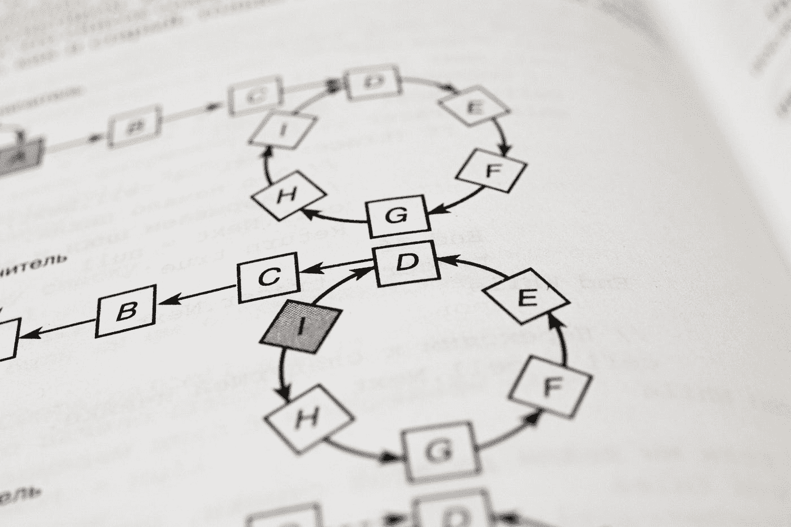

照片由[андрейсизов](https://unsplash.com/@alpridephoto?utm_source=medium&utm_medium=referral)在 [Unsplash](https://unsplash.com?utm_source=medium&utm_medium=referral)

## 介绍

自然语言处理(NLP)是处理人类语言数据的机器学习的子领域。在能够用机器学习模型进行预测之前，处理人类文本通常涉及标准的预处理步骤，如数据清理和将文本转换为数字向量。

在这个故事中，我们将带您浏览一个示例，解释如何使用 [ATOM](https://github.com/tvdboom/ATOM) 库快速处理大量文本文档，并将它们分类到预先确定的主题中。ATOM 是一个开源的 Python 包，旨在帮助数据科学家加快机器学习管道的探索。如果你想对图书馆有一个温和的介绍，请阅读这个故事。

## 加载数据集

我们开始获取文本文档并初始化 atom 实例。我们将要使用的数据是 [20 个新闻组数据集](https://scikit-learn.org/stable/datasets/real_world.html#newsgroups-dataset)，可以使用 sklearn 轻松下载。该数据集包含 20 个主题的大约 18000 篇新闻文章，为了加快计算速度，我们只使用了其中的 5 篇。目标是预测每篇文章的主题。

```
import numpy as np
from atom import ATOMClassifier
from sklearn.datasets import fetch_20newsgroups# Load the dataset (get only 5 topics)
X, y = fetch_20newsgroups(
    return_X_y=True,
    categories=[
        'alt.atheism',
        'sci.med',
        'comp.windows.x',
        'misc.forsale',
        'rec.autos',
    ],
)# atom expects a 2-dimensional array, so reshape to (n_articles, 1)
X = np.array(X).reshape(-1, 1)# Initialize atom
atom = ATOMClassifier(X, y, test_size=0.2, verbose=2)
```

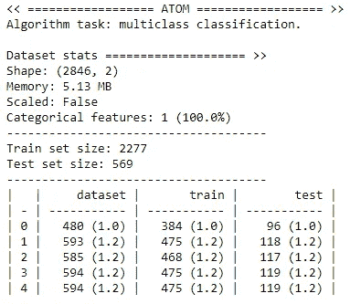

atom 中的数据存储在熊猫数据帧中。注意，我们拥有的唯一特性(包含文章)被自动调用`corpus`。这很重要，因为 atom 的所有 [NLP 方法](https://tvdboom.github.io/ATOM/latest/user_guide/nlp/)只应用于数据集中具有特定名称的列。这种机制允许 atom 将包含文本语料库的数据集与其他非文本特征结合起来(我们不会在本文中使用)。使用`dataset`属性检查数据。

`atom.dataset`

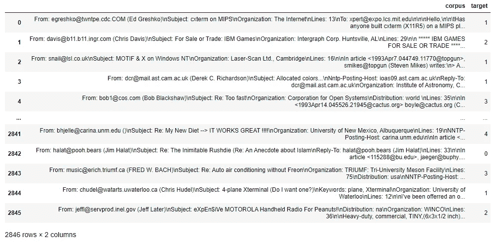

## 文本清理

让我们看看第一篇文章。

`atom.corpus[0]`

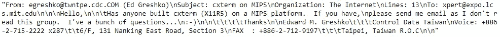

注意它的混乱。文本数据很少干净。无论是从网站上搜集来的还是从纸质文档中推断出来的，通常都填充了与模型无关的信息，比如电子邮件地址、数字、html 标签等..我们可以使用 atom 的[*text clean*](https://tvdboom.github.io/ATOM/latest/API/ATOM/atomclassifier/#textclean)*方法从新闻文章中去除这种“噪音”。该方法对语料库应用以下变换:*

*   *将 unicode 字符解码为 ascii 表示形式*
*   *将所有字符转换为小写*
*   *从文本中删除电子邮件地址*
*   *从文本中删除 URL 链接*
*   *从文本中删除 HTML 标签*
*   *从文本中删除表情符号*
*   *从文本中删除数字*
*   *删除文本中的标点符号*

*`atom.textclean()`*

*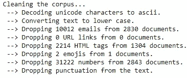*

*使用`drops`属性来检查每篇文章删除了什么。*

*`atom.drops`*

*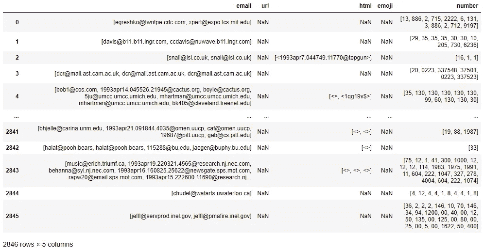*

*现在看看第一篇。*

*`atom.corpus[0]`*

*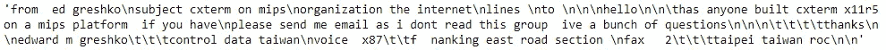*

## *标记化*

*下一步是将文章转换成令牌序列。在这种情况下，单词。我们需要这样做有两个原因:能够使用像词干化或词汇化这样的算法，这些算法要求文档由标记组成，以便知道应该考虑哪些单独的单词；并且能够将文本映射成模型可以接受的数字。*

*`atom.tokenize()`*

*现在每篇文章都由一系列单词组成。*

*`atom.corpus[0][:7]`*

*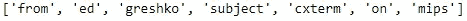*

***提示:**使用 atom 的[*plot _ word cloud*](https://tvdboom.github.io/ATOM/latest/API/plots/plot_wordcloud/)方法对语料库中最常见的术语进行可视化处理。*

*`atom.plot_wordcloud()`*

*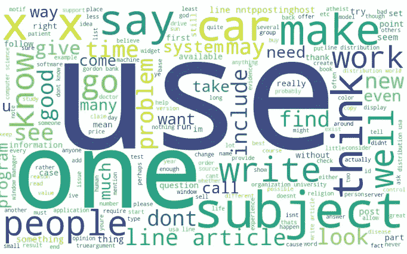*

## *正常化*

*规范化是将单词列表转换为更统一的标准的过程。这有助于减少模型必须处理的不同信息量，从而提高效率。像变元化这样的规范化技术的目标是将一个单词的屈折形式和派生相关形式简化为一个共同的基本形式，例如 universal → universe 或 running → run。*

*我们可以通过删除所有停用词来进一步降低文章的复杂性。停用词是任何自然语言中最常见的词，例如英语中的“the”、“a”、“is”。使用 atom 的[文本*规格化*](https://tvdboom.github.io/ATOM/latest/API/ATOM/atomclassifier/#textnormalize) 方法可以实现规格化和停用词移除。*

*`atom.textnormalize(stopwords="english", lemmatize=True)`*

*还是那句话，我们来看看第一篇文章的前 7 个字。请注意,“从”和“在”不再存在。*

*`atom.corpus[0][:7]`*

*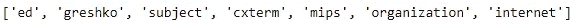*

## *N-grams*

*有时，单词本身的意思和与相邻单词组合在一起的意思不同。例如，当单词“york”直接跟在单词“new”后面时，它的意思与不跟在后面时完全不同。这两个词的组合被称为二元模型。使用`plot_ngrams`方法检查语料库中哪些两个单词的组合是最常见的。*

*`atom.plot_ngrams(ngram=2)`*

*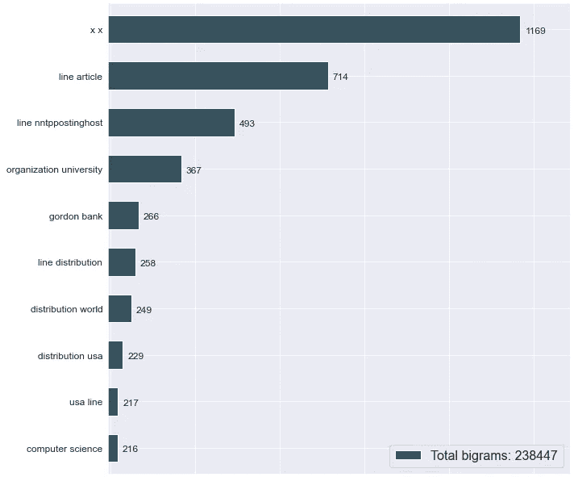*

*Atom 的*

*`atom.tokenize(bigram_freq=200)`*

*二元模型频率为 200 意味着如果二元模型在语料库中至少出现那么多次，就认为它是二元模型。使用`bigrams`属性查看创建了哪些二元模型。*

*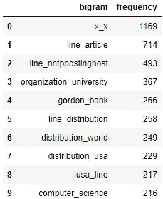*

## *…向量化…*

*文本数据不能直接馈送给算法本身，因为它们中的大多数期望具有固定大小的数字特征向量，而不是具有可变长度的文本文档中的单词。矢量化是将一组文本文档转换成数字特征向量的一般过程。*

*在大型语料库中，一些单词可能非常常见，但携带的关于文档实际内容的有意义信息非常少。如果我们将计数直接输入到分类器中，那些非常频繁的词将会掩盖更罕见、但更有趣的词的频率。使用 [TF-IDF](https://en.wikipedia.org/wiki/Tf%E2%80%93idf) 策略将计数特征重新加权为浮点值。创建的列以它们正在计数的单词命名。*

*`atom.vectorize(strategy="tfidf")`*

*由于在完整的语料库中有许多单词，并且每个单词都有自己的列，所以数据集的维度增加了很多。*

*`atom.shape`*

*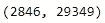*

*为了处理这个庞大的数据集，矢量化方法默认返回稀疏数组的数据帧。*

*`atom.dataset.dtypes`*

*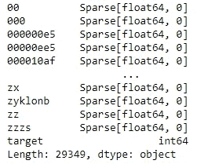*

***信息:**您可以使用该方法的`return_sparse`参数来改变这种行为。请注意，当语料库包含许多单词时，使用 return_sparse=False 会使转换非常缓慢，并占用大量内存。*

## *建模和结果*

*要为我们的数据选择正确的模型，我们需要检查哪些模型具有对稀疏数据帧的本地支持。*

*`atom.available_models()`*

*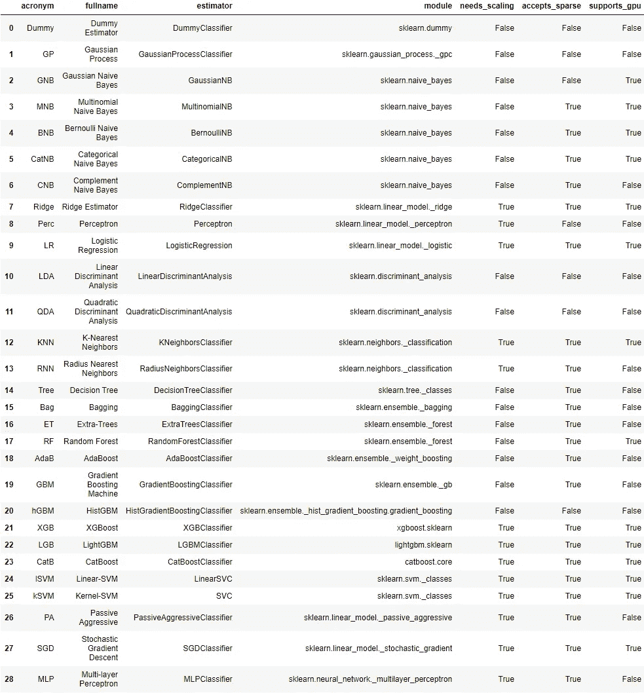*

*看看第 17 行的`accepts_sparse`栏。看起来[随机森林(RF)](https://tvdboom.github.io/ATOM/latest/API/models/rf/) 很适合我们的任务。*

*`atom.run(models="RF", metric="f1_weighted")`*

*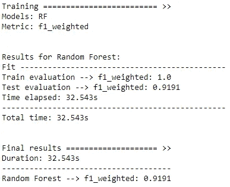*

*就这样，我们训练了一个模型来对文本数据进行预测。使用以下工具快速评估各种指标的结果:*

*`atom.evaluate()`*

*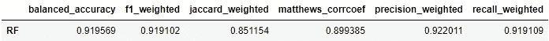*

*该模型似乎总体得分较高。使用 atom 的[绘图方法](https://tvdboom.github.io/ATOM/latest/user_guide/plots/)进一步分析结果。*

*`atom.plot_confusion_matrix()`*

*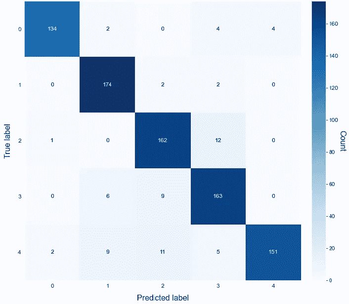*

*ATOM 还集成了 [shap](https://shap.readthedocs.io/en/latest/index.html) 库，可以根据 Shapley 值快速洞察图形。例如，在对第一篇文章进行预测时，查看哪些单词对算法的影响最大。*

*`atom.decision_plot(index=0, target=atom.predict(0), show=10)`*

*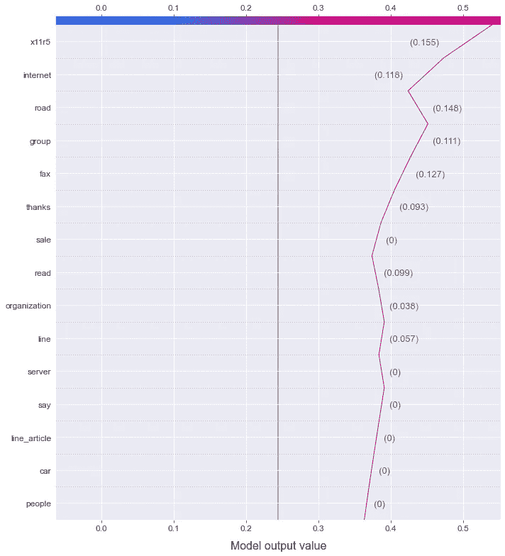*

*或者检查所有文章中哪些词对预测第一个主题最重要:无神论。*

*`atom.beeswarm_plot(target=0, show=15)`*

*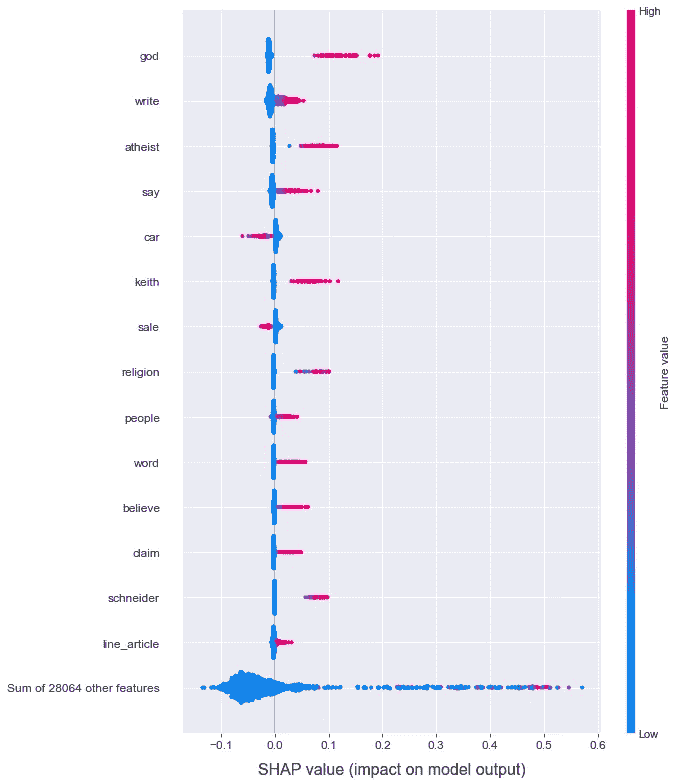*

# *结论*

*我们展示了如何使用 ATOM 包快速探索自然语言数据集。首先，我们将原始文本文档转换成向量，之后，我们训练并评估了一个分类器。以及不到 30 行代码中的所有内容！*

*关于 ATOM 的更多信息，请看一下软件包的文档[。对于 bug 或功能需求，请不要犹豫，在](https://tvdboom.github.io/ATOM/) [GitHub](https://github.com/tvdboom/ATOM) 上提出问题或给我发邮件。*

*相关故事:*

*   *[https://towards data science . com/atom-a-python-package-for-fast-exploration-of-machine-learning-pipelines-653956 a16 e7b](/atom-a-python-package-for-fast-exploration-of-machine-learning-pipelines-653956a16e7b)*
*   *[https://towards data science . com/how-to-test-multiple-machine-learning-pipelines-with-just-the-less-lines-of-python-1 a16 CB 4686d](/how-to-test-multiple-machine-learning-pipelines-with-just-a-few-lines-of-python-1a16cb4686d)*
*   *[https://towards data science . com/from-raw-data-to-we B- app-deployment-with-atom-and-streamlit-d 8df 381 aa 19 f](/from-raw-data-to-web-app-deployment-with-atom-and-streamlit-d8df381aa19f)*
*   *[https://towards data science . com/exploration-of-deep-learning-pipelines-made-easy-e1cf 649892 BC](/exploration-of-deep-learning-pipelines-made-easy-e1cf649892bc)*
*   *[https://towards data science . com/deep-feature-synthesis-vs-genetic-feature-generation-6 ba 4d 05 a6 ca 5](/deep-feature-synthesis-vs-genetic-feature-generation-6ba4d05a6ca5)*

*参考资料:*

*   *[20 个新闻组数据集](http://qwone.com/~jason/20Newsgroups/)是机器学习技术文本应用实验的一个流行数据集，最初由 Ken Lang 为他的[*news weaver:Learning to filter net news*](http://qwone.com/~jason/20Newsgroups/lang95.bib)论文收集。*
*   *这个故事中所有没有说明的图片都是作者创作的。*