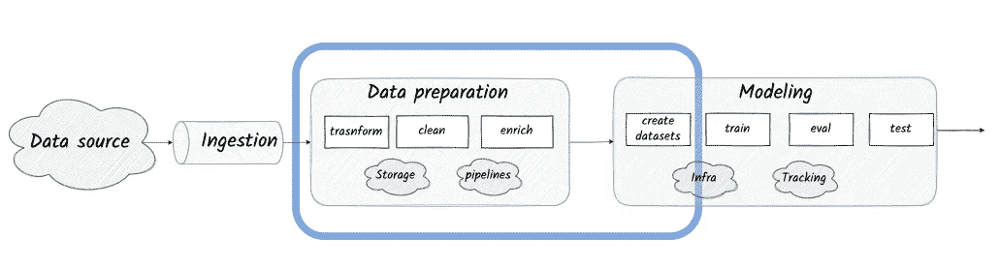
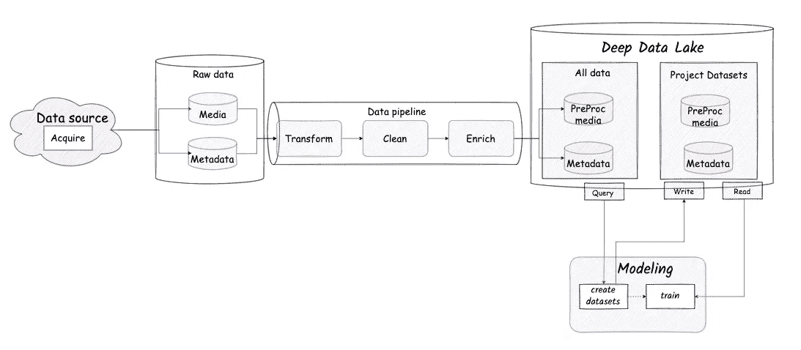
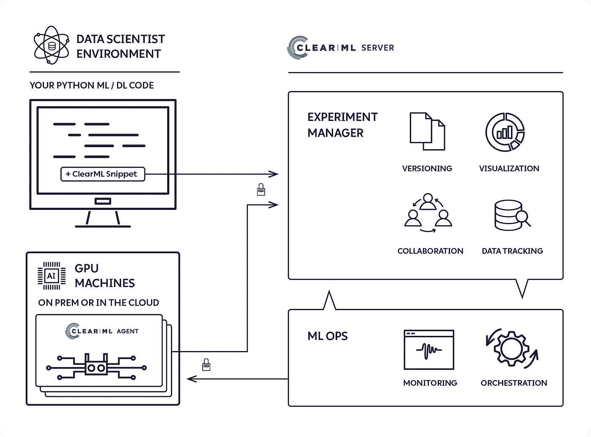
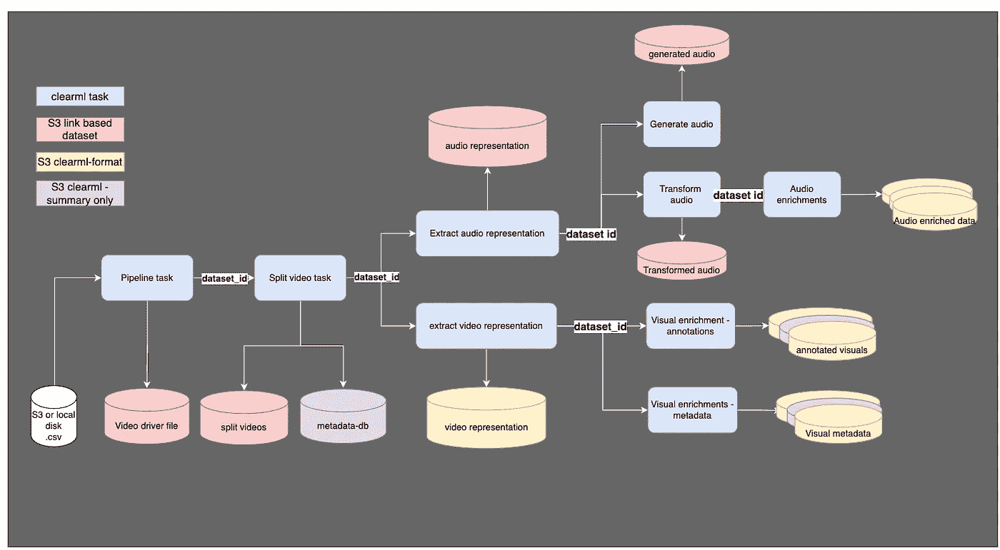
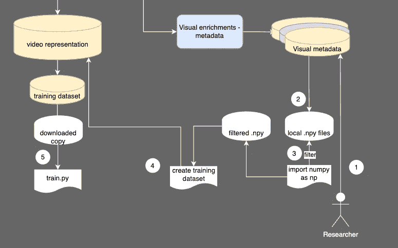
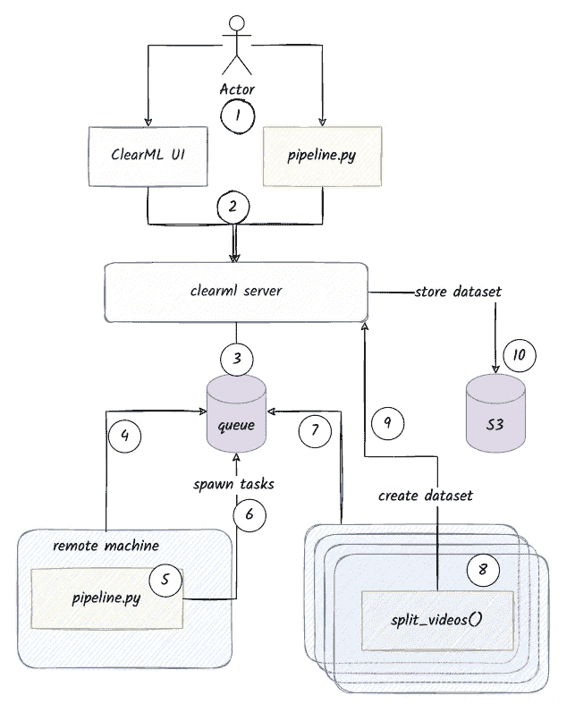

# 从原始视频到 GAN 培训

> 原文：<https://towardsdatascience.com/from-raw-videos-to-gan-training-implementing-a-data-pipeline-and-a-lightweight-deep-learning-6274de917be9>

## 在 AWS 上使用 ClearML 实现数据管道和轻量级深度学习数据湖

# 介绍

[Hour One](https://hourone.ai/) 是一家以人工智能为中心的初创公司，其主要产品是将文本转换成*虚拟人类主持人*的视频。

仅基于文本生成真实、流畅和引人注目的人类演讲者用多种语言说话和打手势的视频是一项具有挑战性的任务，这需要训练复杂的深度学习模型——以及大量的训练数据。

这篇文章描述了我使用 [ClearML](https://github.com/allegroai/clearml) 和 AWS 为 Hour One 构建的数据管道和数据管理解决方案的设计和实现。

该解决方案基于轻量级版本的
[Deep Lake 架构模式](/deep-lake-an-architectural-blueprint-for-managing-deep-learning-data-at-scale-part-i-effafd488e7c)。

视频深度学习的数据管道和数据管理。作者图片

注意:我与 ClearML 项目或其支持者没有任何关系。

# 从视频到准备好的数据集

Hour One 的人工智能模型需要将文本作为输入，并生成逼真的视频作为输出。

实现这一点的一种方法是通过在真人展示各种文本的视频上训练模型。

该模型然后尝试预测视频中的下一帧或帧序列，同时最小化损失函数，这有助于确保输出是真实的和高质量的。

从数据准备和管理的角度来看，这需要:

**将视频数据转换为有用的表示形式—** 使训练人员能够专注于输入的正确“特征”。

例如，以一种用于频谱分析的格式表示音频，或者将视频像素编码成一种可以馈入模型的紧凑格式。

**丰富提供详细监督的数据层—** 天真地，被训练来预测图像的模型可以尝试最小化与地面真实图像的简单像素距离。
然而，这个损失函数可能不是考虑真实性、平滑性或一致性的最佳方式。

为了支持更详细的监督，在训练期间可以使用附加的注释或数据层。
例如，考虑一层关于视频中每一帧中人脸确切位置的信息(“注释”)。

这些层可以由人工注释器以编程方式生成，也可以两者都有。

**清理数据以确保其适合训练—** 例如，删除不包含对着摄像机说话的人的部分。
一些清洗逻辑需要在转换的甚至是丰富的数据上运行。

**捕获元数据** —为了帮助构建多样化且平衡的数据集，我们需要将数据映射到多个领域维度，例如演讲者的性别、照明条件、语音质量等。

元数据可以描述整个视频、视频的片段或视频内非常短的序列，例如帧级别。

作为从源获取数据的一部分，可以提供描述整个视频的一些基本维度。

在其他情况下，需要计算元数据，例如通过附加的深度学习算法对数据进行推断。

**长期存储数据+元数据—** 所有形式的数据都需要长期存储，包括原始的、经过转换和丰富的以及精选的数据集。

**使数据可搜索—** 该解决方案需要允许研究人员通过搜索具有所需属性/维度/元数据组合的实例的数据来快速构建数据集，例如“获取 100 个训练实例，其中多达 40%应该具有闪烁的字符”。

**构建和存储版本化的训练数据集—** 一旦为数据集选择了实例，它就应该以版本化的方式存储，并在需要时被拉入训练机器。

光深湖的视频资料。作者图片

让我们深入了解解决方案每个部分的需求。

# 要求

## 管道

数据流水线子系统的目标是执行处理步骤的 DAG，并发出数据，这些数据随后将被存储在数据管理子系统中。

**输入和触发**

管道的输入是一个文件，其中包含指向原始视频的指针，以及一些关于其内容的元数据。

流水线通常在获取新数据后被触发，并且只处理新的数据增量。

有时，我们可能会选择从头开始对所有数据运行它，或者对输入数据的特定子集运行它。

**加工**

管道应该运行多个异构的数据处理步骤。一些步骤可以运行外部过程，一些可以运行模型的推断，一些可以执行图像或信号处理。

每个步骤的输出可以被过程中的下一个步骤、训练过程或两者使用。

**扩展性和进化**

一些低级处理阶段被认为是相对稳定的，不太可能经常改变。

管道的其他部分，如浓缩逻辑，将继续高速发展——我们需要**允许研究人员在不依赖工程师的情况下在管道**中增加浓缩阶段。

**子 DAG 执行和回填**

当管道逻辑发展时，新的逻辑需要在整个数据语料库上运行。在数据工程中，这通常被称为“回填”或“填充”。

在我们的案例中，由于数据的大小和处理的复杂性，在整个数据语料库上重新运行整个管道是一项昂贵且耗时的工作。

因此，流水线需要支持触发部分执行，即**只运行用户指定的子 DAG** 。

**结果缓存**

作为一个相关的要求，我们希望管道能够“**缓存感知**”——即跳过昂贵的处理阶段，以防自上次执行以来数据、代码和配置没有任何变化。

**输出处理语义**

当对旧数据运行管道时，我们可能会决定覆盖旧数据，或者将输出作为新版本的数据追加。

**横向扩展** 随着数据量的不断增长，我们需要一个能够在多台机器上运行的解决方案**。**

**在这种模式下工作时，应该可以通过 UI 或调度程序调用管道。**

****本地运行** 与此同时，能够在本地将管道作为完全标准的 Python 流程运行非常有用——从源代码、包或 Docker 容器内部运行，而不依赖于云基础设施，也不发布其输出，主要用于开发和本地测试。**

****CPU 和 GPU****

**流水线中的一些阶段执行适合 CPU 的视频裁剪或编码/解码等活动，一些阶段执行深度学习模型的推断(例如，检测演员面部周围的边界框)，这些活动受益于 GPU 加速。**

**用户应该能够以声明的方式指定哪些任务应该在哪个处理单元上运行。**

## **数据管理**

**数据管理子系统的目标是长期存储数据和元数据。此外，它应该:**

1.  **使数据可搜索并可访问以构建数据集**
2.  **以版本控制的方式支持新数据集的创建**
3.  **允许用户下载数据集进行培训**

****存储****

**对于长期存储，我们需要一种可扩展的对象存储技术，如 S3。**

****媒体存储格式****

**我们希望以标准格式存储较大的媒体文件，包括原始文件和预处理文件，以便尽可能使用标准工具(例如. mp4、.哇哇，还有。png)**

****元数据存储和模式** 遵循 [Deep Lake 架构模式](/deep-lake-an-architectural-blueprint-for-managing-deep-learning-data-at-scale-part-i-effafd488e7c)，元数据应该使用提供结构的格式存储，并且是可查询的。**

**同时，我们需要在模式管理中允许高度的灵活性，而不引入复杂或僵化的数据引擎。**

****数据版本化** 媒体文件的底层和繁重的预处理逻辑不会经常改变，如果改变了，通常覆盖以前的版本是安全的。**

**另一方面，丰富逻辑往往会随着时间而变化，在数据足迹方面更轻(想想边界框和地标坐标)，因此它们的输出应该被版本化。**

**训练数据集应该受版本控制。**

# **ClearML 101**

**[ClearML](https://clear.ml/docs/latest/docs/) 是一个开源的 MLOps 项目，它结合了实验跟踪、数据集管理、远程代码执行和用 Python 编写的作业管道。**

****

**ClearML HL 架构。图片来自 ClearML github 项目[https://raw . githubusercontent . com/allegro ai/clear ml-docs/main/docs/img/clear ml _ architecture . png](https://raw.githubusercontent.com/allegroai/clearml-docs/main/docs/img/clearml_architecture.png)**

## **任务和实验跟踪**

**在高层次上，您可以用几行代码来检测 Python 程序，以将其连接到 ClearML。一个被检测的 Python 程序被称为一个 ***任务*** 。**

**当*任务*执行时，例如在您的本地机器上，插装代码自动收集信息，例如命令行参数、git diff 和 latest commit、解释器可用的 Python 包列表，甚至 ML 工具的特定状态，例如 PyTorch 指标。**

**然后，被跟踪的元数据被发送到 ClearML 服务器并存储在那里，可以通过 UI 和 API 访问。**

**您还可以在任务执行期间从代码中显式报告数据。这对于例如在训练过程中跟踪指标是有用的。**

## **远程执行**

**当 ClearML 跟踪一个*任务*时，服务器会存储复制它所需的所有信息——包括在远程机器上运行它。**

**为了在远程机器上执行一个任务，您“克隆”它(通过 UI 或 API 调用)，并把它放在一个*队列中。***

**运行在远程机器上的一个 [*阿根*](https://clear.ml/docs/latest/docs/clearml_agent/) t 轮询新*任务*的队列，一旦它将一个任务出队，它就将其作为一个(本地)Python 进程来执行。运行*代理*的远程机器称为*工作器*。**

## **管道**

**任务的 DAG 被称为 ***流水线。*** 流水线的流程由一个 ***控制器*** 任务——另一个触发任务执行的 Python 函数，在它们之间传递参数和信息。**

***控制器*通常会执行*任务*，将它们发送到 ***队列*** ，在那里它们将被 ***工作器*** *拾取。***

## **数据集**

**一个 ***数据集*** 是一种特殊的*任务*，其中用户报告“数据”而不是像正常实验中那样报告度量。**

**数据可以是任何东西，但通常是存储在某个文件系统上的文件，如挂载的磁盘、NFS 或对象存储。**

**数据集可以用与 Git 类似的方式进行版本化，每次提交版本时，它只存储与以前版本的差异。**

**关于数据集的元数据存储在 ClearML 服务器中，而实际数据(例如数据集中包含的文件)可以存储在您选择的存储设备中，例如 S3 或 NFS 服务器，只要它可供需要下载和使用它的*工作者*机器使用。**

# **为什么是 ClearML**

## **功能适用性**

**ClearML 支持所有主要的功能需求:**

*   **在 Python 中定义和运行媒体处理管道**
*   **在 CPU 和 GPU 上以远程/分布式执行方式运行管道。**
*   **长期存储大量二进制或半结构化文件，并将其管理和保存到数据集中。**
*   **允许下游处理步骤和训练过程容易地使用数据集。**

**ClearML 可以执行所有这些任务。**

**然而，如果你一直在关注，你会注意到 ClearML *并没有*提供一种可以在数据集内存储的数据上运行的查询语言，而这是我们需求的一部分。**

**然而，正如我们将看到的，我们有一个解决这个限制的方案，成功地完成了工作。**

## **赞成的意见**

**虽然有许多工具可以实现这一功能，但 Hour One AI 团队已经采用 ClearML 进行实验跟踪。**

**与此同时，该团队在运行关系数据仓库或云基础设施方面的经验要少得多，因此该工具的 Pythonic 式和熟悉的界面对其有利。**

**作为一个更普遍的优势，该工具是开源的，并且有一个活跃的社区。**

**最后，我们知道 ClearML 非常灵活，一旦你掌握了任务和远程执行机制，你就可以构建非常复杂的工作流——所以我们知道我们可以让它工作。**

## **骗局**

**该工具的自动特性是有代价的——当事情不按预期运行时，需要时间来理解发生了什么。**

**调试没有按预期执行的 ClearML 代码需要打开工具的代码，通过它进行调试，在 slack 上提出问题，并且通常具有分布式计算、云 API、Python 依赖管理、docker 内部机制等方面的工作知识。**

**退一步说，文档可能是不完整的。**

**最后，灵活性也是一个缺点——因为 ClearML 不是一个固执己见的工具。这意味着你通常可以让它做你想做的事情，但你需要知道你在做什么才能让你的工作流有意义。**

# **系统设计**

## **高水平（位）**

*   **该工作流被实现为一个 ClearML ***管道*** (具体来说——使用 [PipelineDecorator](https://clear.ml/docs/latest/docs/pipelines/pipelines_sdk_function_decorators/) )。**
*   **流水线中的每个 ***任务*** 以一个 ***数据集*** ID 为输入，生成一个或多个 ***数据集*** 作为输出。**
*   **关于生成数据的元数据(包括世系)长期存储在 ***数据集中。*** 数据本身以多种不同的格式驻留在 S3 上。**
*   **使用 ***ClearML 队列*** 和 ***自动缩放器*** 来缩放流水线**
*   **大多数其他需求(缓存、子 DAG 执行、使用相同的代码库在本地和远程运行)都是通过仔细分离关注点以及使用低级 ClearML API 来实现的。**

## **逻辑流程**

**按照图表从左到右:**

*   **管道由一个参数触发，该参数将管道指向一个包含原始视频链接的文件。
    文件被添加到代表“所有原始数据”的数据集中。**
*   **第一个任务是根据文件中存在的元数据将原始视频分割成更短的部分(“片段”)。
    结果是分割的视频和元数据文件，每个都存储为 ClearML 数据集。**
*   **下一步是对来自分离视频的视频和音频数据的基本预处理。
    每个都存储到 ClearML 数据集中。**
*   **进一步丰富和净化音频和视频信号——另外约 10 项任务。**

****

**管道逻辑流和输出数据集。作者图片**

## **数据管理**

*   **每个*任务*的每次运行都会生成一个或多个独立的 ClearML *数据集*。**
*   **每个*数据集*对象包含一个指向*任务*的指针，任务为沿袭创建了数据集*对象(反之亦然)。
    这使我们能够提取特定管道运行产生的所有不同数据集。***
*   **每个数据集包含其包含的视频片段的索引。**
*   **大型媒体文件以它们的标准格式存储在 S3 上，ClearML *数据集*使用[外部文件](https://clear.ml/docs/latest/docs/references/sdk/dataset/#add_external_files)机制保存它们在 S3 上的位置的引用。**
*   **较小的文件被克隆并以 ClearML 格式存储(也在 S3 上)。**

****元数据模式和查询处理****

**正如上面所讨论的，我们希望允许研究人员在不需要了解关系数据库和其他外部工具的情况下轻松地发展模式。**

**此外，管道计算的许多元数据是半结构化的，例如，视频中每一帧的边界框或面部标志。**

**数据的结构使得通过关系查询引擎进行查询有点困难。**

**我们决定避免向解决方案中添加另一个移动部分，并保持它纯粹基于 ClearML。下面是我们实现查询的方法:**

1.  **研究者获得他们想要查询的数据集 id 的列表。典型地，这些将包括元数据或注释(不是媒体)。**
2.  **使用 ClearML 工具，用户下载这些数据集并将其合并到本地数据集副本中。
    例如——获取代表人脸边界框和界标的数据集。**
3.  **研究人员使用 numpy 或 Pandas code 等标准工具执行“查询”,以便选择她想要训练的数据。
    例如，迭代表示面部边界框的 Numpy 数组，并且仅过滤掉边界框的总面积大于 X 并且所有界标都落在边界框内的元素。
    该“查询”结果中的每个元素将包含一个指针，该指针指向它所源自的帧和视频。**
4.  **研究人员以编程方式创建一个新的数据集，其中包含 ClearML 中经过过滤的视频。**
5.  **稍后，训练代码将数据集从(4)下载到本地磁盘，并开始训练。**

****

**使用 ClearML 数据集的查询流。作者图片**

**实际上，构建数据集的过程涉及满足数据集结构约束的线性规划。**

## **基于远程和集群的执行**

**该过程工作如下:**

1.  **用户触发管道执行——通过在她的机器上运行管道或者通过 UI**
2.  **ClearML 服务器接收呼叫**
3.  **ClearML 服务器将代表流水线逻辑( ***【控制器】*** )的任务的执行排入 ***队列*****
4.  **运行在某台机器上的一个 ***代理*** 拉这个任务**
5.  *****代理*** 开始执行管道方法代码。**
6.  *****控制器*** 为流水线中的每一步产生 ClearML ***任务*** ，并将它们放入 ***队列*****
7.  **额外的工人机器拉出这些 ***任务*** 并在本地启动它们**
8.  **每个任务逻辑调用 ClearML 数据集 API 来创建它的输出 ***数据集*** ，其中元数据存储在 ClearML 服务器上，实际数据存储在 S3 上。**

****

**带有远程任务执行的 ClearML 管道。作者图片**

****自动缩放****

**让数十台机器持续运行以等待任务排队是没有意义的。**

**ClearML 提供了一个自动缩放器，能够根据队列的状态上下旋转机器。**

**自动缩放流程非常复杂:**

1.  **“自动缩放逻辑”实际上是一个 ClearML 任务，它被放在一个专用队列中(例如“DevOps”队列)。**
2.  **一台专用的机器(总是运行的)运行一个代理来监听这个队列。**
3.  **代理选择自动缩放任务，该任务基本上永远运行**
4.  **任务逻辑包括轮询队列和使用配置，为每个队列启动各种类型的机器**
5.  **使用云提供商 API(例如 AWS 上的 Boto3)来启动机器。**
6.  **衍生的机器有一个[用户数据](https://docs.aws.amazon.com/AWSEC2/latest/UserGuide/user-data.html)启动脚本，该脚本用凭证设置它们，并以守护模式启动 ClearML 代理**
7.  **启动脚本完成后，代理将监听队列**

**小字:**

*   **秘密管理由你负责。ClearML 希望您输入 AWS 凭证和 git。ssh 凭证保存到一个配置文件中，并将其保存在 ClearML 服务器中——从基本的安全实践来看，这是行不通的。**
*   **代理需要访问 S3，因此新机器需要能够承担具有适当权限的角色。**
*   **用户数据脚本是以非常间接的方式生成的——从配置到自动缩放代码到 AWS API 调用等等。任何错误都很难修复/测试。**

**我们必须找到替代解决方案，例如，使用适当的实例配置文件，并将机密存储在机密管理解决方案中。**

****支持 GPU 和 CPU 任务****

**这是通过两个队列实现的，一个用于 CPU 任务，一个用于 GPU 任务。**

**每个任务(Python 函数)都用它应该被发送到的队列的名称进行了注释。**

## **代码级设计笔记**

**管道代码库非常简单。以下是我们构建管道的伪示例。**

****第 7–8 行—** 主控制器逻辑有一个*pipeline decorator . pipeline()decorator***。**此外，它的参数(通常解析自命令行参数)应该可以使用 json 或 pickle 进行序列化。**

****第 9 行** —任何导入都应该在函数内部执行(远程运行时需要)。**

****第 13 行** —我们使用一个工厂来创建一个“追踪器”对象。**追踪器是大部分魔法发生的地方。**它有两个实现——一个本地跟踪器(或多或少是无操作的),和一个 ClearML 跟踪器(实际上针对 ClearML 执行调用)。**

**基于命令行标志实例化正确的类。**

****第 15–19 行** —该流程通过在方法(任务)之间传递数据集 id 来实现。**

**当这些代码以远程模式在 ClearML 上运行时，这些调用触发远程任务的创建，并将它们所依赖的先前任务的结果发送给它们。**

**现在让我们来分析一下任务:**

****第 1 行** —该任务是一个带有 ClearML 装饰器的纯 Python 函数。**

****第 3–5 行** —该函数执行导入，如果我们希望能够远程运行它，就需要执行导入，然后它初始化自己的**跟踪器**实例。**

****第 7–9 行**-跟踪器对象负责获取缓存的结果(如果存在)，或者，如果不存在，则将输入数据集下载到本地文件夹。**

****第 14–15 行** —使用跟踪器，我们将第 11–12 行生成的数据上传到名为“split_videos_media”的 ClearML 数据集。**

****本地运行****

**要打开本地运行，我们需要在管道方法之前调用*pipeline decorator . run _ locally()*。**

**还支持其他一些运行模式，比如:在本地运行管道任务，将任务作为本地进程或远程任务运行。**

****仅在子 Dag 上运行****

**这也由 tracker 对象处理，它能够遍历 DAG 并自动跳过所有不需要的任务。**

****血统追踪****

**tracker 对象用管道运行 ID 标记所有任务，并用它创建的数据集列表标记每个任务——这些数据集作为工件存储在 ClearML 中。**

****附加功能****

**跟踪器负责所有的命名、数据收集和报告约定，以便任务作者可以专注于他们的业务逻辑。它还能够将外部任务作为监听器附加到管道执行中，按计划运行等等。**

# **摘要**

**为训练深度学习模型准备大规模媒体数据需要对原始数据运行多个处理和浓缩步骤。**

**它还要求以一种结构良好的方式存储处理过的数据，这种方式支持版本控制，并使研究人员能够查询数据以构建数据集。**

**ClearML 可以用来实现以上所有功能。**

**它的亮点在于其纯粹的 Pythonic 接口、直观的数据集范式以及对许多非功能性需求的支持，如自动伸缩，尽管这些都是有代价的。**

**虽然 ClearML 没有提供数据查询机制，但它仍然可以组织数据，以便拉动数据并在本地执行查询可以完成工作，特别是如果查询发生在数据生命周期中定义明确的点上。**