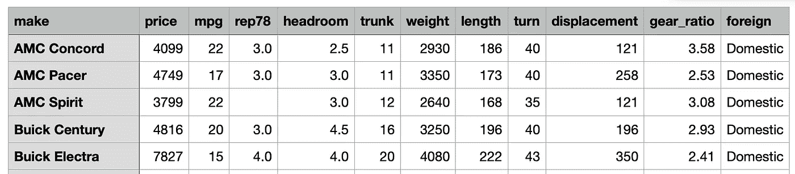
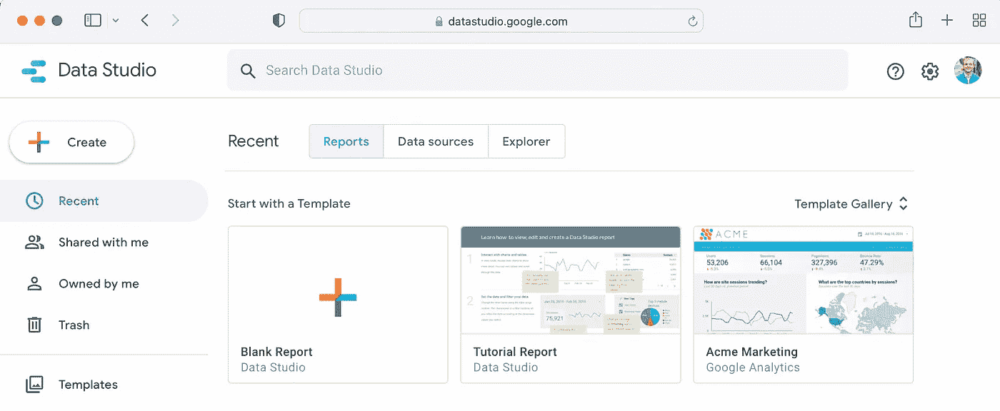
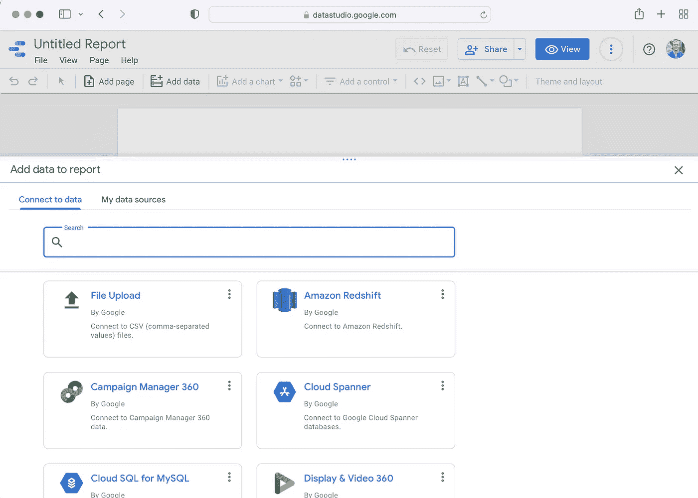
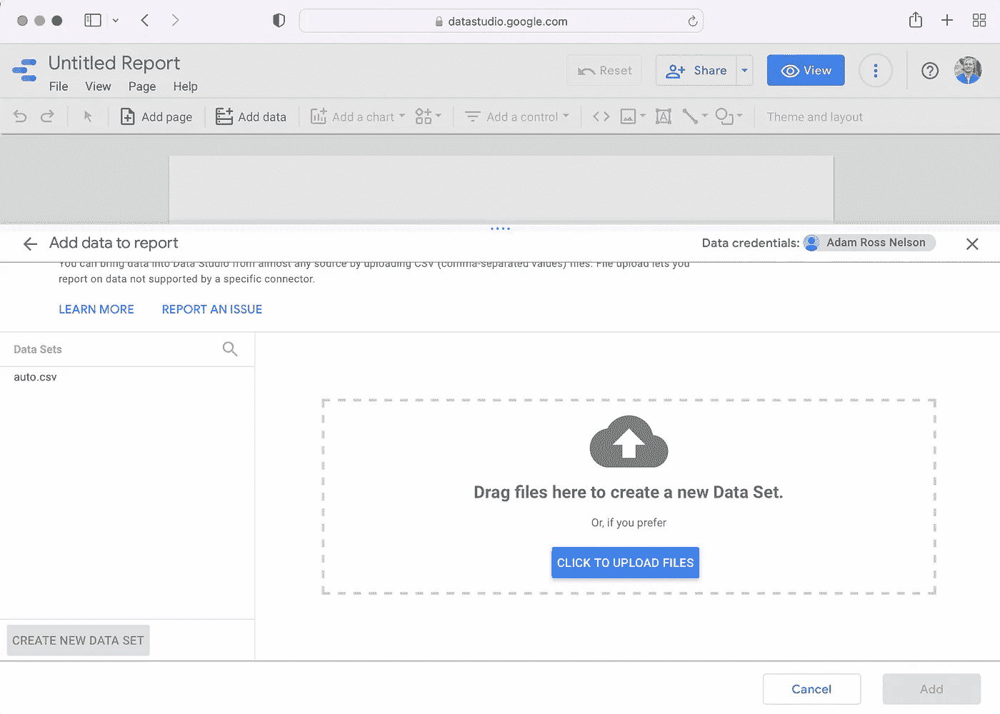
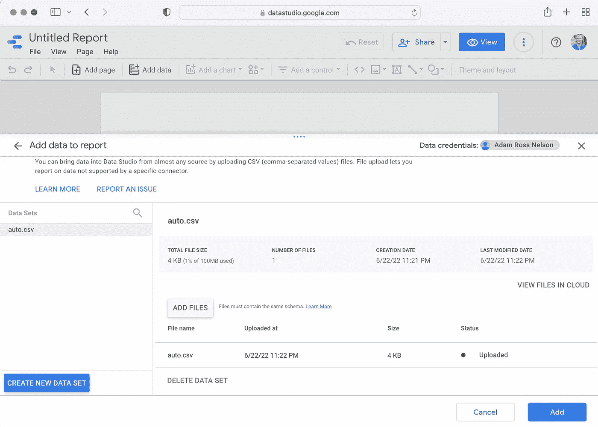
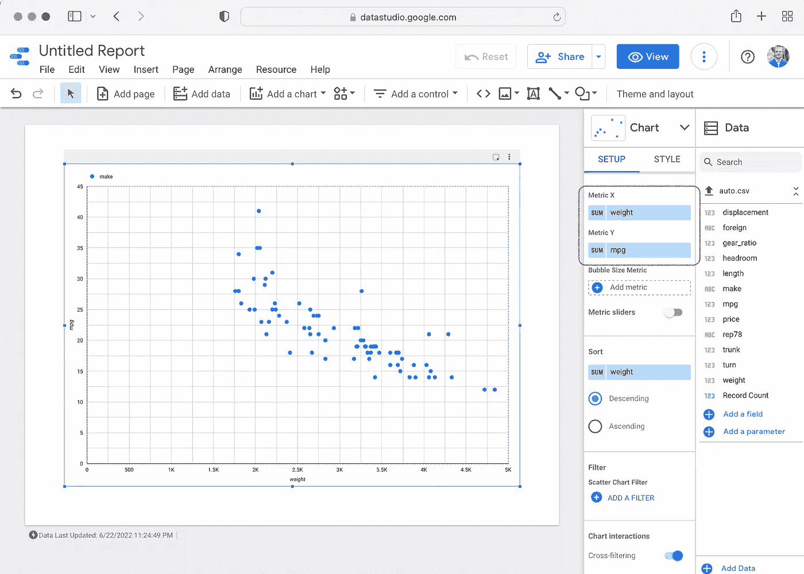
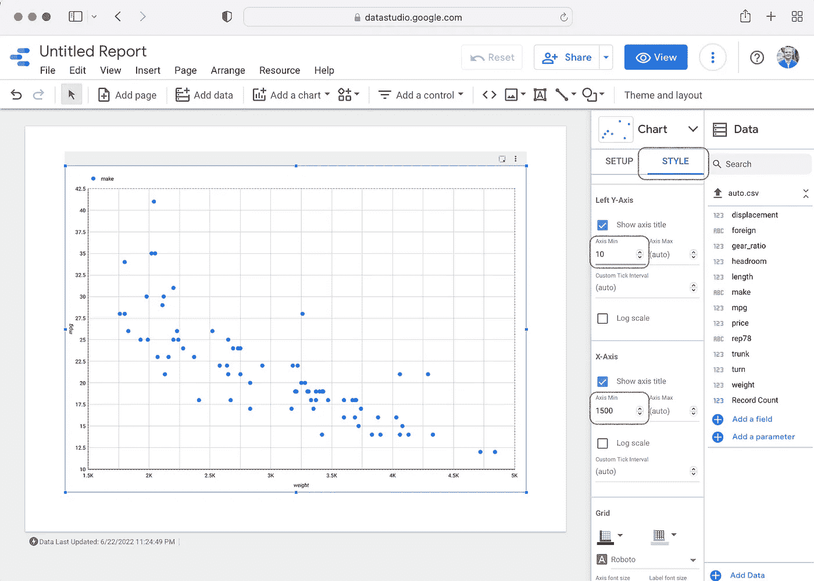
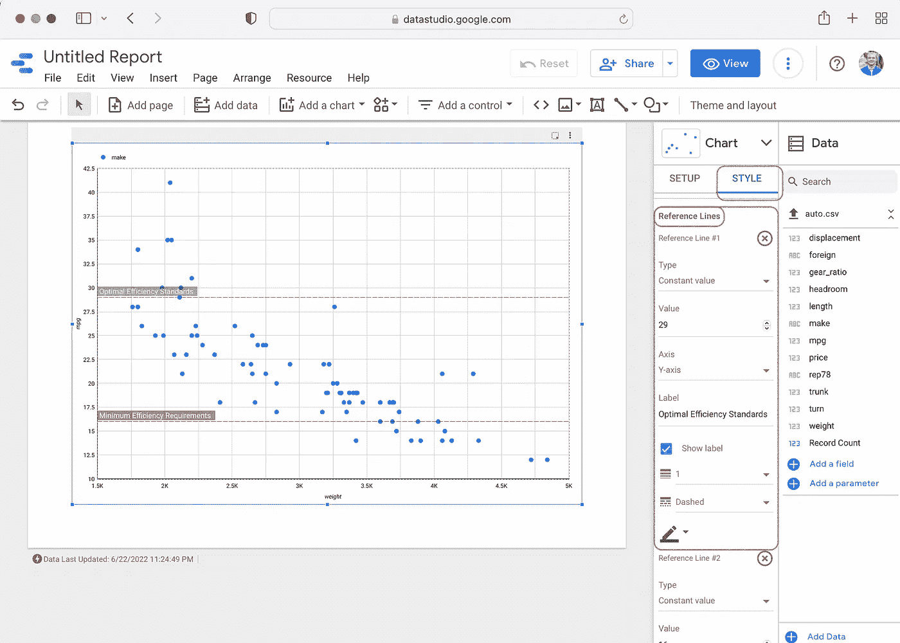
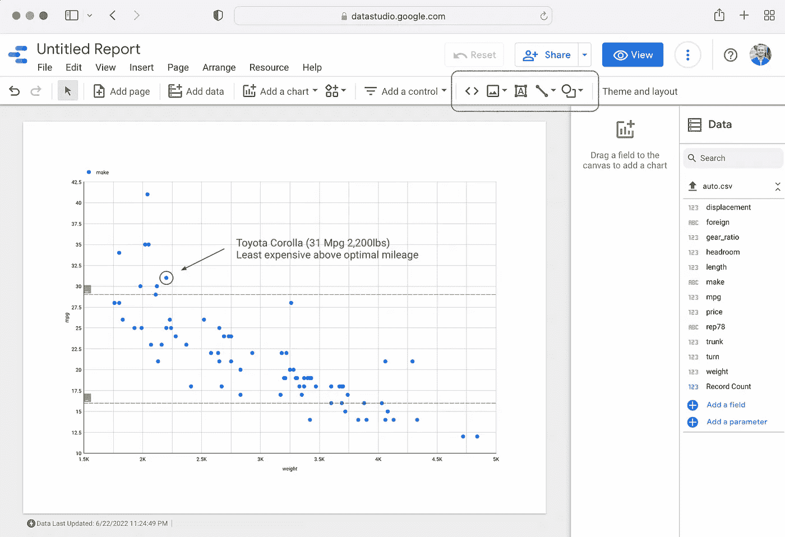

# 从散点图到故事:谷歌数据工作室版

> 原文：<https://towardsdatascience.com/from-scatter-plot-to-story-google-data-studio-edition-ff1bd1ac3d96>

## 通过在 Google Data Studio 中增强您的散点图来讲述完整的故事

TLDR:本文之前的另外三篇配套文章都展示了如何用 Python 或 Stata 代码以编程方式生成散点图。如果你对编写计算机代码不感兴趣，但是你对通过一个简单的散点图讲述一个完整的故事感兴趣，这篇文章适合你。

# 概观

出于对一个简单想法的极大热情，这篇文章至少有三个其他版本。文章的每个版本都展示了将一个简单的散点图转换成完整故事的过程。每篇文章都关注不同的工具。有一款 [Seaborn 版](/from-scatter-plot-to-story-the-seaborn-edition-fb15f3c4cd72)。有一个 [MatplotLib 版](https://pub.towardsai.net/from-scatter-plot-to-story-the-base-matplotlib-edition-21e499dad421)。而且还有一款 [Stata 版](/three-datasets-i-often-use-as-examples-c70ec5b2f793)。

现在我介绍谷歌数据工作室版。正如我先前解释的那样:

> 散点图是许多分析师和数据专家的重要工具。它们说明了两个(或更多)变量之间的关系。它们很快就会生成。它们很容易解释。

如果你还不知道，Google Data Studio 是一个简单、强大、免费的数据可视化工具。你可以在[datastudio.google.com](https://datastudio.google.com)了解更多。谷歌关于这个工具的信息说:

> 你的数据很漂亮。使用它。
> 利用交互式仪表盘和漂亮的报告激发更明智的业务决策，释放数据的力量。既轻松又免费。

要理解这篇文章背后的故事，首先要了解一些背景知识。

# 背景

这个项目的假设目标是审查一个车辆列表，并决定哪一辆车将是为扩大公司车队而购买的最佳车辆。有一个假设的指导方针，确定最低车辆效率为每加仑 16 英里。还有另一个假设的指导方针，确定 29 英里每加仑为最佳车辆效率。耐久性和“韧性”也是车辆选择的一个重点。


由[古斯塔沃](https://unsplash.com/@natura_photos?utm_source=medium&utm_medium=referral)在 [Unsplash](https://unsplash.com?utm_source=medium&utm_medium=referral) 上拍摄的照片

要访问该项目的数据，您需要在 python 中运行以下代码行。运行下面几行代码后，您将拥有 csv 文件中的汽车数据集。

```
import pandas as pddataurl = 'http://www.stata-press.com/data/r15/auto.dta'df = pd.read_stata(dataurl)df.to_csv('auto.csv', index=False)
```

下面是数据的前五个观察结果如何出现在大多数 csv 文件阅读器中。



图片鸣谢:作者截屏 auto.csv。

# Google Data Studio 入门


图片来源:作者对 datastudio.google.com 的截屏。

如果你还没有使用谷歌数据工作室，在 datastudio.google.com 很容易上手。当您到达并登录后，您将看到以下屏幕和选项。



图片来源:作者登录后 datastudio.google.com 的截屏。显示创建新的“空白报告”、“教程报告”或“acme 营销”报告的选项。

要继续本指南，请选择“空白报告”选项。选择“空白报告”选项后，您将看到另一个类似于下图的屏幕。



图片来源:作者选择“空白报告”后 datastudio.google.com 的截屏显示了连接多个数据源的选项，包括“文件上传”选项。

要继续本指南，请选择“文件上传”选项。点击“文件上传”选项后，你会看到一个类似于下图的屏幕。



图片来源:作者选择“文件上传”后 datastudio.google.com 的截屏显示上传数据源的选项。

上传文件后，你会看到另一个类似如下的屏幕。还需要单击屏幕右下角的“添加”按钮。单击“添加”按钮会将数据添加到您的报告中。



图片来源:作者上传 CSV 文件并选择“添加”数据到您的报告后的 datastudio.google.com 截屏。在继续之前，请务必单击“添加”按钮。

将自动数据添加到报告后，下一步是添加图表。下图显示了添加散点图(或散点图)后报告的外观。要添加此图表，请使用报表顶部菜单/功能区中的“添加图表”按钮。



图片来源:作者在上传 CSV 后以及更改 y 轴和 x 轴以显示车辆效率(mpg)和重量之间的关系后对 datastudio.google.com 的截屏。

要确保 mpg 数据沿垂直 y 轴运行，重量沿水平 x 轴运行，请使用报告右侧的设置选项卡(在红色圆角框内)。

这个过程的下一步将是调整图表的范围。要调整图表的范围，请切换到样式选项卡。如下所示，在红色圆角框中进行编辑。



图片来源:作者在上传 CSV 文件、更改 y 轴和 x 轴变量以及调整 y 轴(10 到 42.5mpg)和 x 轴(1500 到 5,000 lbs)的范围后拍摄的 datastudio.google.com 的屏幕截图。

具体来说，上面显示的是散点图的一个版本，控件上有三个红色圆角框。第一个红色框突出显示“样式”选项卡。“样式”选项卡将提供编辑轴范围的权限。如第二个红框所示，我已经将 y 轴的最小值更改为 10 mpg，将 x 轴的最大值更改为 1,500 lbs。

# 添加参考线和注释

到目前为止，上述数据可视化提供了关于车辆列表的大量信息。我们知道最小和最大效率以及最小和最大车辆重量。我们还看到，随着重量的增加，效率下降。

这是大量的信息！然而，为了讲述一个完整的故事，这张图表有一点不足。有太多未回答的问题。这个练习的目标是制作一个视觉效果，观众可以看到并快速理解一个完整的故事。

为了完成这个故事，我们可以添加参考线和注释。第一步将是在最低和最佳效率水平添加参考线。下图显示了(在红色圆角框内)如何在 Google Data Studio 中向图表添加参考线。



图片来源:作者在上传 CSV 文件、更改 y 轴和 x 轴变量以及调整 y 轴和 x 轴的范围后拍摄的 datastudio.google.com 的屏幕截图。这张图片上的红框显示你可以在谷歌数据工作室的图表上添加参考线。

在 Google Data Studio 的“style”选项卡中，有一些选项可以让你调整图表，包括添加参考线的选项。在添加参考线的选项中，还有向参考线添加注释或“标签”的选项。这些选项还允许更改参考线的颜色。

# 注释特定的数据点

最后一步是注释特定的数据点。要注释的特定数据点是最能满足所需车队车辆要求的车辆。在这种情况下，它将是丰田花冠，每加仑效率为 31 英里，重量为 2，200 磅。

为了添加最终的注释，Google Data Studio 提供了添加文本块、线条、箭头和其他形状的机会。下图显示了(在圆角红色框中)文本块、线条、箭头和形状控件。



图片来源:作者截屏 datastudio.google.com，散点图显示了车辆效率和车辆重量之间的关系。红色方框显示了 Google Data Studio 的文本块、线条、箭头和形状工具。

通过添加带有“丰田卡罗拉(31 Mpg 2，200 lbs)租金昂贵，最佳里程”字样的文本块，为最符合车队车辆选择标准的车辆创建注释。

# 感谢阅读

你准备好了解更多关于数据科学职业的信息了吗？我进行一对一的职业辅导，并有一份每周电子邮件列表，帮助专业求职者获取数据。联系我了解更多信息。

感谢阅读。把你的想法和主意发给我。你可以写信只是为了说声嗨。如果你真的需要告诉我是怎么错的，我期待着尽快和你聊天。推特:[@ adamrossnelson](https://twitter.com/adamrossnelson)LinkedIn:[亚当罗斯尼尔森](https://www.linkedin.com/in/arnelson/)。