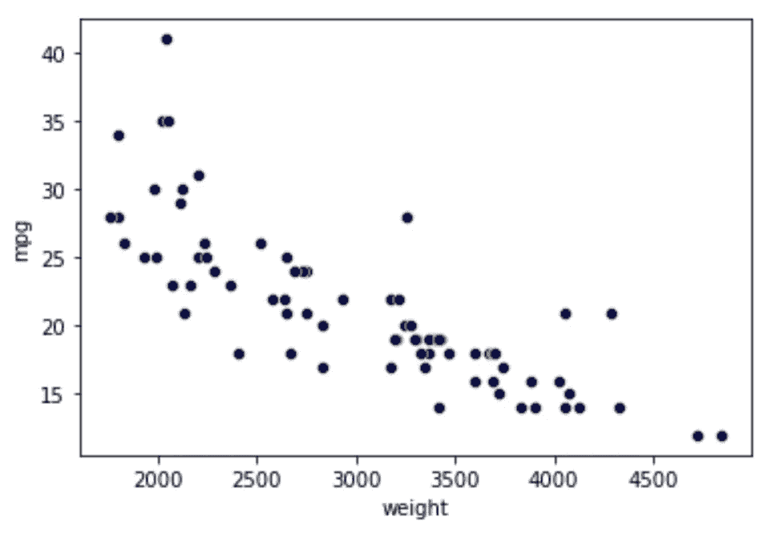
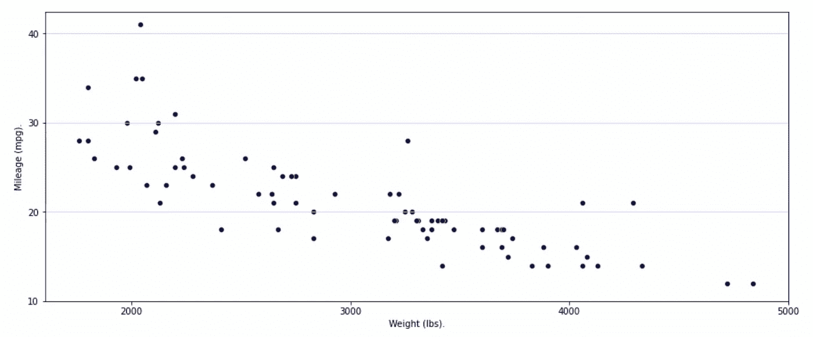
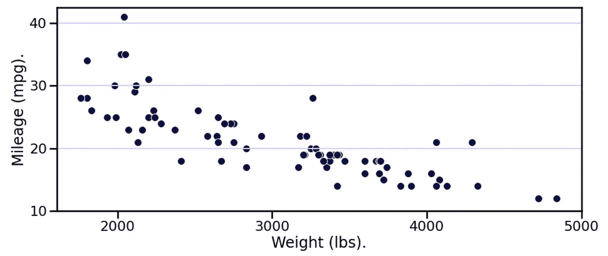
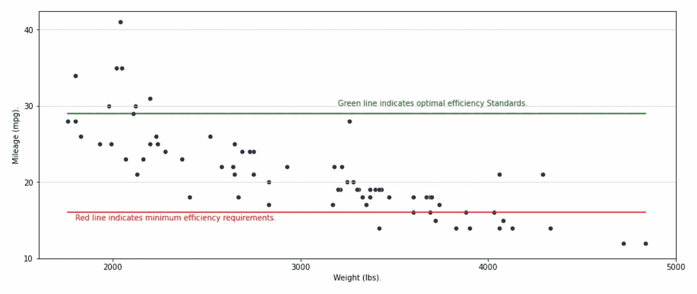
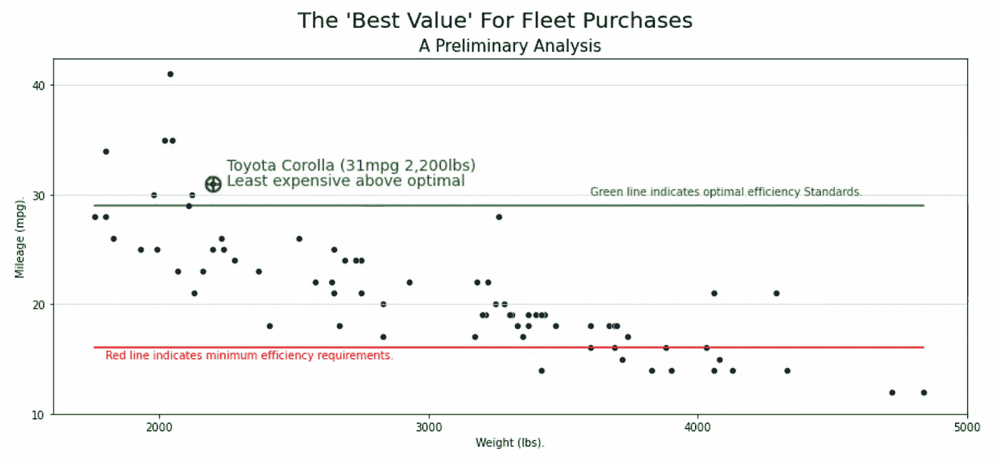

# 从散点图到故事:Seaborn 版

> 原文：<https://towardsdatascience.com/from-scatter-plot-to-story-the-seaborn-edition-fb15f3c4cd72>

## 通过增强散点图讲述完整的故事

# 概观

就绘图而言，散点图是最受欢迎的。它们迅速揭示了两个(或更多)变量之间的关系。如果做得好，散点图可以很快传达给观众一个完整的故事。你的目标是让你的听众对自己说…

> 我们知道现在该做什么…

理想情况下，你的散点图将在瞬间激发上述意识。这篇文章将展示如何将你的可视化从一个简单的散点图变成一个完整的故事。这是 Seaborn 版。后续文章将在基础 Matplotlib 和 Stata 中展示相同的内容。

# 背景

你的工作是帮助决定你的公司应该购买什么样的车辆，因为它希望扩大其企业车队。还有，现在是 1978 年。我们假设现在是 1978 年，因为我们有这一年的数据。

我以前写过这些数据。

[](/three-datasets-i-often-use-as-examples-c70ec5b2f793)  

这些数据告诉我们大约 74 辆车。我们知道每辆车的品牌、价格、效率(mpg)和其他因素。

我们公司规定最低效率要求是每加仑 16 英里，但我们的最佳效率标准是每加仑 29 英里。分析任务是在最佳效率标准之上找到最具成本效益的车辆，同时也是最重的(将是最重型的)。

# 入门指南

最容易查看的图是简单的散点图。在 Seaborn 的帮助下，看起来像这样:

```
import pandas as pd
import matplotlib.pyplot as plt
import seaborn as snsdf = pd.read_stata('[http://www.stata-press.com/data/r15/auto2.dta'](http://www.stata-press.com/data/r15/auto2.dta'))plt.figure()
ax = sns.scatterplot(data=df, 
                     x="weight", y="mpg", 
                     color = '#060b3f')
plt.show()
```

对于下面的结果(这不是很有帮助，也不是有益的，也不是艺术):



作者的再现。使用此处指定的数据和代码。

# 尺寸、比例、大小和标签

美化这种视觉效果的一些首要任务是:

*   更改尺寸(更加水平，以适合我们的目标 8.5 x 11 英寸页面报告。
*   指定将减少混乱的刻度和刻度线。
*   添加精细的网格线，帮助读者将各个数据点与它们在 y 轴上的位置联系起来。
*   并更新轴标签以提供更好的信息。

```
plt.figure(figsize = (15,6))
ax = sns.scatterplot(data=df, 
                     x="weight", 
                     y="mpg", 
                     color = '#060b3f')
ax.set(xlabel='Weight (lbs).', ylabel='Mileage (mpg).')
ax.yaxis.grid(True, color = '#CCCCFF')
plt.xticks(np.arange(2000, 6000, 1000))
plt.yticks(np.arange(10, 45, 10))
plt.show()
```

对于以下结果:



作者的再现。使用此处指定的数据和代码。

# 设置上下文(可选)

Seaborn 的一个特性是能够设置你的上下文。粗略地说，上下文指定了你想要显示视觉效果的地方。例如，你可以将你的视觉效果放在一张纸上、一个笔记本上、一次会议上或者一张海报上。

虽然许多人认为这一步是可选的，但我经常支持为海报设置背景。我发现它在任何背景下都是最具可读性的。`seaborn.set_context(context='poster')`为我们做工作。

```
plt.figure(figsize = (15,6))
sns.set_context(context='poster')
ax = sns.scatterplot(data=df, 
                     x="weight", 
                     y="mpg", 
                     color = '#060b3f')
ax.yaxis.grid(True, color = '#CCCCFF')
ax.set(xlabel='Weight (lbs).', ylabel='Mileage (mpg).')
plt.xticks(np.arange(2000, 6000, 1000))
plt.yticks(np.arange(10, 45, 10))
plt.show()
```

对于结果(更大的字体、更大的数据点、更粗的线条等。):



作者的再现。使用此处指定的数据和代码。

# 添加参考线

这里是商店展示自己的地方。为了勾勒出我们故事的轮廓，我们可以在图形上添加一些额外的信息。我们可以添加与我们公司的效率标准相关的信息。

这里`sns.lineplot()`让我们添加水平参考线。而`ax.text()`让我们注释那些参考线。

```
plt.figure(figsize = (15,6))
sns.lineplot(data=df, x="weight", 
             y=[29]*len(df), color = 'green')
ax = sns.scatterplot(data=df, 
                     x="weight", 
                     y="mpg", 
                     color = '#060b3f')
sns.lineplot(data=df, x="weight", 
             y=[16]*len(df), color = 'red')
ax.text(3200, 30, 
        'Green line indicates optimal efficiency Standards.', 
        color = 'green')
ax.text(1800, 15, 
        'Red line indicates minimum efficiency requirements.', 
        color = 'red')
ax.set(xlabel='Weight (lbs).', 
       ylabel='Mileage (mpg).')
ax.yaxis.grid(True, 
              color = '#CCCCFF')
plt.xticks(np.arange(2000, 6000, 1000))
plt.yticks(np.arange(10, 45, 10))
plt.show()
```

对于几乎最终的结果:



作者的再现。使用此处指定的数据和代码。

# 最后，注释特定的数据点

最后的亮点是注释一个特定的数据点。这里的版本表明，丰田卡罗拉(每加仑 31 英里，2200 磅)是我们下一轮车队采购的最佳车辆。

为了注释一个特定的数据点，这段代码使用了`ax.plot()`,它指定了一个特殊标记的具体位置(坐标)以及其他标记属性。

这个最终版本还使用`plt.suptitle()`和`plt.title()`添加了标题和副标题。

最终版本是否完美？不。话说回来，没有一幅画是完美的。然而，这个最终版本展示了如何，通过一些深思熟虑的更新，你可以从散点图到故事。

在锡伯恩:

```
plt.figure(figsize = (15,6))
sns.lineplot(data=df, x="weight", 
             y=[29]*len(df), color='green')
ax = sns.scatterplot(data=df, 
                     x="weight", 
                     y="mpg", 
                     color='#060b3f')
sns.lineplot(data=df, x="weight", 
             y=[16]*len(df), color='red')
ax.text(3600, 30, 
        'Green line indicates optimal efficiency Standards.', 
        color='green')
ax.text(1800, 15, 
        'Red line indicates minimum efficiency requirements.', 
        color='red')
ax.text(2250, 32.2, 
        'Toyota Corolla (31mpg 2,200lbs)',
        color = 'green', size = '14')
ax.text(2250, 30.8,
        'Least expensive above optimal', 
        color = 'green', size = '14')
ax.set(xlabel='Weight (lbs).', 
       ylabel='Mileage (mpg).')
ax.plot(2200, 31, 
        'g', marker='$\\bigoplus$', markersize=15)
ax.yaxis.grid(True, color = '#CCCCFF')
plt.suptitle("The 'Best Value' For Fleet Purchases", 
             fontsize=20)
plt.title("A Preliminary Analysis",
          fontsize=15)
plt.xticks(np.arange(2000, 6000, 1000))
plt.yticks(np.arange(10, 45, 10))
plt.show()
```

为了最终的结果(如果你愿意，故事):



作者的再现。使用此处指定的数据和代码。

[](https://adamrossnelson.medium.com/membership)  

# 感谢阅读

你准备好了解更多关于数据科学职业的信息了吗？我进行一对一的职业辅导，并有一份每周电子邮件列表，帮助专业求职者获取数据。联系我了解更多信息。

感谢阅读。把你的想法和主意发给我。你可以写信只是为了说声嗨。如果你真的需要告诉我是怎么错的，我期待着尽快和你聊天。推特:[@ adamrossnelson](https://twitter.com/adamrossnelson)LinkedIn:[亚当罗斯尼尔森](https://www.linkedin.com/in/arnelson/)。