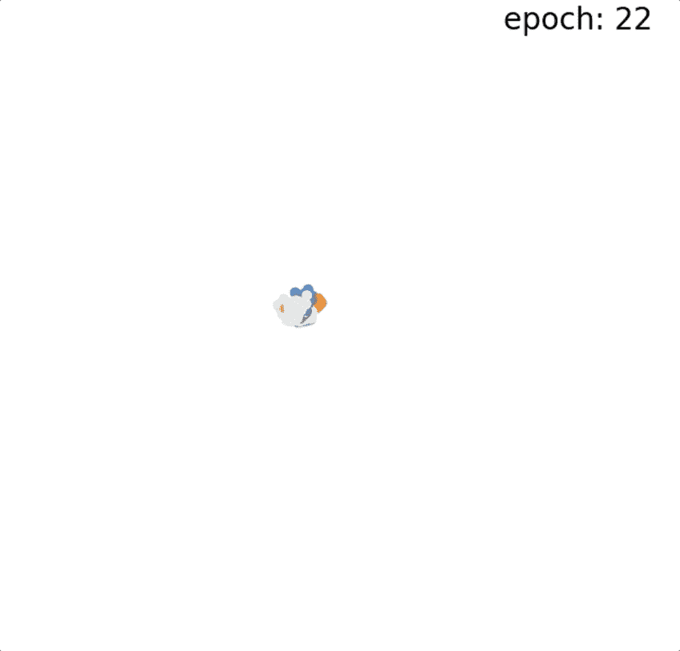
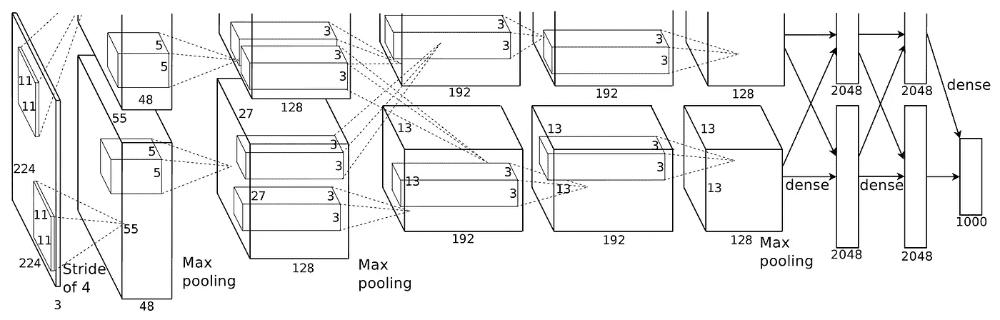
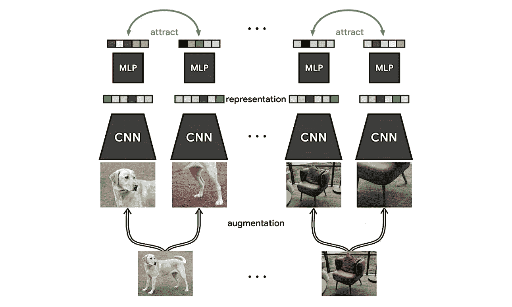
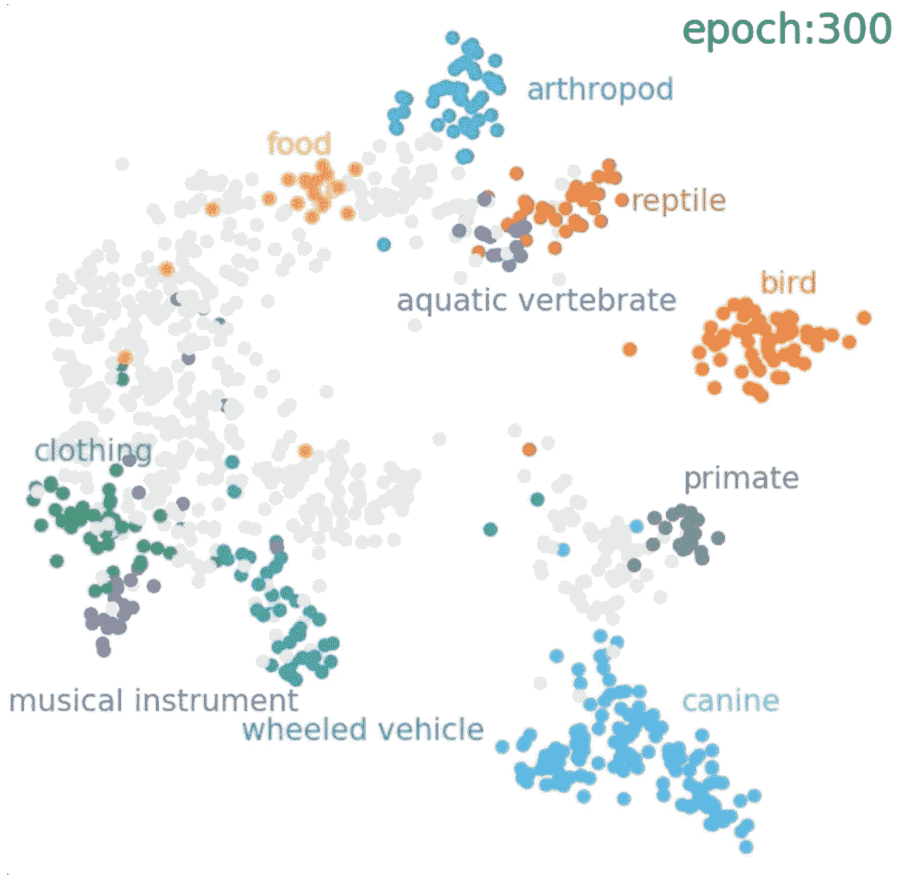

# 从监督学习到非监督学习:计算机视觉中的范式转变

> 原文：<https://towardsdatascience.com/from-supervised-to-unsupervised-learning-a-paradigm-shift-in-computer-vision-ae19ada1064d>

## 慢慢地从训练过程中去除人类知识的注入

自从现代计算机视觉方法出现以来，这些技术的成功应用只能在监控领域中看到。为了使模型有助于执行图像识别、对象检测或语义分割等任务，人工监督曾经是必要的。在一个重大转变中，过去几年的计算机视觉研究已经改变了该领域的焦点:从人类监督下的保证成功转向新的前沿:自我监督和非监督学习。

以非监督方式对不同类进行聚类的动画。来源:[【1】](https://ai.facebook.com/blog/dino-paws-computer-vision-with-self-supervised-transformers-and-10x-more-efficient-training/)

让我们踏上一个已经开始的新时代的征程。

# 监督学习的成功

原始 AlexNet 架构的插图。来源:[【2】](https://proceedings.neurips.cc/paper/2012/file/c399862d3b9d6b76c8436e924a68c45b-Paper.pdf)

AlexNet 标志着神经网络应用于图像任务的第一次突破，更具体地说是 ImageNet 挑战。从那时起，游戏开始了，计算机视觉研究界开始致力于完善多种计算机视觉任务的监督技术。

对于图像分类，自最初的 AlexNet 论文以来，已经出现了许多模型的变体。ResNet 已经无可争议地成为卷积神经网络中的经典。诸如 EfficientNet 之类的高效架构已经出现。甚至是针对移动设备优化的网络，如 MobileNet 架构。最近，视觉变压器获得了越来越多的关注(无意的玩笑)，并显示出在正确的设置下(大量数据和计算)优于卷积神经网络。最初是为语言任务而发明的，它们在计算机视觉方面的应用取得了巨大的成功。另一个有趣的方法是设计网络设计空间，其中量化的线性函数定义称为 RegNet 的网络架构。

监督学习成功解决的下一个任务是对象检测和语义分割。r-CNN 在第一个领域引起了第一次轰动，随后在计算效率和准确性方面取得了许多进步。值得注意的方法是 Fast、Faster 和 Mask R-CNN，还有 YOLO 算法和单次检测器，如 SSD MobileNet。语义分割领域的一个里程碑是 U-Net 架构。

此外，不要忘记基准数据集使监督技术更具可比性。ImageNet 为图像分类设立了标准，MS COCO 对于对象检测和分割任务仍然很重要。

所有这些技术都有一个共同点:它们依赖于经过提炼的人类知识和技能，以标记数据的形式表现良好。事实上，他们是围绕这个资源建立的，并依赖于这个资源。

在某种程度上，所有这些技术都采用模拟人类生物神经网络的人工神经网络。但是，这些模型学习感知的方式与人类学习感知的方式非常不同。为什么只模仿人脑的生物形态，而不模仿学习识别和分类背后的认知过程？

这就是下一次进化的切入点:自我监督学习。

# 将自我监督引入流程

想想你是如何学会观察的。你如何学会识别苹果？当你年轻的时候，你见过许多苹果，但并不是所有的苹果上都有一个标志，上面写着“这是一个苹果”，也没有人告诉你每次你看到一个苹果时它就是一个苹果。你学习的方式是通过相似性:你一次又一次地看到这个物体，每周多次，甚至每天。你认出来了:哎…这是一回事！

然后，有一天，有人教你这是苹果。突然间，这个抽象的物体，这个视觉表现，现在变成了你所知道的“苹果”。这是在自我监督学习中使用的类似过程。

SimCLR 培训过程的图示。来源:[【3】](https://arxiv.org/pdf/2002.05709.pdf)

最先进的技术如 [SimCLR](/paper-explained-a-simple-framework-for-contrastive-learning-of-visual-representations-6a2a63bfa703) 或 [SwAV](/paper-explained-unsupervised-learning-of-visual-features-by-contrasting-cluster-assignments-f9e87db3cb9b) 复制了这一过程。对于预训练，所有标签都被丢弃，模型在不使用人类知识的情况下进行训练。向模型显示同一图像的两个版本，图像可能被裁剪、颜色扭曲或旋转，它开始学习尽管它们的视觉表示不同，但这些对象是相同的“东西”。事实上，这在它们相似的潜在向量表示中是可见的(记住这一点以备后用)。因此，该模型学习为每一类对象产生一个一致的矢量。

接下来是“教学”步骤:这次向预训练的模型显示一些带有标签的图像。它可以更快更有效地学习对不同种类的物体进行分类。

如此多的人类知识已经从训练过程中移除，但不是全部。但下一步就在眼前。

# 走向无监督学习

为了使一个模型完全不受监督，它必须在没有人类监督(标签)的情况下进行训练，并且仍然能够完成预期的任务，例如对图像进行分类。

请记住，自我监督模型已经朝着这个方向迈出了一步:在向它们展示任何标签之前，它们已经能够为不同的对象计算一致的矢量表示。这是去除所有人类监督的关键。

以非监督方式对不同类别进行聚类的示例。来源:[【1】](https://ai.facebook.com/blog/dino-paws-computer-vision-with-self-supervised-transformers-and-10x-more-efficient-training/)

这个向量通常表示的是维数减少的图像。事实上，自动编码器可以被训练来重建图像像素。因为它的降维，我们可以使用一种在计算机视觉中长期被忽略的技术:k 近邻分类器。如果我们的向量表示很好，只有相同的对象形成一个簇，而不同的对象在远处聚集，我们可以给模型一个新的未知图像，模型会将它分配到正确类别的簇中。模型将不能告诉你类名是什么，但是它属于哪组图像。如果为该组指定一个类名，则该组中的所有对象都可以被分类。毕竟类名是人类人工创造的(有人定义这个东西叫苹果)，只是被人类赋予了意义。

由于所有标签都从训练过程中移除，并且像 [DINO](/paper-explained-dino-emerging-properties-in-self-supervised-vision-transformers-f9386df266f1) 这样的论文中的结果非常有希望，这是我们从计算机视觉模型的训练过程中移除所有监督的最接近的方式。

但是还有更多的事情要做，还有更大的提升空间。

# 包装它

如果你一直读到这里，我非常感谢你花时间阅读。我特意没有在这个故事中加入任何图片，因为它们会转移你对这篇文章的注意力。我是说，我们都想成为一个好的变形金刚，对吧？(这次是有意的)

衷心感谢您阅读本文。如果你对自我监督学习感兴趣，可以看看我的其他故事，在这些故事中，我试图向任何感兴趣的人解释这个领域中最先进的论文。**如果你想在高级计算机视觉领域更深入地探索，考虑成为我的追随者**。我试着每周发一篇文章，让你和其他人了解计算机视觉研究的最新进展。

参考资料:

[1] Meta AI 研究博文。[https://ai . Facebook . com/blog/dino-paws-computer-vision-with-self-supervised-transformers-and-10x-more-efficient-training/](https://ai.facebook.com/blog/dino-paws-computer-vision-with-self-supervised-transformers-and-10x-more-efficient-training/)

[2] Krizhevsky、Alex、Ilya Sutskever 和 Geoffrey E. Hinton。"使用深度卷积神经网络的图像网络分类."*神经信息处理系统进展*25(2012):1097–1105。[https://proceedings . neur IPS . cc/paper/2012/file/c 399862d 3 b 9d 6 b 76 c 8436 e 924 a 68 c 45 b-paper . pdf](https://proceedings.neurips.cc/paper/2012/file/c399862d3b9d6b76c8436e924a68c45b-Paper.pdf)

[3]陈，丁等:“视觉表征对比学习的一个简单框架。”*机器学习国际会议*。PMLR，2020 年。https://arxiv.org/pdf/2002.05709.pdf