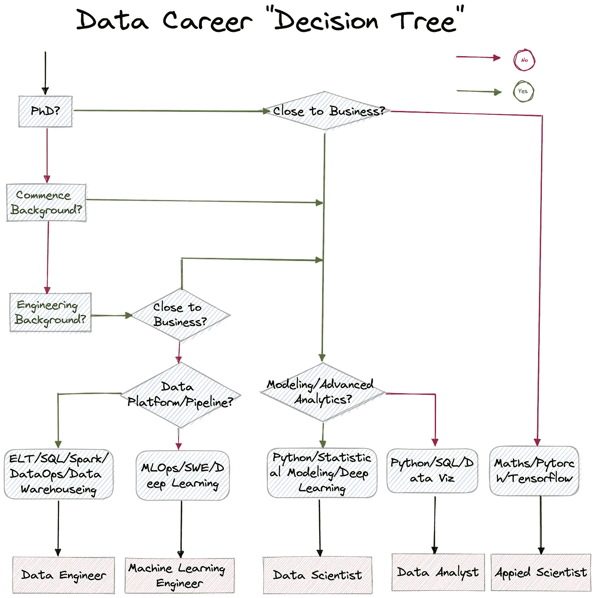
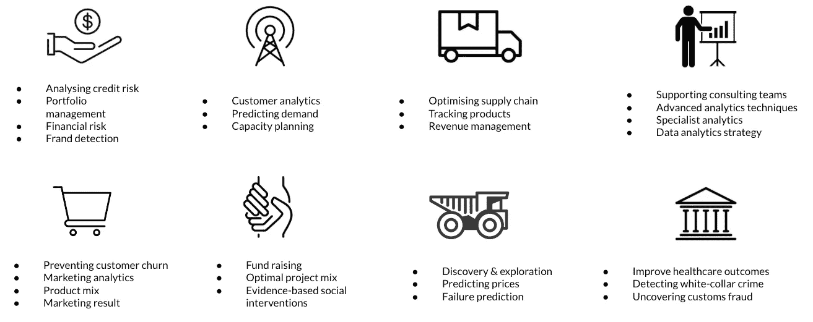
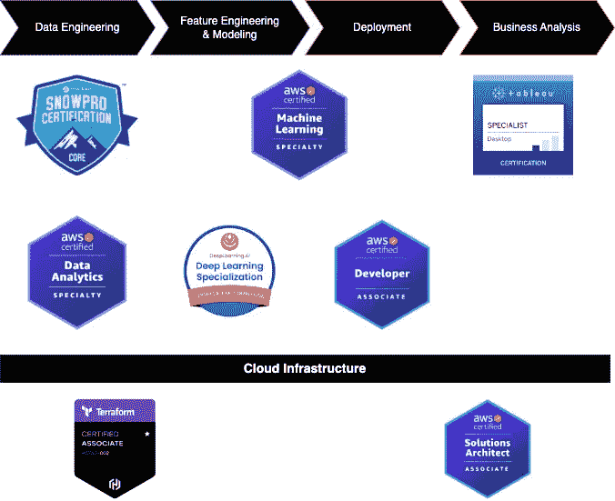

# 从技术项目经理到机器学习工程师

> 原文：<https://towardsdatascience.com/from-technical-project-manager-to-machine-learning-engineer-ecb185c16968>

## 差距、陷阱和技巧

图片由作者提供；它只显示普通路径，而不是所有可能的路径；

这是一个具有挑战性的转变，需要付出巨大的努力，而人工智能/机器学习对于组织来说仍然是一个时髦的词，数据团队通常是第一个被解雇的人。另一方面，人工智能世界正在快速发展，从 [AlphaFold](https://en.wikipedia.org/wiki/AlphaFold#:~:text=AlphaFold%20is%20an%20artificial%20intelligence,has%20had%20two%20major%20versions.) 、文本到图像([稳定扩散](https://stability.ai/blog/stable-diffusion-public-release) / [Dall-E 2](https://openai.com/dall-e-2/) )到[多模态机器学习](http://multicomp.cs.cmu.edu/multimodal-machine-learning/)的突破性进展，人工智能的采用继续增长，收益仍然显著。

我在两年半的时间里过渡到了机器学习工程师，并从 2020 年开始担任商业分析硕士候选人的行业导师。这篇文章中分享的陷阱和技巧是基于我的经验和来自校友、同事和各行各业演讲者的见解。

希望我的故事能帮助激励你的转变，并指导你的决定。

# **职业转型前**

我的职业生涯始于一家跨国电信公司的系统集成工程师，最终成为一名高级技术项目经理，后来我决定辞职，作为联合创始人加入一家初创公司，建立一个金融科技 SaaS 解决方案。

# 新的旅程

我的家人在 2017 年移居澳大利亚，和许多新移民一样，这意味着挑战和机遇，让你重新审视自己的职业规划。自 2013 年以来，我一直关注人工智能和云的发展，我相信云和人工智能，因为它们已经开始全面重塑行业，而这只是一个开始。

# 缺口

知识差距显然很大，所以不考虑非全日制学习。我一直在寻找一个密集、实用、核心、贴近业务且不超过 1 年的过渡。

## **知识缺口，先于商业分析硕士学位**

[墨尔本商学院的全日制商业分析硕士](https://mbs.edu/degree-programs/full-time-master-of-business-analytics) (MBS)是最合适的人选:

按作者分类的图片，工作数据/业务分析的类型可能导致

*   核心和实用课程——统计学习、预测分析、决策和优化、机器学习、编程以及如何在商业中应用数据分析。
*   高强度的快节奏训练，速度比正常训练快 3 倍，将你推向极限。
*   为期 5 周的团队实习，整合了学术学习和在组织中实施数据分析的实际挑战。
*   非凡而聪明的候选人，大多数在知名咨询公司、金融机构或财富 500 强公司开始他们的数据职业生涯。

该计划为您的职业生涯建立了坚实而广泛的数据分析基础，更不用说强大的校友社区，因为许多校友已经开始成为行业领导者。

从英国帝国理工学院商学院到美国麻省理工学院索兰商学院，全球各地的商学院都在提供商业分析硕士课程。

如果你正在寻找一个密集和高质量的过渡，并且已经拥有业务领域的知识，这条道路可能很适合你作为起点。

## 行业差距，张贴商业分析硕士学位

我的数据职业生涯始于在澳大利亚一家领先的数据咨询公司担任数据顾问，这确实加速了我在该行业的职业生涯，并弥合了“Jupyter 笔记本中的结构化和静态数据”与“云中的非结构化和海量数据”之间的差距。

除了从客户项目中获得经验，破解认证/在线课程是获得丰富行业知识和实践的一种**高效**方式。我在两年内破解了 **19 个**证书/在线课程，以下是一些强烈推荐的证书:

图片由作者提供；每个工作范围的认证；

破解认证并不意味着你是该领域的主题专家，所以不要高估它的价值。然而，这些证书确实有助于建立对现代数据/机器学习解决方案的整体理解。凭借强大的云工程和数据分析技能，我后来从数据顾问转型为机器学习工程师。

这不是关于证书，而是关于你在这个行业中的知识/经验差距的意识，并成为一个快速的学习者，用你自己的策略缩小差距。

# 陷阱:

**注意事项**:本节分享的见解可能有失偏颇。

*   头衔膨胀:许多数据科学家头衔的工作与建模、模型分析或特征工程无关，但面向数据分析师(仪表板报告、即席 SQL 查询等)。拥有强大数据科学背景的候选人(尤其是博士候选人)可能会对那些职位感到失望和失落。如果你有很强的领域知识并接近业务部门，成为一名数据分析师是一个非常有吸引力的职业。但我假设大多数数据科学或博士毕业生更喜欢机器学习建模/实现——了解现实中的工作范围，并妥善管理你的期望。
*   机器学习建模工作很少，由机器学习驱动的组织通常实施成熟的行业级模型/解决方案。数据工程、系统设计和软件开发技能远比构建自己的模型更重要(你团队的模型击败正在推动人工智能军备竞赛的大型技术公司的尖端模型的可能性很低)。而是作为一名数据科学家或机器学习工程师，你的主要职责是:提高数据质量(与数据工程师团队一起)；识别用例(与业务涉众一起)；设计和实施基于云的机器学习端到端解决方案(与软件工程师 DevOps 一起)以证明用例——远离 Jupyter 笔记本并学习软件开发实践。
*   对利益相关者的 AI 101 教育是必不可少的，不是因为他们是项目发起人，而是更重要的是，他们需要了解人工智能的局限性，而不是将其视为解决一切问题的神奇技术——在许多情况下，你不需要花哨的机器学习模型，企业需要可解释的人工智能。
*   数据团队通常处于第一波裁员中，尤其是数据分析师、数据科学家和机器学习工程师，而数据工程师相对更安全——数据科学家可能不是“[21 世纪最性感的工作](https://hbr.org/2012/10/data-scientist-the-sexiest-job-of-the-21st-century)”，不幸的是，至少目前不是。

# 小贴士:

**注意事项**:本节分享的小技巧可能会有偏差。

*   避免头衔膨胀陷阱的一个技巧是在面试时问这个职位是与机器学习产品化相关还是与内部报告相关。
*   云知识(AWS/Azure/GCP)是非常可取的，无论你的工作角色如何，它都是必备的，而大多数数据科学/分析项目都不涉及它。对于应届毕业生和大三学生来说是一大利好。
*   坦诚面对自己的优势和劣势，从第一天开始规划自己的数据职业生涯。

按作者分类的图像，按角色分类的主要工作范围

*   个人品牌很重要，知识分享也很贴心——建立你的影响力要从分享你的知识开始，越早越好。
*   该行业正朝着以数据为中心的人工智能方法发展，数据工程和 MLOps 将更加关键。垃圾进，垃圾出。我们最近通过 **8%** 改进了一个模型在生产中的性能——通过简单地修复训练集中不一致的数据注释。

以下是帮助我转型的书籍/博客列表:

技术

*   使用 Scikit-Learn、Keras 和 TensorFlow 进行机器实践学习
*   用 Chip Huyen 设计机器学习系统
*   系统设计访谈—内部人员指南:第 2 卷
*   彼得的数据科学家实用统计学。b 安德烈。B&·彼得。G
*   设计数据密集型应用程序:可靠、可伸缩和可维护系统背后的重要思想
*   [AWS 解决方案库由 AWS](https://aws.amazon.com/solutions/)

软技能

*   用数据讲故事
*   芭芭拉·明托的金字塔原理
*   [量子黑对人工智能的见解](https://www.mckinsey.com/capabilities/quantumblack/our-insights)

# 最终想法:

数字化转型和人工智能的采用仍处于早期阶段，人工智能项目的高失败率并不新鲜。释放数据的价值并实现成功的 ML 项目需要对强大的基础进行投资，特别是用例一致性、文化转变、人工智能教育和流程变革管理，这实际上比实施人工智能技术本身更重要。对于那些拥有商业领域知识并随后转向数据职业的人来说，除了你的技术技能之外，培养“[分析翻译](https://www.mckinsey.com/capabilities/quantumblack/our-insights/analytics-translator)”技能可以让你更具竞争力，正如我所观察到的那样，它们对成功的 ML/AI 项目更为关键。

[1]报道于 [IBM](https://oreil.ly/AfUB5) 、[优步](https://oreil.ly/t0QpY)、 [Airbnb](https://oreil.ly/q4M4E) 和 Sejuti Das 的分析*《数据科学家如何也容易受到危机中裁员的影响》、*、 *Analytics India Magazine* ，2020 年 5 月 21 日、[、*https://oreil.ly/jobmz*、](https://oreil.ly/jobmz)

[2]*2021 年的 AI 状态*

[https://www . McKinsey . com/capabilities/quantum black/our-insights/global-survey-the-state-of-ai-in-2021](https://www.mckinsey.com/capabilities/quantumblack/our-insights/global-survey-the-state-of-ai-in-2021)

*[3]与 Andrew 就 MLOps 的对话:从以模型为中心到以数据为中心的人工智能*

[https://www.youtube.com/watch?v=06-AZXmwHjo](https://www.youtube.com/watch?v=06-AZXmwHjo)