# 从理论到实践用贝叶斯神经网络，用 Python

> 原文：<https://towardsdatascience.com/from-theory-to-practice-with-bayesian-neural-network-using-python-9262b611b825>

## 以下是如何用几行代码将不确定性融入你的神经网络


在 [Unsplash](https://unsplash.com/s/photos/confusion?utm_source=unsplash&utm_medium=referral&utm_content=creditCopyText) 上由[Towfiqu barb huya](https://unsplash.com/@towfiqu999999?utm_source=unsplash&utm_medium=referral&utm_content=creditCopyText)拍摄的照片

我拥有**物理学**硕士学位，是一名航空航天**工程**研究员。

物理学和工程学是两种截然不同的科学，它们都渴望了解自然，并有能力模拟自然。

物理学家的方法更多的是理论上的。物理学家观察这个世界，并试图以尽可能精确的方式对其建模。物理学家模拟的现实是不完美的，有一些近似，但是一旦我们考虑到这些不完美，现实就变得**整洁、完美、**和**优雅。**

工程师的方法更加实用。工程师意识到物理学家的模型的所有限制，并试图在实验室中尽可能顺利地体验。工程师可能会做更残酷的近似(例如 pi = 3)，但它的近似在现实生活的实验中实际上更有效。

**戈登·林赛·格莱格**的这段话总结了工程师的实践方法和物理学家优雅的理论方法之间的差异

> 科学家可以发现一颗新星，但他不能制造一颗。他将不得不请一位工程师为他做这件事。

在研究人员的日常生活中，事情是这样的。物理学家是对特定现象有理论的人。工程师是一个科学家，他可以进行实验，看看理论是否可行。

实际上，当我开始从物理学家到工程师的转变时，我经常被问到的一个问题是:

> “好吧，你的模型似乎是可行的……但它有多稳健？”

这是典型的工程师问题。

当你有了一个物理模型，给定一定的条件，这个模型理论上是**完美的**。

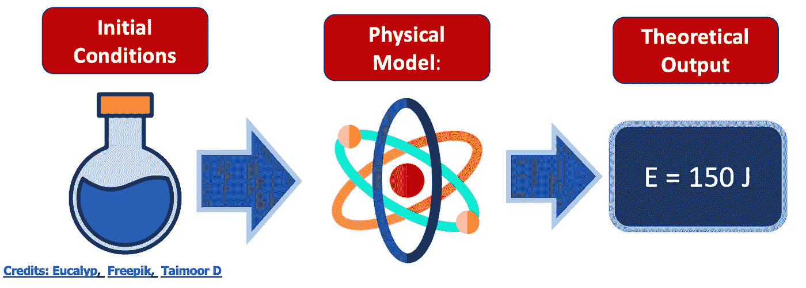

作者图片

尽管如此，当你进行实验时，还是有一定程度的误差，你必须能够正确地估计它。

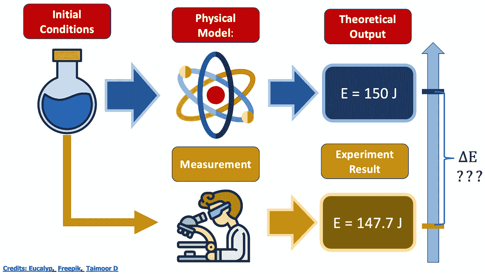

作者图片

在这个例子中，我们如何估计理论输出和实验结果之间的能量差？

两个选项:

A.如果模型是**确定性的，**您可以通过某个增量改变初始条件(例如，将确定性规则应用于输入的**噪声**版本)

B.如果模型是**概率的，**对于一些给定的输入，你从输出中提取一些**统计**信息(例如，平均值、标准偏差、不确定性边界……)

现在让我们进入机器学习的**语言。**在这种特殊情况下:

A.如果机器学习模型是**确定性的，**我们可以通过改组训练集和验证集来测试它的鲁棒性。

B.如果机器学习模型是**概率**，对于一些给定的输入，您从输出中提取一些**统计**信息(例如，平均值、标准偏差、不确定性边界……)

现在，假设我们要使用的模型是**神经网络。**
第一个问题:[需要神经网络](https://medium.com/towards-data-science/deep-learning-vs-linear-regression-ea74aca115ea)吗？如果答案是肯定的，那么你一定要用(你不说)。问题:

> “你的机器学习模型健壮吗？”

神经网络的原始定义是“纯粹确定性的”。
我们可以调整训练、验证和测试集，但我们需要考虑到神经网络可能需要很长时间来训练，如果我们想进行多次测试(假设 CV = 10，000)，那么，你可能需要等待一段时间。

我们需要考虑的另一件事是，使用一种称为**梯度下降的算法来优化神经网络。**这个想法是我们从参数空间中的一个点开始，顾名思义，**沿着损失的负**梯度**指示的方向下降**。这将理想地把我们带到一个**全球最小值**(剧透:它实际上从来不是全球性的)。

不切实际的简单 1D 损失函数的理想情况如下:

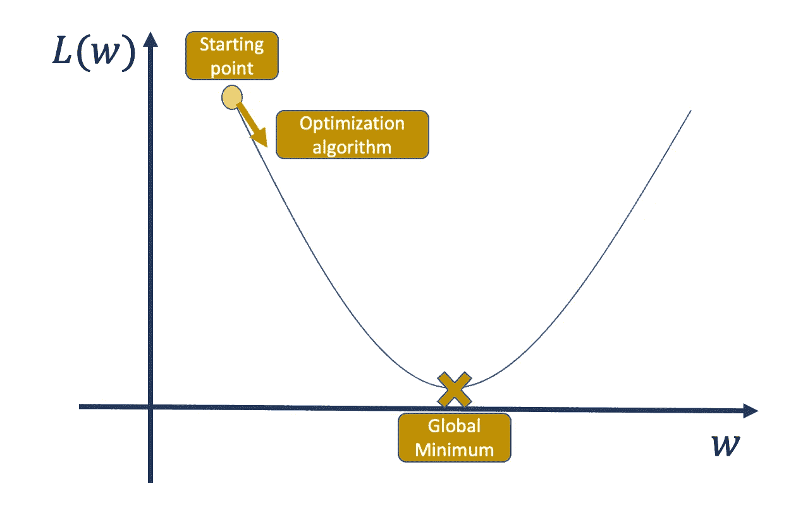

作者图片

现在，在这种情况下，如果我们改变起点，我们仍然收敛到唯一的全局最小值。

更现实的情况是这样的:

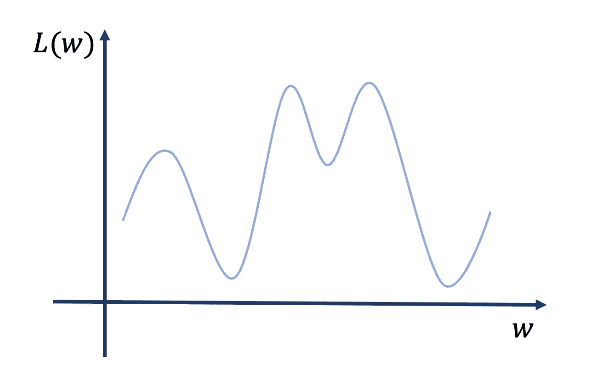

作者图片

所以，如果我们从不同的起点随机重启训练算法，我们会收敛到不同的**局部最小值**。

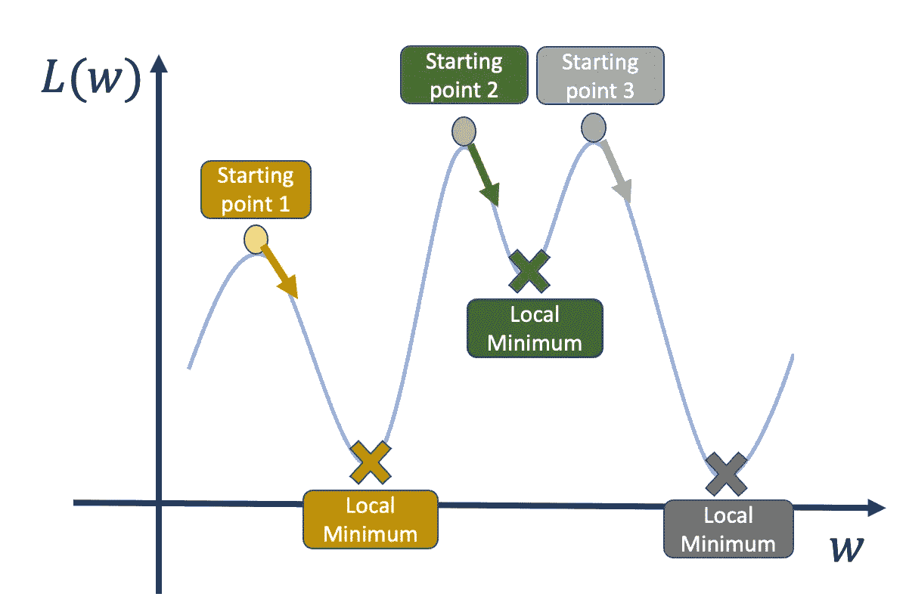

作者图片

所以如果我们从点 1 或者点 3 开始，我们会到达一个比起点 2 更低的点。

损失函数可能充满了局部最小值，因此找到真正的**全局**最小值可能是一项艰巨的任务。我们可以做的另一件事是从不同的起点重新开始训练，并比较损失函数值。这种方法和以前一样，我们也有同样的问题:我们只能做这么多次。

有一种更健壮、更严格、更优雅的方法，以一种**概率**的方式使用神经网络的相同计算能力；它被称为**贝叶斯神经网络。**

在本文中，我们将了解:

1.  贝叶斯神经网络背后的**想法**
2.  贝叶斯神经网络背后的**数学公式**
3.  使用 Python 的贝叶斯神经网络的**实现**(更具体地说 **Pytorch** )
4.  如何使用贝叶斯神经网络解决**回归**问题

开始吧！

# 1.什么是贝叶斯神经网络？

正如我们前面所说，贝叶斯神经网络的思想是给典型的神经网络增加一种概率“感觉”。我们如何做到这一点？

在理解贝叶斯神经网络之前，我们可能应该回顾一下**贝叶斯**定理。

观察贝叶斯定理的一个非常有效的方法如下:

> “贝叶斯定理是一个数学定理，它解释了为什么如果世界上所有的汽车都是蓝色的，那么我的汽车也必须是蓝色的，但仅仅因为我的汽车是蓝色的，并不意味着世界上所有的汽车都是蓝色的。”

在数学术语中，已知事件“A”和“B”，已知事件“B”已经发生，事件“A”发生的概率如下:

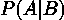

作者图片

假设事件“A”已经发生，事件“B”发生的概率如下:

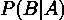

作者图片

连接第一个和最后一个表达式的等式如下:

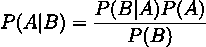

作者图片

明白了吗？太好了。现在，假设你有了你的神经网络模型。这个神经网络只不过是一组将给定输入转换为期望输出的参数。

前馈神经网络(最简单的深度学习结构)通过将输入乘以参数矩阵来处理您的输入。然后，非线性激活函数(**这是神经网络的真实能力**)被逐项应用于该矩阵乘法的结果。结果是下一层的输入，其中应用相同的过程。

我们现在将模型的参数集称为 **w** 。现在我们可以问自己这个棘手的问题。

假设我有一个数据集 D，它是一组成对的输入 x_i 和输出 y_i，例如，第 I 个动物的图像和第 I 个标签(猫或狗):

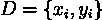

作者图片

> 给定某个数据集 D，有一组参数的概率是多少？

这个问题你大概需要看 3、4 遍才能领会，但是思路是有的。如果你在输入和输出之间有某种映射，在极端的**确定性**情况下，只有一组参数能够处理输入并给你带来想要的输出。在**概率方式**中，会有一个概率参数集比另一个更有可能。

所以我们感兴趣的是数量。

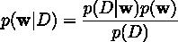

作者图片

现在，有三件事很酷:

1.  当考虑给定该分布的平均值时，您仍然可以将其视为标准的神经网络模型。例如:

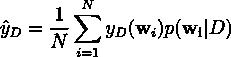

作者图片

等式的左手代表计算的平均输出，右手代表所有可能的参数结果集(N)的平均值，概率分布提供每个结果的权重。

2.虽然 **p(w|D)** 显然是个谜，但 p(D|w)是我们可以一直研究的东西。如果我们对一个巨大的 N 使用上面的等式，就不需要机器学习了。你可以简单地说:“尝试给定某个神经网络的所有可能的模型，并使用上面的等式权衡所有可能的结果”

3.当我们得到 p 时，我们得到的不仅仅是一个机器学习模型；我们实际上获得了**无限的**机器学习模型。这意味着我们可以从你的预测中提取一些不确定性边界和统计信息。结果不仅是“10.23”，更像是“10.23，可能的误差为 0.50。”

我希望我让你兴奋了。让我们进入下一章

# 2.一些数学

> 我不想让这篇文章成为闲聊，但我也不想让它成为一种痛苦。如果你对贝叶斯神经网络有所了解，或者你已经知道它们背后的数学原理，可以跳过这一章。如果想有个参考，下面是一个不错的。([动手操作贝叶斯神经网络——深度学习用户教程](https://arxiv.org/pdf/2007.06823.pdf))

现在这一切看起来很酷，但我认为，如果你是一个机器学习用户，你应该有这样的想法:

> "我怎么才能优化这样一个奇怪的生物？"

简单的回答是，“通过最大化:

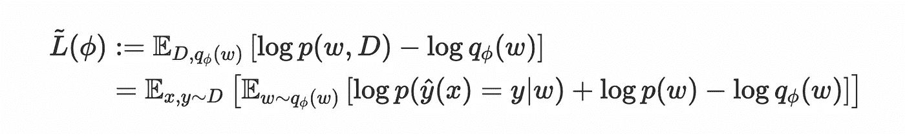

作者图片

但我不认为这是不言自明的。

在这种情况下，优化原则是找到分布 p(w|D)的最佳估计。我们称这个分布为 q，我们需要两个分布函数之间距离的度量。

我们将使用的指标称为**kull back–lei bler**散度

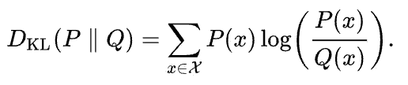

作者图片

一些有趣的事实:

1.  对于两个相等的分布，它是 0
2.  如果两个分布的分母趋向于零，而分子仍然不为零，那么它就是无穷大
3.  它是不对称的。

现在，你在上面看到的损失函数是 Kullback-Leibler 散度的替代量，它被称为**证据下限(ELBO)** 。

权重 q 的分布被认为是具有均值μ和方差σ2 的正态分布:

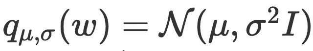

作者图片

因此，优化是为了确定该分布的最佳 mu 和 sigma 值。

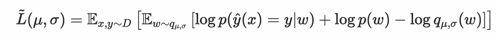

作者图片

在实际的 **PyTorch** 实施中，分布的平均值和目标值之间的 MSE 也被添加到我们的 L (mu，sigma)中。

# 3.Pyt(orch)hon 实施

使用 **PyTorch** 在 Python 中实现贝叶斯神经网络非常简单，这要归功于一个名为*[***torchbn***](https://github.com/Harry24k/bayesian-neural-network-pytorch)的库。*

*安装非常简单，因为:*

```
*pip install torchbnn*
```

*正如我们将看到的，我们将建立一个非常类似于标准 Tor 神经网络的东西:*

```
*model = nn.Sequential(
    bnn.BayesLinear(prior_mu=0, prior_sigma=0.1, in_features=1, out_features=1000),
    nn.ReLU(),
    bnn.BayesLinear(prior_mu=0, prior_sigma=0.1, in_features=1000, out_features=1),
)*
```

*实际上，有一个库可以将您的 torch 模型转换成它的贝叶斯代理:*

```
*transform_model(model, nn.Conv2d, bnn.BayesConv2d, 
                args={"prior_mu":0, "prior_sigma":0.1, "in_channels" : ".in_channels",
                      "out_channels" : ".out_channels", "kernel_size" : ".kernel_size",
                      "stride" : ".stride", "padding" : ".padding", "bias":".bias"
                     }, 
                attrs={"weight_mu" : ".weight"})*
```

*但让我们来做一个实际操作的详细示例:*

# *4.动手回归任务*

*首先要做的是导入一些库:*

*之后，我们将制作非常简单的二维数据集:*

*因此，给定我们的 1D 输入 x(范围从-2 到 2)，我们想找到我们的 y*

***Clean_target** 是我们的地面真相生成器，而 **target** 是我们的噪声数据生成器。*

*现在我们将定义我们的贝叶斯前馈神经网络:*

*正如我们所看到的，它是一个具有贝叶斯层的两层前馈神经网络。这将允许我们有一个**概率输出。***

*现在我们将定义我们的 MSE 损失和剩余的 Kullback-Leibler 散度:*

*这两个损失都将用于我们的优化步骤:*

*已经用了 2000 个纪元了。*

*让我们定义我们的测试集:*

*现在，从**模型**类得出的结果是**概率**。这意味着，如果我们运行我们的模型 10，000 次，我们将得到 10，000 个略有不同的值。对于从-2 到 2 的每个数据点，我们将得到平均值和标准偏差，*

*我们会画出置信区间。*

# *5.包装它*

*在本文中，我们看到了如何建立一个机器学习模型，该模型结合了神经网络的力量，并仍然保持对我们预测的概率方法。*

*为了做到这一点，我们可以建立所谓的**贝叶斯神经网络**。这个想法不是优化一个神经网络的损失，而是优化无限个神经网络的损失。换句话说，我们正在优化给定数据集的模型参数的概率分布。*

*我们使用了一个损失函数，这个函数包含了一个叫做 **Kullback-Leibler** 散度的度量。这用于计算两个分布之间的距离。*

*在优化我们的损失函数后，我们能够使用一个**概率模型。**这意味着，如果我们重复这个模型两次，我们会得到两个不同的结果，如果我们重复 10k 次，我们能够提取结果的稳健统计分布。*

*我们使用 **torch** 和一个名为 **torchbnn** 的库实现了这一点。我们建立了简单的回归任务，并使用两层前馈神经网络来解决它。*

# *6.结论*

*如果你喜欢这篇文章，你想了解更多关于机器学习的知识，或者你只是想问我一些问题，你可以:*

*A.在 [**Linkedin**](https://www.linkedin.com/in/pieropaialunga/) 上关注我，我在那里发布我所有的故事
B .订阅我的 [**简讯**](https://piero-paialunga.medium.com/subscribe) 。这会让你了解新的故事，并给你机会发短信给我，让我收到你所有的更正或疑问。
C .成为 [**推荐会员**](https://piero-paialunga.medium.com/membership) ，这样你就不会有任何“本月最大数量的故事”，你可以阅读我(以及数千名其他机器学习和数据科学顶级作家)写的任何关于最新可用技术的文章。*