# Fugue 和 duck db:Python 中的快速 SQL 代码

> 原文：<https://towardsdatascience.com/fugue-and-duckdb-fast-sql-code-in-python-e2e2dfc0f8eb>

## 使用 Python 和 DuckDB 优化您的 SQL 代码

# 动机

作为一名数据科学家，您可能对 Pandas 和 SQL 都很熟悉。然而，可能有一些查询和转换，您会觉得用 SQL 而不是 Python 来做比较舒服。

如果你能使用 SQL 查询熊猫数据帧，那不是很好吗…

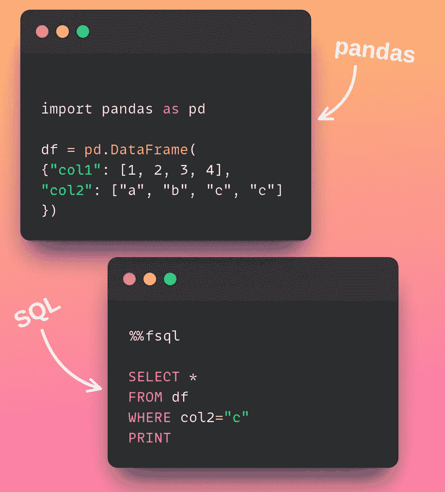

作者图片

…同时在处理大量数据时还能**加速您的代码**？

这时候 Fugue + DuckDB 就派上用场了。

在上一篇文章中，我展示了如何使用 pandas 引擎通过 SQL 查询 pandas 数据帧。

[](/introducing-fuguesql-sql-for-pandas-spark-and-dask-dataframes-63d461a16b27)  

在本文中，我将向您展示如何使用 DuckDB 引擎来加速您的查询。

# 为什么是赋格和 DuckDB？

[Fugue](https://fugue-tutorials.readthedocs.io/tutorials/fugue_sql/index.html) 是一个 Python 库，允许用户组合 Python 代码和 SQL 命令。这使得用户可以在 Jupyter 笔记本或 Python 脚本中灵活地切换 Python 和 SQL。

默认情况下，Fugue 会将您的 SQL 代码映射到 pandas。但是，当数据大小超过几个 GB 时，使用 pandas 并不理想，因为它:

*   一次只允许您使用一个内核
*   创建大量数据的中间副本,这会增加内存使用

Fugue 还允许您使用 Spark 或 Dask 来扩展 SQL 代码。但是，较小的组织可能没有可以向其移植工作负载的集群。

## DuckDB 简介

DuckDB 是一个进程内 SQL OLAP 数据库管理系统。在本地机器上，即使是千兆字节的数据，速度也非常快。

因此，FugueSQL 和 DuckDB 的结合允许你**使用 SQL 和 Python** 和**无缝地加速你的代码**。

要使用 DuckDB 引擎安装 FugueSQL，请键入:

```
pip install -U fugue[duckdb,sql] 
```

# 建立

首先，我们为赋格导入一些设置函数。这将让我们使用 Jupyter 笔记本中的`%%fsql`细胞魔法。我们还导入了 DuckDB 引擎。

# 加载数据

本文将使用币安加密小猫数据集。这可以通过知识共享许可从 [Kaggle](https://www.kaggle.com/binance/binance-crypto-klines) 下载。

文件夹`crypto-binance`包含 1000 多个不同的文件，总内存超过 5GB。我[合并了这些文件](https://github.com/khuyentran1401/Data-science/blob/master/productive_tools/Fugue_and_Duckdb/preprocessing.ipynb)并将新文件保存为`raw.parquet`。

下载完[加工文件](https://drive.google.com/uc?id=1gM9gKrrck0KHlhiKbjuyV13UKfa4SYCg)后，一个文件名`raw.parquet`会保存在你的本地机器上。从获取新文件的位置开始:

现在我们来比较一下熊猫和 DuckDB 的加载速度。

## 熊猫

从使用 pandas 加载数据开始:

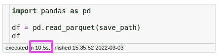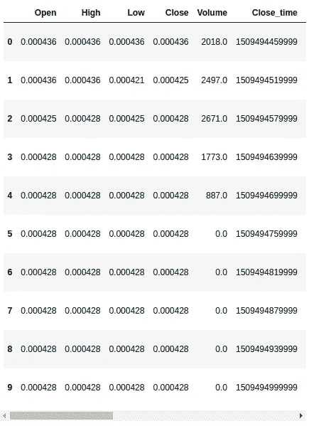

作者图片

请注意，加载数据花费了我们 10.5 秒。这太慢了。让我们看看是否可以通过使用 FugueSQL 和 DuckDB 来加快这个过程。

## 赋格+ DuckDB

要在 Jupyter 笔记本单元格中使用 DuckDB 作为引擎编写 SQL，只需在单元格的开头添加`%%fsql duck`:

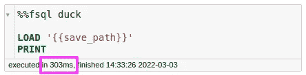

作者图片

在上面的代码中，

*   `PRINT`允许我们打印输出
*   双括号`{{}}`允许我们在 SQL 中使用 Python 变量。

上面的代码在 303 毫秒内加载数据！使用 DuckDB 作为引擎比使用 pandas 作为引擎快 34 倍以上。

# 处理

我们来对比一下熊猫和 DuckDB +神游的数据处理速度。

## 熊猫

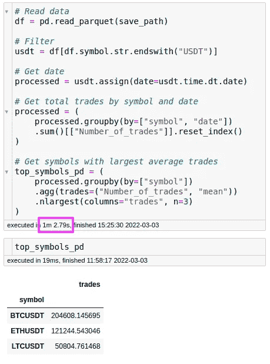

作者图片

## 赋格+ DuckDB

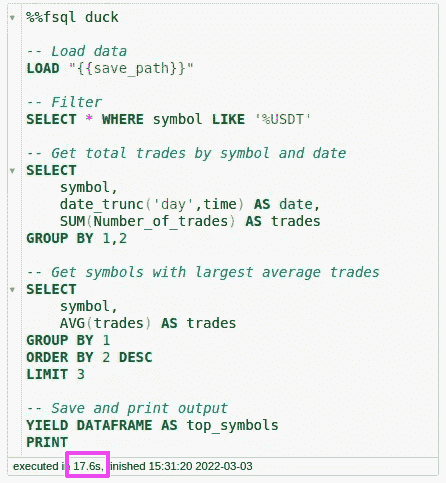

作者图片

***注意*** *:类似于 SQL 临时表，FugueSQL 允许多个* `*SELECT*` *语句。这使得代码可以自顶向下阅读，并消除了样板代码。如果未指定* `*FROM*` *，SQL 语句将使用堆栈中的最后一个数据帧。*

## 观察

我们可以看到用 Fugue + DuckDB 比用熊猫快了差不多 4 倍。用 SQL 编写上面的处理代码也比用 pandas 稍微容易一些。

# 为什么 DuckDB 快了这么多？

DuckDB 更快，因为它使用了惰性求值。

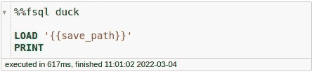

作者图片

例如，在上面的代码中，`PRINT`语句默认返回 10 条记录。DuckDB 知道最终结果只需要 10 条记录，所以它**只获取那些记录**。

另一方面，熊猫被急切地处决了。这意味着只有在**整个文件加载到**后，获取前 10 行的操作才会运行。

# 但是为什么神游呢？

DuckDB 有自己的 [Python API](https://duckdb.org/docs/api/python) ，为什么要用 Fugue 搭配 DuckDB？

这是因为 Fugue 提供了自定义函数，允许您轻松地与 Python 对象进行交互。在接下来的部分中，我们将学习如何使用这些自定义函数来改进您的 SQL 代码。

# 使用赋格数据帧

在上面的代码中，这一行

```
YIELD DATAFRAME AS top_symbols
```

…输出赋格数据帧并保存为`top_symbols`。

你可以很容易地把`top_symbols`变成熊猫的数据帧:

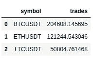

作者图片

…或者在另一个 SQL 查询中使用`top_symbols`:

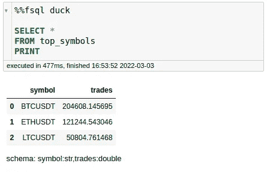

作者图片

# 为中间输出指定名称

有时，您可能希望为中间输出指定名称，以便它们可以被同一个 SQL 查询中的其他流程使用。神游允许你使用`=`给你的中间输出命名:

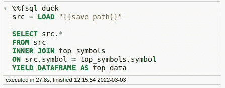

作者图片

在上面的代码中，我将中间输出保存到`src`，然后将`src`与`top_symbols`连接起来。

# Python 扩展

同时使用 Fugue 和 DuckDB 还允许您通过扩展在 SQL 代码中使用 Python 逻辑。让我们来看看这些扩展。

## 输出

SQL 不允许您绘制输出。然而，我们可以用 Python 创建一个绘图函数，然后在我们的 SQL 代码中使用它。

要使用上面的`plot_by`功能，只需在`plot_by`旁边添加`OUPUT USING`:

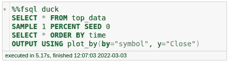

作者图片

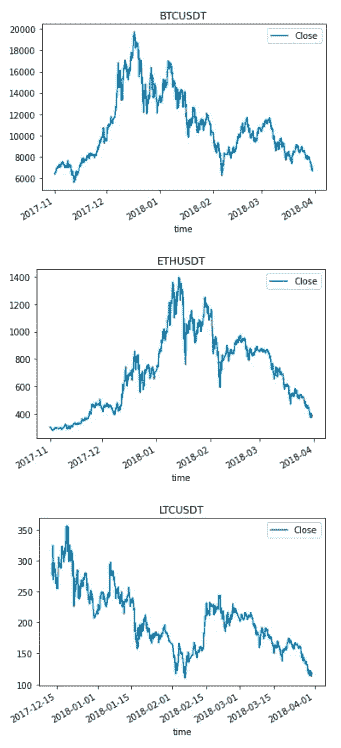

作者图片

## 改变

有些函数用 Python 比用 SQL 更容易编写。如果您想使用 Python 转换 SQL 查询的输出，请使用`TRANSFORM`。

要了解这个扩展是如何工作的，首先创建一个名为`macd`的函数。该函数使用 [pandas-ta](https://github.com/twopirllc/pandas-ta) 来获取时间序列的某个趋势。

我们还将模式提示作为注释(`# schema: *,macd:double`)添加到函数`macd`之上，以便 Fugue 可以读取这个模式提示并应用该模式。

现在我们可以使用这个函数来转换查询中的数据:

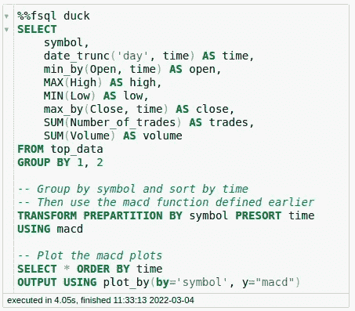

作者图片

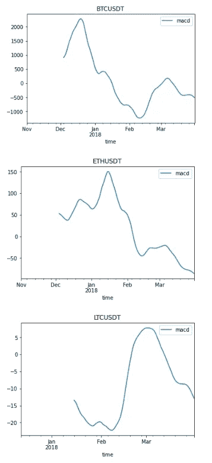

作者图片

酷！我们刚刚使用 Python 函数转换了 SQL 输出。

点击了解更多关于赋格[中`TRANSFORM`和`PREPARTITION`的信息。](/introducing-fuguesql-sql-for-pandas-spark-and-dask-dataframes-63d461a16b27#78e1)

# 神游+生产中的 DuckDB

要将 FugueSQL 从 Jupyter 笔记本中取出并放入 Python 脚本中，我们需要做的就是将 FugueSQL 查询包装在一个`fsql`类中。然后我们可以调用`.run()`方法并选择一个执行引擎作为`"duck"`。

# 结论

恭喜你！您刚刚学习了将 FugueSQL 和 DuckDB 一起用作后端，以充分利用本地执行。由于 DuckDB 提供的惰性评估，我们可以在将数据提交给 Pandas 进行进一步分析之前快速预聚合数据，这在 SQL 中是很难做到的。

使用 Fugue 作为界面还可以让我们无缝地使用 DuckDB 的优势。

随意发挥，并在这里叉这篇文章的源代码:

[](https://github.com/khuyentran1401/Data-science/blob/master/productive_tools/Fugue_and_Duckdb/Fugue_and_Duckdb.ipynb)  

我喜欢写一些基本的数据科学概念，并尝试不同的数据科学工具。你可以通过 [LinkedIn](https://www.linkedin.com/in/khuyen-tran-1401/) 和 [Twitter](https://twitter.com/KhuyenTran16) 与我联系。

如果你想查看我写的所有文章的代码，请点击这里。在 Medium 上关注我，了解我的最新数据科学文章，例如:

[](/write-clean-python-code-using-pipes-1239a0f3abf5)  [](/introducing-fuguesql-sql-for-pandas-spark-and-dask-dataframes-63d461a16b27)  [](/3-tools-to-track-and-visualize-the-execution-of-your-python-code-666a153e435e) [## 3 个跟踪和可视化 Python 代码执行的工具

towardsdatascience.com](/3-tools-to-track-and-visualize-the-execution-of-your-python-code-666a153e435e) [](/bentoml-create-an-ml-powered-prediction-service-in-minutes-23d135d6ca76)  

# 参考

币安加密线。2018–01–16.币安。
CC0:公共领域。从 https://www.kaggle.com/binance/binance-crypto-klines[检索到 2022–03–01](https://www.kaggle.com/binance/binance-crypto-klines)