# 从浓缩咖啡中充分提取咖啡

> 原文：<https://towardsdatascience.com/fully-extracting-coffee-from-espresso-e2310dc6c289>

## 咖啡数据科学

## 为另一个实验做准备的有趣数据

当我在准备一个实验时，我很好奇我是否能完全取出一个冰球。我的目标是为另一个实验生产废咖啡，但以前的实验总是显示一些可溶物仍然存在。所以我在制作这个用过的咖啡时做了一些测量，并在圆盘中放了很多水。

# 设备/技术

[意式咖啡机](/taxonomy-of-lever-espresso-machines-f32d111688f1) : [像样的意式咖啡机](/developing-a-decent-profile-for-espresso-c2750bed053f)

咖啡研磨机:利基零

咖啡:[家庭烘焙咖啡](https://rmckeon.medium.com/coffee-roasting-splash-page-780b0c3242ea)，中杯(第一口+ 1 分钟)

镜头准备:[断奏夯实](/staccato-tamping-improving-espresso-without-a-sifter-b22de5db28f6)

[预灌注](/pre-infusion-for-espresso-visual-cues-for-better-espresso-c23b2542152e):长，约 25 秒

输液:[压力脉动](/pressure-pulsing-for-better-espresso-62f09362211d)

[过滤篮](https://rmckeon.medium.com/espresso-baskets-and-related-topics-splash-page-ff10f690a738) : 20g VST

其他设备: [Atago TDS 计](/affordable-coffee-solubility-tools-tds-for-espresso-brix-vs-atago-f8367efb5aa4)、 [Acaia Pyxis 秤](/data-review-acaia-scale-pyxis-for-espresso-457782bafa5d)

# 发射

我开了一枪:

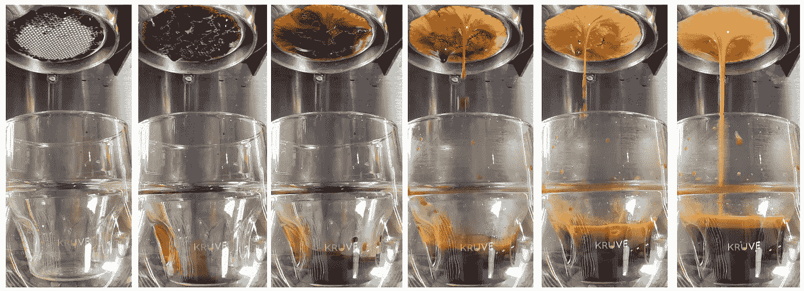

所有图片由作者提供

然后，我以 2、4、6 和 8 毫升/秒的流速，分四个阶段倒入 3 个杯子中。

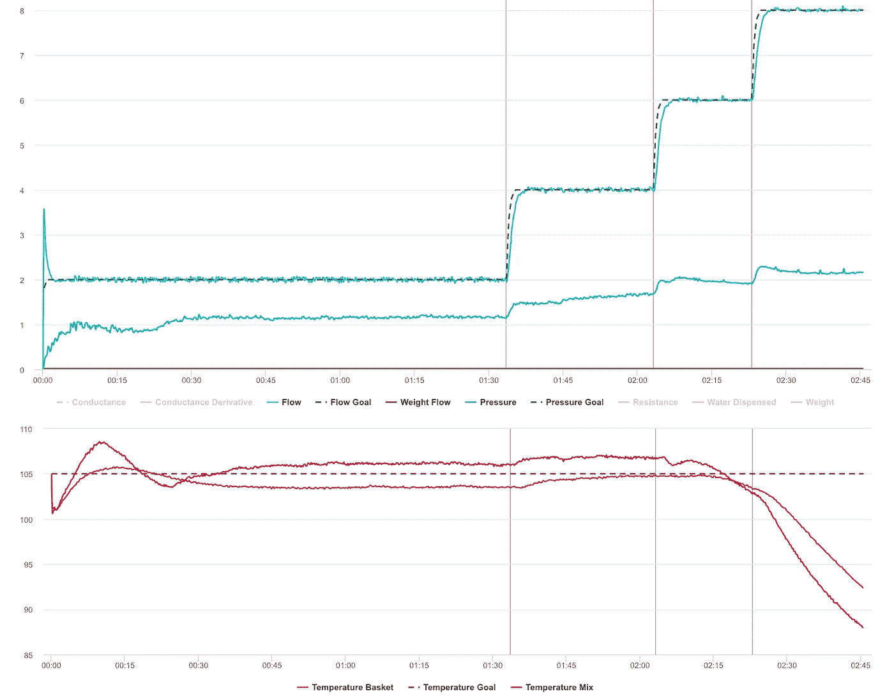

结果看起来像奶油。

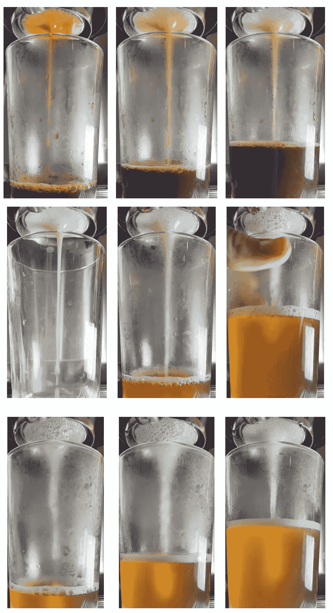

三杯及其级数

最终产品看起来像几瓶淡啤酒。

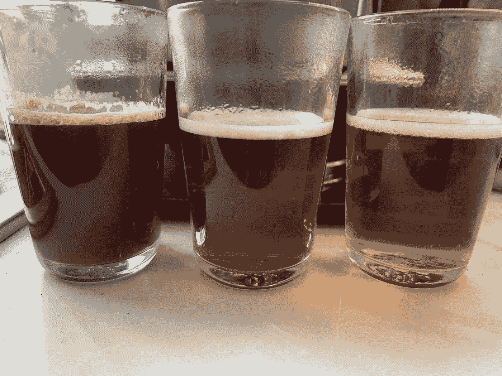

冰球看起来很奇怪。通常，颜色是均匀的，但是现在，上面的颜色比下面的颜色深。

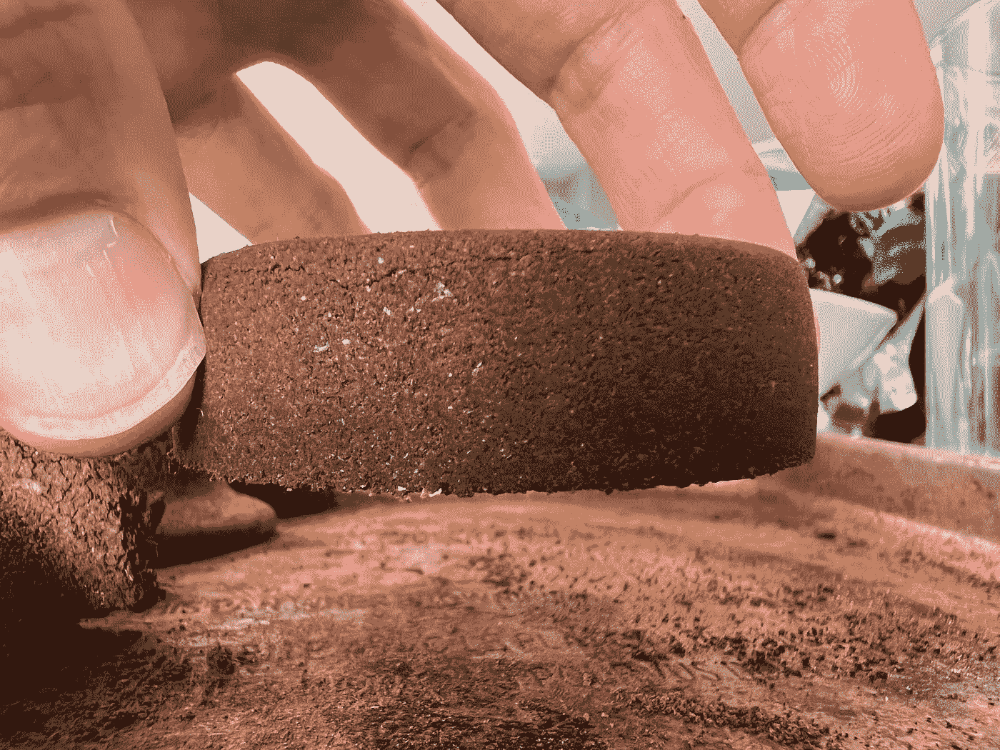

倒置的用过的冰球。

所以我把这个冰球放回篮子里，并让更多的水通过它。

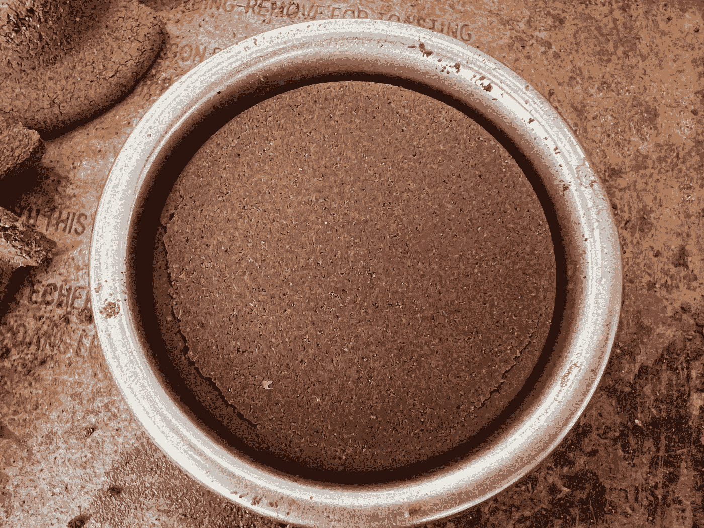

当然流出的水少了。

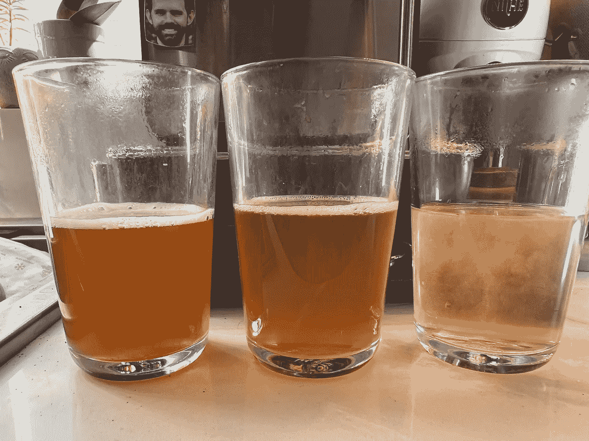

所以我把冰球拿出来，混在一起，然后把它塞回篮子里。

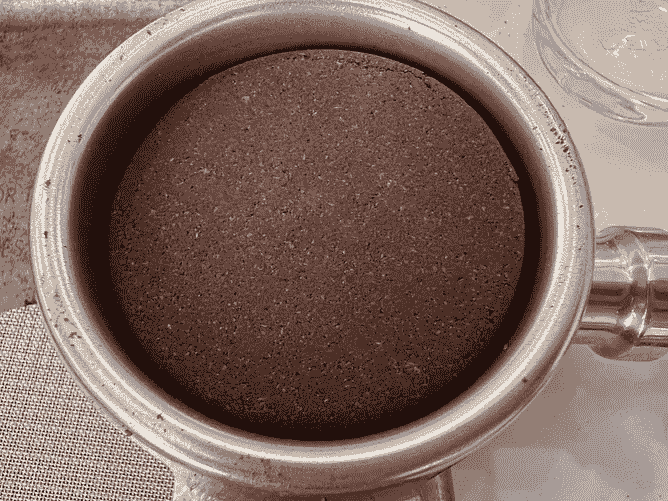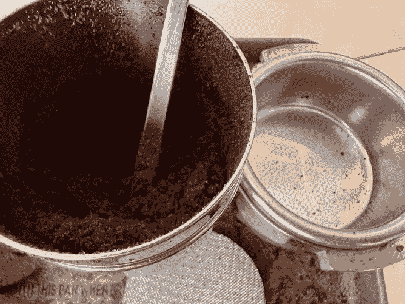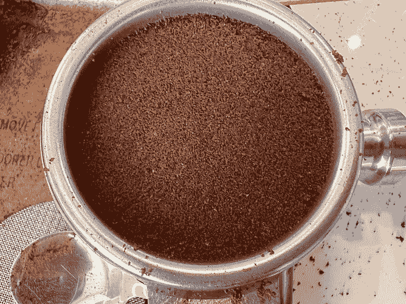

所有这些都是为了从咖啡中提取所有的可溶物。

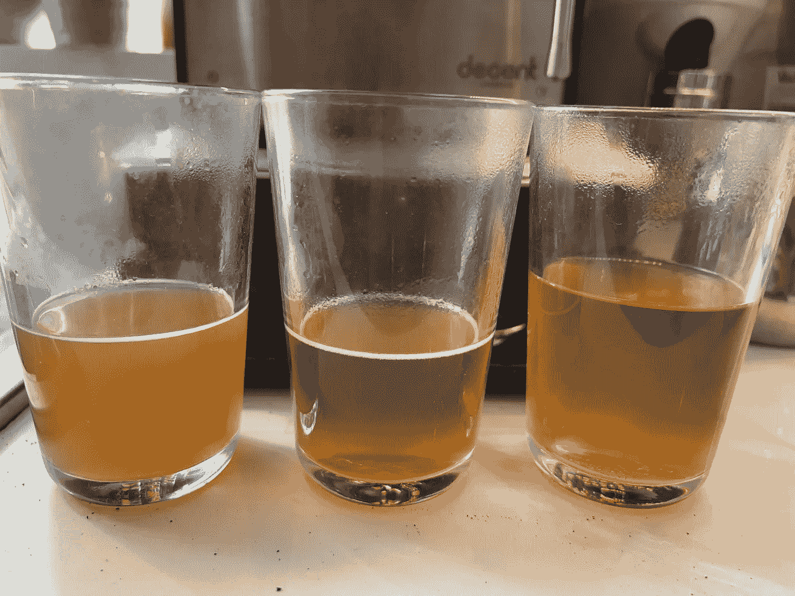

然而，结果却很奇怪。

# 收集数据

我收集了每个阶段的 TDS。

这个测量可以告诉我们提取了多少咖啡。通常情况下，30%的咖啡是可溶的，但更多的咖啡不断从圆盘中流出。

我想过继续，但是我不需要为了我的实验而继续。我降到了 0% TDS，我想进行更大的实验。然而，这个数据是如此有趣和引人注目，因为它违背了我所假设的最大提取量。数据还表明，有微通道导致一些咖啡碎片没有暴露在足够的水流中进行提取。

如果你愿意，可以在推特、 [YouTube](https://m.youtube.com/channel/UClgcmAtBMTmVVGANjtntXTw?source=post_page---------------------------) 和 [Instagram](https://www.instagram.com/espressofun/) 上关注我，我会在那里发布不同机器上的浓缩咖啡照片和浓缩咖啡相关的视频。你也可以在 [LinkedIn](https://www.linkedin.com/in/dr-robert-mckeon-aloe-01581595) 上找到我。也可以关注我在[中](https://towardsdatascience.com/@rmckeon/follow)和[订阅](https://rmckeon.medium.com/subscribe)。

# [我的进一步阅读](https://rmckeon.medium.com/story-collection-splash-page-e15025710347):

[我未来的书](https://www.kickstarter.com/projects/espressofun/engineering-better-espresso-data-driven-coffee)

[我的链接](https://rmckeon.medium.com/my-links-5de9eb69c26b?source=your_stories_page----------------------------------------)

[浓缩咖啡系列文章](https://rmckeon.medium.com/a-collection-of-espresso-articles-de8a3abf9917?postPublishedType=repub)

工作和学校故事集