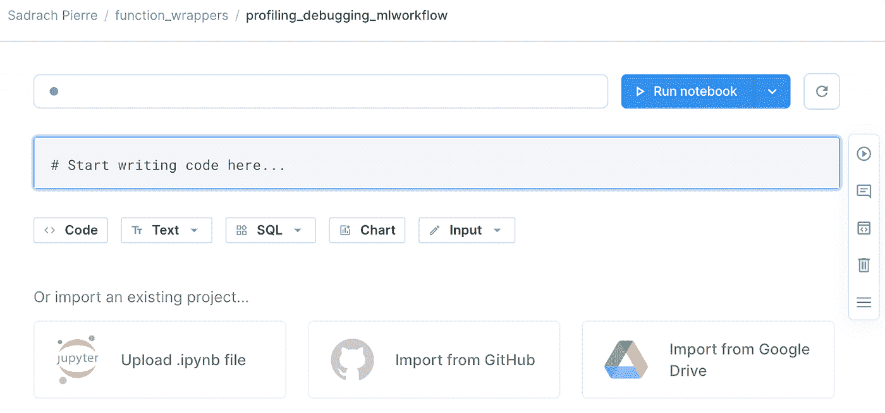
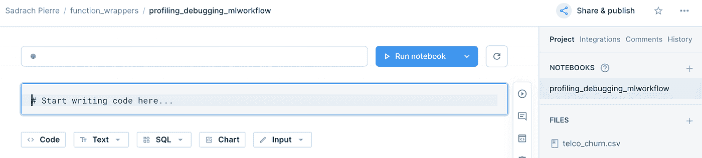
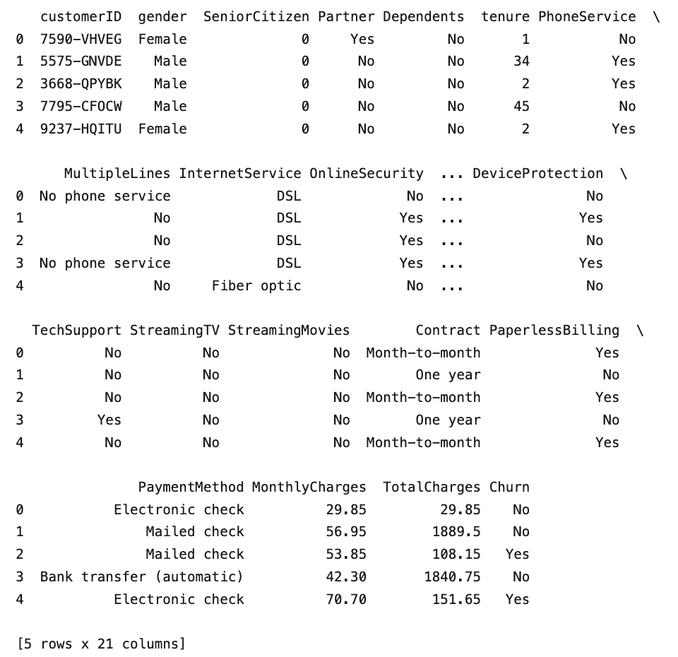
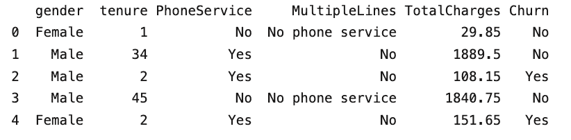
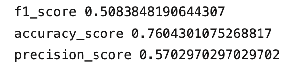
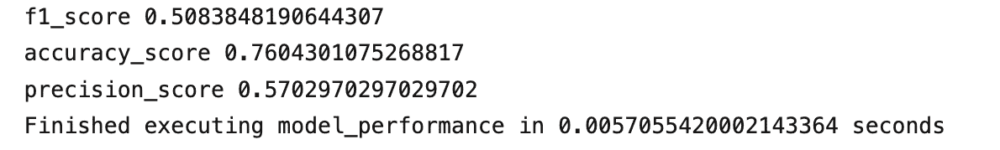

# Python 中的函数包装器:模型运行时和调试

> 原文：<https://towardsdatascience.com/function-wrappers-in-python-model-runtime-and-debugging-243da483b9d6>

## 使用函数包装器进行机器学习


图片由[Acharaporn Kamornboonyarush](https://www.pexels.com/@feelartfeelant/)在[像素](https://www.pexels.com/photo/photo-of-red-boxes-1028723/)上拍摄

函数包装器是修改函数行为的有用工具。在 [Python](https://builtin.com/learn/tech-dictionary/python) 中，他们被称为装饰者。Decorators 允许我们扩展函数或类的行为，而不改变包装函数的原始实现。

decorators 的一个特别有用的应用是用于监控函数调用的运行时，因为它允许开发人员监控一个函数成功执行和运行需要多长时间。这一过程对于管理时间和成本等计算资源至关重要。

函数包装器的另一个应用是调试其他函数。在 Python 中，定义打印函数参数和返回值的调试器函数包装器非常简单。这个应用程序对于使用几行代码检查函数执行失败的原因非常有用。

Python 中的 functools 模块使得定义定制装饰器变得容易，它可以“包装”(修改/扩展)另一个函数的行为。事实上，正如我们将看到的，定义函数包装器与在 Python 中定义普通函数非常相似。一旦定义了函数装饰器，我们只需在想要修改或扩展的函数之前的代码行中使用“@”符号和包装函数的名称。定义定时器和调试器函数包装器的过程遵循类似的步骤。

在这里，我们将考虑如何为简单分类模型定义和应用函数包装器来剖析机器学习模型运行时。我们将使用这个函数包装器来监控简单机器学习工作流中的数据准备、模型拟合和模型预测步骤的运行时。我们还将看到如何定义和应用函数包装器来调试这些相同的步骤。

我将使用 [Deepnote](https://deepnote.com/home) ，这是一个数据科学笔记本，它使管理机器资源变得容易，并提供各种数据科学工具之间的无缝切换。这些特性使得运行可重复实验变得简单。我们将使用虚构的[电信客户流失](https://www.kaggle.com/datasets/blastchar/telco-customer-churn)数据集，该数据集在 Kaggle 上公开。数据集在 [Apache 2.0 许可](https://www.apache.org/licenses/LICENSE-2.0)下可以自由使用、修改和共享。

**监控机器学习工作流的运行时间**

让我们通过一个例子来看看这个过程是如何工作的。

**数据准备**

让我们通过导航到 Deepnote 平台开始数据准备过程(如果您还没有帐户，注册是免费的)。让我们创建一个项目。


作者截图

并将我们的项目命名为 function_wrappers，将我们的笔记本命名为 profiling_debugging_mlworkflow:



作者截图

让我们将数据添加到 Deepnote:



作者截图

我们将使用熊猫图书馆来处理我们的数据。我们来导入一下:

```
import pandas as pd
```

接下来，让我们定义一个函数，我们称之为 data_preparation:

```
def data_preparation():
  pass
```

我们来补充一些基本的数据处理逻辑。该功能将执行五项任务:

1.  读入数据
2.  选择相关列
3.  该函数将接受列名列表作为输入
4.  清理数据
5.  指定列数据类型
6.  为培训和测试拆分数据
7.  该函数将把测试大小作为输入
8.  返回训练和测试集

让我们首先添加读入数据的逻辑。让我们也添加显示前五行的逻辑:

```
def data_preparation(columns, test_size):
  df = pd.read_csv("telco_churn.csv")
  print(df.head())
```

让我们调用我们的数据准备函数。现在，让我们传递“none”作为列和测试大小的参数:

```
def data_preparation(columns, test_size):
  df = pd.read_csv("telco_churn.csv")
  print(df.head())
  data_preparation(None, None)
```



作者截图

接下来，在我们的 data_preparation 方法中，让我们使用 columns 变量来过滤我们的数据框，定义我们将使用的列名列表，并使用 columns 变量调用我们的函数:

```
def data_preparation(columns, test_size):
  df = pd.read_csv(“telco_churn.csv”)
  df_subset = df[columns].copy()
  print(df_subset.head())
columns = ["gender", "tenure", "PhoneService", "MultipleLines","MonthlyCharges", "Churn"]
data_preparation(columns, None)
```



作者截图

接下来，让我们指定另一个函数参数，我们将使用它来指定每一列的数据类型。在我们函数的循环的[中，我们将为每一列指定数据，这些数据将从我们的数据类型映射输入字典中获得:](https://builtin.com/software-engineering-perspectives/for-loop-vs-while-loop)

```
def data_preparation(columns, test_size, datatype_dict):
  df = pd.read_csv(“telco_churn.csv”)
  df_subset = df[columns].copy()
  for col in columns:
  df_subset[col] = df_subset[col].astype(datatype_dict[col])
  print(df_subset.head())
columns = ["gender", "tenure", "PhoneService", "MultipleLines","MonthlyCharges", "Churn"]
datatype_dict = {"gender":"category", "tenure":"float", "PhoneService":"category", "MultipleLines":"category", "MonthlyCharges":"float", "Churn":"category"}
data_preparation(columns, None, datatype_dict)
```

在另一个 [for 循环](https://builtin.com/software-engineering-perspectives/for-loop-vs-while-loop)中，我们将把所有分类列转换成机器可读的代码:

```
def data_preparation(columns, test_size, datatype_dict):
  df = pd.read_csv("telco_churn.csv")
  df_subset = df[columns].copy()

  for col in columns:
     df_subset[col] = df_subset[col].astype(datatype_dict[col])

  for col in columns:
   if datatype_dict[col] == "category":
     df_subset[col] = df_subset[col].cat.codes

columns = ["gender", "tenure", "PhoneService", "MultipleLines","MonthlyCharges", "Churn"]
datatype_dict = {"gender":"category", "tenure":"float", "PhoneService":"category", "MultipleLines":"category", "MonthlyCharges":"float", "Churn":"category"}
data_preparation(columns, None, datatype_dict)
```

最后，让我们指定我们的输入和输出，分割我们的数据用于训练和测试，并返回我们的训练和测试集。首先，让我们从 Scikit-learn 中的模型选择模块导入[训练测试分割方法](https://builtin.com/data-science/train-test-split):

```
from sklearn.model_selection import train_test_split
```

接下来，让我们指定我们的输入、输出、训练和测试集:

```
def data_preparation(columns, test_size, datatype_dict):
  df = pd.read_csv("telco_churn.csv")
  df_subset = df[columns].copy()

  for col in columns:
     df_subset[col] = df_subset[col].astype(datatype_dict[col])

  for col in columns:
   if datatype_dict[col] == "category":
     df_subset[col] = df_subset[col].cat.codes
  X = df_subset[["gender", "tenure", "PhoneService", "MultipleLines","MonthlyCharges",]]
  y = df_subset["Churn"]
  X_train, X_test, y_train, y_test = train_test_split(X, y, test_size=test_size, random_state=42)
  return X_train, X_test, y_train, y_test

columns = ["gender", "tenure", "PhoneService", "MultipleLines","MonthlyCharges", "Churn"]
datatype_dict = {"gender":"category", "tenure":"float", "PhoneService":"category", "MultipleLines":"category", "MonthlyCharges":"float", "Churn":"category"}
X_train, X_test, y_train, y_test = data_preparation(columns, 0.33, datatype_dict)
```

**模特培训**

现在我们已经准备好了训练和测试数据，让我们来训练分类模型。为简单起见，让我们定义一个函数，用默认参数训练一个随机森林分类器，并设置一个随机状态再现性。该函数将返回经过训练的模型对象。让我们从导入随机森林分类器开始:

```
from sklearn.ensemble import RandomForestClassifier
```

接下来，让我们定义我们的拟合函数并存储训练好的模型对象:

```
def fit_model(X_train,y_train):
   model = RandomForestClassifier(random_state=42)
   model.fit(X_train,y_train)
   return model

model = fit_model(X_train,y_train)
```

**模型预测和性能**

让我们也定义我们的预测函数，它将返回模型预测

```
def predict(X_test, model):
   y_pred = model.predict(X_test)
   return y_pred

y_pred = predict(X_test, model)
```

最后，让我们定义一个报告分类性能指标的方法

```
def model_performance(y_pred, y_test):
   print("f1_score", f1_score(y_test, y_pred))
   print("accuracy_score", accuracy_score(y_test, y_pred))
   print("precision_score", precision_score(y_test, y_pred))

model_performance(y_pred, y_test)
```



作者截图

现在，如果我们想使用函数包装器来定义我们的计时器，我们需要导入 functools 和 time 模块:

```
import functools
import time
```

接下来，让我们定义我们的定时器函数。我们称之为 runtime_monitor。它将采用一个名为 input_function 的参数作为自变量。我们还将把输入函数传递给 functools 包装器中的 wrappers 方法，我们将把它放在实际的计时器函数之前，称为 runtime_wrapper:

```
def runtime_monitor(input_function):
  @functools.wraps(input_function)
  def runtime_wrapper(*args, **kwargs):
```

接下来，在运行时包装器的范围内，我们为输入函数指定计算执行运行时的逻辑。我们定义了一个开始时间值，函数的返回值(我们执行函数的地方)一个结束时间值，以及运行时间值，即开始时间和结束时间之差

```
 def runtime_wrapper(*args, **kwargs):
     start_value = time.perf_counter() 
     return_value = input_function(*args, **kwargs)
     end_value = time.perf_counter()
     runtime_value = end_value - start_value 
     print(f"Finished executing {input_function.__name__} in {runtime_value} seconds")
     return return_value
```

我们的计时器函数(runtime_wrapper)是在 runtime_monitor 函数的范围内定义的。完整的功能如下:

作者创建的嵌入

然后，我们可以使用 runtime_monitor 来包装我们的 data_preparation、fit_model、predict 和 model_performance 函数。对于数据准备，我们有以下内容:

```
@runtime_monitor
def data_preparation(columns, test_size, datatype_dict):
  df = pd.read_csv("telco_churn.csv")
  df_subset = df[columns].copy()
  for col in columns:
     df_subset[col] = df_subset[col].astype(datatype_dict[col])
  for col in columns:
   if datatype_dict[col] == "category":
     df_subset[col] = df_subset[col].cat.codes
  X = df_subset[["gender", "tenure", "PhoneService", "MultipleLines","MonthlyCharges",]]
  y = df_subset["Churn"]
  X_train, X_test, y_train, y_test = train_test_split(X, y, test_size=test_size, random_state=42)
  return X_train, X_test, y_train, y_test

columns = ["gender", "tenure", "PhoneService", "MultipleLines","MonthlyCharges", "Churn"]
datatype_dict = {"gender":"category", "tenure":"float", "PhoneService":"category", "MultipleLines":"category", "MonthlyCharges":"float", "Churn":"category"}
X_train, X_test, y_train, y_test = data_preparation(columns, 0.33, datatype_dict)
```


作者截图

我们看到我们的数据准备函数需要 0.04 来执行。对于 fit_model，我们有:

```
@runtime_monitor
def fit_model(X_train,y_train):
   model = RandomForestClassifier(random_state=42)
   model.fit(X_train,y_train)
   return model

model = fit_model(X_train,y_train)
```


作者截图

我们预测:

```
@runtime_monitor
def predict(X_test, model):
   y_pred = model.predict(X_test)
   return y_pred

y_pred = predict(X_test, model)
```


作者截图

最后，对于模型性能:

```
@runtime_monitor
def model_performance(y_pred, y_test):
   print("f1_score", f1_score(y_test, y_pred))
   print("accuracy_score", accuracy_score(y_test, y_pred))
   print("precision_score", precision_score(y_test, y_pred))

model_performance(y_pred, y_test)
```



作者截图

我们看到 fit 方法是最耗时的，这是我们所期望的。在构建像这样简单的机器学习工作流时，能够可靠地监控这些函数的运行时对于资源管理是必不可少的。

**调试机器学习模型**

定义调试器函数包装器也是一个简单的过程。我们先来定义一个叫做调试方法的函数。类似于我们的定时器函数，iit 将接受一个函数作为输入。我们还将把输入函数传递给 functools 包装器中的 wrappers 方法，我们将把它放在实际的调试器函数之前，称为 debugging_wrapper。debugging_wrapper 将参数和关键字参数作为输入:

```
def debugging_method(input_function):
  @functools.wraps(input_function)
  def debugging_wrapper(*args, **kwargs):
```

接下来，我们将把参数的表示、关键字及其值分别存储在名为 arguments 和 keyword_arguments 的列表中:

```
def debugging_wrapper(*args, **kwargs):
       arguments = []
       keyword_arguments = []
       for a in args:
          arguments.append(repr(a))    
       for key, value in kwargs.items():
          keyword_arguments.append(f"{key}={value}")
```

接下来，我们将连接参数和 keyword_argument，然后将它们连接成一个字符串:

```
 def debugging_wrapper(*args, **kwargs):
    ...#code truncated for clarity
    function_signature = arguments + keyword_arguments
    function_signature = "; ".join(function_signature) 
```

最后，我们将打印函数名、它的签名和它的返回值:

```
 def debugging_wrapper(*args, **kwargs):
    ...#code truncated for clarity
     print(f"{input_function.__name__} has the following signature: {function_signature}")
     return_value = input_function(*args, **kwargs)
     print(f"{input_function.__name__} has the following return: {return_value}") 
```

debugging_wrapper 函数也将返回输入函数的返回值。完整的功能如下:

作者创建的嵌入

**数据准备**

现在，我们可以用调试方法包装数据准备函数:

作者创建的嵌入

**模特培训**

我们可以对 fit 函数做同样的事情:

作者创建的嵌入

**模型预测和性能**

对于我们预测函数:

作者创建的嵌入

最后，对于我们的性能函数:

作者创建的嵌入

这篇文章中的代码可以在 [GitHub](https://github.com/spierre91/builtiin/blob/main/profiling_debugging_mlworkflow.ipynb) 上找到。

**Python 中使用的函数包装器**

函数包装器在[软件工程](https://builtin.com/software-engineering-perspectives)、[数据分析](https://builtin.com/learn/tech-dictionary/data-analytics)和[机器学习](https://builtin.com/machine-learning)中有着广泛的应用。当开发机器学习模型时，涉及数据准备、模型训练和预测的操作的运行时间是主要关注的领域。在数据准备的情况下，根据数据的大小和操作的复杂性，诸如读入数据、执行聚合和输入缺失值等操作在运行时会有所不同。记住这一点，当数据改变时，监视这些操作的运行时如何改变是有用的。

此外，将模型拟合到训练数据可以说是机器学习管道中最昂贵的步骤。根据数据对模型进行定型(拟合)的运行时间可能会随着数据大小的不同而有很大的变化，包括包含的要素数量和数据中的行数。在许多情况下，机器学习的训练数据会随着更多的数据而刷新。这导致模型训练步骤在运行时增加，并且通常需要更强大的机器来成功完成模型训练。

模型预测调用也可能因预测输入的数量而异。尽管几十到几百个预测调用可能不会有很长的运行时间，但在某些情况下，需要进行几千到几百万次预测，这会极大地影响运行时间。能够监控预测函数调用的运行时对于资源管理也是必不可少的。

除了监控运行时，使用函数包装器进行调试在构建机器学习模型时也很有用。与运行时监控类似，该过程对于解决数据准备、模型拟合调用和模型预测调用的问题非常有用。在数据准备步骤中，数据刷新可能导致曾经可执行的功能失败。此外，当数据被刷新或用于训练的模型输入被修改时，问题和错误可能出现。使用函数包装器进行调试有助于指出输入、数组形状和数组长度的变化是如何导致 fit 调用失败的。在这种情况下，我们可以使用函数包装器来找到这个 bug 的来源并解决它。

Python 中的函数包装器使得运行时监控和调试变得简单明了。虽然我只讨论了一个非常简单的例子的数据准备、模型拟合和模型预测，但是这些方法对于更复杂的数据会变得更加有用。在数据准备的情况下，运行时监控和调试功能对于其他类型的数据准备非常有用，例如预测缺失值、合并数据源以及通过规范化或标准化来转换数据。此外，在拟合模型和进行预测时，模型类型和模型超参数会对运行时间和错误产生重大影响。拥有可靠的运行时监控和调试工具对于数据科学家和机器学习工程师来说都是很有价值的。

**本帖原载于** [**内置博客**](https://builtin.com/data-science/) **。原片可以在** **这里找到** [**。**](https://builtin.com/data-science/python-wrapper)