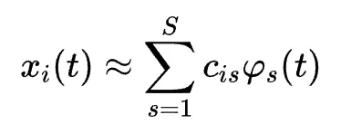
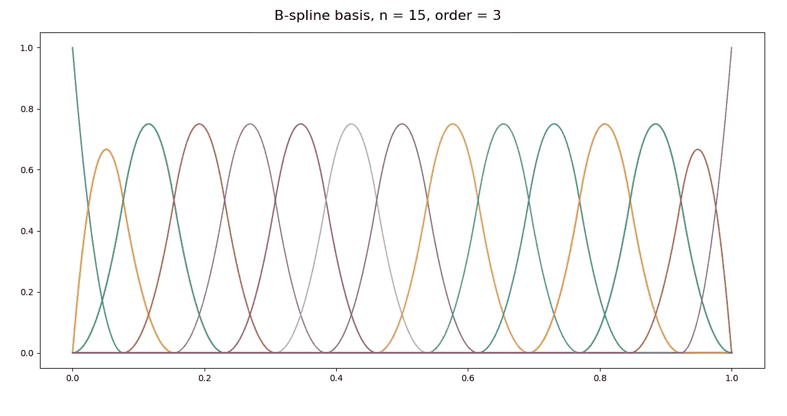
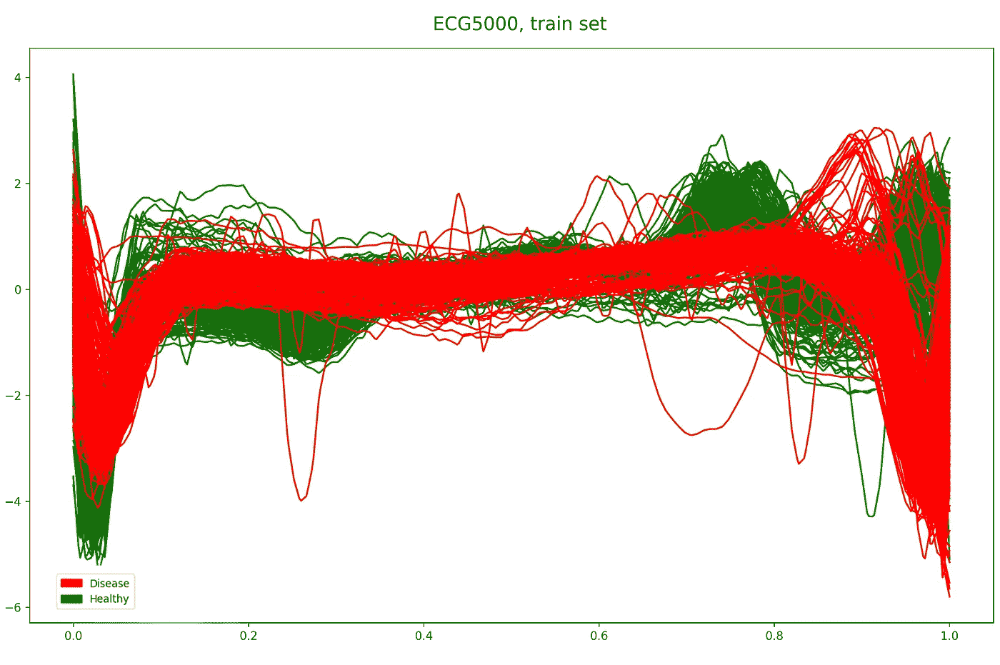
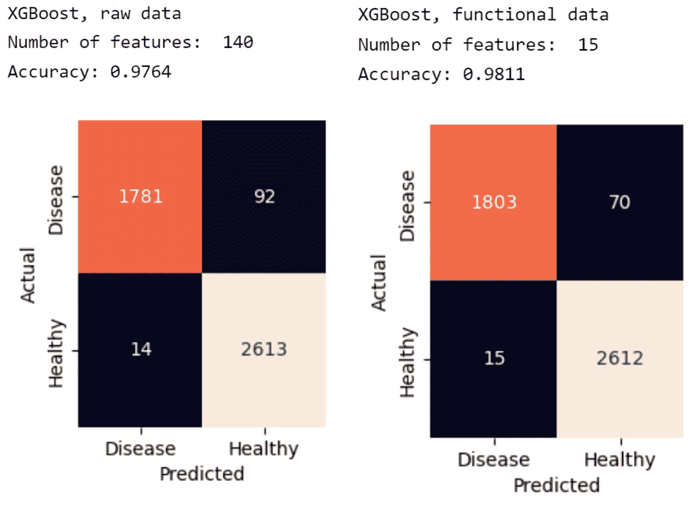
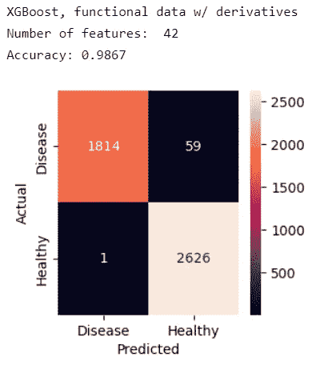

# 功能数据分析:维数灾难的解决方案

> 原文：<https://towardsdatascience.com/functional-data-analysis-a-solution-to-the-curse-of-dimensionality-f83dd19fa6e8>

## *使用梯度增强和 FDA 对 Python 中的 ECG 数据进行分类*


由[马库斯·斯皮斯克](https://unsplash.com/@markusspiske?utm_source=unsplash&utm_medium=referral&utm_content=creditCopyText)在 [Unsplash](https://unsplash.com/s/photos/data-analysis?utm_source=unsplash&utm_medium=referral&utm_content=creditCopyText) 上拍摄的照片

# **维度的诅咒**

维数灾难是指在机器学习中处理**高维数据集**时出现的挑战和困难。随着数据集中维度(或特征)数量的增加，准确了解特征和目标变量之间的关系所需的数据量呈指数增长。这使得在高维数据集上训练高性能的机器学习模型变得困难。

维数灾难是机器学习中的一个问题的另一个原因是，它可能导致过度拟合。在处理高维数据集时，很容易包含不相关或冗余的特征，这些特征对模型的预测能力没有贡献。这可能会导致模型过于接近定型数据，从而导致对看不见的数据的泛化能力很差。

# 功能**数据分析**

**功能数据分析(FDA)** 是一种统计分析，用于分析连续曲线或函数形式的数据，而不是统计分析中常用的传统表格数据。在函数数据分析中，目标是通过检查函数本身之间的关系，而不仅仅是单个数据点，来建模和理解数据的底层结构。这种类型的分析对于复杂或依赖于时间的数据集特别有用，并且**可以提供传统统计技术无法提供的洞察力。**

函数数据分析在许多不同的情况下都很有用。例如，它可用于对可能具有大量底层结构的复杂数据集进行建模，如时序数据或连续测量的数据。它还可用于识别数据中的模式和趋势，这些模式和趋势在查看单个数据点时可能不明显。[1]此外，函数数据分析可以提供对数据集中不同变量之间关系的更详细和细微的理解，这对于进行预测或开发新理论是有用的。**功能数据分析的使用可以帮助研究人员更深入地理解他们正在处理的数据**，并揭示从更传统的统计技术中可能不明显的见解。

## 功能数据表示

可以将数据从离散集合**x₂…xₜx₁**转换成函数形式。换句话说，我们可以将数据表示为函数，而不是离散的点。

在函数数据分析中，基是用来表示连续曲线或函数的一组函数。这个过程也叫基平滑。平滑过程如公式 1 **所示。它包括将统计单位 xᵢ表示为系数 cᵢₛ和基函数φₛ.的线性组合**



等式 1。功能数据表示。[2]

# 基本类型

根据数据的性质和分析的具体目标，可以使用不同类型的基础。一些常见类型的基包括傅立叶基、多项式基、样条基和小波基。每种类型的基础都有其独特的属性，可用于不同类型的数据和分析。例如，傅立叶基常用于具有周期性结构的数据，而多项式基则适用于由多项式函数近似的数据。一般来说，**基础的选择将取决于数据的具体特征和分析的目标。**

## **B 样条** **基础**

在函数数据分析中，B 样条基是一种使用 B 样条函数构造的基。 **B 样条函数是计算机图形学和数值分析中常用的分段多项式函数**。在 B 样条基中，函数以特定的方式排列，以便它们可以用来表示任何连续的曲线或函数。b 样条基常用于函数数据分析，因为它们有许多有用的性质。b 样条基是 FDA 研究中使用最多的基。[3]
图 1 显示了一个三次 B 样条基的例子。



图一。三次 B 样条基，使用 n = 15。图片作者。

## FDA 如何降低数据的维度？

让我们来看一个 FDA 的 Python 实现，以展示这种强大的技术如何在一些数据集上很好地工作，从而既降低维度又提高准确性。您可以在文章末尾找到完整的代码链接。该过程如下:

**1。选择一个数据集** 对于下面的例子，我使用的是 [BIDMC 充血性心力衰竭数据库](https://physionet.org/content/chfdb/1.0.0/)【4】【5】数据集。该分析基于一个名为 [ECG5000](https://timeseriesclassification.com/description.php?Dataset=ECG5000) 的预处理版本。如图 2 所示，数据集是一个具有 140 个特征(时刻)和 5000 个实例(500 个用于训练集，4500 个用于测试集)的时间序列。在目标变量中有五个等级，有四种不同类型的心脏病。对于这种分析，我们将只考虑一个二元目标，如果心跳正常，则为 0，如果受到心脏病的影响，则为 1。**训练集大小为 500x140，是一个高维数据集。**



图二。ECG5000 数据集。数据集的目的是预测心脏病。图片作者。

**2。选择一个基础。** 我选择了如图 1 所示的基础。

**3。以函数形式表示数据。** 图 3 显示了使用具有 15 个函数的 B 样条将数据转换为函数形式后的结果。我已经用 python 库 [scikit-fda](https://fda.readthedocs.io/en/latest/) 用下面的代码完成了。

```
import pandas as pd
import numpy as np
import matplotlib.pyplot as plt
import pandas as pd
from skfda.representation.basis import BSpline
from skfda.representation import FDataGrid, FDataBasis

train = pd.read_csv(f'ECG5000_TRAIN.arff', header=None)
test = pd.read_csv(f'ECG5000_TEST.arff', header=None)
y_train = train.iloc[:, -1]
y_train = [1 if i == 1 else 0 for i in y_train]
X_train = train.iloc[:, :-1]
y_test = test.iloc[:, -1]
y_test = [1 if i == 1 else 0 for i in y_test]
X_test = test.iloc[:, :-1]

basis = BSpline(n_basis=15, order = 3)
X_train_FDA = FDataBasis.from_data(X_train, grid_points= np.linspace(0, 1, 140), basis=basis)
X_test_FDA = FDataBasis.from_data(X_test, grid_points= np.linspace(0, 1, 140), basis=basis)

X_train_FDA = X_train_FDA.coefficients
X_test_FDA = X_test_FDA.coefficients
```


图 3。用函数表示的 ECG5000。图片作者。

**4。最后，提取系数。这是你的新数据集。** 基础集中有 15 个功能。因此，要使用 15 个系数。该过程有效地将维数从 140 减少到 15 个特征。现在让我们训练一个 XGBoost 模型来评估准确性是否受到影响。



图 4。ECG5000 数据集上的 FDA 之前和之后。图片作者。

可以观察到，在将特征的数量减少了几乎 10 倍之后，准确度提高了！

## 还有一步:添加衍生品

导数是一个数学概念，用来衡量函数相对于它的一个自变量的变化率。在函数数据分析的背景下，导数可用于定量描述函数数据集的平滑度和形状。例如，函数的一阶导数可用于识别局部最大值和最小值，而二阶导数可用于识别拐点。

导数也可以用来确定函数的斜率或曲率的变化。这对于识别一段时间内数据的趋势或变化非常有用。此外，导数可用于通过多项式展开来逼近原始函数，这对于进行预测或对数据执行其他分析非常有用。
图 5 显示了添加一阶和二阶导数后精度的提高。导数以同样的方式加入。首先，我们对函数形式求导，并将基系数添加到数据集。对二阶导数重复这一过程。

由于我们添加了额外的功能，维度增加了。然而，它还不到原始数据集的三分之一。混淆矩阵显示,**衍生工具为模型**增加了重要信息，显著减少了假阴性的数量，并且**实现了对健康个体近乎完美的分类。**



图 5。特征加导数后的结果。图片作者。

## 结论

总的来说，FDA 是分析功能数据的强大工具，在工程、经济和生物学等领域有广泛的应用。它能够使用函数形式对函数数据进行建模，并应用广泛的统计方法，这使它成为在某些情况下降低维度和提高准确性的重要工具。

## 参考

您可以在 [GitHub](https://github.com/reese3222/fda-ecg5000/blob/main/fda-ecg5000.ipynb) 上找到数据集以及图和模型的完整代码。

[1] Ramsay，j .，& Silverman，B. W. *功能数据分析* (2010) *(统计学中的 Springer 系列)*(精装第 2 版软装再版。2005).斯普林格。

[2] Maturo，f .，& Verde，r .生物医学信号监督分类的汇集随机森林和功能数据分析:心电图数据的理论和应用。(2022).*医学统计学*， *41* (12)，2247–2275。[https://doi.org/10.1002/sim.9353](https://doi.org/10.1002/sim.9353)

[3]s .乌拉和 f .芬奇。功能数据分析的应用:系统综述。(2013) *BMC 医学研究方法论*， *13* (1)。【https://doi.org/10.1186/1471-2288-13-43】

[4] Baim DS，Colucci WS，Monrad ES，Smith HS，Wright RF，Lanoue A，Gauthier DF，Ransil BJ，Grossman W，Braunwald E .口服米力农治疗严重充血性心力衰竭患者的生存率。美国心脏病学会，1986 年 3 月；7(3):661–670.[http://www.ncbi.nlm.nih.gov/entrez/query.fcgi?cmd=Retrieve&db = PubMed&list _ UIDs = 3950244&dopt = Abstract](http://www.ncbi.nlm.nih.gov/entrez/query.fcgi?cmd=Retrieve&db=PubMed&list_uids=3950244&dopt=Abstract)

[5] Goldberger，a .，Amaral，l .，Glass，l .，Hausdorff，j .，Ivanov，P. C .，Mark，r .，…和 Stanley，H. E. (2000 年)。生理银行、生理工具包和生理网:复杂生理信号新研究资源的组成部分。循环[ [在线](https://physionet.org/)。101 (23)，第 e215–e220 页。