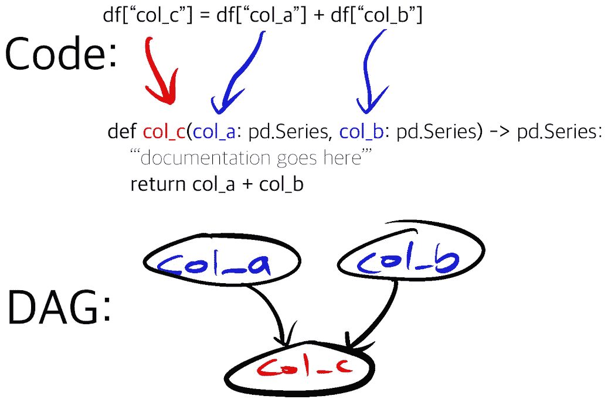

# 功能和 DAGs: Hamilton，一个用于熊猫数据帧生成的通用微框架

> 原文：<https://towardsdatascience.com/functions-dags-introducing-hamilton-a-microframework-for-dataframe-generation-more-8e34b84efc1d>

## 一种防止代码变得过于复杂而无法导航的方法

创建数据框架很容易，但是管理代码库来实现这一点可能会变得困难和复杂。当一个数据科学团队寻求帮助来解决这个问题时，Stitch Fix Platform 团队一起工作来构建 [Hamilton](https://github.com/DAGWorks-Inc/hamilton/) 【开源代码】！这篇文章是汉密尔顿的背景介绍。

注:这篇帖子是最初出现在 [Stitch Fix 多线程博客](https://multithreaded.stitchfix.com/algorithms/blog/)上的两篇帖子([帖子 1](https://multithreaded.stitchfix.com/blog/2021/10/14/functions-dags-hamilton/) 、[帖子 2](https://multithreaded.stitchfix.com/blog/2022/02/22/scaling-hamilton/) )的合并。

# 背景

数据科学家的一项常见任务是生成一个数据框架(也称为特征工程)，用作创建模型的输入。我敢肯定，对于本博客的大多数读者来说，以下是熟悉的景象:

```
df **=** load_some_data('location/SQL query')
df['column_b'] **=** SOME_CONSTANT ***** df['column_a']
df['column_c'] **=** df['column_b'].apply(a_transform)
*# … some more feature engineering* model **=** fit(df)
```

对于简单的领域和模型，上面的代码可能不会太难管理。但是，如果您在时间序列预测这样的领域中，您创建的许多列都是其他列的函数，那么这方面的代码会变得非常复杂。

# 问题是

现在想象一下上面的代码帮助创建某种类型的模型的情况。这些模型是成功的，对业务至关重要，需要每周更新和使用。例如，它正在做一些重要的运营预测。没问题，上面的代码存在于一个脚本中，该脚本可以由一个预定的任务执行。为了便于创建和管理更好的模型，围绕这一业务关键任务组建了一个团队，他们遵循最佳实践来维护工作秩序，例如，代码是受版本控制的，以便可以审查任何更改，可以恢复任何重大更改，等等。

现在，五年过去了，团队的成长刚好能够跟上业务的发展。你认为上面的代码库会发生什么？它可能变得更加复杂；适应业务变化、新模式、新功能。但是它是一种很好的综合体吗，是你愿意日复一日与之共事的综合体吗？不太可能。这并不是因为恶意或糟糕的软件工程实践而变得复杂，它只是因为每次需要改变时，都需要触及数据框架(本例中的 df)。这导致了一些问题:

列(即特征)依赖关系很难确定。

*   例如，如果我创建列 a，它随后被列 c、d 使用，然后这些列又被用作创建其他列的输入，这些列又被用作输入，等等。除非您阅读所有代码，否则没有简单的方法来确定这些依赖关系。这在大型代码库中是困难的。

文档很难。

*   如果有许多行代码在做:
    `df['column_z'] **=** df['column_n'] ***** log(df['column_o']) **+** 1` 那么很难自然地放置文档。

单元测试很难。

*   与文档示例类似，如何轻松地对内联数据帧转换进行单元测试？

您需要执行并理解整个脚本来获得任何列(即特性)。

*   如果您只需要数据帧的一部分就需要计算整个数据帧，这可能会成为开发的负担。例如，你正在开发一个不需要所有这些柱子的新模型……*让我去煮点咖啡……*

在应用程序中，这意味着一个新加入团队的人有很多准备工作要做，任期与调试一个问题或添加一个新列(特性)所花费的时间直接相关。生产率的学习曲线变得陡峭而漫长；每一个新的修改都加剧了这条曲线——经过多年的这种开发，学习曲线看起来更像黎明之墙。

你们中的一些人可能会读到这里，并想知道——“这些人到底怎么了？”— *显然*解决办法是增加功能。可以记录功能，并进行单元测试。在这一点上，我们不同意你的意见。功能很棒！然而，将代码组织成函数仅仅是一种工具，并不能提供足够的防护来防止我们上面看到的问题。例如，您将什么作为输入传递给这些函数？整个数据框架？数据帧的特定列？十有八九，这仍然意味着您必须执行整个脚本才能得到任何东西。它也没有解决知道哪些列被使用和未被使用，以及它们之间的关系的问题。

# 缝合固定方法

在 Stitch Fix，需求预测和评估(FED)团队负责业务决策所依据的运营预测。作为工作流程的一部分，他们需要大型复杂的数据框架来训练和执行他们的模型。很自然，他们会遇到我们上面描述的每一个问题。谢天谢地，现在他们不用自己解决这个问题了。

Stitch Fix 的 Algo 平台团队的职能之一是帮助构建库、工具和平台，以使数据科学家能够更快地开展工作。Algo 平台团队分为多个子团队，专注于数据科学与业务相结合所需的不同功能。每个子团队在创建解决方案时都有很大的自由度。我们的模型生命周期团队解决了这个问题，他们的目标是简化模型生产——包括简化特征创建。

在继续之前，我们首先要提到的是，虽然我们探索了各种产品，但我们没有发现任何开源工具可以显著提高我们解决上述问题的能力。第二，我们在这里没有解决大数据挑战，所以基本假设是所有数据都可以放在内存中，但是 Hamilton 可以在多个 CPU 上运行，并扩展到大数据集大小。

# 结果是:汉密尔顿

为了解决美联储的问题，美联储和模型生命周期团队之间形成了合作，一个项目诞生了，以帮助重新思考他们的代码库。由此产生了用于生成数据帧的 python 微框架 [Hamilton](https://github.com/stitchfix/hamilton) 。这个框架是专门为解决创建数据框架(包含成千上万的工程特性和多年的业务逻辑)所带来的难题而设计的，这些数据框架将用作时间序列预测的输入。Hamilton 的主要“技巧”是如何改变数据帧创建和操作的范式，以处理这种令人痛苦的复杂性。更多信息请见下文。

随着 2019 年 11 月汉密尔顿的出现，美联储团队的数据科学家专门编写了特殊形状的 python 函数来产生他们的数据框架。如前所述，简洁的函数有助于解决单元测试和文档方面的问题，我们在这里并没有开拓新的领域。然而，如何解决跟踪数据帧内的依赖性和选择性执行的问题呢？容易；我们构建了一个[有向无环图](https://en.wikipedia.org/wiki/Directed_acyclic_graph)，或者简称为 DAG，使用 python 函数如何形成的属性。

**你** : *等等，我糊涂了？解释一下！*

不是让数据科学家编写如下的列转换:

```
df['COLUMN_C'] **=** df['COLUMN_A'] **+** df['COLUMN_B']
```

Hamilton 使数据科学家能够将它们表达为类似于 following⁴:的函数

```
**def** **COLUMN_C**(COLUMN_A: pd.Series, COLUMN_B: pd.Series) **->** pd.Series:
      """Documentation"""
	**return** COLUMN_A **+** COLUMN_B
```

函数的*名等同于列名。*输入参数*是该函数所依赖的输入列(或其他输入变量)的名称。*功能文档 string⁵* 成为仅用于这部分业务逻辑的文档。函数*的*主体照常进行计算。对于大多数意图和目的来说，输出应该是一个序列或者一个数据帧，但是这不是一个硬性要求。*

注意范式的转变！汉密尔顿没有让数据科学家编写代码，然后在一个大规模的过程中执行，而是利用函数的定义方式来创建 DAG，并为数据科学家执行它。使用这种方法，列关系和业务逻辑可以很容易地进行文档化和单元测试。



显示代码在前、代码在后和 DAG 构造的示例。*图片作者。*

列定义与函数定义对等，然后我们利用 python 的内置 [inspect](https://docs.python.org/3/library/inspect.html) ⁷模块来创建所有这些声明函数的 DAG。这使我们能够确定需要 DAG 的哪些部分来计算任何给定的节点，即列。这反过来又使我们能够削减给定所需输出列列表所需的输入和执行集。

数据科学家现在可以通过两个简单的步骤创建他们想要的数据框架:初始化和执行。这些步骤的内部工作被框架巧妙地抽象出来。数据科学家需要为 DAG 的初始化指定的所有内容是一些初始配置参数和 python 包/模块，以获取函数定义。为了执行，他们只需要指定在最终的数据帧中需要哪些列。

功能示例 1:

```
import importlib
from hamilton import driverinitial_columns **=** {  *# load from actuals or wherever 
*                     *# this is our initial data we use as input.
*    'signups': pd.Series([1, 10, 50, 100, 200, 400]),
    'spend': pd.Series([10, 10, 20, 40, 40, 50]),
}*# module to import functions from; could just do import my_functions* module_name **=** 'my_functions'
py_module **=** importlib.import_module(module_name)*# create the DAG* dr **=** driver.Driver(initial_columns, py_module)*# determine what we want in the end* output_columns **=** ['signups', 'avg_3wk_spend', 'some_column']# create the dataframe
df **=** dr.execute(output_columns, display_graph**=**False)
```

能够将列关系表示为 DAG 还有其他一些好处:

*   通过函数上的类型提示，我们可以在运行 DAG 之前编译它，以进行基本的类型检查和验证。
*   我们可以想象匕首。这是快速理解复杂关系的好方法——对新老团队成员都是如此。
*   我们可以执行其他图形分析，例如，我们可以删除什么？例如，未使用的列将被表示为孤立的 Dag。
*   通过使用 DAG 对函数执行进行逻辑建模，这为我们针对不同的执行环境编译执行提供了可能性。例如 Spark，或者适当地利用系统上的多个内核等。

就是这样。它非常简单，相对来说也很轻便。

如果你仍然不相信，这里有一份来自 Stitch Fix 的数据科学家的证明，他加入了美联储团队:

> 我之前在一个处理多层信息依赖的组织工作过。“数据产品”是多年来多位作者在没有系统检查循环引用等坑洞的情况下添加图层的结果。正因为如此，该产品是一个非常脆弱的产品，知识转移是通过一个新成员的一系列特别的试验和错误来进行的；他们遇到一个问题，要求他们的主管澄清，然后他们得到一个不透明的解释和解决方法，然后通过电话游戏传播给下一个人(解决方案的机制被传播，但解决方案背后的原因没有被传播)。在我自己的经历中，直到我顽强地跟随信息的线索并自己建立了一个 dag，啊哈时刻才出现。
> 
> *有过这样的经历后，拥有一个已经有图形结构来体现复杂依赖性的数据产品是一件令人高兴的事情；在它的众多好处中，最主要的是该产品可以适用于其他图形的一般分析方法。此外，由于将数据帧结构与定量说明分开的抽象，它有助于新人处理信息，而不必具有先验领域知识，因为依赖性被清楚地指定，并且功能简单而简明。*

# 学习

让我们回顾一下汉密尔顿自成立以来的一些学习和发展。

## 使 Hamilton 代码更易于维护

随着移植数据科学代码以使用 Hamilton 的工作的进展，我们定义函数以使用 Hamilton 的方式显然还有改进的余地。这里有两个我们认为读者会觉得最有趣的例子:

*   我们如何处理条件执行？我们是需要一个带有 if else 语句的函数，还是需要多个函数来处理依赖于某些输入的情况？例如，Stitch Fix 有多个独立建模的业务线，但是我们希望尽可能共享代码。在每个业务线可能需要一些不同的逻辑的情况下，我们如何最好地处理它，同时保持代码简单、易于理解和遵循？
*   这里有一个人为的例子。这里的要点是，每个业务线的逻辑可能会变得任意复杂，并需要不同的输入，从而混淆依赖结构，并带回我们最初试图与 Hamilton 一起解决的问题。

人为的例子 1:

```
**def** **total_marketing_spend**(business_line: str,
                        tv_spend: pd.Series, 
                        radio_spend: pd.Series, 
                        fb_spend: pd.Series) **->** pd.Series:
   """Total marketing spend."""
   **if** business_line **==** 'womens':
       **return** tv_spend **+** radio_spend **+** fb_spend
   **elif** business_line **==** 'mens':
       **return** radio_spend **+** fb_spend
   **elif** business_line **==** 'kids':
       **return** fb_spend
   **else**:
      **raise** ValueError(f'Unknown business_line {business_line}')
```

*   我们如何在变换[和](https://en.wikipedia.org/wiki/Don%27t_repeat_yourself)之间保持相似的逻辑？相差一个值的重复函数使得代码重复且不必要地冗长。例如，为节假日或特殊事件发生时设置指标变量，或重新设计网站，或推出新产品。

人为的例子 2:

```
**def** **mlk_holiday_2020**(date_index: pd.Series) **->** pd.Series:
   """Indicator for MLK holiday 2020"""
   **return** (date_index **==** "2020-01-20").astype(int)

**def** **us_election_2020**(date_index: pd.Series) **->** pd.Series:
   """Indicator for US election 2020"""
   **return** (date_index **==** "2020-11-03").astype(int)

**def** **thanksgiving_2020**(date_index: pd.Series) **->** pd.Series:
   """Indicator for Thanksgiving 2020"""
   **return** (date_index **==** "2020-11-26").astype(int)
```

幸运的是，我们正在处理函数，所以我们用来帮助上述情况的一个常用策略是创建[装饰器](https://realpython.com/primer-on-python-decorators/)。这些作为[语法糖](https://en.wikipedia.org/wiki/Syntactic_sugar)帮助保持代码更简洁，写起来更愉快。让我们描述一下改进上述例子的装饰者。

**用@config.when*避免 if else 语句**

在上面的“虚构示例 1”中，我们有一堆基于业务线的 *if else* 语句。为了使依赖关系更加清晰，我们定义了三个独立的函数，并用`@config.when`修饰它们，以描述该定义适用的条件。

```
**@**config.when(business_line**=**'kids')
**def** **total_marketing_spend__kids**(fb_spend: pd.Series) **->** pd.Series:
     """Total marketing spend for kids."""
     **return** fb_spend **@**config.when(business_line**=**'mens')
**def** **total_marketing_spend__mens**(business_line: str,
                                radio_spend: pd.Series, 
                                fb_spend: pd.Series) **->** pd.Series:
     """Total marketing spend for mens."""
     **return** radio_spend **+** fb_spend **@**config.when(business_line**=**'womens')
**def** **total_marketing_spend__womens**(business_line: str,
                                  tv_spend: pd.Series, 
                                  radio_spend: pd.Series, 
                                  fb_spend: pd.Series) **->** pd.Series:
     """Total marketing spend for womens."""
     **return** tv_spend **+** radio_spend **+** fb_spend
```

当我们构造 DAG 时，我们只保留满足装饰器中指定的过滤标准的函数。过滤标准来自实例化时提供的配置/初始数据(功能示例 1，变量`initial_columns`)。这使我们能够根据一些配置参数有选择地包含或排除功能。

您可能还注意到了函数名中的`__`后缀指示器。我们希望目标列的名称在不同的配置中保持一致，但是一个函数在一个给定的文件中只能有一个定义，所以我们被迫使用不同的名称。在框架中强加 decorator + dunder 命名约定，我们可以有条件地定义输出列的底层函数；如果我们检测到函数名中的后缀，框架知道要去掉它，从而适当地创建输出列名和定义。

使用`@config.when`有助于确保我们避免复杂的代码，并且可以在 DAG 构建时发现错误的配置。例如，在以前的版本中，如果我们提供了一个不正确的 business_line 值，我们直到代码执行时才知道(如果曾经知道的话！).在使用`@config.when`时，如果我们传入一个不正确的 business_line 值，我们将在请求输出列时出错，因为没有这样的方法来满足这个请求。

**用@参数化**减少代码维护

天真地使用 Hamilton 会使简单的函数感觉不必要的冗长:一行定义函数，另几行用于文档，然后是简单的主体。为了减少这种感觉，我们可以创建一个函数来跨多个列定义共享代码。让我们能够做到这一点的是用`@parametrized`来修饰这个函数，以告诉 Hamilton 它代表哪些列(或者更确切地说，可以用来调用这个函数的所有参数)。例如，我们可以用下面的方式重写“人造例子 2 ”:

```
*# we define the input here* SOME_DATES **=** {
     *# (output name, documentation): value to pass
*    ("mlk_holiday_2020", "MLK 2020"): "2020-01-20",
    ("us_election_2020", "US 2020 Election Day"): "2020-11-03",
    ("thanksgiving_2020", "Thanksgiving 2020"): "2020-11-26",
}**@**function_modifiers.parametrized(parameter**=**"single_date", assigned_output**=**SOME_DATES)
**def** **create_date_indicators_**(date_index: pd.Series, 
                            single_date: str) **->** pd.Series:
    """Helper to create an indicator series from a single date."""
    **return** (date_index **==** single_date).astype(int)
```

除了更简洁之外，我们更喜欢“人造示例 2 ”,主要有两个原因:

1.  如果我们改变逻辑(例如，在我们的例子中日期指示器是如何创建的)，我们只需要在一个地方改变它。
2.  如果我们要创建更多这样的代码，只需要添加一行代码。

我们喜欢这个装潢师的额外原因:

1.  文档！即使我们只添加了一行，我们仍然可以适当地考虑文档，这确保了每个功能仍然是文档化的。

这里我们只讨论了汉密尔顿带来的众多[装饰家中的两个。我们创建的其他 decorators 在其他上下文中提供了帮助，这些上下文来自于我们对框架的其他学习。](https://github.com/stitchfix/hamilton/blob/main/decorators.md)

## 代码审查更简单

创建 Hamilton 时，简化代码审查过程并不是预期的目标。碰巧的是，当您强制将业务逻辑更紧密地封装到功能中时，审查变更要容易得多。

例如，由于逻辑没有很好地封装，Hamilton 的事情要简单得多，而不是必须跟踪涉及大量文件和代码行的更改。迫使数据科学家编写清晰的函数来解释他们需要什么输入和他们创建什么输出，对于评审者来说是一个更简单、更难理解的工件。这样做的结果是，代码评审者更有效率，并且通过评审过程的错误更少。

## 缩放汉密尔顿

当我们谈论缝合固定时的比例时，我们通常指以下之一:

*   复杂性的扩展(额外的模型架构、更多可参数化的管道、额外的业务线/区域)，以及…
*   数据规模和计算的扩展(由于客户群的增长、更大的培训数据、更多的 CPU 内核可供利用，数据集变得更大)

虽然 Hamilton 最初设计时考虑的是前者，但在使用过程中，它发展到解决后者，而不限制分布式计算的方法！使用*图形适配器*的概念，这是可行的，图形适配器是负责处理 Hamilton DAG 并确定各个节点应该如何执行的抽象。不严格地说，这允许你在任何你想要的平台上运行你的 Hamilton DAG 使你能够利用 [ray](https://ray.io/) 的并行性，以及 [spark](https://spark.apache.org/) 的可伸缩性(使用 [pandas API](https://spark.apache.org/docs/latest/api/python/user_guide/pandas_on_spark/index.html) ，又名[考拉](https://github.com/databricks/koalas)和 [dask](https://dask.org/) )。如果你正在使用 [pandas](https://pandas.pydata.org/docs/#) ，好消息是，你现在有三种方法来扩展你的代码！

这一切听起来很酷，也许好得难以置信。可能有一两个警告(阅读文档了解更多！)，但是让我们深入一个例子来说服您，您既可以简单地编写您的管道，又可以让它们伸缩。我们将从一个简单的管道开始，即计算营销支出的汉密尔顿数据流:

```
# my_functions.py
import pandas **as** pd

**def** **avg_3wk_spend**(spend: pd.Series) **->** pd.Series:
    """Rolling 3 week average spend."""
    **return** spend.rolling(3).mean()

**def** **acquisition_cost**(avg_3wk_spend: pd.Series, signups: pd.Series) **->** pd.Series:
    """The cost per signup in relation to a rolling average of spend."""
    **return** avg_3wk_spend **/** signups

**def** **spend_mean**(spend: pd.Series) **->** float:
    """Shows function creating a scalar. In this case it computes the mean of the entire column."""
    **return** spend.mean()

**def** **spend_zero_mean**(spend: pd.Series, spend_mean: float) **->** pd.Series:
    """Shows function that takes a scalar. In this case to zero mean spend."""
    **return** spend **-** spend_mean
```

我们可以使用下面的*“driver”*代码在 pandas 中轻松运行它:

```
import pandas **as** pd
from hamilton import driver

import my_functions  *# we import the module here!**# load from actuals or wherever
#  -- this is one way to provide inputs to Hamilton*
initial_columns **=** {      'signups': pd.Series([1, 10, 50, 100, 200, 400]),
    'spend': pd.Series([10, 10, 20, 40, 40, 50]),
}*# creates the DAG* dr **=** driver.Driver(initial_columns, my_functions)  outputs **=** ['spend','signups','acquisition_cost','spend_zero_mean']*# let's create the dataframe!* df **=** dr.execute(outputs)  **print**(df)
```

通过对驱动程序代码做如下小小的修改(总共五处)，我们可以在 dask 上运行它！请注意，定义业务逻辑的函数根本不需要修改(感谢 dask 实现了 Pandas API 的一个好部分)！

```
import pandas **as** pd
from hamilton import base
from hamilton import driver
from hamilton.experimental import h_dask

import my_functions  *# we import the module here!**# import dask components (1)* from dask.distributed import Client, LocalCluster  from dask import dataframe *# need to adjust how we load data -- (2)*
initial_columns **=** {      'signups': 
    dataframe.from_pandas(pd.Series([1, 10, 50, 100, 200, 400]), 
                          name**=**'signups', npartitions**=**2),
    'spend': 
    dataframe.from_pandas(pd.Series([10, 10, 20, 40, 40, 50]),
                          name**=**'spend', npartitions**=**2),
}*# Setup connection to dask (3)* client **=** Client(LocalCluster())*# Create dask adapter for Hamilton (4)*  **adapter** **=** h_dask.**DaskGraphAdapter**(client,
                                  base.PandasDataFrameResult()) 
*# and pass in the Adapter (4)*dr **=** driver.Driver(initial_columns, my_functions, adapter**=adapter**)  outputs **=** ['spend','signups','acquisition_cost','spend_zero_mean']*# This will now execute using dask!* df **=** dr.execute(outputs)  **print**(df) *# shut things down (5)* client.shutdown() 
```

就这么简单。

补充说明，PyData 社区为确保 python 数据 libraries/frameworks⁷.之间更好的互操作性所做的工作让我们很兴奋在这个例子中，在 dask 上进行缩放是因为他们的工作！

**开放 Hamilton 成为通用数据流框架**

预测团队的管道都围绕着创建熊猫数据框架，汉密尔顿就是在这种假设下成长起来的。然而，通过函数对数据流[建模的概念比最初的应用更普遍。](https://en.wikipedia.org/wiki/Dataflow_programming)

因此，我们引入了*结果* [*Mixin*](https://riptutorial.com/python/example/15228/mixin) ，这是一个帮助告诉 Hamilton 如何将 DAG 的输出转换成可用的 python 对象的抽象。这使得汉密尔顿用户能够操作的不仅仅是熊猫数据帧！它与图形适配器一起使用，使用简单。

这是一个例子，汉密尔顿数据流适合一个模型，并预测它。

```
import numpy **as** np
from sklearn import base, linear_model
from hamilton import function_modifiers

*# This dataflow is abbreviated for this blog post -- see the full example in the examples folder.* 
**@**function_modifiers.config.when(clf**=**'logistic')
**def** **prefit_clf__logreg**(penalty: str) **->** base.ClassifierMixin:
    """Returns an unfitted Logistic Regression classifier object"""
    **return** linear_model.LogisticRegression(penalty)

**def** **fit_clf**(prefit_clf: base.ClassifierMixin, X_train: np.ndarray, y_train: np.ndarray) **->** base.ClassifierMixin:
    """Calls fit on the classifier object; it mutates it."""
    prefit_clf.fit(X_train, y_train)
    **return** prefit_clf

**def** **predicted_output**(fit_clf: base.ClassifierMixin, X_test: np.ndarray) **->** np.ndarray:
    """Exercised the fit classifier to perform a prediction."""
    **return** fit_clf.predict(X_test)

**def** **predicted_output_with_labels**(predicted_output: np.ndarray, target_names: np.ndarray) **->** np.ndarray:
    """Replaces the predictions with the desired labels."""
    **return** np.array([target_names[idx] **for** idx **in** predicted_output])

**def** **y_test_with_labels**(y_test: np.ndarray, target_names: np.ndarray) **->** np.ndarray:
    """Adds labels to the target output."""
    **return** np.array([target_names[idx] **for** idx **in** y_test])
```

我们可以使用下面的驱动程序代码轻松运行它；它请求一个具有两列的 numpy 矩阵，一列具有预测标签，另一列具有基本事实标签。

```
from hamilton import base, driver
import my_train_evaluate_logic

dag_config **=** {'clf': 'logistic'}
**adapter** **=** base.**SimplePythonGraphAdapter**(**base.NumpyMatrixResult()**)
dr **=** driver.Driver(
     dag_config, my_train_evaluate_logic, adapter**=adapter**)
*# the following is abbreviated code:* inputs **=** {'penalty': 'l1', 
          'X_train': ..., 
          'y_train': ..., 
          'X_test': ..., 
          'y_test': ..., 
          'target_names': ...}
result **=** dr.execute(
         ['predicted_output_with_labels', 
          'y_test_with_labels'], 
         inputs**=**inputs)
*# result is a np.ndarray that represents a matrix with two columns.
# One could then go and compute performance metrics with this output...*
```

但是，如果我们想调试输出呢？我们可以很容易地修改代码，返回一个字典作为结果，然后检查汉密尔顿数据流的阶段。我们只需要更新图形适配器，并指定我们想要检查的额外输出。

```
from hamilton import base, driver
import my_train_evaluate_logic

dag_config **=** {'clf': 'logistic'}*# (1) we changed the following line:* **adapter** **=** base.SimplePythonGraphAdapter(**base.DictResult()**)
dr **=** driver.Driver(
     dag_config, my_train_evaluate_logic, adapter**=adapter**)
inputs **=** {'penalty': 'l1', 
          'X_train': ..., 
          'y_train': ..., 
          'X_test': ..., 
          'y_test': ..., 
          'target_names': ...}*# result will now be a dictionary*
result **=** dr.execute(
         ['predicted_output_with_labels', 
          'y_test_with_labels', 
          '**fit_clf**'],     *# (2) add this to get more output*
         inputs**=**inputs)  *

# One could now debug/inspect the fit model and iterate/develop further...*
```

# 总结和未来工作

Hamilton 的诞生是为了帮助一个数据科学家团队通过编写特殊形状的函数，在共享代码库中管理复杂数据帧的创建。通过处理如何，汉密尔顿允许数据科学家专注于什么。这是模型生命周期和 Stitch Fix 的 FED 团队之间成功的跨职能合作的结果，自 2019 年 11 月以来一直在生产中运行。我们认为我们创建 dataframe 或任何 python 对象的新颖方法非常适合我们在 Stitch Fix 的环境，并邀请您亲自尝试一下！

```
pip install sf-hamilton # See [https://hamilton-docs.gitbook.io/docs/](https://hamilton-docs.gitbook.io/docs/)
```

我们对汉密尔顿的发展方向感到非常兴奋，并且正在积极地进行扩展。作为一个引子，我们想分享我们对汉密尔顿如何帮助解决数据质量问题的想法。我们可以添加一个简单的装饰器来运行基本的检查吗？也许像这样的 API 就足够了…

```
**@**check_output({'type': float, 'range': (0.0, 10000.0)})
**def** **SOME_IMPORTANT_OUTPUT**(input1: pd.Series, input2: pd.Series) **->** pd.Series:
    """Does some complex logic"""
    ...
```

你怎么想呢?请在我们的 [github 问题](https://github.com/DAGWorks-Inc/hamilton/issues)中留下您的想法。

如果你对汉密尔顿感兴趣，我们已经在 slack 上开发了一个[社区📣](https://join.slack.com/t/hamilton-opensource/shared_invite/zt-1bjs72asx-wcUTgH7q7QX1igiQ5bbdcg)。如果您对如何最好地使用汉密尔顿有任何疑问或需要建议，请加入我们。您也可以通过探索 [Hamilton 知识库](https://github.com/DAGWorks-Inc/hamilton/)(请⭐️它)，或者在这里浏览我们的文档[来了解更多信息📚](https://hamilton.readthedocs.io/en/latest/)。

# 脚注

[1]在我们的说法中，列是特征。出于本文的目的，我们将坚持把特性描述为数据帧中的列。

[2]黎明墙是约塞米蒂国家公园中一条攀登埃尔卡皮坦山的路线的名字。它非常陡峭，很难攀登。

[3]该框架比仅仅创建数据框架更强大，但这是它的第一个应用。

[4]因为用 Hamilton 编写函数会稍微增加一些冗长，我们有装饰者来帮助保持代码[干燥](https://en.wikipedia.org/wiki/Don%27t_repeat_yourself)。继续阅读，看看一些例子。

[5]你知道吗，有了 [sphinx](https://www.sphinx-doc.org/en/master/) ，一个 python 文档工具，你也可以轻松地展示这个函数文档。我们有一个合并后的工作，从这个代码构建 sphinx 文档，以帮助它更好地浮出水面。

[6]TL；inspect 模块上的 DR 是它允许你非常容易地访问函数的名字和签名。

[7]例如定义一个 [Python 数组 API 标准](https://data-apis.org/blog/array_api_standard_release)的工作。