# 返回函数的函数

> 原文：<https://towardsdatascience.com/functions-that-return-functions-higher-order-functions-and-decorators-in-python-with-examples-4282742cdd3e>

## Python 中的高阶函数和装饰器及其示例


茱莉亚·卡德尔在 [Unsplash](https://unsplash.com?utm_source=medium&utm_medium=referral) 上的照片

**高阶函数**是一个重要的主题，我相信你应该很好地掌握它们是如何工作的，以充分受益于 Python 的能力并充分利用你的代码。

我将用一个例子来说明**高阶函数，这样您可以获得它们的工作知识，然后我们将使用这些知识来**实现一个装饰器**，这是 Python 中高阶函数最典型的用例之一。**

我们开始吧！

> 本帖包含部分转载自我的书内容:**[**深度学习用 PyTorch 循序渐进:初学者指南**](https://pytorchstepbystep.com) **。****

# **一系列功能**

**假设我们想要构建一个**系列的函数**，每个函数都执行给定幂的幂运算。代码应该是这样的:**

**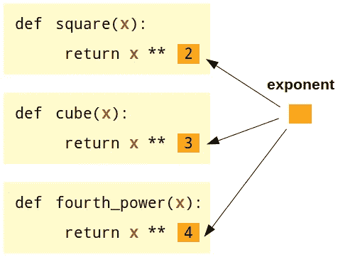**

**执行指数运算的一系列函数**

**嗯，很明显有一个**更高的结构**指向这个:**

*   ****每个函数都有一个参数 *x*** (红色)，这是我们想要取幂的数字；**
*   ****每个函数都执行相同的运算**，取幂，但是每个函数都有一个**不同的指数**(橙色框)。**

**解决这个问题的一个方法是**使指数成为显式参数**，就像下面的代码一样:**

****

**具有两个常规参数的典型函数**

**这很好，而且效果很好。但是它也要求你在每次调用函数时指定指数。**一定还有别的办法**！当然有；这就是这篇文章的目的:-)**

# **函数生成器**

**我们需要**构建另一个(高阶)函数来构建那些函数(正方形、立方体等。)**对我们来说。(高阶)函数只是一个**函数生成器**。但是我们怎么做呢？**

**首先，让我们构建我们试图生成的函数的“*骨架*；它们都**取单个自变量*x*T5(红色)，而**它们都执行求幂运算**，每个都使用一个**不同的指数**(橙色框，不是自变量)。****

**好吧。它应该是这样的:**

**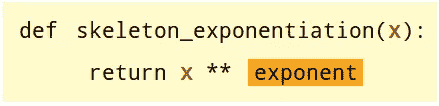**

**函数的框架有一个未定义的变量(指数)**

**如果您尝试用任何一个 ***x*** 调用这个函数**，比如说*skeleton _exp 幂运算(2)* ，您会得到下面的**错误**:****

```
skeleton_exponentiation(2)**Output:
NameError: name ‘exponent’ is not defined**
```

**这是意料之中的:你的“*骨架*函数有**不知道变量*指数*是什么**！这就是高阶函数要完成的任务。**

**我们用一个高阶函数(蓝色)包装我们的*框架*函数，它将构建所需的函数。我们姑且称之为*指数构建器()*。**

**它的参数是什么，如果有的话？嗯，我们正试图**告诉我们的“*骨架*”函数它的指数应该是多少**(橙色框)，所以让我们从那个开始吧！**

**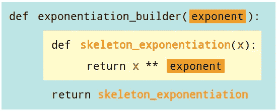**

**高阶函数，定义骨架函数的指数**

**现在我想让你看一下(外层)**返回语句**(在蓝色函数中)。是**而不是**返回一个**值**；是**返回了*骨架*功能，而不是**。**

> **这毕竟是一个函数构建器:它应该构建(并返回)函数。**

**如果我们调用这个给定指数的高阶函数，比如说 2，会发生什么？**

```
returned_function = exponentiation_builder(2)
returned_function**Output:
<function __main__.exponentiation_builder.<locals>.skeleton_
exponentiation(x)>**
```

****结果**正如所料，是一个**函数**！**

**这个函数是做什么的？它应该证明了它的论点——让我们来看看:**

```
returned_function(5)**Output:
25**
```

**然后*瞧啊*！我们有一个函数生成器！我们可以用它来创建尽可能多的指数函数:**

**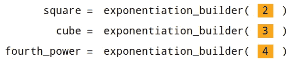**

**由高阶函数建立的一系列函数**

**没那么糟，对吧？这个概念本身非常简单，但是需要密切注意实现细节，以确保“嵌套”的函数和参数被正确定义。**

# **到处都有功能**

**现在，让我们更进一步:如果我们的**高阶函数采用另一个函数作为参数，而不是常规参数(*指数*)呢？****

> **“等等，什么？！将另一个函数作为参数并返回第三个不同函数的函数？真的吗？”**

**是的，完全正确！令人震惊，对吧？:-)**

**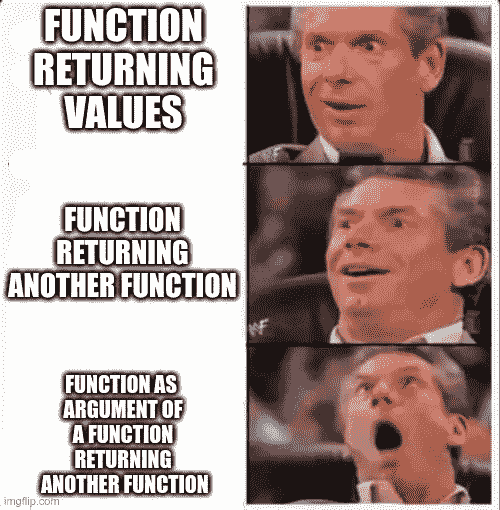**

**令人兴奋的功能！**

> **“我为什么要这么做？”**

**因为很酷！不，真的，**(高阶)函数可以作为装饰器**，并且可以用于**修改它附加到**的任何函数或方法的输出。**

**准备好了吗？让我们开始吧！**

**假设你写了很多函数，它们都以给定的单位返回值(比如，在美国是*英寸*，在其他地方是*毫米*)。**

**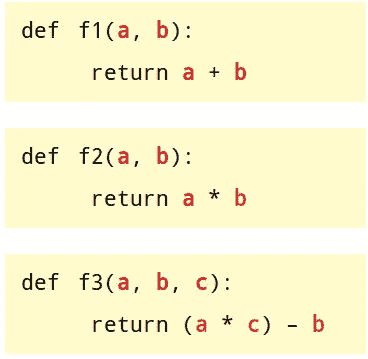**

**“许多”函数返回值以英寸为单位**

**现在，如果你被要求把你的代码发送到世界的另一个地方，那么修改你写的每一个函数**来包含一个**乘法因子**以适应不同的单位是非常麻烦的，对吗？****

**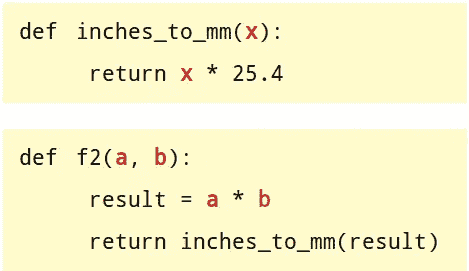**

**修改输出，繁琐的方式！**

> **“老实说，这看起来像是糟糕的软件工程…”**

**是的，最有可能的是**是**糟糕的软件工程——理想情况下，人们会预见到以不同单位产生输出的需要，并将单位(英寸或毫米)作为一个参数，但这超出了这里的重点。**

**所以，请继续这个虚构的故事，让我们看看如何毫不费力地修补这个虚构的代码:-)**

**我们知道，我们的 ***f2()*** 函数接受**两个参数， *a* 和 *b*** (红色)，执行一些操作(不管那是什么，我们不关心操作本身)，并产生一个**结果，我们希望将该结果从英寸转换为毫米。**那么，也许我们可以**围绕*【F2()***构建另一个函数*来执行转换？***

**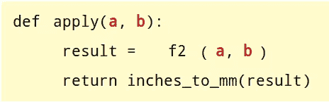**

**使用外部函数修改输出**

**但是这只适用于 *f2()* ，我们希望有一个更通用的解决方案，所以**让我们用一个通用函数来替换 *f2()* ， *func* ()** :**

**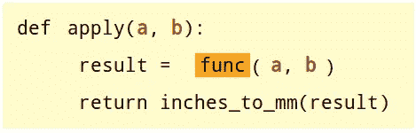**

**具有一个未定义变量(func)的通用函数**

> **“这看起来很熟悉…”**

**这很有意义，因为它非常类似于“函数构建器”一节中的“*框架*”函数。和以前一样，**参数**在**红色**中，而**橙色框**是将要执行的**底层通用函数**。**

**那么，你能猜到如果我们用任何参数调用 *apply()* 函数会发生什么吗？**

> **“一个错误？”**

**你答对了——和之前一样的错误，一个 **NameError** ，因为 ***apply()*** 函数**不知道底层函数 *func* —是什么**。**

```
apply(1, 4)**Output:
NameError: name ‘func’ is not defined**
```

**同样的错误需要同样的解决方案:让我们用蓝色的高阶函数“包装”我们的 *apply()* 函数。因为我们试图**告诉我们的 *apply()* 函数底层函数( *func* )应该是什么**(橙色框)，让我们用它作为“包装器”函数的一个参数！**

**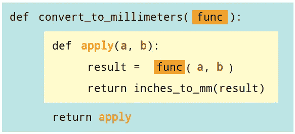**

**高阶函数，定义应用函数的基础函数(func)**

**和之前一模一样:(外部)**返回语句**(蓝色函数中)是**返回一个函数。**不同的是**橙色框**,“wrapper”函数的**参数也是一个函数！****

> **“功能，功能，声音！”**

**我听到了，太多的功能要记住…所以，让我们快速回顾一下**四个**(!)上面五行代码中的函数:**

*   ****底层** **函数** : ***func()*** ，它执行一些代码，不管那是什么，并输出一个结果，据报道以英寸为单位；**
*   **乘法函数: *inches_to_mm()* ，将一个结果从英寸转换成毫米；**
*   ****通用的“应用”函数**:****apply()***，带参数(红色)，**执行底层函数，修改结果**(转换为毫米)；***
*   *****高阶“包装器”函数**:***convert _ to _ 毫米()*** ，其中**将我们正在尝试执行的**的底层函数**作为参数**。***

> ***你还和我在一起吗？我知道这很棘手，所以花点时间把上面的结构看几遍，让它深入理解。***

***现在，让我们最后使用高阶“包装器”函数来转换原始***【F2()***函数的输出:***

***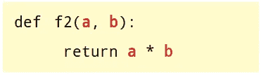***

***原始的 f2()函数***

***记住，***【F2()*函数**要扮演**底层函数**的角色，也就是作为**参数传递给“包装器”函数*convert _ to _ 毫米()*** 。***

```
*f2_in_millimeters = convert_to_millimeters(f2)
f2_in_millimeters**Output:
<function __main__.convert_to_millimeters.<locals>.apply(a, b)>***
```

> *****一个函数进去，另一个函数出来！*****

***让我们调用 ***a* =1** 和 ***b* =4** 的结果函数:***

```
*f2_millimeters(1, 4)**Output:
101.6***
```

***现在我们有了:101.6 毫米，对应于 4 英寸的原始输出。***

*****但是等等，还有！*****

# ***装饰功能***

***事实证明，你甚至不需要创建另一个函数，你可以**简单地在底层函数 *f2()* 之上加上“包装器”函数*convert _ to _ 毫米()*，作为装饰器**！***

***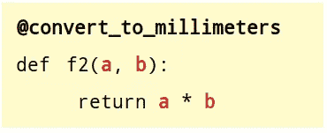***

***装饰 f2()函数***

***现在您可以**直接调用*F2()***，**装饰器将自动执行底层函数(即 *f2()* )并修改结果**，因此您已经获得了以毫米为单位的输出！***

```
 *f2(1, 4)**Output:
101.6***
```

***很酷，对吧？***

> ***“好的，很酷，但是如果我想把 **f3()** 的输出也转换成毫米呢？不会起作用，因为 **f3()** 有三个参数！***

***接得好！为了让我们的*convert _ to _ 毫米()* decorator **真正通用**，我们需要**修改内部的 *apply()* 函数来接受任何参数**:***

***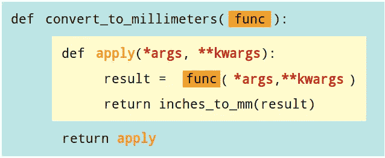***

***一个真正通用的高阶函数，为 apply 函数定义底层函数(func)***

***现在你可以用这个“包装器”函数来**修饰**任何你想要的函数，***【f1()******【F2()******【F3()***等等…***

> ***就这样结束了:-)***

***感谢你阅读这篇文章——我相信学习应该是容易的，有趣的，所以我希望你喜欢它:-)。***

# ***进一步阅读***

***装饰者是一个很大的话题，我只是想给大家展示一下**背后的主要思想**，也就是**修改一个底层函数的输出/行为。**如果你想深入这个话题，请查看 Real Python 的“[Python Decorators 入门](https://realpython.com/primer-on-python-decorators/)”。***

****如果您有任何想法、意见或问题，请在下方留言或通过我的*[*bio . link*](https://bio.link/dvgodoy)*页面联系。****