# 自然语言处理的基本 EDA 技术

> 原文：<https://towardsdatascience.com/fundamental-eda-techniques-for-nlp-f81a93696a75>

## 从数量、长度、词频到为什么不需要词云

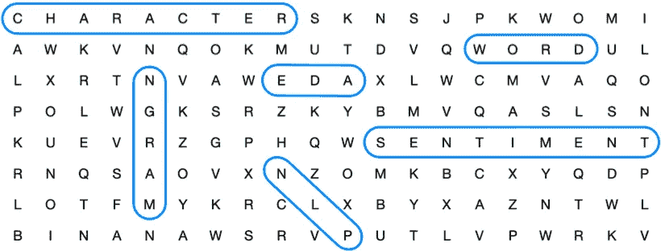

图片由作者提供。

探索性数据分析(EDA)是任何数据科学项目工作流程中的一个重要步骤。然而，当在自然语言处理(NLP)项目中处理文本数据时，您需要应用与处理表格数据不同的技术。

> 处理文本数据[…]时，您需要应用与处理表格数据等不同的技术。

因此，在本文中，我们将研究一些针对文本数据的基本 EDA 技术:

1.  [**计数和长度**](#74ea) **:** 我们将看看字符计数、单词计数、句子计数和字符串计数，以及单词和句子的平均长度。
2.  [**词频分析**](#b757) **:** 我们来看看最常用的词和 n 元词，讨论一下为什么不需要词云。

对于本文，我们将使用来自 Kaggle 的[女装电子商务服装评论](https://www.kaggle.com/datasets/nicapotato/womens-ecommerce-clothing-reviews)数据集。

为了简化示例，我们将使用 450 条正面评论(`rating == 5`)和 450 条负面评论(`rating == 1`)。这将数据点的数量减少到 900 行，将评级类别的数量减少到两个，并平衡正面和负面的评论。

此外，我们将只使用两列:评论文本和评级。

精简数据集的数据帧头如下所示:

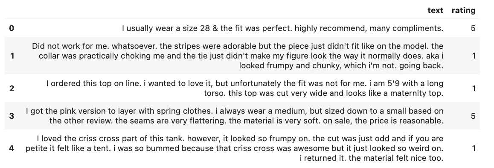

简化的[女性电子商务服装评论](https://www.kaggle.com/datasets/nicapotato/womens-ecommerce-clothing-reviews)数据集负责人(图片由作者提供)

# 计数和长度

先说一些基本的计数和长度。我们将通过一个简单的示例回顾文本来介绍每个功能:

```
text = "Very #comfortable and #versatile. Got lots of compliments."
```

## 字符计数

你可以从计算一篇文章中的所有字符开始。

```
char_count = len(text)
```

对于我们复习课文的例子，`char_count = 58`。

## 字数

接下来，你可以统计一篇课文中的所有单词。

```
word_count = len(text.split())
```

对于我们的示例复习文本，`word_count = 8`。

## 句子计数

如果你有较长的文本，你也可以计算句子的数量。为此，您需要从 NLTK 导入`sent_tokenize`函数。

```
import nltk
from nltk.tokenize import sent_tokenizesent_count = len(sent_tokenize(text))
```

对于我们的示例复习文本，`sent_count = 2`。

## 字符串计数

您还可以计算特定的字符或字符串。例如，你可以通过计算字符“#”来计算标签的数量。你也可以计算提及次数(“@”)或网站(“http”)等等。

```
hashtag_count = text.count("#")
```

对于我们的示例复习文本，`hashtag_count = 2`。

## 平均单词长度

你也可以计算一个单词的平均长度。

```
import numpy as npavg_word_len = np.mean([len(w) for w in str(text).split()])
```

对于我们的示例复习文本，`avg_word_len = 6.375`。

## 平均句子长度

如果你有较长的文本，你也可以计算一个句子的平均长度。

```
avg_sent_len = np.mean([len(w.split()) for w in sent_tokenize(text)])
```

对于我们复习课文的例子，`avg_sent_len = 4.0`。

使用`map()`功能，您可以将上述所有技术应用到 pandas 数据框架中的文本列:

```
import numpy as np
import nltk
from nltk.tokenize import sent_tokenize# Character counts
df["char_count"] = df["text"].map(lambda x: len(x))# Word counts
df["word_count"] = df["text"].map(lambda x: len(x.split()))# Sentence counts
df["sent_count"] = df["text"].map(lambda x: len(sent_tokenize(x)))# String counts
df["hashtag_count"] = df["text"].map(lambda x: x.count("#"))# Average word length
df["avg_word_len"] = df["text"].map(lambda x: np.mean([len(w) for w in str(x).split()]))# Average sentence length
df["avg_sent_len"] = df["text"].map(lambda x: np.mean([len(w.split()) for w in sent_tokenize(x)]))
```

在此之后，您的初始数据帧可能如下所示:

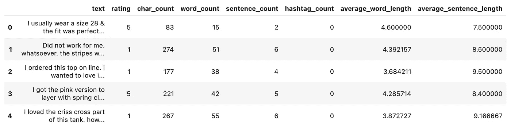

从文本创建新特征后的 DataFrame 的头部(图片由作者提供)

现在，您可以使用直方图、KDE 图或箱线图来探索这些新功能。如果您正在处理文本分类问题，当您可视化数据时，也可以按类进行区分。

```
import seaborn as sns# Histogram
sns.histplot(data = df, x = feature, hue = class)# KDE plot
sns.kdeplot(data = df, x = feature, hue = class)# Boxplot
sns.boxplot(data = df, x = class, y = feature)
```

下面你可以看到我们的例子 KDE 图。

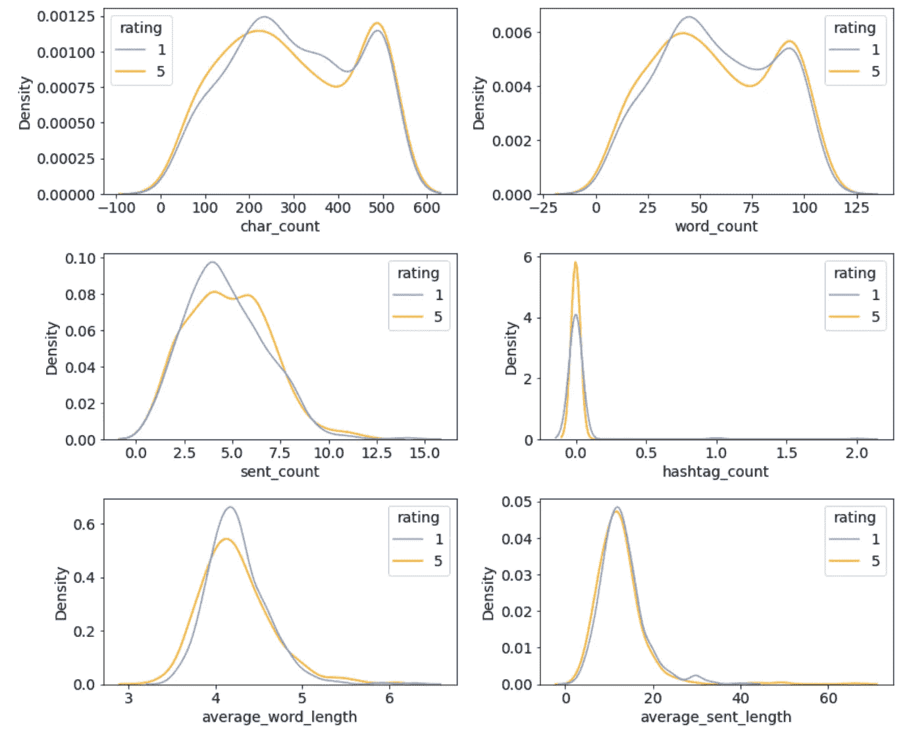

由“评级”类分隔的新创建功能的 KDE 图(图片由作者提供)

# 词频分析

这是你可能想使用单词 cloud 的地方。不要。

我专门用了一整节的篇幅来讲述为什么我会在这篇文章之后避免使用单词云。但我们先来说说如何探索和可视化最常用的术语。

在开始之前，我们需要对文本进行预处理，将所有内容都改为小写，并删除所有标点符号和非罗马字符。

```
import re
import stringdef clean_text(text):
    # Convert text to lowercase
    text = text.lower() # Remove punctuation
    text = re.sub("[%s]" % re.escape(string.punctuation), "", text) # Remove non-Roman characters
    text = re.sub("([^\x00-\x7F])+", " ", text)

    return textdf["text_clean"] = df["text"].map(lambda x: clean_text(x))
```

清理后的评论文本如下所示:

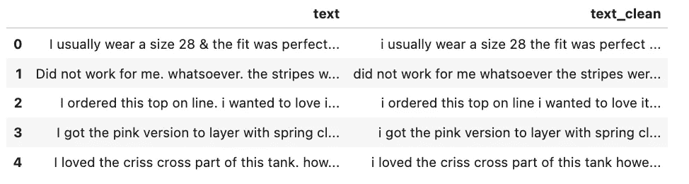

左边是原始评论文本，上面是经过清理的评论文本(图片由作者提供)

## 最常用的词

要得到最常用的词，首先需要创建一个所谓的“语料库”。这意味着我们创建了一个列表，其中包含所有来自已清理评论文本的相关单词。我说的“相关”词是指不是停用词的词，比如“是”、“for”、“a”、“and”。

```
from nltk.corpus import stopwordsstop = set(stopwords.words("english"))corpus = [word for i in df["text_clean"].str.split().values.tolist() for word in i if (word not in stop)]
```

`corpus`看起来是这样的:

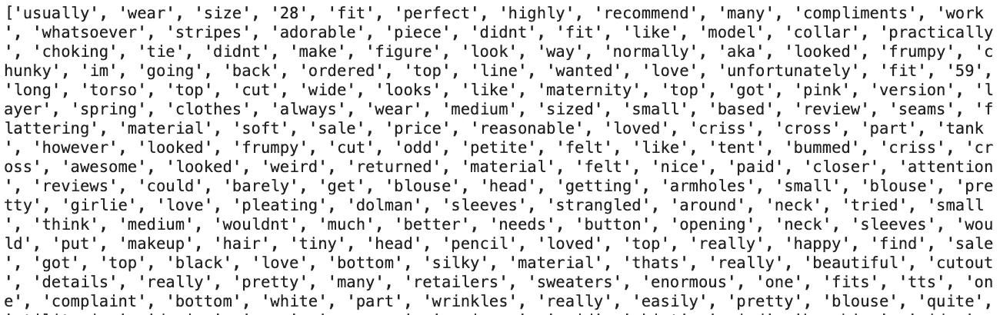

文集的开头(图片由作者提供)

现在，要从语料库中获取最常见的单词，您有两种选择:

您可以使用`FreqDist`类:

```
from nltk.probability import FreqDist
most_common = FreqDist(corpus).most_common(10)
```

或者你可以使用`Counter`类:

```
from collections import Counter
most_common = Counter(corpus).most_common(10)
```

使用`most_common(10)`函数，将返回前 10 个最常用的单词及其频率。

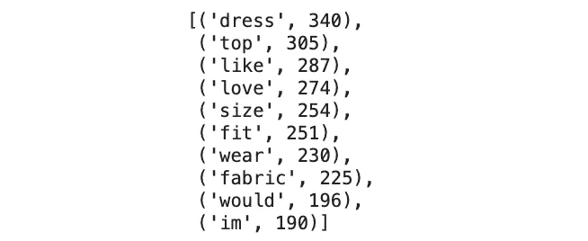

最常用的单词(图片由作者提供)

有了这个，你可以很容易地创建一个最常见的单词的柱状图:

```
words, frequency = [], []
for word, count in most_common:
    words.append(word)
    frequency.append(count)

sns.barplot(x = frequency, y = words)
```

下面，你可以看到负面和正面评论中最常见的 10 个词:

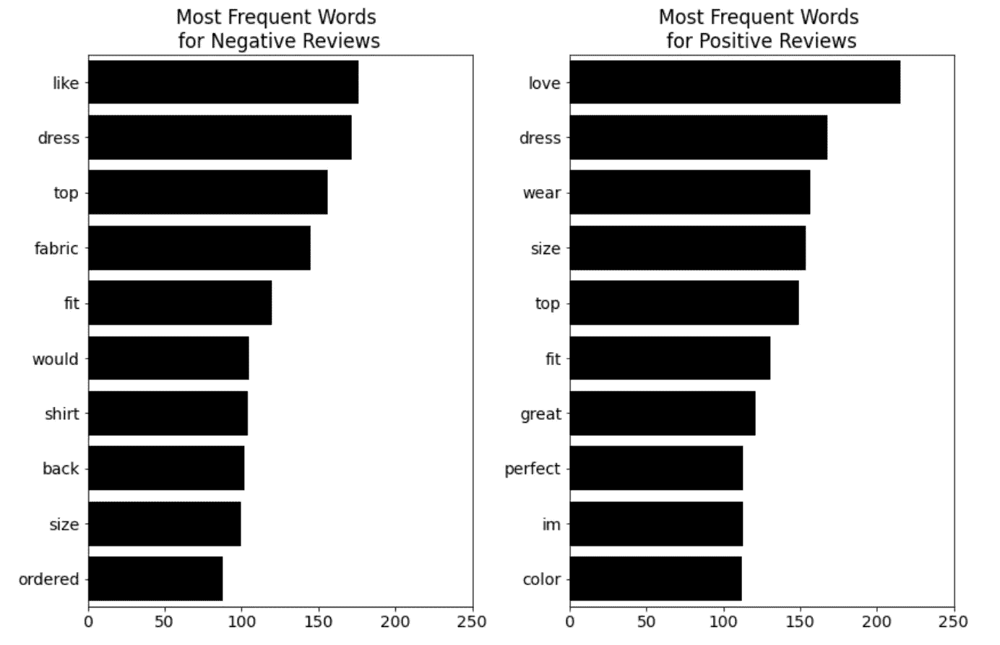

由“评级”类分隔的最常用词(图片由作者提供)。

从这个技巧中，我们可以看到在正面和负面的评论中,“连衣裙”和“上衣”是最常被提及的。然而，在积极的评论中，像“伟大”和“完美”这样的形容词被提到了很多，而在消极的评论中却不是这样。

## 最常见的 N-gram

让我们对 n-grams 做同样的事情。什么是 n-gram？它是文本中 n 个单词的序列。

例如，句子“你今天好吗？”的二元语法(n = 2)会是:“你好吗”、“你好吗”和“今天的你”。三元组(n =3)将是“你好吗”和“你今天好吗”。

要将文本分成 n 元语法，可以使用如下所示的`CountVectorizer`类。

在`ngram_range`中，您可以定义要考虑的 n-grams。比如`ngram_range = (2, 2)`只考虑二元，`ngram_range = (3, 3)`只考虑三元，`ngram_range = (2, 3)`考虑二元和三元。

```
from sklearn.feature_extraction.text import CountVectorizer# Initialize CountVectorizer
vec = CountVectorizer(stop_words = stop, ngram_range = (2, 2))# Matrix of ngrams
bow = vec.fit_transform(df["text_clean"])# Count frequency of ngrams
count_values = bow.toarray().sum(axis=0)# Create DataFrame from ngram frequencies
ngram_freq = pd.DataFrame(sorted([(count_values[i], k) for k, i in vec.vocabulary_.items()], reverse = True))
ngram_freq.columns = ["frequency", "ngram"]
```

得到的数据帧`ngram_freq`如下所示:


包含二元模型的数据帧头(图片由作者提供)

下面你可以看到由正面和负面评论分开的二元和三元词汇:

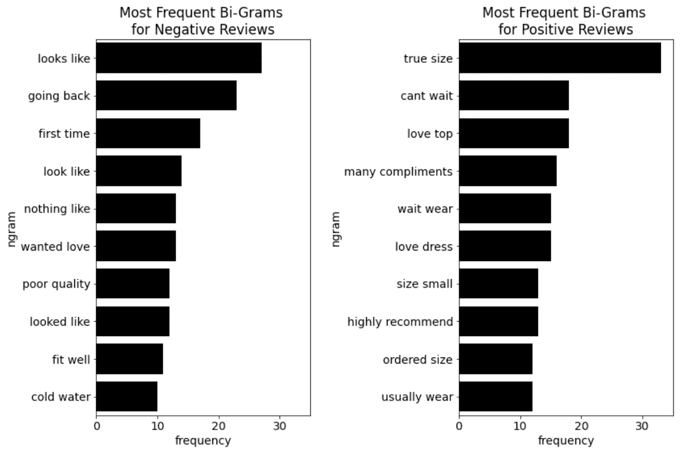

按“评级”分类最常见的双字母组合(图片由作者提供)。

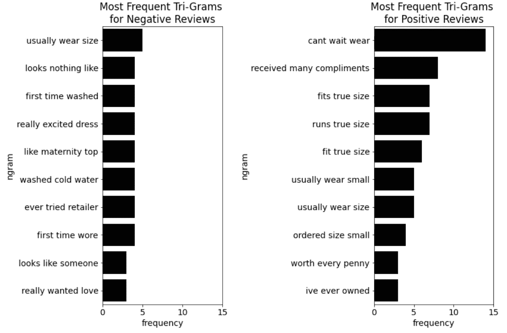

按“评级”分类最常见的三元组(图片由作者提供)。

如你所见，这种 EDA 技术有助于你理解评论的不同基调。

# 用那些文字云想念我

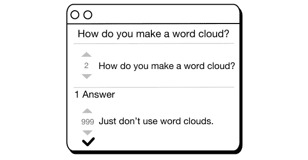

图片由作者提供。

注意，我们怎么没有谈到单词云？是的—您可以在不使用词云的情况下对文本数据执行 EDA。

**字云何惑**。虽然较频繁的术语比不太频繁的术语以更大的字体显示，但是很难掌握相似的频繁词之间的顺序。

一个简单的**条形图**可能不像单词云那样华丽，但它在可视化精确排名和术语频率方面做得更好。

所以，除非你的管理层真的想看到一个词云，否则我会推荐用条形图来代替。

> 除非你的管理层真的想看到一个词云，否则我会推荐用条形图来代替。

# 结论

在本文中，我们研究了一些针对文本数据的基本 EDA 技术:

1.  **计数和长度:**我们查看了字符数、字数、句子数和字符串数，以及平均单词和句子长度。
2.  **词频分析:**我们看了最常用的词和 n-gram，讨论了为什么不需要词云。

下面是所有可快速复制的代码片段:

你可以在这篇关于[“NLP 的中级 EDA 技术”](/intermediate-eda-techniques-for-nlp-2c898cc96d1d)的文章中找到这篇文章的续篇:

[](/intermediate-eda-techniques-for-nlp-2c898cc96d1d) [## 面向自然语言处理的中级 EDA 技术

### 如何对自然语言处理的文本数据进行探索性数据分析

towardsdatascience.com](/intermediate-eda-techniques-for-nlp-2c898cc96d1d) 

# 喜欢这个故事吗？

*这里收集了我的其他自然语言处理文章:*


莉奥妮·莫尼加蒂

## 自然语言处理

[View list](https://medium.com/@iamleonie/list/natural-language-processing-nlp-52815a8f7361?source=post_page-----f81a93696a75--------------------------------)3 stories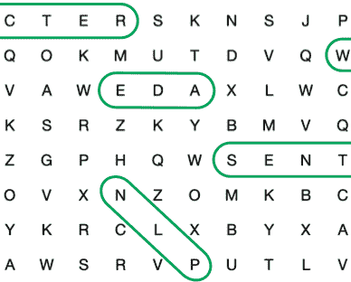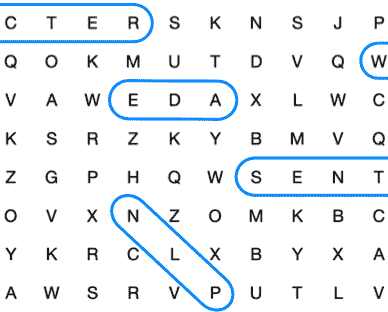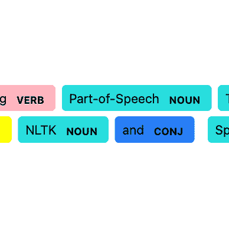

*如果你想把我的新故事直接发到你的收件箱，请务必* [*订阅*](https://medium.com/subscribe/@iamleonie) *！*

*成为媒介会员，阅读更多来自我和其他作家的故事。报名时可以用我的* [*推荐链接*](https://medium.com/@iamleonie/membership) *支持我。我将收取佣金，不需要你额外付费。*

[](https://medium.com/@iamleonie/membership) [## 通过我的推荐链接加入 Medium—Leonie Monigatti

### 阅读 Leonie Monigatti(以及媒体上成千上万的其他作家)的每一个故事。您的会员费直接…

medium.com](https://medium.com/@iamleonie/membership) 

*在* [*上找我*](https://twitter.com/helloiamleonie)*[*LinkedIn*](https://www.linkedin.com/in/804250ab/)*[*ka ggle*](https://www.kaggle.com/iamleonie)*！***

# **资料组**

**《nicapotato》《女装电商服装评论》。(License:CC0:Public Domain)[https://www . ka ggle . com/datasets/nica potato/women-ecommerce-clothing-reviews](https://www.kaggle.com/datasets/nicapotato/womens-ecommerce-clothing-reviews)(2022 年 8 月 30 日访问)。**