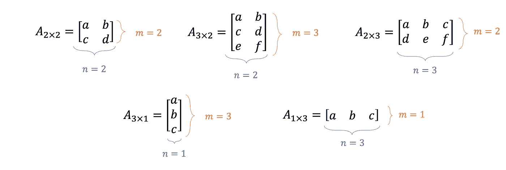
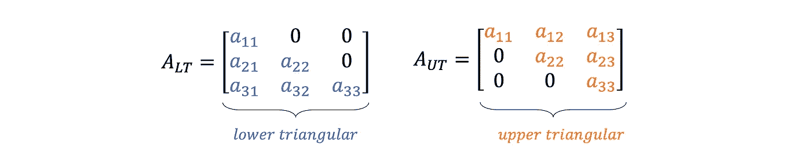
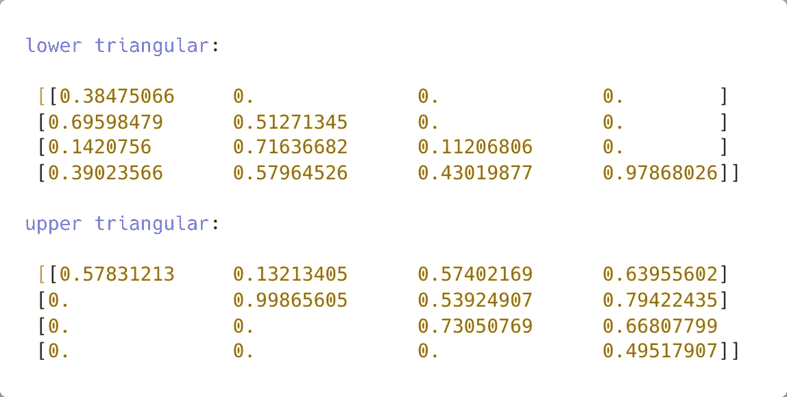
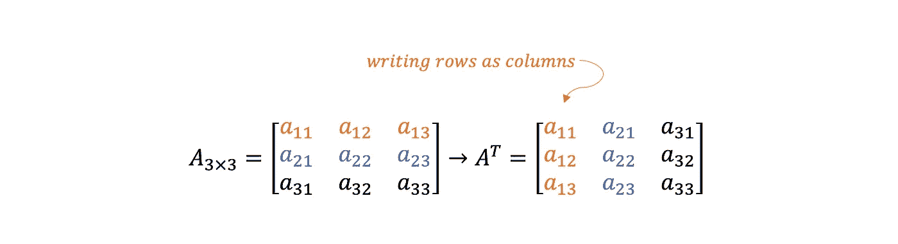

# Python 的矩阵代数基础|第 1 部分

> 原文：<https://towardsdatascience.com/fundamentals-of-matrix-algebra-with-python-part-1-85aaa17e3632>

## 使用 Python 理解和实现基本矩阵代数概念和运算

## 介绍

**矩阵代数**是*工程学*和*计算机科学*中许多复杂而突出的研发领域的基础。例如，神经网络中使用的**机器学习算法**广泛使用*矢量化*来大幅提高计算时间。


照片由 [Aron Van de Pol](https://unsplash.com/@aronvandepol?utm_source=medium&utm_medium=referral) 在 [Unsplash](https://unsplash.com?utm_source=medium&utm_medium=referral) 上拍摄

本文介绍了矩阵代数的一些基本概念，并用一些 Python 代码来说明结果。主题在*简要细节*中介绍，因此*鼓励读者*将此作为进一步研究的起点。

代码将使用 **NumPy** ，这是一个无价的处理矩阵的 Python 库。

## 内容

1.  什么是*矩阵*？
2.  *分度*元件
3.  上下*三角形*矩阵
4.  *转置*
5.  *对称性*

理解这些概念为探索航天器姿态动力学与控制中的[参考系变换](https://python.plainenglish.io/reference-frame-transformations-in-python-with-numpy-and-matplotlib-6adeb901e0b0)等更高级的课题奠定基础。

[](https://python.plainenglish.io/reference-frame-transformations-in-python-with-numpy-and-matplotlib-6adeb901e0b0) [## 如何使用 NumPy 和 Matplotlib 在 Python 中转换参考系

### 将变换矩阵应用于参考框架以将其从一个方向旋转到另一个方向的指南。

python .平原英语. io](https://python.plainenglish.io/reference-frame-transformations-in-python-with-numpy-and-matplotlib-6adeb901e0b0) 

## 1)什么是矩阵？

矩阵是由数字组成的*矩形阵列。尺寸通常按照*行* **×** *列、*或( **m×n** )的顺序进行描述，如图 1 所示。*

如果 *n = 1* ，则矩阵是一个**列向量**。同理，若 *m = 1* ，则称为一个**行向量**。



图 1 —示例 m **×** n 矩阵(图片由作者提供)

使用 Gist 1 中的 Python 代码通过 Numpy 创建这些数组。

要点 Numpy 中的矩阵示例

## 2) *分度*元件

矩阵元素使用( *i，j)* 下标*索引*，其中 ***i*** 对应**行号，*****j***对应**列号**，如图 2 所示。


图 2 —使用(i =行，j =列)值访问矩阵的元素(作者图片)

使用 Gist 2 中提供的代码在 Python 中执行如上所示的*等价索引操作*。注意，在 Python 编程语言中，**数组索引是从零**开始的。

要点 Numpy 中的索引元素

## 3)上下*三角形*矩阵

图 3 提供了两种类型矩阵的例子。



图 3 —上下三角矩阵(图片由作者提供)

*   如果对角线上和对角线*下的**元素为非零且所有其他值为零，则矩阵为**下三角形**。***


下三角条件

*   或者，如果对角线上和对角线上方的*元素为非零*且*所有其他条目为零*，则矩阵为**上三角**。


上三角条件

**使用 Gist 3 中的 Python 代码测试**这些*条件*。图 4 显示了一个示例输出。

要点 4 —创建上下三角矩阵



图 Gist 4 的控制台输出示例(图片由作者提供)

## 4) *转置*

转置矩阵是一个相对简单的操作。它包括*将行写成列* **或者**将*列写成行*。

转置一个 *3×3* 矩阵，如下图 5 所示。



图 5 —矩阵的转置(图片由作者提供)

Gist 5 是转置矩阵的一个简单的 Python 实现。始终**使用 Numpy** 或其他设计用于高效执行矩阵代数*的库*。

要点 5 —转置 mxn 矩阵的简单 Python 代码

这种算法在一个中等大小的矩阵上运行`m = 6000, n = 2500`，用`≈8.49` *秒*，也就是计算机时间的*千年*。

对比 Numpy 中的等效操作，**执行时间**为`≈0.000451` *秒*。

```
# define mxn matrix
A = np.random.rand(m, n)# numpy transpose operation
A_transpose_numpy = A.T
```

本文介绍了矩阵代数的基本概念，但没有演示如何实现最有效的算法。

## 5)对称性

给定一个*方阵* ***一个*** ，行列数相等；若 ***A = Aᵀ*** 则为*对称。对称矩阵的一个例子如图 6 所示。*


图 6 —对称 3x3 矩阵

使用 Numpy 对**断言**对称性*很简单*。检查转置矩阵的所有*元素是否与 **A** 相同。*

要点 6 —数字对称断言

一个**反对称**矩阵等于其*转置的负*，即 ***A = -Aᵀ*** 。这种情况见图 7。注意*对角线元素必须为零*。


图 7 —反对称 3×3 矩阵

要点 7 — Numpy 斜对称断言

## 结论

了解这些基本概念对工程和计算机科学专业的学生很有价值。然而，这篇文章只是触及了矩阵代数的表面。**第二部分**链接如下，讨论了*追踪*、*逆*等其他项目。

[](/fundamentals-of-matrix-algebra-with-python-part-2-833e447077d5) [## Python 的矩阵代数基础|第 2 部分

### 使用 Python 理解和实现基本矩阵代数概念和运算

towardsdatascience.com](/fundamentals-of-matrix-algebra-with-python-part-2-833e447077d5) 

如果你对 Python、工程学和数据科学感兴趣，请关注并查看我的其他文章。

[](https://medium.com/@andrewdaviesul/membership) [## 通过我的推荐链接加入媒体-安德鲁·约瑟夫·戴维斯

### 作为一个媒体会员，你的会员费的一部分会给你阅读的作家，你可以完全接触到每一个故事…

medium.com](https://medium.com/@andrewdaviesul/membership) [](/5-python-projects-for-engineering-students-8e951b7c131f) [## 面向工程专业学生的 5 个 Python 项目

### 面向工程师的初级到中级 Python 项目理念

towardsdatascience.com](/5-python-projects-for-engineering-students-8e951b7c131f) 

*感谢阅读。*

## 参考

[1] [工程师矩阵代数](https://youtube.com/playlist?list=PLkZjai-2Jcxlg-Z1roB0pUwFU-P58tvOx) — **杰弗里·r·查斯诺夫**