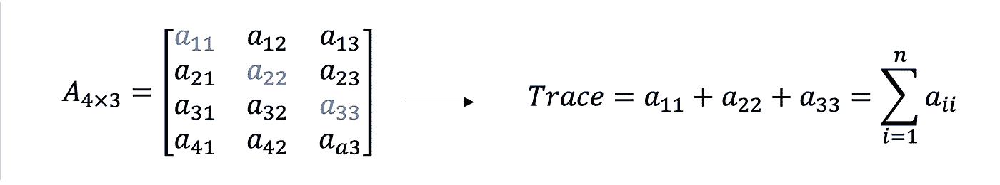
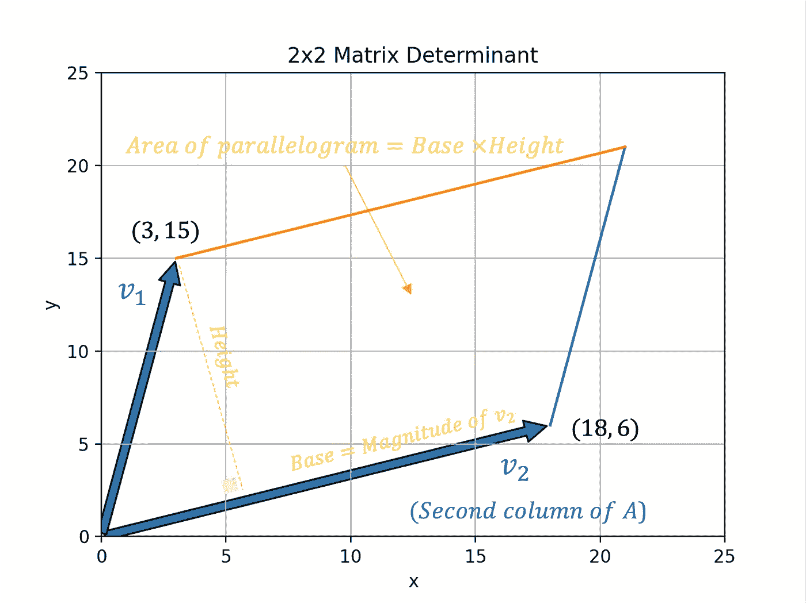
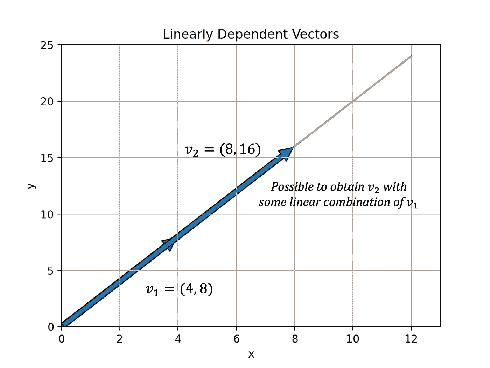
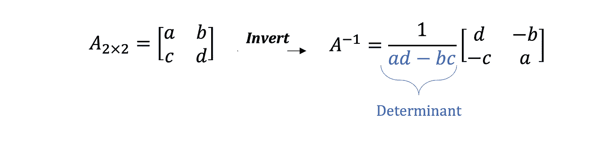
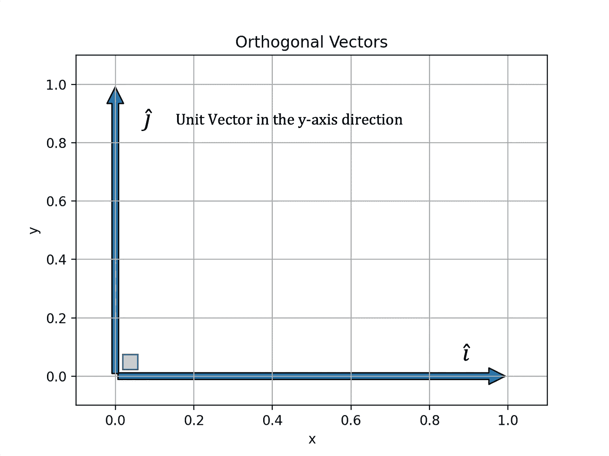
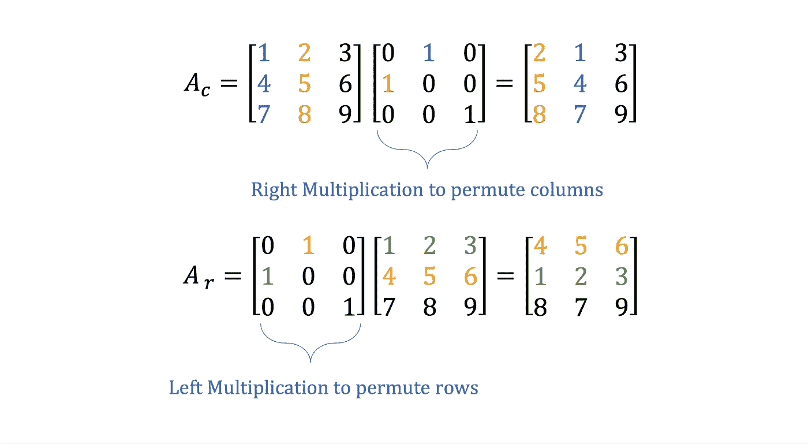

# Python 的矩阵代数基础|第 2 部分

> 原文：<https://towardsdatascience.com/fundamentals-of-matrix-algebra-with-python-part-2-833e447077d5>

## 使用 Python 理解和实现基本矩阵代数概念和运算

## 介绍

本文跟随“*Python 矩阵代数基础|第 1 部分*”。它引入了更多的***矩阵代数**的基本概念*，并用一些 Python 代码来演示结果。

 [## Python 的矩阵代数基础|第 1 部分

### 使用 Python 理解和实现基本矩阵代数概念和运算

towardsdatascience.com](/fundamentals-of-matrix-algebra-with-python-part-1-85aaa17e3632) 

照片由 [Dan Schiumarini](https://unsplash.com/@dan_schiumarini?utm_source=medium&utm_medium=referral) 在 [Unsplash](https://unsplash.com?utm_source=medium&utm_medium=referral) 上拍摄

## 内容

1.  *追踪*
2.  *行列式*
3.  *逆*
4.  *正交性*
5.  行*排列*

这份关于矩阵的初步材料有助于探索更高级的主题，例如使用**状态空间**模型模拟动态系统。

 [## 用 Python 建模动态系统

### 用 Python 推导和求解平动机械振动系统的运动方程

towardsdatascience.com](/modelling-dynamic-systems-in-python-92c14d4b35d3) 

## 1)跟踪

矩阵的*轨迹*就是其对角元素的**和，如图 1 所示。**

图 1 —矩阵的轨迹(图片由作者提供)

Gist 1 提供 Python 代码来*计算一个矩阵*的迹，这是**琐碎的**使用 Numpy。

要点 1 —计算矩阵的轨迹

## 2)行列式

方阵的**行列式**是**标量**。*非方阵没有行列式。*

以图 2 中的 ***A*** 为例。

图 2 —示例 2×2 矩阵(图片由作者提供)

图 3 给出了计算一个 *2×2 行列式*的公式。

图 3–计算 2×2 行列式(图片由作者提供)

一个重要的*几何*结果是 2×2 行列式**标量**值等于由 *A* 的*列向量*组成的**平行四边形**形成的**面积**。

*使用 Gist 2 中的代码在 Matplotlib 中绘制*一个 2×2 矩阵的列向量表明 **v₁** (第一列)和 **v₂** (第二列)组成了一个平行四边形的*条边。*

要点 2 —显示平行四边形边的列向量

图 4 是从上面的代码生成的带标签的图。*列向量形成平行四边形*。

图 4 —平行四边形的面积(图片由作者提供)

*检查*和*修改*Gist 2 中的 Python 代码以生成更多示例。

图 5 描绘了两个*共线向量*，意味着它们是**线性相关的**。因此，不可能构造一个平行四边形。

图 5 —线性相关向量(图片由作者提供)

*因此，这说明如果行或列是线性相关的，则行列式的值为 0。*

## 3)逆

图 6 描绘了一个 3 **×** 3 **的单位矩阵，I** 。

图 6 —身份矩阵(图片由作者提供)

*将* 一个矩阵与其逆矩阵相乘得到单位矩阵，I 即***a***⁻***= I***，其中 *A* ⁻表示 *A 的逆*用图 7 中的表达式计算 a ^ 2**×**2 的逆。

图 7–2**×**2 矩阵求逆(图片由作者提供)

不是所有的矩阵都是可逆的。如图 7 所示，行列式出现在计算中。因此， ***A*** *必须是平方* ( **n×n** )且有一个*非零行列式*才有逆。

## 4)正交性

*正交性*与**正交性**同义。当*列*或*行*是**正交向量**时，正交性适用。

标准正交向量就是**垂直**，如图 8 所示。

图 8 —正交矢量(作者图片)

使用图 9 中的条件测试正交性。

图 9 —正交性条件(图片由作者提供)

基本上，这个表达式意味着如果 A 的转置等于它的逆矩阵，则 A 是**正交的——使用类似于 Gist 3 的代码来检查矩阵是否正交。**

要点 3 —正交条件

## 5)行排列

> 一个 [**置换矩阵**](https://en.wikipedia.org/wiki/Permutation_matrix) 是一个二进制方阵，每行每列有一个条目为 1，其他地方为 0。

引入单位矩阵后，允许矩阵 A 的行包括将矩阵乘以修改后的 ***I*** 。

图 9 —排列矩阵(图片由作者提供)

以图 10 中的矩阵 A 为例。

图 10 —演示排列的示例矩阵(图片由作者提供)

*置换行*涉及**改变行** *或* **列**的顺序，例如，将 r₁移到 r₂，将 r₂移到 r₁.图 11 描述了使用上面定义的置换矩阵 *P* 的两种置换的例子。

图 11-行和列排列(作者图片)

Gist 4 给出了执行这些操作所需的 Python 代码。

要点 Python 中的置换

## 结论

本文介绍了矩阵代数的五个基本概念。上述主题在细节上*简洁*，因此鼓励读者*将此作为进一步研究的起点。*

建议*的下一个主题是*使用 Python 中的**高斯消去算法**求解线性方程组* 。*

 [## Python 中的高斯消去算法

### 关于如何在 Python 中使用高斯消去法求解线性方程组的教程

levelup.gitconnected.com](https://levelup.gitconnected.com/gaussian-elimination-algorithm-in-python-4e90cb3a0fd9)  [## 通过我的推荐链接加入媒体-安德鲁·约瑟夫·戴维斯

### 作为一个媒体会员，你的会员费的一部分会给你阅读的作家，你可以完全接触到每一个故事…

medium.com](https://medium.com/@andrewdaviesul/membership) 

感谢阅读。

## 参考

[1] [工程师矩阵代数](https://youtube.com/playlist?list=PLkZjai-2Jcxlg-Z1roB0pUwFU-P58tvOx) — **杰弗里·查斯诺夫** 【2】[置换矩阵](https://en.wikipedia.org/wiki/Permutation_matrix) —维基百科