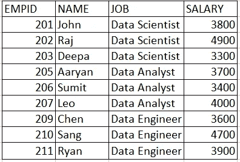
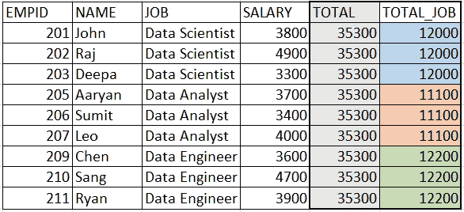
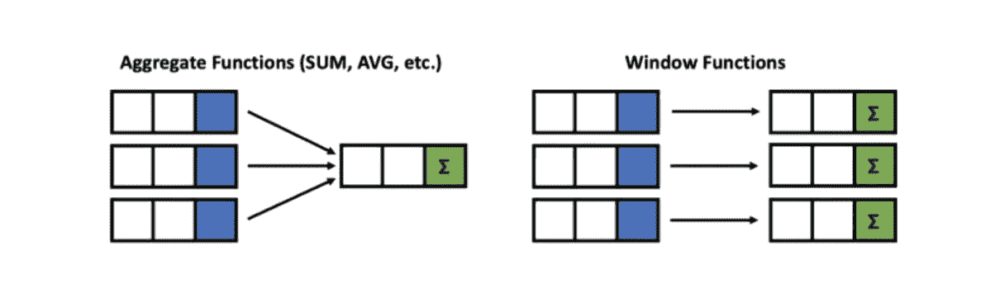
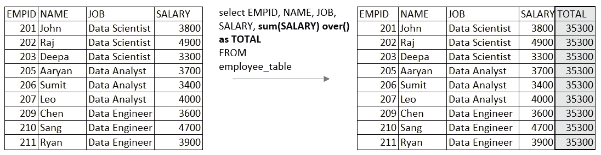
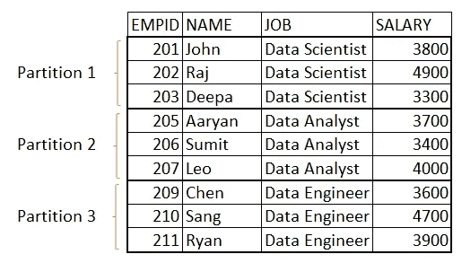
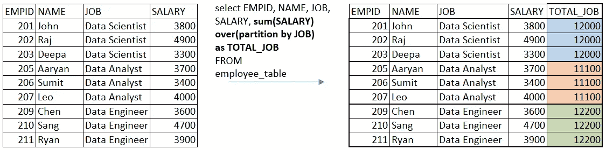

# SQL 窗口函数简介:第 1 部分

> 原文：<https://towardsdatascience.com/fundato-sql-window-functions-part-1-ab61df519973>

## 为数据科学面试做好准备


SQL 窗口函数(图片由作者提供)

## 背景

窗口函数对于用几行代码有效地执行数据操作是非常有用的，这也是为什么你会在几乎每个数据科学访谈中发现一个关于窗口函数的问题。

这是 SQL 窗口函数系列的第 1 部分。在这篇博客中，我们将学习 SQL 窗口函数的基本原理及其应用。

## **为什么需要窗口功能？**

假设我们有一个组织内员工的工资数据。下表显示了数据:



员工表(作者图片)

现在，假设我们要向该数据表添加 2 列:

1.  TOTAL:该列包含所有员工的工资总额。这等于薪水栏的总和。
2.  TOTAL_JOB:该列包含与某一行相对应的工作角色(数据科学家、数据分析师、数据工程师)中所有雇员的工资总额。例如，对于“JOB”为数据科学家的行，TOTAL_JOB 列等于 12，000(数据科学家的工资总和:3800+4900+3300)。



向雇员表中添加列(按作者排序的图像)

我们可以在不执行分组和自连接的情况下添加这些列吗？

**是的，**我们使用**窗口函数很容易做到这一点。**

## **SQL 中的窗口函数是什么？**

window 函数对数据表中的一行或多行执行计算，并将值返回给表中的所有行。与聚合函数(使用 GROUP BY 子句)不同，在聚合函数中，单个行会“丢失”，而窗口函数不会将多行的结果组合成一行，并且每一行都保留其原始身份。



聚合函数与窗口函数(图片由作者提供)

## 窗口函数的语法

以下是窗口函数的语法:

```
SELECT
<column_1>, <column_2>,
**<window_function>(expression)OVER
(PARTITION BY<partition_list> 
ORDER BY<order_list>)**
FROM
<table_name>
```

让我们详细了解一下每个关键词:

*   **窗口函数**是我们希望应用的窗口函数的名称，如 sum、mean、行号等。
*   **表达式**是应用窗口函数的列名。根据我们使用的窗口功能，这可能是必需的，也可能不是必需的。例如，行号窗口函数不需要表达式。
*   **OVER** 简单表示该函数是窗口函数。
*   **PARTITION BY** 对数据表的行进行分区，允许我们定义利用哪些行来计算窗口函数。
*   **分区列表**是我们想要进行分区的列的名称。对于 PARTITION BY 子句，这是必需的。
*   **ORDER BY** 用于对每个分区内的行进行排序。这是一个可选条款。
*   **Order list** 是要排序的列的名称，对于 ORDER BY 子句是必需的。

## 一些例子

要查看窗口函数的运行情况，让我们看几个例子:

1.  **OVER 子句没有被**分割

要添加一个包含 employee 表中所有雇员薪金总和的列(TOTAL ),我们将使用 sum 函数作为窗口函数，使用 salary 列作为表达式，并使用 OVER()子句。

因为我们正在查找所有雇员(行)的薪金总和，所以不需要对数据进行分区。



```
## SQL Query
select EMPID, NAME, JOB, SALARY, 
**sum(SALARY) over() as TOTAL** FROM
employee_table
```

2. **OVER 子句用**进行划分

现在，要添加一个列，其中包含与某行相对应的工作角色(数据科学家、数据分析师、数据工程师)中所有员工的总工资，我们需要按列 job 对数据进行分区。



Job 列上的数据分区(图片由作者提供)

为了获得输出，我们将使用 sum 函数作为窗口函数，salary 列作为表达式，在 OVER()子句中，我们将按 JOB 列对数据表进行分区。



```
## SQL Query
select EMPID, NAME, JOB, SALARY, 
**sum(SALARY) over(partition by** **JOB)
as TOTAL_JOB** FROM
employee_table
```

## 结论

因此，我们研究了如何使用 SQL 中的 window 函数轻松地将聚合值添加到表的所有行中。

我们可以创建跨所有行以及跨行分区的汇总列，而不会丢失表中的原始行。

## 谢谢大家！

你可以在收件箱里看到我所有的帖子。 [***在这里做*** *！*](https://anmol3015.medium.com/subscribe) *如果你喜欢体验媒介的自己，可以考虑通过* [***报名会员来支持我和其他成千上万的作家。它每个月只需要 5 美元，它极大地支持了我们，作家，而且你也有机会通过你的写作赚钱。***](https://anmol3015.medium.com/membership)